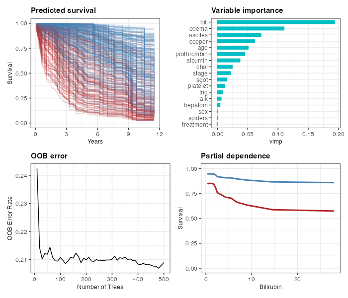

# ggRandomForests: Visually Exploring Random Forests

<!-- badges: start -->
[](https://cranlogs.r-pkg.org:443/badges/ggRandomForests)
[](https://cran.r-project.org/package=ggRandomForests)
[](https://github.com/ehrlinger/ggRandomForests)

[](https://www.repostatus.org/badges/latest/active.svg)

[](https://github.com/ehrlinger/ggRandomForests/actions/workflows/R-CMD-check.yaml)
[](https://github.com/ehrlinger/ggRandomForests/actions/workflows/lint.yaml)
[](https://github.com/ehrlinger/ggRandomForests/actions/workflows/pkgdown.yaml)
[](https://app.codecov.io/gh/ehrlinger/ggRandomForests)

[](https://doi.org/10.5281/zenodo.11526)
<!-- badges: end -->



`ggRandomForests` provides `ggplot2`-based diagnostic and exploration plots for random forests fit with
[randomForestSRC](https://cran.r-project.org/package=randomForestSRC) (>= 3.4.0) or
[randomForest](https://cran.r-project.org/package=randomForest).
It keeps the data step apart from the figure step, so you can inspect, save, or reuse the tidy object on its own.
Listed in the [ggplot2 extensions gallery](https://exts.ggplot2.tidyverse.org/).

## Installation

```r
# CRAN (stable)
install.packages("ggRandomForests")

# Development version from GitHub
# install.packages("remotes")
remotes::install_github("ehrlinger/ggRandomForests")
```

## Quick start

```r
library(randomForestSRC)
library(ggRandomForests)

# 1. Fit a forest (regression)
rf <- rfsrc(medv ~ ., data = MASS::Boston, importance = TRUE)

# 2. Check convergence: did the forest grow enough trees?
plot(gg_error(rf))

# 3. Rank predictors by importance
plot(gg_vimp(rf))

# 4. Marginal dependence for top variables
gg_v <- gg_variable(rf)
plot(gg_v, xvar = "lstat")
plot(gg_v, xvar = rf$xvar.names, panel = TRUE, se = FALSE)

# 5. Partial dependence for a single predictor
pv <- plot.variable(rf, xvar.names = "lstat", partial = TRUE, show.plots = FALSE)
pd <- gg_partial(pv)
plot(pd)
```

For survival forests, see the package vignette:
```r
vignette("ggRandomForests")
```

For variable importance with varPro — partial dependence, importance
z-scores, beta importance, individual/local importance, and isolation
forests — see the dedicated vignette:
```r
vignette("varpro", package = "ggRandomForests")
```

The unsupervised varPro tools — `gg_udependent()`, `gg_beta_uvarpro()`, and
`gg_sdependent()`, which read structure off a `uvarpro()` fit with no outcome —
have their own short vignette:
```r
vignette("uvarpro", package = "ggRandomForests")
```

## Function reference

| Function | Input | What you get |
|---|---|---|
| `gg_error()` | `rfsrc` / `randomForest` | OOB error vs. number of trees |
| `gg_vimp()` | `rfsrc` / `randomForest` | Variable importance ranking |
| `gg_rfsrc()` | `rfsrc` / `randomForest` | Predicted vs. observed values |
| `gg_variable()` | `rfsrc` / `randomForest` | Marginal dependence data frame |
| `gg_partial()` | `plot.variable` output | Partial dependence (continuous + categorical) |
| `gg_partial_rfsrc()` | `rfsrc` model | Partial dependence via `partial.rfsrc` |
| `gg_survival()` | `rfsrc` survival forest | Kaplan–Meier / Nelson–Aalen estimates |
| `gg_roc()` | `rfsrc` / `randomForest` (class) | ROC curve data |
| `gg_brier()` | `rfsrc` (survival) | Time-resolved Brier score and CRPS |

Each `gg_*` function has a matching `plot()` S3 method that hands back a single plottable object: a `ggplot`
you extend with `+`, or a `patchwork` composite for the multi-panel methods. Most `gg_*` objects also carry `print()` and `summary()` methods: `print()`
shows a short header at the REPL rather than dumping every row (use `head()` when you want the rows), and
`summary()` gives you a diagnostics object you can print or keep. `gg_shap()` is the exception — it has
neither, and prints as the `data.frame` it is.

## Why ggRandomForests?

The package is built on one decision: keep the data step and the figure step apart. The `gg_*`
functions pull a tidy data object out of the forest; the `plot()` methods turn that object into a
`ggplot2` figure. Two things follow from that split.

First, the data object stands on its own. It carries everything its plot needs, so you can save it,
inspect it, or come back to it later without keeping the original forest — which can be large —
in memory.

Second, you are never locked into the default figure. Because a `plot()` method returns a single
plottable object (a `ggplot`, or a `patchwork` composite for the multi-panel methods), you can add
layers, swap scales, or apply a theme; and if the default is not what you want, you can ignore it
entirely and build the figure from the tidy data yourself.

## Recent changes

See [NEWS.md](NEWS.md) for the full changelog. Recent highlights:

- **v3.4.0** Unsupervised varPro wrappers (`gg_beta_uvarpro()`, `gg_sdependent()`) with their own vignette; `gg_partial_rfsrc()` now handles factor predictors correctly.
- **v3.3.0** varPro partial plots default to interpretable scales — probability for classification, survival S(&tau;) for survival.
- **v3.1.0** varPro integration: release-rule importance, partial dependence, local importance, anomaly scores, and the dependency graph.

## References

Breiman, L. (2001). Random forests, *Machine Learning*, 45:5–32.

Ishwaran H. and Kogalur U.B. randomForestSRC: Random Forests for Survival, Regression and
Classification. R package version >= 3.4.0. <https://cran.r-project.org/package=randomForestSRC>

Ishwaran H. and Kogalur U.B. (2007). Random survival forests for R. *R News* 7(2), 25–31.

Ishwaran H., Kogalur U.B., Blackstone E.H. and Lauer M.S. (2008). Random survival forests.
*Ann. Appl. Statist.* 2(3), 841–860.

Liaw A. and Wiener M. (2002). Classification and Regression by randomForest. *R News* 2(3), 18–22.

Wickham H. (2009). *ggplot2: Elegant Graphics for Data Analysis*. Springer New York.
