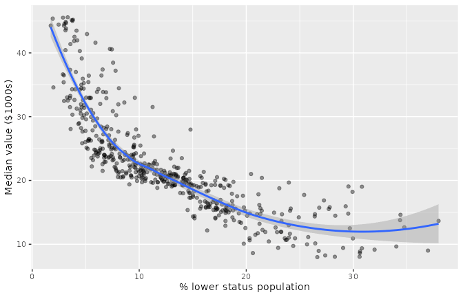
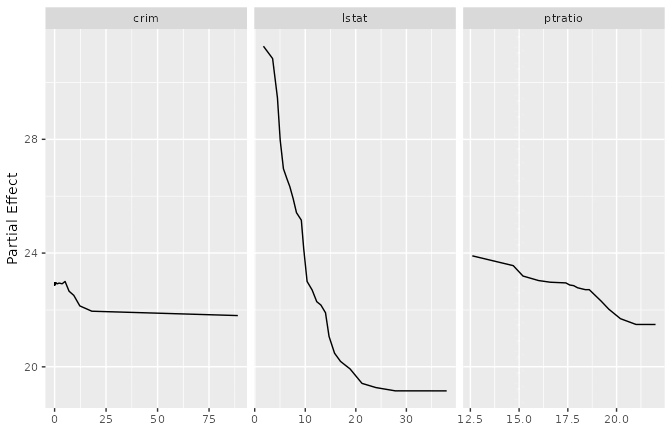
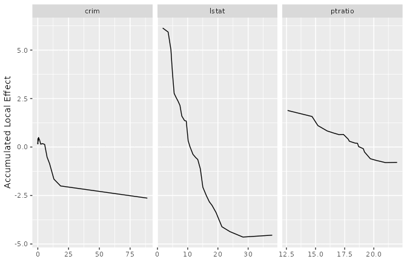
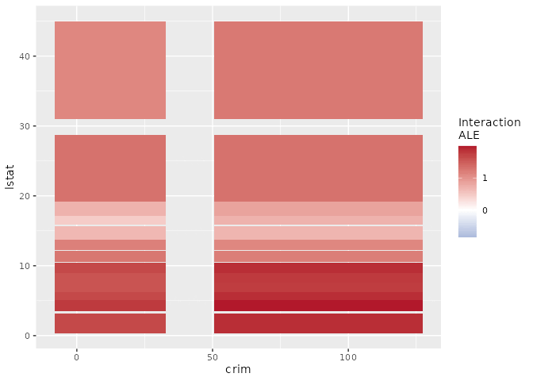
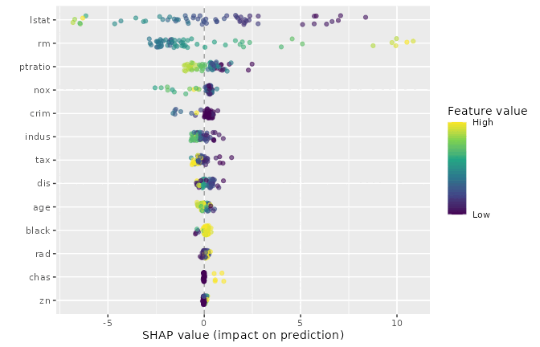
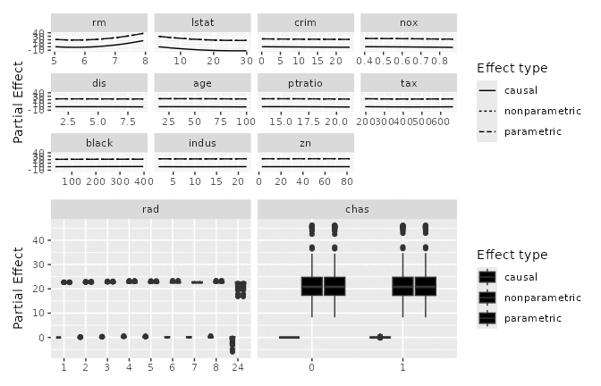

# Explaining a forest: five views of a variable’s effect

``` r

library(ggplot2)

# Try the installed package first, fall back to pkgload::load_all() for the
# R CMD check vignette rebuild where the package isn't yet on .libPaths().
if (requireNamespace("ggRandomForests", quietly = TRUE)) {
  library(ggRandomForests)
} else if (requireNamespace("pkgload", quietly = TRUE)) {
  pkgload::load_all(export_all = FALSE, helpers = FALSE,
                    attach_testthat = FALSE)
} else {
  stop("Install ggRandomForests (or pkgload for dev builds) to render this vignette.")
}
```

## What does this variable do?

You have fit a forest, it predicts well, and now someone asks the
obvious question: what is this variable actually doing? It is the
question every applied analysis reaches eventually, and
`ggRandomForests` gives you five different ways to answer it.

That is a problem, because the five answers are not interchangeable.
They estimate different things. Read one as though it were another and
you will report a number that is off by as much as a factor of two or
three, with a figure that looks entirely reasonable.

This vignette puts them side by side on one forest. No one method wins;
the point is to know which question you asked.

| Function | The question it answers |
|----|----|
| [`gg_variable()`](https://ehrlinger.github.io/ggRandomForests/reference/gg_variable.md) | What does the *data* look like? |
| [`gg_partial_rfsrc()`](https://ehrlinger.github.io/ggRandomForests/reference/gg_partial_rfsrc.md) | What does the forest predict as I move this variable, averaging over everything else? |
| [`gg_ale_rfsrc()`](https://ehrlinger.github.io/ggRandomForests/reference/gg_ale_rfsrc.md) | What does the forest predict as I nudge this variable locally? |
| [`gg_shap()`](https://ehrlinger.github.io/ggRandomForests/reference/gg_shap.md) | How much did this variable contribute to *this one* prediction? |
| [`gg_partial_varpro()`](https://ehrlinger.github.io/ggRandomForests/reference/gg_partial_varpro.md) | What does the effect look like inside varPro’s local rule neighborhoods? |

## The data, and a forest

Boston housing: 506 census tracts, median home value (`medv`) against
thirteen predictors. It is a stock dataset, it ships with `MASS`, and
its predictors are correlated in the way real data is correlated, which
turns out to matter a great deal.

``` r

data(Boston, package = "MASS")
set.seed(20260909L)
rfsrc_boston <- randomForestSRC::rfsrc(medv ~ ., data = Boston, ntree = 500)
rfsrc_boston
```

                             Sample size: 506
                         Number of trees: 500
               Forest terminal node size: 5
           Average no. of terminal nodes: 66.736
    No. of variables tried at each split: 5
                  Total no. of variables: 13
           Resampling used to grow trees: swor
        Resample size used to grow trees: 320
                                Analysis: RF-R
                                  Family: regr
                          Splitting rule: mse *random*
           Number of random split points: 10
                         (OOB) R squared: 0.86046646
       (OOB) Requested performance error: 11.80268521

Before going further, look at how tangled the predictors are. This is
the fact the rest of the vignette hangs on.

``` r

pred <- setdiff(names(Boston), "medv")
cm <- cor(Boston[, pred])
diag(cm) <- NA
head(sort(abs(cm["tax", ]), decreasing = TRUE), 3)
```

          rad     indus       nox
    0.9102282 0.7207602 0.6680232 

Property tax rate and highway accessibility move together at 0.91. There
are essentially no high-tax tracts with poor highway access in this
data, and no low-tax tracts with excellent access. Hold on to that.

## What the data alone shows

[`gg_variable()`](https://ehrlinger.github.io/ggRandomForests/reference/gg_variable.md)
is the honest starting point, and the one most often mistaken for
something it isn’t. It plots the observed response against the observed
predictor. No model is involved in the y-axis at all.

``` r

gg_dta <- gg_variable(rfsrc_boston)
plot(gg_dta, xvar = "lstat", alpha = 0.4) +
  labs(y = "Median value ($1000s)", x = "% lower status population")
```



The downward trend is real, but it belongs to the data, not to the
forest. Every variable correlated with `lstat` is folded into that
slope. You cannot read it as “what happens if `lstat` changes”, because
in this data `lstat` never changes on its own.

So we ask the model instead.

## Averaging over everything else: partial dependence

Partial dependence takes the whole dataset, overwrites one column with a
fixed value, scores every row, and averages the result. Then it does
that again at the next value. What you get is the average prediction as
a function of that one variable, with the others integrated out.

``` r

pd <- gg_partial_rfsrc(rfsrc_boston,
                       xvar.names = c("crim", "lstat", "ptratio"),
                       n_eval = 25)
plot(pd)
```



This is the workhorse, and for a lot of problems it is exactly right.
But notice what the recipe requires. To evaluate `crim` at its 95th
percentile, partial dependence takes every tract in the data, including
the leafy low-crime ones, and asks the forest to price them as though
they had that crime rate while keeping all their other characteristics.

## The neighborhood that doesn’t exist

In Boston that last step is literal.

To score `tax` at its maximum, partial dependence hands the forest a
tract with the highest property tax rate in the state and the highway
access of a low-tax suburb. No such tract exists. The forest has never
seen one, so its answer there is an extrapolation dressed up as an
average.

Accumulated local effects ([Apley and Zhu 2020](#ref-Apley2020ale))
avoid the problem by never building that tract. Instead of substituting
a value across the whole dataset, ALE splits the variable into quantile
bins and, inside each bin, asks only what happens when an observation
moves from one edge of *its own* bin to the other. Everything else stays
where it actually was. Those local differences are then accumulated
across bins into a single curve and centered.

``` r

ale <- gg_ale_rfsrc(rfsrc_boston,
                    xvar.names = c("crim", "lstat", "ptratio"),
                    n_eval = 25)
plot(ale)
```



Same forest, same three variables, and the shapes are recognisably the
same family. Look at the y-axes.

## How different are they, really?

Different enough to change what you would report. Here both curves are
put on a common grid and centered, so the comparison is about shape and
size rather than offset.

``` r

compare <- function(v) {
  a <- ale$continuous[ale$continuous$name == v, ]
  p <- pd$continuous[pd$continuous$name == v, ]
  lo <- max(min(a$x), min(p$x))
  hi <- min(max(a$x), max(p$x))
  grid <- seq(lo, hi, length.out = 100)
  ay <- approx(a$x, a$yhat, xout = grid)$y
  py <- approx(p$x, p$yhat, xout = grid)$y
  ay <- ay - mean(ay)
  py <- py - mean(py)
  data.frame(
    variable    = v,
    ale_range   = round(diff(range(ay)), 2),
    pd_range    = round(diff(range(py)), 2),
    pd_over_ale = round(diff(range(py)) / diff(range(ay)), 2)
  )
}
do.call(rbind, lapply(c("crim", "lstat", "ptratio"), compare))
```

      variable ale_range pd_range pd_over_ale
    1     crim      3.06     1.17        0.38
    2    lstat     10.77    12.12        1.12
    3  ptratio      2.69     2.41        0.90

On `crim` the two disagree by a lot, and they disagree in a consistent
direction: partial dependence reports the smaller effect. That is not an
accident of this fit. Across all eleven continuous predictors in Boston,
averaged over three forests, ALE’s range exceeds partial dependence’s in
nine of them, with a median ratio near 0.6.

Averaging over the joint distribution pulls the curve toward the overall
mean, because a good part of what it averages is the forest’s opinion of
tracts that do not exist, and the forest has no strong opinion about
those. Partial dependence is not wrong here so much as diluted. If you
read its y-axis as the size of the effect, you are understating it.

Two cautions before you conclude that ALE always wins. On `ptratio` the
two methods agree closely, and on `lstat` partial dependence gives the
*larger* range. The gap usually runs one way but not always, so check
both before you report the size of an effect.

## Where two variables act together

Second-order ALE has no partial dependence counterpart in this package.
Give
[`gg_ale_rfsrc()`](https://ehrlinger.github.io/ggRandomForests/reference/gg_ale_rfsrc.md)
a second variable and it returns the part of the pair’s joint effect
that neither variable’s own main effect explains.

``` r

ale_int <- gg_ale_rfsrc(rfsrc_boston, xvar.names = "crim",
                        xvar2.name = "lstat", n_eval = 12)
plot(ale_int)
```



Read it as a departure from additivity. White means the two variables
act independently over that region: the joint effect is what you would
get by adding their separate effects. Colour means they interact, and
the sign tells you in which direction. A forest that is purely additive
in a pair returns a surface that is zero everywhere.

## One prediction at a time

Everything so far describes the model’s average behaviour. SHAP asks a
different question entirely: for *this* tract, how much did each
variable contribute to the number the forest produced?

``` r

if (!is.null(.pc$shap_boston)) {
  shap_boston <- .pc$shap_boston
} else if (requireNamespace("kernelshap", quietly = TRUE)) {
  set.seed(20260909L)
  rows <- sort(sample(nrow(Boston), 60))
  shap_boston <- gg_shap(rfsrc_boston,
                         newdata = rfsrc_boston$xvar[rows, , drop = FALSE],
                         bg_n = 30)
} else {
  shap_boston <- NULL
}
if (!is.null(shap_boston)) plot(shap_boston)
```



Each point is one tract for one variable, positioned by its contribution
and coloured by that tract’s value of the variable. The spread is the
point. A variable whose points fan out wide matters a lot, but
differently for different tracts, which is something no averaged curve
can tell you.

One trap is worth naming. Averaging the absolute SHAP values gives you a
ranking, and that ranking is an *importance* measure, not a shape. It
answers “how much does this variable move predictions” and says nothing
about which direction or where. Reach for
[`gg_vimp()`](https://ehrlinger.github.io/ggRandomForests/reference/gg_vimp.md)
if ranking is what you want.

Two practical notes.
[`gg_shap()`](https://ehrlinger.github.io/ggRandomForests/reference/gg_shap.md)
needs `kernelshap`, which is a suggested dependency, so guard it as
above if you are writing something others will run. And `newdata` takes
predictors only. Handing it a frame that still carries the response
fails inside `kernelshap` with a message about column names that
mentions neither your column nor
[`gg_shap()`](https://ehrlinger.github.io/ggRandomForests/reference/gg_shap.md).

## Local by construction

varPro comes at the problem from a different direction ([Lu and Ishwaran
2024](#ref-Lu2024varpro)). It builds rules that carve the predictor
space into local regions, then estimates effects inside them.
[`gg_partial_varpro()`](https://ehrlinger.github.io/ggRandomForests/reference/gg_partial_varpro.md)
wraps
[`varPro::partialpro()`](https://www.randomforestsrc.org/reference/partialpro.html)
and returns per-subject curves rather than one averaged curve.

``` r

if (!is.null(.pc$pd_varpro)) {
  pd_varpro <- .pc$pd_varpro
} else {
  set.seed(20260909L)
  v_boston <- varPro::varpro(medv ~ ., data = Boston, split.weight = FALSE)
  pd_varpro <- gg_partial_varpro(object = v_boston)
}
plot(pd_varpro)
```



Because the estimate is local by construction, it shares ALE’s
resistance to the non-existent-neighborhood problem, and it arrives
there by a different route: varPro’s rules, rather than quantile bins.

### Two estimands that are easy to confuse

On a classification fit
[`gg_partial_varpro()`](https://ehrlinger.github.io/ggRandomForests/reference/gg_partial_varpro.md)
has a `scale` argument that is worth understanding before you present a
figure, because both settings are correct and they answer different
questions.

`partialpro()` works internally on the log-odds scale and returns
per-subject values. Collapsing those to one curve takes an average and a
back-transform, and the *order* of those two steps is a modelling
choice:

- `scale = "prob"` transforms each subject, then averages. That is the
  mean predicted probability, the expected proportion of the cohort.
- `scale = "prob_typical"` averages on the log-odds scale, then
  transforms once. That is the probability for a subject at the mean
  log-odds.

They disagree, and by more the more heterogeneous your cohort is,
because the inverse logit bends. On a real fit whose per-subject
log-odds carried a standard deviation near 4.5, a point reading 0.96
under `"prob_typical"` read 0.74 under `"prob"`. A figure captioned as a
percentage of patients wants `"prob"`. See
[`?gg_partial_varpro`](https://ehrlinger.github.io/ggRandomForests/reference/gg_partial_varpro.md)
for the full argument.

## Which one do you reach for?

| You want | Use | Read it as |
|----|----|----|
| To see the raw relationship | [`gg_variable()`](https://ehrlinger.github.io/ggRandomForests/reference/gg_variable.md) | Data, confounded by everything correlated |
| The conventional marginal effect | [`gg_partial_rfsrc()`](https://ehrlinger.github.io/ggRandomForests/reference/gg_partial_rfsrc.md) | An average, diluted where predictors are correlated |
| A marginal effect that does not extrapolate | [`gg_ale_rfsrc()`](https://ehrlinger.github.io/ggRandomForests/reference/gg_ale_rfsrc.md) | Local changes accumulated, centered at zero |
| Whether two variables act together | `gg_ale_rfsrc(xvar2.name =)` | Departure from additivity |
| Why one case got its prediction | [`gg_shap()`](https://ehrlinger.github.io/ggRandomForests/reference/gg_shap.md) | Per-observation attribution |
| Effects inside local rule neighborhoods | [`gg_partial_varpro()`](https://ehrlinger.github.io/ggRandomForests/reference/gg_partial_varpro.md) | Per-subject curves, mind the scale |
| A ranking, not a shape | [`gg_vimp()`](https://ehrlinger.github.io/ggRandomForests/reference/gg_vimp.md), [`gg_varpro()`](https://ehrlinger.github.io/ggRandomForests/reference/gg_varpro.md) | Importance |

A reasonable default: start with partial dependence because it is
familiar and cheap, then check it against ALE on the variables you
intend to report. Where they agree you can stop worrying. Where they
disagree, the correlation structure is telling you something, and ALE is
the one to trust.

## What is not here

**Survival forests.** Both
[`gg_ale_rfsrc()`](https://ehrlinger.github.io/ggRandomForests/reference/gg_ale_rfsrc.md)
and
[`gg_shap()`](https://ehrlinger.github.io/ggRandomForests/reference/gg_shap.md)
are regression and classification only for now. Partial dependence
covers survival; see the survival vignette.

**Dependence without an outcome.**
[`gg_udependent()`](https://ehrlinger.github.io/ggRandomForests/reference/gg_udependent.md)
and
[`gg_sdependent()`](https://ehrlinger.github.io/ggRandomForests/reference/gg_sdependent.md)
describe how predictors relate to each other rather than to a
prediction, which is a different question from the one this vignette
asks. They need a `uvarpro` fit and are covered in the unsupervised
varPro vignette.

**Choosing variables.** Everything here assumes you already know which
variable you care about. For getting to that shortlist, see
[`gg_vimp()`](https://ehrlinger.github.io/ggRandomForests/reference/gg_vimp.md),
`gg_minimal_depth()` and the varPro vignette.

## References

Apley, Daniel W., and Jingyu Zhu. 2020. “Visualizing the Effects of
Predictor Variables in Black Box Supervised Learning Models.” *Journal
of the Royal Statistical Society Series B: Statistical Methodology* 82
(4): 1059–86. <https://doi.org/10.1111/rssb.12377>.

Lu, M., and H. Ishwaran. 2024. “Model-Independent Variable Selection via
the Rule-Based Variable Priority.” *arXiv Preprint*.
<https://arxiv.org/abs/2409.09003>.
