# Random Forest Classification with ggRandomForests

> **Work in progress**
>
> This vignette is under active development. Code examples and narrative
> may change before the next release.

## Introduction

Random forests ([Breiman 2001](#ref-Breiman:2001)) are a non-parametric
ensemble method that requires no distributional or functional
assumptions on how covariates relate to the response. For
classification, each tree votes for a class, and the forest reports the
vote fractions as class probabilities. The **randomForestSRC** package
([Ishwaran and Kogalur 2024](#ref-Ishwaran:RFSRC:2014)) provides a
unified implementation for survival, regression, and classification
forests.

**ggRandomForests** extracts tidy data objects from `rfsrc` fits and
renders them with **ggplot2** ([Wickham 2016](#ref-Wickham:2009)),
making it straightforward to explore how a forest is constructed, which
variables matter, and how the predicted probabilities depend on
individual predictors.

This vignette demonstrates a complete random forest classification
workflow on Fisher’s iris data ([Fisher 1936](#ref-Fisher:1936)):

1.  **Data exploration** — EDA scatter panels, the two variable pairs
    that separate the three species
2.  **Growing the forest** — fitting an RF, checking OOB error
    convergence
3.  **Variable selection** — VIMP and minimal depth via
    [`max.subtree()`](https://www.randomforestsrc.org//reference/max.subtree.rfsrc.html)
4.  **SHAP analysis** — per-observation, per-class additive explanations
    via
    [`gg_shap()`](https://ehrlinger.github.io/ggRandomForests/reference/gg_shap.md)
5.  **Dependence plots** — variable dependence and partial dependence
    via
    [`gg_variable()`](https://ehrlinger.github.io/ggRandomForests/reference/gg_variable.md)
    and
    [`gg_partial_rfsrc()`](https://ehrlinger.github.io/ggRandomForests/reference/gg_partial_rfsrc.md)
6.  **Classification performance** — ROC curves and AUC via
    [`gg_roc()`](https://ehrlinger.github.io/ggRandomForests/reference/gg_roc.rfsrc.md)

``` r

library(ggplot2)
library(dplyr)
library(randomForestSRC)

if (requireNamespace("ggRandomForests", quietly = TRUE)) {
  library(ggRandomForests)
} else if (requireNamespace("pkgload", quietly = TRUE)) {
  pkgload::load_all(export_all = FALSE, helpers = FALSE, attach_testthat = FALSE)
} else {
  stop("Install ggRandomForests (or pkgload for dev builds) to render this vignette.")
}

theme_set(theme_bw())
```

## Data: Iris Flower Measurements

Fisher’s iris data ([Fisher 1936](#ref-Fisher:1936)) measures sepal and
petal length and width for 150 flowers, 50 each from three species:
*setosa*, *versicolor*, and *virginica*. It is a small data set, and
that is a feature here, not a flaw: every figure in this vignette
renders in under a second, and the structure is well-understood enough
that any strange behavior stands out.

``` r

data(iris)
```

### Exploratory data analysis

Petal measurements separate the three species almost perfectly; sepal
measurements do not.

``` r

ggplot(iris, aes(x = Petal.Length, y = Petal.Width, color = Species)) +
  geom_point(size = 2, alpha = 0.7) +
  scale_color_brewer(palette = "Set2")
```

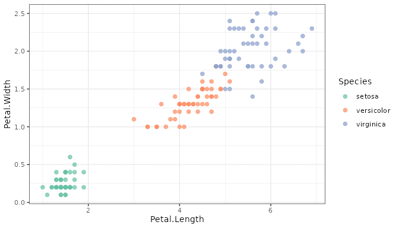

Petal length vs. petal width, colored by species.

``` r

ggplot(iris, aes(x = Sepal.Length, y = Sepal.Width, color = Species)) +
  geom_point(size = 2, alpha = 0.7) +
  scale_color_brewer(palette = "Set2")
```

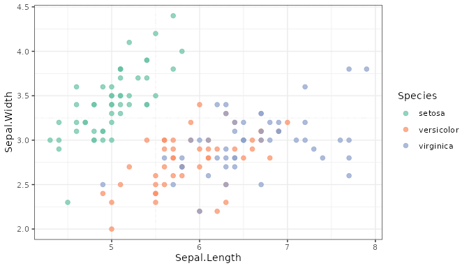

Sepal length vs. sepal width, colored by species.

*setosa* sits in its own corner of petal space, clean of the other two.
*versicolor* and *virginica* overlap in both plots, more so on sepals
than petals. Keep that overlap in mind — it is the interesting case for
everything that follows, since *setosa* is trivial for the forest to get
right.

## Growing a Random Forest

We grow a classification forest using all four predictors. The
[`rfsrc()`](https://www.randomforestsrc.org//reference/rfsrc.html)
function detects the classification family from the factor response.

``` r

set.seed(42)
rfsrc_iris <- rfsrc(Species ~ ., data = iris,
                    ntree = 200, importance = TRUE, err.block = 5)
rfsrc_iris
```

    #>                          Sample size: 150
    #>            Frequency of class labels: setosa=50, versicolor=50, virginica=50
    #>                      Number of trees: 200
    #>            Forest terminal node size: 1
    #>        Average no. of terminal nodes: 9.75
    #> No. of variables tried at each split: 2
    #>               Total no. of variables: 4
    #>        Resampling used to grow trees: swor
    #>     Resample size used to grow trees: 95
    #>                             Analysis: RF-C
    #>                               Family: class
    #>                       Splitting rule: gini *random*
    #>        Number of random split points: 10
    #>                    (OOB) Brier score: 0.02253931
    #>         (OOB) Normalized Brier score: 0.10142687
    #>                            (OOB) AUC: 0.994
    #>                       (OOB) Log-loss: 0.11724994
    #>    (OOB) Requested performance error: 0.04, 0, 0.06, 0.06
    #>
    #> Confusion matrix:
    #>
    #>             predicted
    #>   observed   setosa versicolor virginica class.error
    #>   setosa         50          0         0        0.00
    #>   versicolor      0         47         3        0.06
    #>   virginica       0          3        47        0.06
    #>
    #>       (OOB) Misclassification rate: 0.04
    #>
    #> Random-classifier baselines (uniform):
    #>    Brier: 0.22222222   Normalized Brier: 1   Log-loss: 1.09861229

The forest grew 200 trees. The confusion matrix confirms what the EDA
suggested: every *setosa* is classified correctly, while *versicolor*
and *virginica* trade three misclassifications each way, for an overall
OOB misclassification rate of 4%.

### OOB error convergence

``` r

plot(gg_error(rfsrc_iris))
```

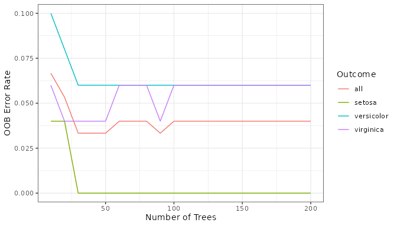

OOB misclassification rate vs. number of trees, overall and per class.

The *setosa* error drops to zero almost immediately. *versicolor* and
*virginica* settle in around 6% each, and the overall rate levels off
near 4% well before 200 trees — the forest is not still learning by the
time we stop growing it.

### OOB predictions

``` r

plot(gg_rfsrc(rfsrc_iris))
```

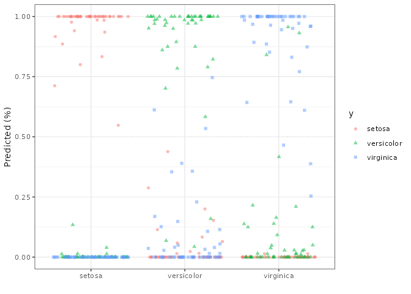

OOB predicted class probabilities, faceted by the flower’s true species.

Each panel is one true species; each point is one flower’s predicted
probability for one of the three classes. *setosa* flowers pin their
probability at 1 for *setosa* and 0 for the other two — no ambiguity at
all. The *versicolor* and *virginica* panels show real spread: most
flowers are still classified confidently, but a handful sit in the
0.2–0.6 range where the forest is genuinely unsure which of the two they
are.

## Variable Selection

### Variable importance (VIMP)

VIMP, computed by [randomForestSRC](https://www.randomforestsrc.org),
measures the increase in OOB prediction error when a variable’s values
are randomly permuted across the out-of-bag observations ([Breiman
2001](#ref-Breiman:2001)). For a classification forest,
[`gg_vimp()`](https://ehrlinger.github.io/ggRandomForests/reference/gg_vimp.md)
returns one column per class alongside the overall score, and
[`plot()`](https://rdrr.io/r/graphics/plot.default.html) facets on that
automatically.

``` r

plot(gg_vimp(rfsrc_iris))
```

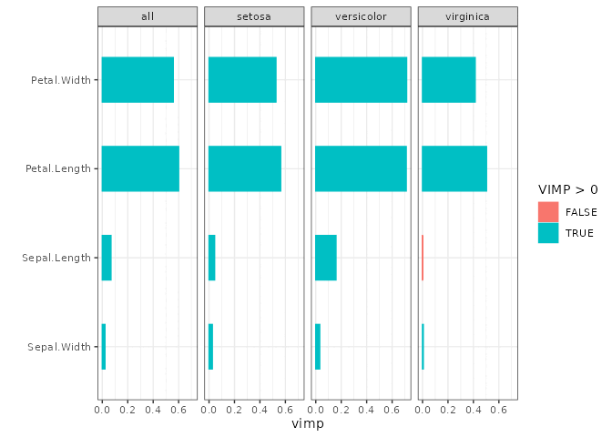

VIMP ranking, overall and per class.

`Petal.Length` and `Petal.Width` dominate every facet, `Sepal.Length`
and `Sepal.Width` barely register — consistent with the EDA. Look
closely at the *virginica* facet: `Sepal.Length` has a small negative
VIMP there (colored differently), meaning permuting it very slightly
*helped* virginica predictions in this fit. That kind of disagreement
across facets is exactly what a per-class VIMP breakdown is for; a
single overall score would have hidden it. (This is a distinct question
from the permutation-vs-varPro comparison covered in
[`vignette("varpro", package = "ggRandomForests")`](https://ehrlinger.github.io/ggRandomForests/articles/varpro.md),
which contrasts *how* importance is measured rather than *for which
class*.)

### Minimal depth

Minimal depth ([Ishwaran et al. 2010](#ref-Ishwaran:2010)) ranks
variables by how close to the root node they first split, on average.

``` r

md_iris <- max.subtree(rfsrc_iris)
```

The threshold is 1.88, selecting 2 variables: Petal.Length, Petal.Width.
VIMP and minimal depth agree.

## SHAP Analysis

VIMP ranks importance averaged over the whole forest, and it does not
change with the question you ask. SHAP does: a classification forest
predicts one probability per class, and
[`gg_shap()`](https://ehrlinger.github.io/ggRandomForests/reference/gg_shap.md)
explains exactly one of those probabilities at a time, chosen with the
`which.class` argument. Ask for class 1 (*setosa*) and you get
contributions to the *setosa* probability; switch to class 3
(*virginica*) and every contribution is recomputed for *virginica*
instead. Nothing else about the method changes — same players, same
game, different payout to split.

We target *virginica* (`which.class = 3`), the harder of the two
overlapping species. With only four predictors, `kernelshap` runs in
exact mode, so explaining all 150 flowers takes about two seconds — no
need for the random-sample workaround the regression vignette uses on
the larger, higher- dimensional Boston housing data.

``` r

set.seed(43)
gg_shp <- gg_shap(rfsrc_iris, bg_n = 50, which.class = 3)
```

### SHAP importance

``` r

plot(gg_shp, type = "importance")
```

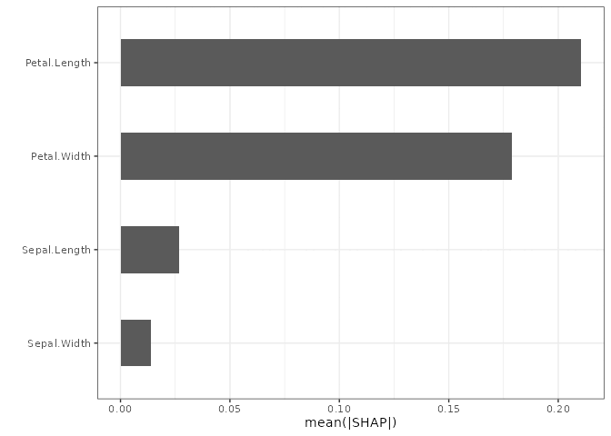

Mean absolute SHAP value per predictor, virginica probability.

Same two variables on top as VIMP and minimal depth, `Petal.Length`
ahead of `Petal.Width`. Three different mechanisms, one answer for the
dominant variables — the disagreement worth watching for is further down
the ranking, not at the top.

### SHAP beeswarm

``` r

plot(gg_shp, type = "beeswarm")
```

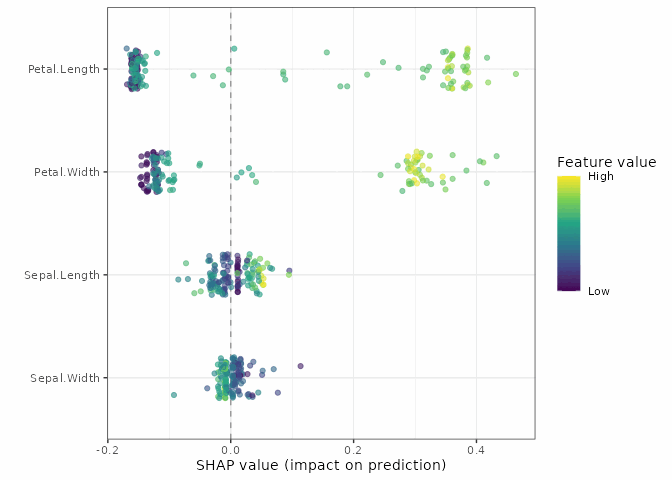

SHAP beeswarm for virginica probability: every dot is one flower’s
contribution for one predictor.

`Petal.Width` shows a clean gradient: the yellow (wide petal) dots sit
on the positive side, pushing the predicted *virginica* probability up;
the purple (narrow petal) dots sit on the negative side, pulling it
down. That is exactly what you would expect from the EDA scatter —
*virginica* has the widest petals of the three species.

### SHAP dependence

``` r

plot(gg_shp, type = "dependence", xvar = "Petal.Width")
```

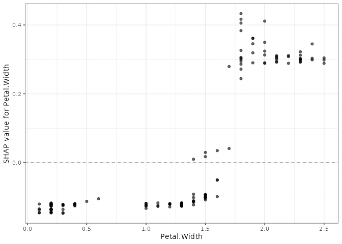

SHAP dependence for Petal.Width, virginica probability.

The upward slope states the same relationship as a number instead of a
color: as `Petal.Width` increases, its contribution to the *virginica*
probability climbs from clearly negative to clearly positive, crossing
zero around the point where *versicolor* and *virginica* petals start to
overlap in the EDA plot.

## Variable Dependence

### Variable dependence plots

Variable dependence shows each flower’s OOB predicted class probability
plotted against a predictor. For a classification forest,
[`gg_variable()`](https://ehrlinger.github.io/ggRandomForests/reference/gg_variable.md)
returns one probability column per class and
[`plot()`](https://rdrr.io/r/graphics/plot.default.html) facets on it,
the same way
[`gg_vimp()`](https://ehrlinger.github.io/ggRandomForests/reference/gg_vimp.md)
does.

``` r

gg_v <- gg_variable(rfsrc_iris)

plot(gg_v, xvar = "Petal.Width")
```

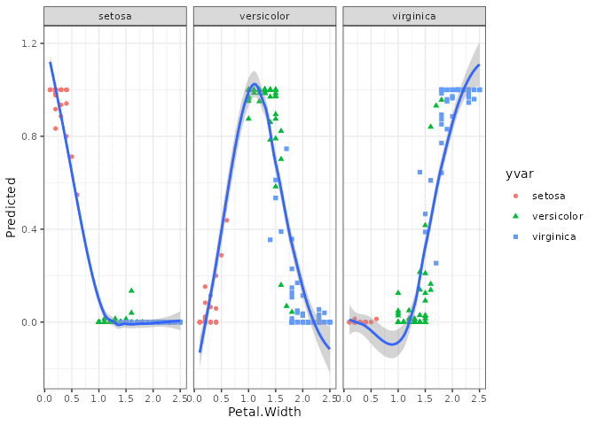

Variable dependence for Petal.Width, faceted by predicted-class
probability.

Three curves, three stories: *setosa*’s probability collapses to zero
past a petal width of about 0.6, *versicolor* peaks in the middle of the
range and falls off on both sides, and *virginica* rises steadily from
zero starting around 1.0 — the same three-panel pattern the beeswarm and
dependence plots already showed for *virginica* alone, now visible for
all three classes at once.

### Partial dependence

Partial dependence integrates out the effects of all other covariates,
giving a risk-adjusted view of each predictor’s marginal effect on one
class’s predicted probability ([Friedman 2001](#ref-Friedman:2000)).
Unlike
[`gg_shap()`](https://ehrlinger.github.io/ggRandomForests/reference/gg_shap.md),
[`gg_partial_rfsrc()`](https://ehrlinger.github.io/ggRandomForests/reference/gg_partial_rfsrc.md)
has no `which.class` argument for classification forests; it defers to
[`randomForestSRC::partial.rfsrc()`](https://www.randomforestsrc.org//reference/partial.rfsrc.html)’s
own default, which targets the first factor level, *setosa* here.

``` r

pd <- gg_partial_rfsrc(rfsrc_iris, xvar.names = c("Petal.Length", "Petal.Width"))
plot(pd)
```

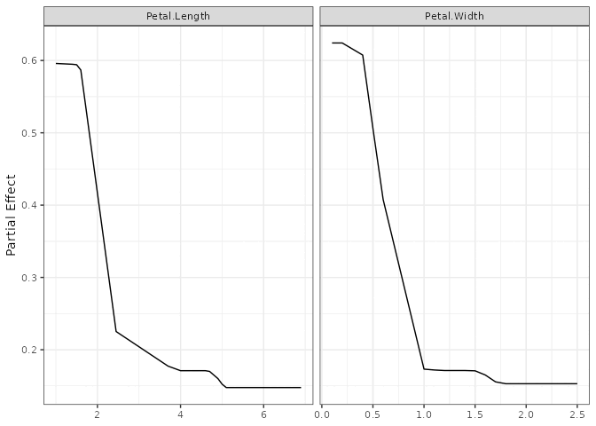

Partial dependence for petal measurements, setosa probability.

Both curves fall sharply and then flatten near zero — the risk-adjusted
version of what the EDA already showed: past a certain petal size, a
flower is essentially never *setosa*. Getting the same kind of curve for
*versicolor* or *virginica* instead means going back to
[`gg_shap()`](https://ehrlinger.github.io/ggRandomForests/reference/gg_shap.md):
re-run it with `which.class = 2` or `3`, then
[`shap_dependence()`](https://ehrlinger.github.io/ggRandomForests/reference/shap_dependence.md)
on that new object picks up wherever `which.class` left off.

## Classification Performance: ROC and AUC

ROC curves and AUC have no equivalent in the regression vignette — they
are specific to classification, where “how well does the forest separate
this class from the rest” is itself a well-posed question.
[`gg_roc()`](https://ehrlinger.github.io/ggRandomForests/reference/gg_roc.rfsrc.md)
computes the curve for one class at a time, indexed the same way as
[`gg_shap()`](https://ehrlinger.github.io/ggRandomForests/reference/gg_shap.md)’s
`which.class`, just under the name `which_outcome`.

``` r

roc_virginica <- gg_roc(rfsrc_iris, which_outcome = 3)
plot(roc_virginica)
```

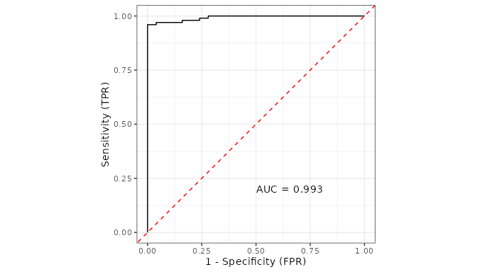

ROC curve for virginica vs. the rest.

``` r

calc_auc(roc_virginica)
```

    #> [1] 0.9928

An AUC of 0.993 for *virginica* confirms the forest separates it well,
even given its overlap with *versicolor*. *setosa*’s ROC curve is not
worth plotting — it is a right angle, AUC 1, the geometric version of
the confusion matrix’s perfect row.

## Conclusion

We have walked a full random forest classification analysis with
**randomForestSRC** and **ggRandomForests**, and the pieces line up:

- [`gg_error()`](https://ehrlinger.github.io/ggRandomForests/reference/gg_error.md)
  showed *setosa* converging immediately, *versicolor* and *virginica*
  settling near 6% each.
- VIMP
  ([`gg_vimp()`](https://ehrlinger.github.io/ggRandomForests/reference/gg_vimp.md))
  and minimal depth
  ([`max.subtree()`](https://www.randomforestsrc.org//reference/max.subtree.rfsrc.html))
  agreed: `Petal.Length` and `Petal.Width` dominate, for every class.
- [`gg_shap()`](https://ehrlinger.github.io/ggRandomForests/reference/gg_shap.md)
  gave the same top variables, but added something VIMP cannot: a
  signed, additive, per-flower contribution to one class’s probability,
  chosen with `which.class`.
- [`gg_variable()`](https://ehrlinger.github.io/ggRandomForests/reference/gg_variable.md)
  and
  [`gg_partial_rfsrc()`](https://ehrlinger.github.io/ggRandomForests/reference/gg_partial_rfsrc.md)
  traced the marginal and risk-adjusted versions of the same curves the
  SHAP dependence plot already hinted at.
- [`gg_roc()`](https://ehrlinger.github.io/ggRandomForests/reference/gg_roc.rfsrc.md)
  and
  [`calc_auc()`](https://ehrlinger.github.io/ggRandomForests/reference/calc_auc.md)
  closed the loop with the classification-specific question SHAP and
  VIMP do not answer directly: how well does the forest separate each
  class from the rest.

The pattern from the regression vignette holds here too. Each `gg_*()`
function returns a tidy object; the plotting is a separate step. Use the
package’s [`plot()`](https://rdrr.io/r/graphics/plot.default.html)
methods when the default figure is what you want, and reach for
`ggplot2` directly when it is not.

## References

Breiman, Leo. 2001. “Random Forests.” *Machine Learning* 45 (1): 5–32.
<https://doi.org/10.1023/A:1010933404324>.

Fisher, Ronald A. 1936. “The Use of Multiple Measurements in Taxonomic
Problems.” *Annals of Eugenics* 7 (2): 179–88.
<https://doi.org/10.1111/j.1469-1809.1936.tb02137.x>.

Friedman, Jerome H. 2001. “Greedy Function Approximation: A Gradient
Boosting Machine.” *The Annals of Statistics* 29 (5): 1189–232.
<https://doi.org/10.1214/aos/1013203451>.

Ishwaran, Hemant, and Udaya B. Kogalur. 2024. *randomForestSRC: Fast
Unified Random Forests for Survival, Regression, and Classification
(RF-SRC)*. <https://cran.r-project.org/package=randomForestSRC>.

Ishwaran, Hemant, Udaya B. Kogalur, Eiran Z. Gorodeski, Andy J. Minn,
and Michael S. Lauer. 2010. “High-Dimensional Variable Selection for
Survival Data.” *Journal of the American Statistical Association* 105
(489): 205–17. <https://doi.org/10.1198/jasa.2009.tm08622>.

Wickham, Hadley. 2016. *ggplot2: Elegant Graphics for Data Analysis*.
2nd ed. Springer. <https://doi.org/10.1007/978-3-319-24277-4>.
