# Random Forest Regression with ggRandomForests

> **Work in progress**
>
> This vignette is under active development. Code examples and narrative
> may change before the next release.

## Introduction

Random forests ([Breiman 2001](#ref-Breiman:2001)) are a non-parametric
ensemble method that requires no distributional or functional
assumptions on how covariates relate to the response. The method builds
a large collection of de-correlated decision trees via bootstrap
aggregation (bagging) and random feature selection, then averages their
predictions to produce a stable, low-variance estimator. The
**randomForestSRC** package ([Ishwaran and Kogalur
2024](#ref-Ishwaran:RFSRC:2014)) provides a unified implementation for
survival, regression, and classification forests.

**ggRandomForests** extracts tidy data objects from `rfsrc` fits and
renders them with **ggplot2** ([Wickham 2016](#ref-Wickham:2009)),
making it straightforward to explore how a forest is constructed, which
variables matter, and how the response depends on individual predictors.

This vignette demonstrates a complete random forest regression workflow
on the Boston Housing data set ([Harrison and Rubinfeld
1978](#ref-Harrison:1978); [Belsley et al. 1980](#ref-Belsley:1980)):

1.  **Data exploration** — EDA scatter panels, variable descriptions
2.  **Growing the forest** — fitting an RF, checking OOB error
    convergence
3.  **Variable selection** — VIMP and minimal depth via
    [`max.subtree()`](https://www.randomforestsrc.org//reference/max.subtree.rfsrc.html)
4.  **Dependence plots** — variable dependence and partial dependence
    via
    [`gg_variable()`](https://ehrlinger.github.io/ggRandomForests/reference/gg_variable.md)
    and
    [`gg_partial_rfsrc()`](https://ehrlinger.github.io/ggRandomForests/reference/gg_partial_rfsrc.md)
5.  **Variable interactions** — conditioning plots and interactive 3-D
    partial dependence surfaces with **plotly**

``` r

library(ggplot2)
library(dplyr)
library(tidyr)
library(randomForestSRC)

if (requireNamespace("ggRandomForests", quietly = TRUE)) {
  library(ggRandomForests)
} else if (requireNamespace("pkgload", quietly = TRUE)) {
  pkgload::load_all(export_all = FALSE, helpers = FALSE, attach_testthat = FALSE)
} else {
  stop("Install ggRandomForests (or pkgload for dev builds) to render this vignette.")
}

theme_set(theme_bw())
```

## Data: Boston Housing Values

The Boston Housing data ([Harrison and Rubinfeld
1978](#ref-Harrison:1978); [Belsley et al. 1980](#ref-Belsley:1980)) is
a standard benchmark for regression. It contains data for 506 census
tracts of Boston from the 1970 census. The objective is to predict the
median value of owner-occupied homes (`medv`, in \$1000s) from 13
predictors covering crime, zoning, industry, environmental quality, and
housing characteristics. We use the copy from the **MASS** package
([Venables and Ripley 2002](#ref-mass:2002)).

``` r

data(Boston, package = "MASS")
Boston$chas <- as.logical(Boston$chas) # nolint: object_name_linter
```

``` r

st_labs <- c(
  crim    = "Crime rate by town",
  zn      = "Residential land zoned > 25k sq ft (%)",
  indus   = "Non-retail business acres (%)",
  chas    = "Borders Charles River",
  nox     = "Nitrogen oxides (10 ppm)",
  rm      = "Rooms per dwelling",
  age     = "Units built before 1940 (%)",
  dis     = "Distance to employment centers",
  rad     = "Highway accessibility index",
  tax     = "Property tax rate per $10,000",
  ptratio = "Pupil-teacher ratio",
  black   = "Proportion of Black residents",
  lstat   = "Lower status population (%)",
  medv    = "Median home value ($1000s)"
)
```

### Exploratory data analysis

We plot each predictor against the response (`medv`), coloring by the
sole categorical variable (`chas`, whether the tract borders the Charles
River). A loess smooth highlights the marginal trend.

``` r

dta <- Boston |>
  pivot_longer(c(-medv, -chas), names_to = "variable", values_to = "value")

ggplot(dta, aes(x = medv, y = value, color = chas)) +
  geom_point(alpha = 0.4) +
  geom_smooth(aes(x = medv, y = value), color = "grey30",
              inherit.aes = FALSE, se = FALSE) +
  labs(y = "", x = st_labs["medv"]) +
  scale_color_brewer(palette = "Set2") +
  facet_wrap(~variable, scales = "free_y", ncol = 3)
```

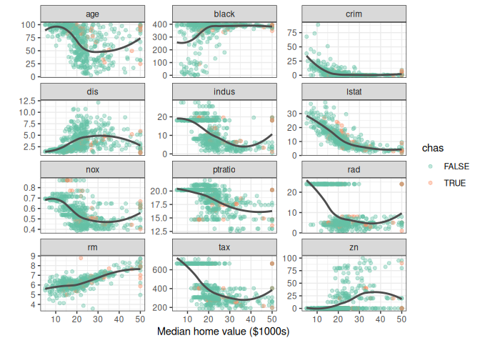

EDA: each predictor vs. median home value, colored by Charles River
indicator.

Even from this simple view, the strong relationship between `medv` and
both `lstat` (lower status %) and `rm` (rooms per dwelling) is apparent.
We expect the random forest to confirm these as the most important
predictors.

## Growing a Random Forest

We grow a regression forest using all 13 predictors. The
[`rfsrc()`](https://www.randomforestsrc.org//reference/rfsrc.html)
function detects the regression family from the continuous response.

``` r

rfsrc_Boston <- rfsrc(medv ~ ., data = Boston, # nolint: object_name_linter
                      importance = TRUE, err.block = 5)
rfsrc_Boston
```

    #>                          Sample size: 506
    #>                      Number of trees: 500
    #>            Forest terminal node size: 5
    #>        Average no. of terminal nodes: 67.006
    #> No. of variables tried at each split: 5
    #>               Total no. of variables: 13
    #>        Resampling used to grow trees: swor
    #>     Resample size used to grow trees: 320
    #>                             Analysis: RF-R
    #>                               Family: regr
    #>                       Splitting rule: mse *random*
    #>        Number of random split points: 10
    #>                      (OOB) R squared: 0.86674919
    #>    (OOB) Requested performance error: 11.27124983

The forest grew 500 trees, splitting on 5 randomly selected candidate
variables at each node, and stopping at a minimum terminal node size of
5.

### OOB error convergence

``` r

gg_e <- gg_error(rfsrc_Boston)
gg_e <- gg_e |> filter(!is.na(error))
class(gg_e) <- c("gg_error", class(gg_e))
plot(gg_e)
```

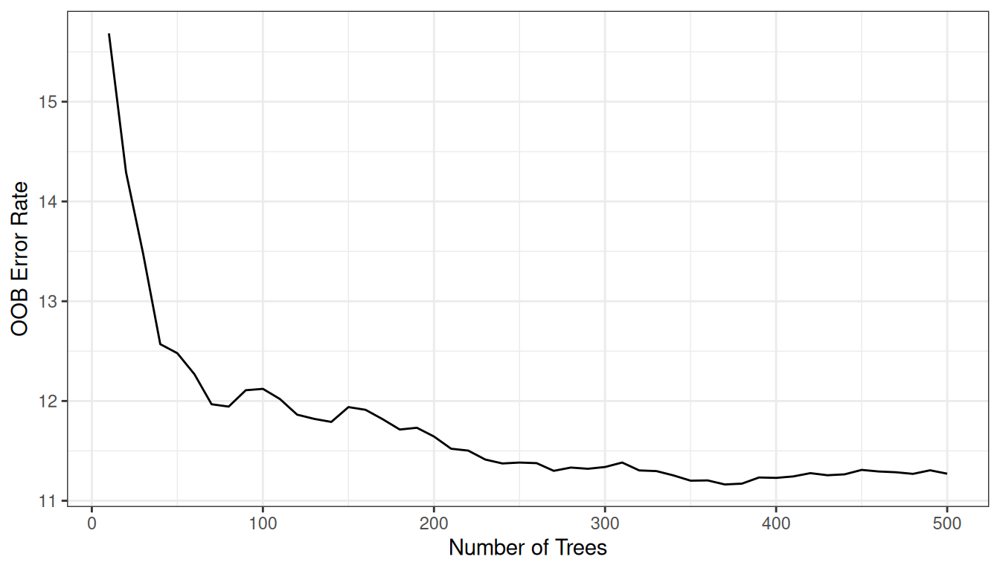

OOB mean squared error vs. number of trees.

The error stabilizes well before 500 trees, indicating the forest is
large enough for reliable predictions.

### OOB predictions

``` r

plot(gg_rfsrc(rfsrc_Boston), alpha = 0.5) +
  coord_cartesian(ylim = c(5, 49))
```

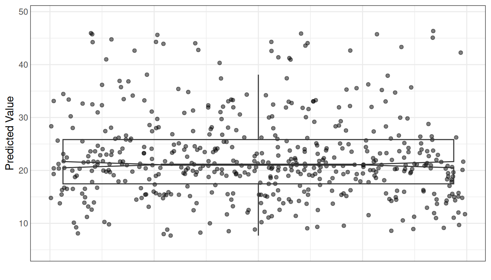

OOB predicted median home values. Points are jittered; boxplot shows the
distribution.

Each point is a single tract’s OOB prediction. The distribution is a
sanity check — we are more interested in the *why* behind these
predictions.

## Variable Selection

### Variable importance (VIMP)

VIMP measures the increase in prediction error when a variable is
randomly permuted ([Breiman 2001](#ref-Breiman:2001)). Large positive
values mean the variable is essential; negative values suggest noise is
more informative.

``` r

plot(gg_vimp(rfsrc_Boston), lbls = st_labs)
```

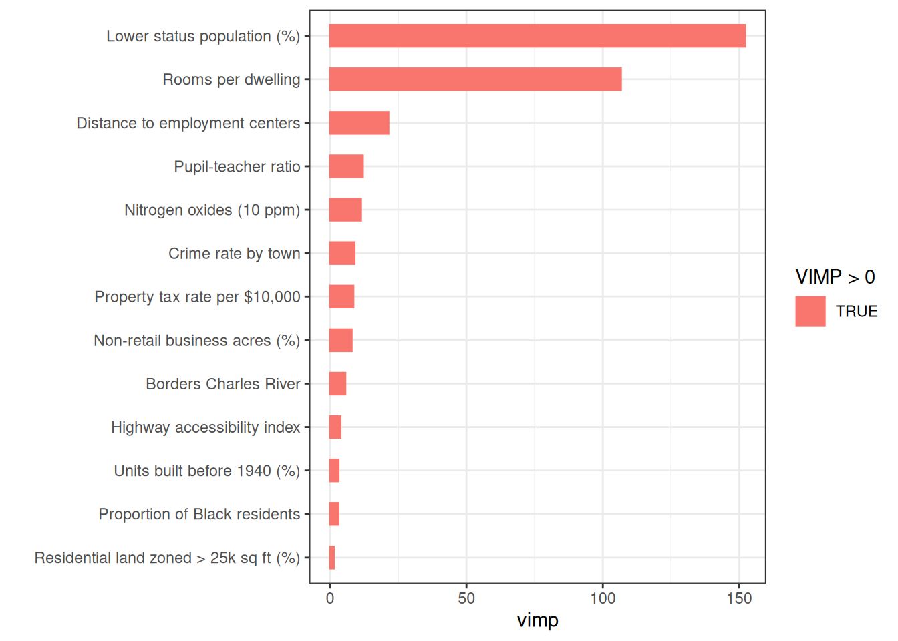

VIMP ranking. Longer blue bars indicate more important variables.

`lstat` and `rm` dominate, with a clear gap to the remaining predictors.
All VIMP values are positive, indicating every predictor contributes at
least marginally.

### Minimal depth

Minimal depth ([Ishwaran et al. 2010](#ref-Ishwaran:2010)) ranks
variables by how close to the root node they first split, on average.
Variables that partition large portions of the population early are
considered most important.

``` r

md_Boston <- max.subtree(rfsrc_Boston) # nolint: object_name_linter
```

The threshold is 3.01, selecting 6 variables: crim, nox, rm, dis,
ptratio, lstat.

Both VIMP and minimal depth agree on the dominance of `lstat` and `rm`.
We use the minimal depth top variables for the remainder of the
analysis.

``` r

xvar <- md_Boston$topvars
```

## Variable Dependence

### Variable dependence plots

Variable dependence shows each tract’s OOB predicted `medv` plotted
against a predictor, with a loess smooth indicating the trend.

``` r

gg_v <- gg_variable(rfsrc_Boston)

plot(gg_v, xvar = xvar, panel = TRUE, alpha = 0.5) +
  labs(y = st_labs["medv"], x = "")
```

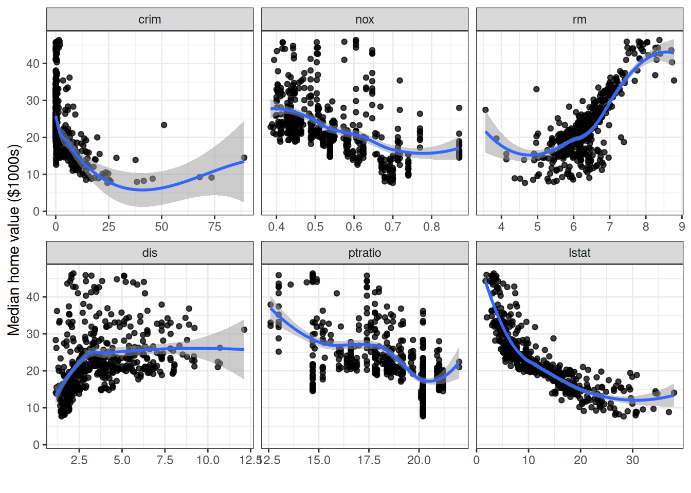

Variable dependence for top predictors (minimal depth rank order).

The panels confirm what EDA suggested: `medv` decreases sharply with
`lstat` and increases with `rm`, both in strongly non-linear ways. The
remaining variables show weaker but still discernible trends.

``` r

plot(gg_v, xvar = "chas", alpha = 0.4) +
  labs(y = st_labs["medv"])
```

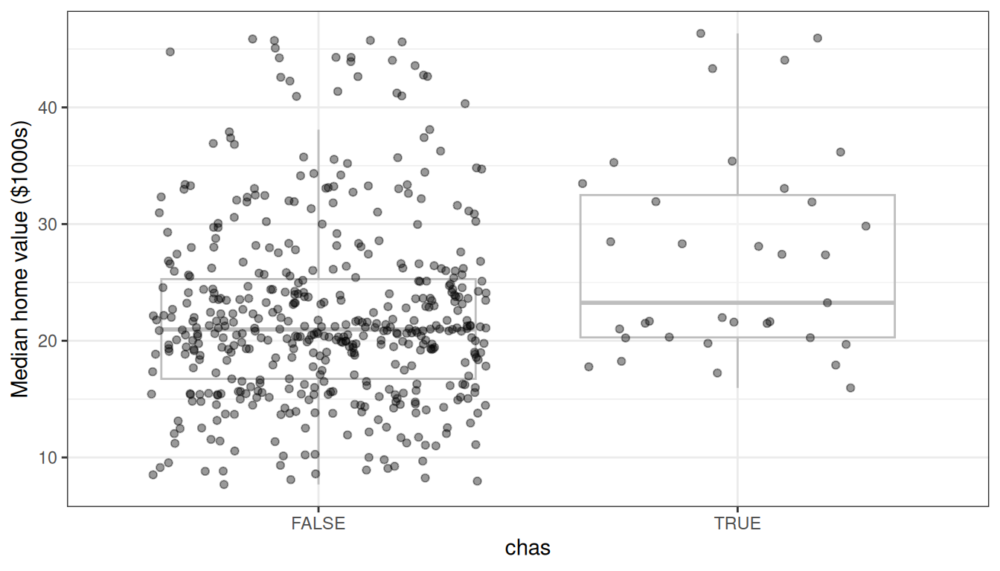

Variable dependence for Charles River (categorical).

Most tracts do not border the Charles River, and the predicted value
distributions largely overlap — consistent with `chas` ranking last in
both VIMP and minimal depth.

### Partial dependence

Partial dependence integrates out the effects of all other covariates,
giving a risk-adjusted view of each predictor’s marginal effect
([Friedman 2001](#ref-Friedman:2000)):

``` math
\tilde{f}(x) = \frac{1}{n} \sum_{i=1}^n \hat{f}(x, x_{i,o})
```

We use
[`gg_partial_rfsrc()`](https://ehrlinger.github.io/ggRandomForests/reference/gg_partial_rfsrc.md),
which calls
[`randomForestSRC::partial.rfsrc()`](https://www.randomforestsrc.org//reference/partial.rfsrc.html)
directly and returns a `gg_partial_rfsrc` object. The quickest path to a
plot is `plot(pd)`, which handles continuous and categorical variables
automatically. For a custom layout we can also access `pd$continuous`
directly.

``` r

pd <- gg_partial_rfsrc(rfsrc_Boston, xvar.names = xvar)

# Quick S3 plot — works out of the box for the standard regression case
plot(pd)
```

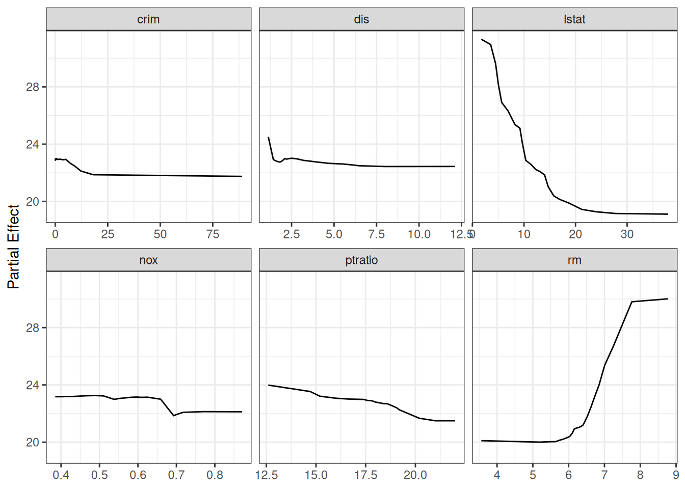

Partial dependence for top predictors.

For a publication-ready layout with custom axis labels, access the
underlying data frame directly:

``` r

ggplot(pd$continuous, aes(x = x, y = yhat)) +
  geom_line(color = "steelblue", linewidth = 1) +
  facet_wrap(~name, scales = "free_x") +
  labs(y = st_labs["medv"], x = "") +
  theme_bw()
```

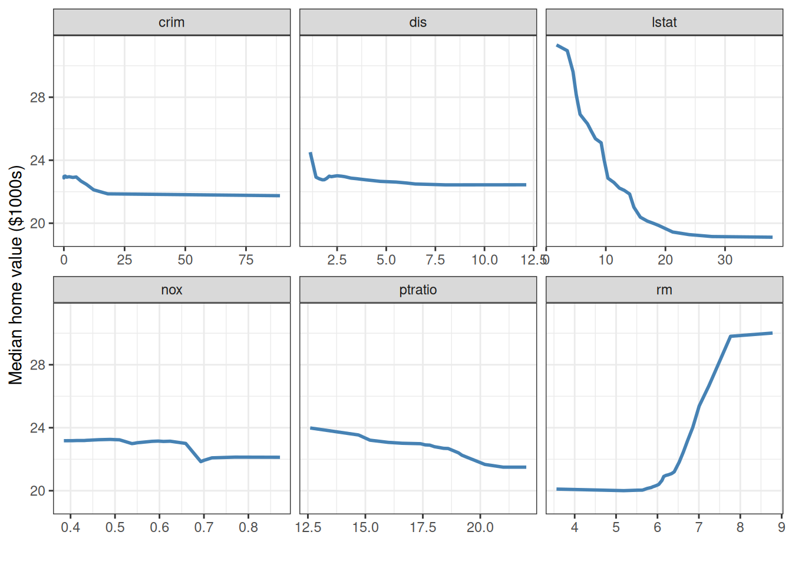

Partial dependence (custom styling).

`lstat` shows a strongly concave relationship, while `rm` has a flat
region below ~6 rooms before increasing sharply. These non-linear shapes
are difficult to capture with simple parametric transforms but are
naturally handled by the random forest.

## Variable Interactions and Conditioning Plots

### Conditioning on a categorical variable

The simplest coplot conditions on a categorical variable. Here we
examine `medv` vs. `lstat`, split by Charles River status:

``` r

gg_v$chas_label <- ifelse(gg_v$chas, "Borders Charles River",
                          "Does not border")

plot(gg_v, xvar = "lstat", alpha = 0.5) +
  labs(y = st_labs["medv"], x = st_labs["lstat"]) +
  theme(legend.position = "none") +
  facet_wrap(~chas_label)
```

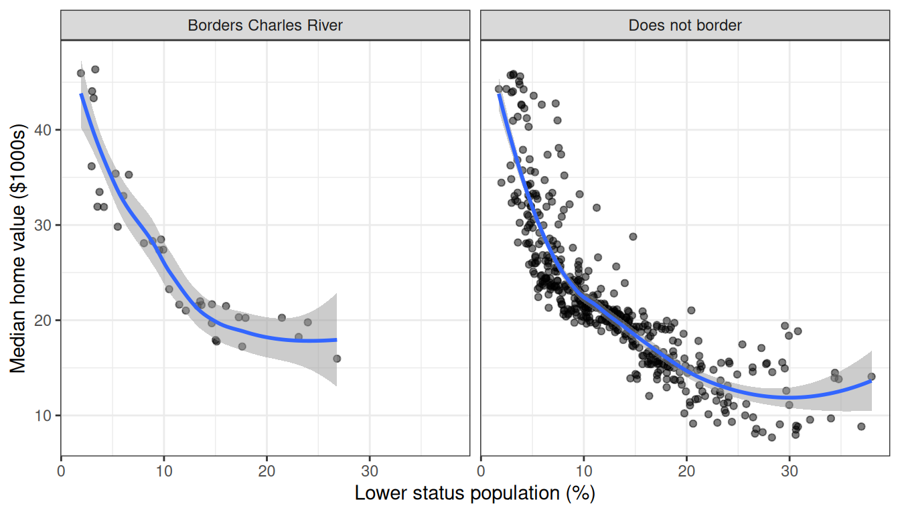

Variable dependence on lstat, conditional on Charles River.

The decreasing trend holds in both groups, with slightly higher values
along the Charles River at every `lstat` level.

### Conditioning on a continuous variable

To investigate the `lstat`–`rm` interaction, we bin `rm` into six
quantile groups using
[`quantile_pts()`](https://ehrlinger.github.io/ggRandomForests/reference/quantile_pts.md)
and facet:

``` r

rm_pts <- quantile_pts(rfsrc_Boston$xvar$rm, groups = 6, intervals = TRUE)
gg_v$rm_grp <- cut(rfsrc_Boston$xvar$rm, breaks = rm_pts)
levels(gg_v$rm_grp) <- paste("rm in", levels(gg_v$rm_grp))

plot(gg_v, xvar = "lstat", alpha = 0.5) +
  labs(y = st_labs["medv"], x = st_labs["lstat"]) +
  theme(legend.position = "none") +
  scale_color_brewer(palette = "Set3") +
  facet_wrap(~rm_grp)
```

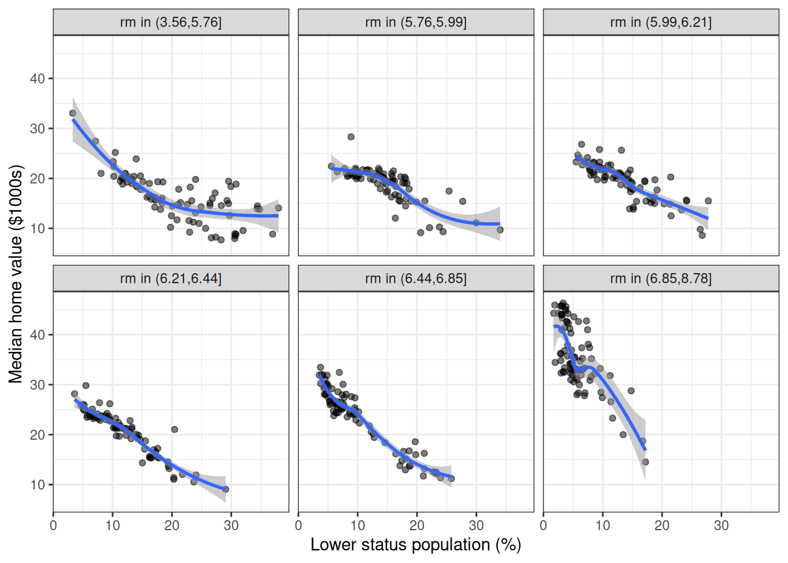

Predicted medv vs. lstat, conditional on rooms-per-dwelling groups.

Median values decrease with `lstat` within every `rm` group, but the
intercept shifts upward with more rooms. Smaller homes in low-`lstat`
(high-status) neighborhoods still command high prices.

The complement view — `medv` vs. `rm`, conditional on `lstat` groups —
completes the picture:

``` r

lstat_pts <- quantile_pts(rfsrc_Boston$xvar$lstat, groups = 6,
                          intervals = TRUE)
gg_v$lstat_grp <- cut(rfsrc_Boston$xvar$lstat, breaks = lstat_pts)
levels(gg_v$lstat_grp) <- paste("lstat in", levels(gg_v$lstat_grp))

plot(gg_v, xvar = "rm", alpha = 0.5) +
  labs(y = st_labs["medv"], x = st_labs["rm"]) +
  theme(legend.position = "none") +
  scale_color_brewer(palette = "Set3") +
  facet_wrap(~lstat_grp)
```

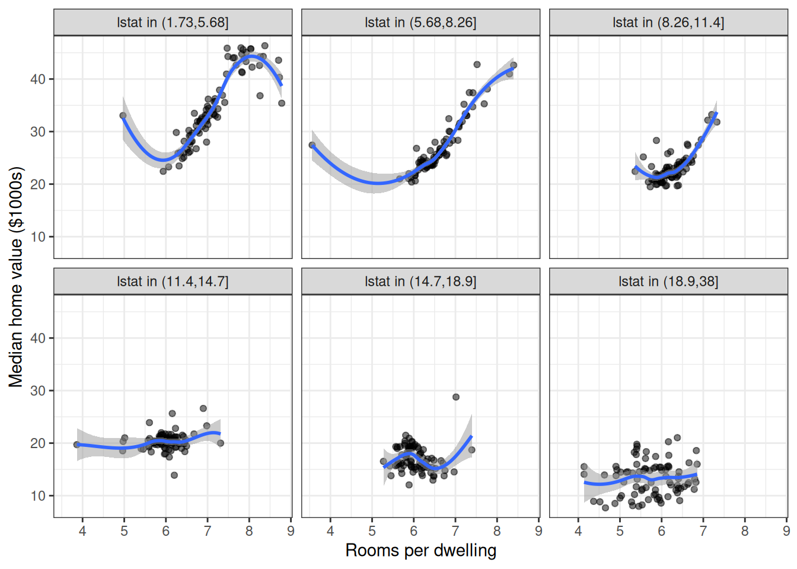

Predicted medv vs. rooms, conditional on lower-status groups.

The `rm` effect is strongest in low-`lstat` tracts (bottom-left panels)
and nearly flat in high-`lstat` tracts, confirming a meaningful
interaction.

## Interactive Partial Dependence Surface

To visualize the joint partial dependence of `medv` on `lstat` and `rm`,
we compute partial dependence on a grid: 25 values of `rm`, each
evaluated at 25 points along `lstat`.

``` r

rm_grid <- quantile_pts(rfsrc_Boston$xvar$rm, groups = 25)

surface_list <- lapply(rm_grid, function(rm_val) {
  newx <- rfsrc_Boston$xvar
  newx$rm <- rm_val
  pd_rm <- gg_partial_rfsrc(rfsrc_Boston, xvar.names = "lstat", newx = newx)
  df <- pd_rm$continuous
  df$rm <- rm_val
  df
})

surface_df <- bind_rows(surface_list)
```

``` r

if (requireNamespace("plotly", quietly = TRUE)) {
  library(plotly)

  surface_wide <- surface_df |>
    select(lstat = x, rm, medv = yhat) |>
    arrange(rm, lstat)

  lstat_vals <- sort(unique(surface_wide$lstat))
  rm_vals    <- sort(unique(surface_wide$rm))
  z_matrix   <- matrix(surface_wide$medv,
                        nrow = length(rm_vals),
                        ncol = length(lstat_vals),
                        byrow = TRUE)

  plot_ly(x = lstat_vals, y = rm_vals, z = z_matrix) |>
    add_surface(colorscale = "Viridis", showscale = TRUE) |>
    layout(
      scene = list(
        xaxis = list(title = "Lower Status (%)"),
        yaxis = list(title = "Rooms per Dwelling"),
        zaxis = list(title = "Median Value ($1000s)")
      )
    )
} else {
  message("Install the plotly package for interactive 3D surfaces.")
  ggplot(surface_df, aes(x = x, y = rm, fill = yhat)) +
    geom_tile() +
    scale_fill_viridis_c(name = "Median Value") +
    labs(x = "Lower Status (%)", y = "Rooms per Dwelling") +
    theme_bw()
}
```

Interactive partial dependence surface: median home value as a function
of lstat and rm.

The surface confirms the strong interaction: home values are highest
when `lstat` is low and `rm` is high (upper-left corner), dropping
steeply along both axes. The non-planar curvature — particularly the
sharp step near `rm` = 7 — demonstrates the kind of complex, non-linear
structure that random forests capture naturally.

## Conclusion

This vignette demonstrated a complete random forest regression analysis
using **randomForestSRC** and **ggRandomForests**:

- **OOB error** via
  [`gg_error()`](https://ehrlinger.github.io/ggRandomForests/reference/gg_error.md)
  showed the forest stabilized quickly.
- **VIMP** via
  [`gg_vimp()`](https://ehrlinger.github.io/ggRandomForests/reference/gg_vimp.md)
  and **minimal depth** via
  [`max.subtree()`](https://www.randomforestsrc.org//reference/max.subtree.rfsrc.html)
  both identified `lstat` and `rm` as the dominant predictors, with a
  clear gap to the remaining variables.
- **Variable dependence** via
  [`gg_variable()`](https://ehrlinger.github.io/ggRandomForests/reference/gg_variable.md)
  revealed strongly non-linear predictor–response relationships that
  match the raw data EDA.
- **Partial dependence** via
  [`gg_partial_rfsrc()`](https://ehrlinger.github.io/ggRandomForests/reference/gg_partial_rfsrc.md)
  provided risk-adjusted confirmation, showing concave `lstat` and
  threshold-like `rm` effects.
- **Conditioning plots** and **interactive surfaces** exposed the
  `lstat`–`rm` interaction, where the room-size effect is strongest in
  high-status neighborhoods.

The **ggRandomForests** design separates data extraction from plotting:
every `gg_*()` function returns a tidy data frame that can be plotted
with the package’s
[`plot()`](https://rdrr.io/r/graphics/plot.default.html) methods or fed
directly into custom `ggplot2` workflows.

## References

Belsley, David A., Edwin Kuh, and Roy E. Welsch. 1980. *Regression
Diagnostics: Identifying Influential Data and Sources of Collinearity*.
John Wiley & Sons. <https://doi.org/10.1002/0471725153>.

Breiman, Leo. 2001. “Random Forests.” *Machine Learning* 45 (1): 5–32.
<https://doi.org/10.1023/A:1010933404324>.

Friedman, Jerome H. 2001. “Greedy Function Approximation: A Gradient
Boosting Machine.” *The Annals of Statistics* 29 (5): 1189–232.
<https://doi.org/10.1214/aos/1013203451>.

Harrison, David, and Daniel L. Rubinfeld. 1978. “Hedonic Housing Prices
and the Demand for a Clean Environment.” *Journal of Environmental
Economics and Management* 5 (1): 81–102.
<https://doi.org/10.1016/0095-0696(78)90006-2>.

Ishwaran, Hemant, and Udaya B. Kogalur. 2024. *randomForestSRC: Fast
Unified Random Forests for Survival, Regression, and Classification
(RF-SRC)*. <https://cran.r-project.org/package=randomForestSRC>.

Ishwaran, Hemant, Udaya B. Kogalur, Eiran Z. Gorodeski, Andy J. Minn,
and Michael S. Lauer. 2010. “High-Dimensional Variable Selection for
Survival Data.” *Journal of the American Statistical Association* 105
(489): 205–17. <https://doi.org/10.1198/jasa.2009.tm08622>.

Venables, William N., and Brian D. Ripley. 2002. *Modern Applied
Statistics with S*. 4th ed. Springer.
<https://doi.org/10.1007/978-0-387-21706-2>.

Wickham, Hadley. 2016. *ggplot2: Elegant Graphics for Data Analysis*.
2nd ed. Springer. <https://doi.org/10.1007/978-3-319-24277-4>.
