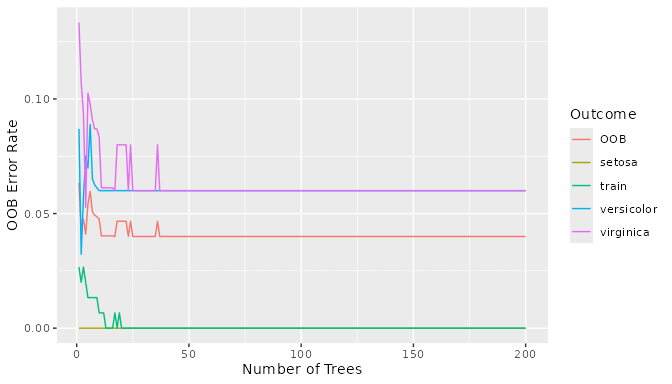
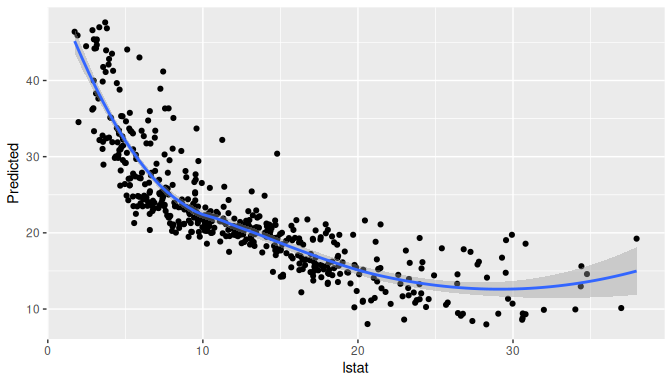
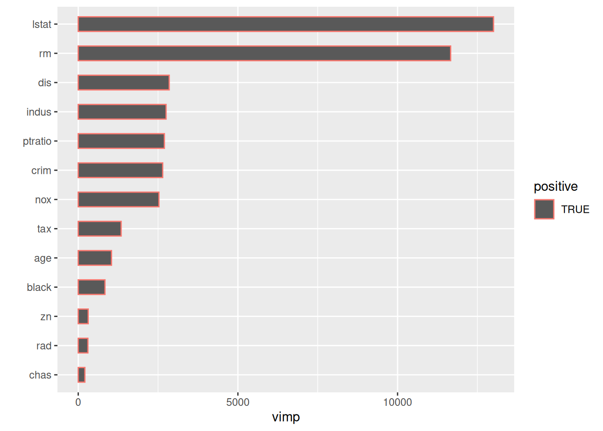

# Exploring Random Forests with ggRandomForests

The **ggRandomForests** package extracts tidy data objects from either
`randomForestSRC` or `randomForest` fits and feeds them into familiar
`ggplot2` workflows. This vignette highlights the most common objects—
`gg_error`, `gg_variable`, and `gg_vimp`—along with a small helper for
building balanced conditioning intervals.

## Error trajectories with `gg_error()`

``` r
library(randomForest)
set.seed(42)
rf_iris <- randomForest(Species ~ ., data = iris, ntree = 200, keep.forest = TRUE)
err_df <- ggRandomForests::gg_error(rf_iris, training = TRUE)
head(err_df)
```

             OOB setosa versicolor  virginica ntree      train
    1 0.06349206      0 0.08695652 0.13333333     1 0.02666667
    2 0.04255319      0 0.03225806 0.10714286     2 0.02000000
    3 0.04761905      0 0.05714286 0.09375000     3 0.02666667
    4 0.04098361      0 0.07500000 0.05263158     4 0.02000000
    5 0.05426357      0 0.06976744 0.10256410     5 0.01333333
    6 0.05970149      0 0.08888889 0.09756098     6 0.01333333

The
[`gg_error()`](https://ehrlinger.github.io/ggRandomForests/reference/gg_error.md)
object stores the cumulative OOB error rate for each outcome column plus
the `ntree` counter. When `training = TRUE`, the function reconstructs
the original model frame and appends the in-bag error trajectory
(`train`). Plotting overlays both curves by default:

``` r
plot(err_df)
```



## Marginal dependence via `gg_variable()`

``` r
set.seed(99)
boston <- MASS::Boston
rf_boston <- randomForest(medv ~ ., data = boston, ntree = 150)
var_df <- ggRandomForests::gg_variable(rf_boston)
str(var_df[, c("lstat", "yhat")])
```

    Classes 'gg_variable', 'regression' and 'data.frame':   506 obs. of  2 variables:
     $ lstat: num  4.98 9.14 4.03 2.94 5.33 ...
     $ yhat : num  29.2 22.5 35.1 36.4 33.4 ...

Because the original training data are recovered from the model call,
[`gg_variable()`](https://ehrlinger.github.io/ggRandomForests/reference/gg_variable.md)
works even when the forest was trained within helper functions or
against a [`subset()`](https://rdrr.io/r/base/subset.html) expression.
The output keeps the raw predictors plus either a continuous `yhat`
column (regression) or per-class probabilities (`yhat.<class>` for
classification). Plotting a single variable is straightforward:

``` r
plot(var_df, xvar = "lstat")
```

    `geom_smooth()` using method = 'loess' and formula = 'y ~ x'



Survival forests can request multiple horizons using the `time`
argument; non-OOB predictions are available by setting `oob = FALSE`.

## Variable importance with `gg_vimp()`

``` r
vimp_df <- ggRandomForests::gg_vimp(rf_boston)
head(vimp_df)
```

    # A tibble: 6 × 4
      vars    set     vimp positive
      <fct>   <chr>  <dbl> <lgl>
    1 lstat   vimp  13005. TRUE
    2 rm      vimp  11662. TRUE
    3 dis     vimp   2849. TRUE
    4 indus   vimp   2751. TRUE
    5 ptratio vimp   2698. TRUE
    6 crim    vimp   2646. TRUE    

``` r
plot(vimp_df)
```



If a `randomForest` object lacks stored importance scores,
[`gg_vimp()`](https://ehrlinger.github.io/ggRandomForests/reference/gg_vimp.md)
tries to compute them on the fly. When the forest truly cannot provide
the information (for example when `importance = FALSE` and the
predictors are no longer accessible), the function emits a warning and
returns `NA` placeholders so plots still render.

## Balanced conditioning cuts with `quantile_pts()`

``` r
rm_breaks <- ggRandomForests::quantile_pts(boston$rm, groups = 6, intervals = TRUE)
rm_groups <- cut(boston$rm, breaks = rm_breaks)
table(rm_groups)
```

    rm_groups
    (3.56,5.76] (5.76,5.99] (5.99,6.21] (6.21,6.44] (6.44,6.85] (6.85,8.78]
             85          84          84          85          84          84 

The helper wraps
[`stats::quantile()`](https://rdrr.io/r/stats/quantile.html) to produce
evenly populated strata that drop directly into
[`cut()`](https://rdrr.io/r/base/cut.html) when building coplots or
facet labels.

## Next steps

- Inspect the full API reference at
  <https://ehrlinger.github.io/ggRandomForests/>.
- Use
  [`?gg_error`](https://ehrlinger.github.io/ggRandomForests/reference/gg_error.md),
  [`?gg_variable`](https://ehrlinger.github.io/ggRandomForests/reference/gg_variable.md),
  [`?gg_vimp`](https://ehrlinger.github.io/ggRandomForests/reference/gg_vimp.md),
  and
  [`?quantile_pts`](https://ehrlinger.github.io/ggRandomForests/reference/quantile_pts.md)
  for additional arguments and examples.
- Pair these data objects with your own `ggplot2` themes to align with
  your preferred publication style.
