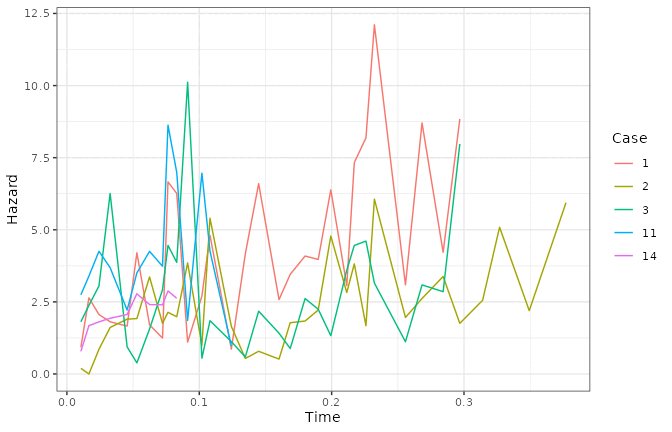
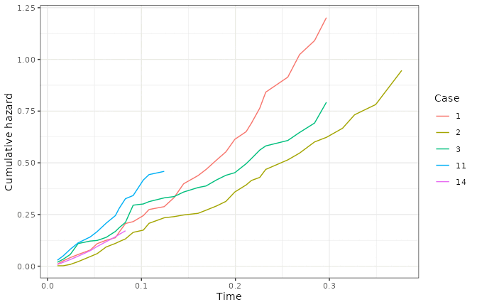
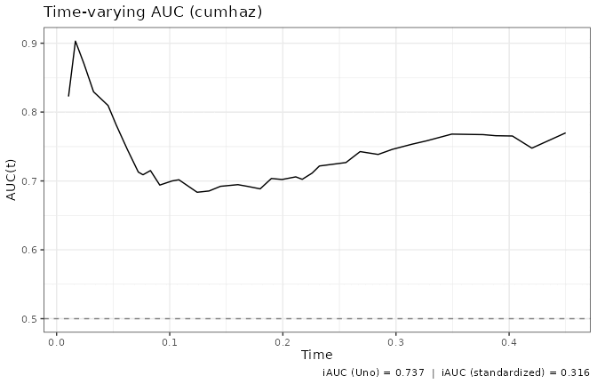
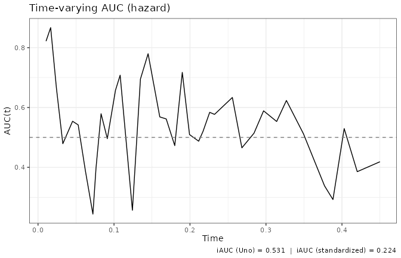
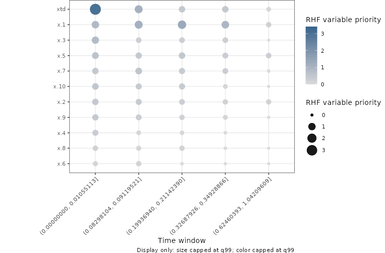
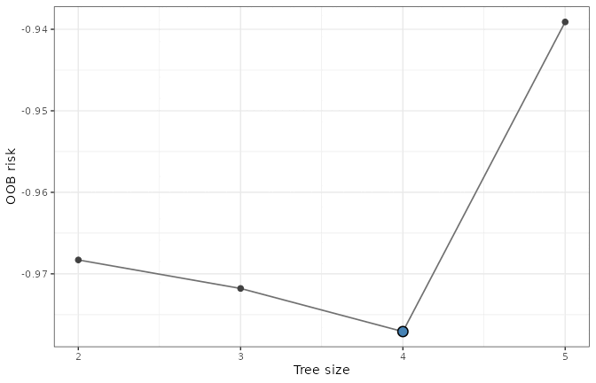
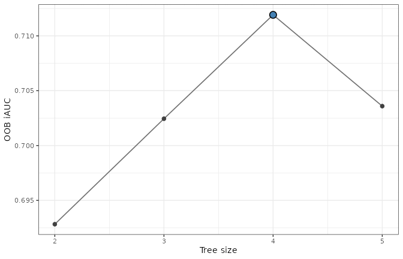

# Random Hazard Forests with ggRandomForests

Most survival data begin with one row per subject: a follow-up time, an
event indicator, and covariates measured at baseline. That row cannot
show a covariate changing during follow-up. A Random Hazard Forest (RHF)
instead accepts repeated time intervals for each subject, so a tree can
use the covariate values that belong to each part of the subject’s path
([Ishwaran et al. 2026](#ref-Ishwaran:RHF:2026); [Ishwaran and Kogalur
2026](#ref-Ishwaran:RHF:software:2026)).

This vignette uses simulated counting-process data to show how
**ggRandomForests** reads an RHF fit. We first make the time-dependent
data structure explicit, then extract case-specific hazard and
cumulative hazard curves. The fitting, performance, importance, and
tuning work has already been run by `vignettes/precompute_rhf.R`. The
article evaluates only the inexpensive **ggRandomForests** extraction
and plotting steps.

## What changes with counting-process data?

One subject can contribute several rows. Each row covers an interval
$`(\mathit{start}, \mathit{stop}]`$, and `event` records whether the
event occurs at that interval’s right endpoint. The first simulated
subject makes the layout concrete:

``` r

rhf_data <- bundle$data
one_subject <- rhf_data[rhf_data$id == rhf_data$id[1L],
                        c("id", "start", "stop", "event", "xtd")]
knitr::kable(one_subject, digits = 3)
```

|  id | start |  stop | event |   xtd |
|----:|------:|------:|------:|------:|
|   1 | 0.000 | 0.082 |     0 | 0.054 |
|   1 | 0.082 | 0.121 |     0 | 0.080 |
|   1 | 0.121 | 0.185 |     0 | 0.122 |
|   1 | 0.185 | 0.313 |     1 | 0.207 |

The intervals do more than divide follow-up into pieces. They define a
covariate path. A time-dependent covariate must be *predictable*: the
value used at time $`t`$ is known just before the event decision at
$`t`$. In the first RHF simulation, the actual identity is
`xtd = (x.4 + x.5) * stop`. Because this is a continuous function of
time and the subject’s fixed `x.4` and `x.5`, its value at `stop` is
also its left-hand limit there. It is available for the interval ending
at that time.

That distinction matters with data collected in practice. A lab value
measured after an interval ends cannot be copied backward into that
interval. At any candidate split time, the subject must be routed using
the active record, not a later measurement. This is the no-lookahead
rule: future covariate values never select an earlier branch. The
active-record stitching and tree routing are behavior of
[`randomForestRHF::rhf()`](https://www.randomforestsrc.org//reference/rhf.html),
not **ggRandomForests**. **ggRandomForests** reads the fitted estimates
after the upstream model has applied those rules ([Ishwaran et al.
2026](#ref-Ishwaran:RHF:2026); [Ishwaran and Kogalur
2026](#ref-Ishwaran:RHF:software:2026)).

Here is a compact view of the full simulated data set:

``` r

records_per_subject <- as.integer(table(rhf_data$id))
events_by_subject <- tapply(rhf_data$event, rhf_data$id, max)
data_summary <- data.frame(
  measure = c(
    "Subjects",
    "Counting-process records",
    "Records per subject",
    "Subjects with an event",
    "xtd range"
  ),
  value = c(
    length(unique(rhf_data$id)),
    nrow(rhf_data),
    sprintf(
      "%d to %d (median %g)",
      min(records_per_subject),
      max(records_per_subject),
      stats::median(records_per_subject)
    ),
    sum(events_by_subject),
    sprintf("%.3f to %.3f", min(rhf_data$xtd), max(rhf_data$xtd))
  )
)
knitr::kable(data_summary, col.names = c("Measure", "Value"))
```

| Measure                  | Value             |
|:-------------------------|:------------------|
| Subjects                 | 500               |
| Counting-process records | 2598              |
| Records per subject      | 2 to 7 (median 5) |
| Subjects with an event   | 427               |
| xtd range                | 0.000 to 0.975    |

## Where did the fitted objects come from?

The preparation below is shown but not evaluated while the vignette
renders. These are the fixed calls used to create the saved bundle.
Keeping the upstream objects in `rhf_precomputed.rds` makes CRAN builds
predictable, while `vignettes/precompute_rhf.R` lets you reproduce the
bundle from the same public simulation whenever you want to rerun the
longer calculations.

``` r

set.seed(20260825L)
sim <- randomForestRHF::hazard.simulation(1)
data <- sim$dta
formula <- stats::as.formula("Surv(id, start, stop, event) ~ .")
with(data, stopifnot(identical(xtd, (x.4 + x.5) * stop)))

fit <- randomForestRHF::rhf(
  formula, data, ntree = 50L, seed = -1L
)
auct_cumulative <- randomForestRHF::auct.rhf(
  fit, marker = "cumhaz", method = "cumulative", verbose = FALSE
)
auct_incident <- randomForestRHF::auct.rhf(
  fit, marker = "hazard", method = "incident",
  riskset = "subject", verbose = FALSE
)
cache <- randomForestRHF::varpro.cache.rhf(
  fit, max.rules.tree = 30L, max.tree = 20L, verbose = FALSE
)
time_index <- unique(as.integer(round(seq.int(
  1L, cache$K, length.out = 5L
))))
importance <- randomForestRHF::importance.rhf(
  fit, cache = cache, time.index = time_index, verbose = FALSE
)
tune_risk <- randomForestRHF::tune.treesize.rhf(
  formula, data, ntree = 20L, perf = "risk", lower = 2L,
  upper = 6L, max.evals = 5L, seed = 20260825L, verbose = FALSE,
  forest = FALSE
)
tune_iauc <- randomForestRHF::tune.iAUC.rhf(
  formula, data, ntree = 20L, lower = 2L, upper = 6L,
  max.evals = 5L, seed = 20260825L, verbose = FALSE,
  forest = FALSE
)
```

The loaded fit can be checked without growing another forest:

``` r

fit_summary <- data.frame(
  measure = c(
    "Object class",
    "Trees",
    "Subjects",
    "Working time points",
    "Saved ensemble source"
  ),
  value = c(
    paste(class(bundle$fit), collapse = ", "),
    bundle$fit$ntree,
    length(bundle$fit$ensemble.id),
    length(bundle$fit$time.interest),
    "out-of-bag hazard and cumulative hazard"
  )
)
knitr::kable(fit_summary, col.names = c("Fit component", "Value"))
```

| Fit component         | Value                                   |
|:----------------------|:----------------------------------------|
| Object class          | rhf, grow, surv-tdc                     |
| Trees                 | 50                                      |
| Subjects              | 500                                     |
| Working time points   | 42                                      |
| Saved ensemble source | out-of-bag hazard and cumulative hazard |

## How do hazard and cumulative hazard differ?

[`gg_rhf()`](https://ehrlinger.github.io/ggRandomForests/reference/gg_rhf.md)
extracts both estimates into one tidy object, with one row for each
subject and point on the RHF working time grid. This extraction runs
live when the article renders:

``` r

rhf_curves <- ggRandomForests::gg_rhf(bundle$fit)
head(as.data.frame(rhf_curves))
```

    #>   id       time    hazard         chf source
    #> 1  1 0.01055113 0.9265708 0.009776536    oob
    #> 2  2 0.01055113 0.1961717 0.002069869    oob
    #> 3  3 0.01055113 1.8109938 0.019108357    oob
    #> 4  4 0.01055113 0.7639137 0.008060290    oob
    #> 5  5 0.01055113 0.8986797 0.009482248    oob
    #> 6  6 0.01055113 3.5193765 0.037134033    oob

The `source` column is `"oob"` here, so each displayed curve uses the
trees for which that subject was out of bag. We select six subjects only
to keep the lines readable; the extracted object contains all 500.

### Hazard is local

``` r

case_ids <- c(1, 2, 3, 11, 14, 22)
plot(rhf_curves, idx = case_ids)
```



Hazard is a local event rate. A high point says that events are
occurring at a high instantaneous rate among subjects still at risk
around that time. It is not the probability that a subject has the event
at that time, so neither its height nor its scale should be read as a
percentage. RHF estimates this local quantity directly ([Ishwaran et al.
2026](#ref-Ishwaran:RHF:2026)).

### Why do the hazard curves stop early?

Each line ends where that subject’s follow-up ends. This is upstream
behavior: from version 2.0.0,
[`randomForestRHF::rhf()`](https://www.randomforestsrc.org//reference/rhf.html)
returns a pointwise hazard only where a grid point falls inside one of
the subject’s supplied `(start, stop]` records, and `NA` everywhere
else, both in the gaps between records and after the final stop time.
Earlier versions carried an estimate across the whole grid.
[`gg_rhf()`](https://ehrlinger.github.io/ggRandomForests/reference/gg_rhf.md)
passes those `NA` values through unchanged, and
[`plot()`](https://rdrr.io/r/graphics/plot.default.html) drops them
before drawing, so a curve covers the range the forest was asked about
and no more.

Cumulative hazard is masked too, but on a different rule, and version
2.0.3 changed it. It accumulates the exact overlap between the working
grid and the supplied records, so it stays flat through a gap between
two records rather than going missing there. After a subject’s final
stop, though, there is no more overlap to accumulate, and from 2.0.3 the
value is `NA` instead of the last level carried forward. So the
cumulative-hazard panel below ends each curve where the hazard panel
does, and the difference between the two masks only shows up on a fit
with time-dependent covariates, where the gaps are real. If you
summarize either column yourself, remember to pass `na.rm = TRUE`.

### Cumulative hazard adds the local rates

The same `gg_rhf` object carries `chf`. Set the public `hazard.only`
argument to `FALSE` to draw it:

``` r

plot(rhf_curves, idx = case_ids, hazard.only = FALSE)
```



The cumulative hazard function (CHF) adds hazard over follow-up. It
summarizes accumulated event pressure, but it is unbounded and is not an
event probability. Its scale answers “how much hazard has accumulated?”,
while the hazard plot answers “where is the event rate high right now?”

There is one wrinkle in these time-dependent curves. `randomForestRHF`
stitches record-specific ensemble estimates as each subject’s active
record changes. A new record’s estimated CHF can start below the
preceding record’s value, so a stitched case curve may contain a
downward step. That step does not mean a negative hazard or that past
event pressure disappeared. It marks the upstream model’s transition to
a different active-record estimate ([Ishwaran and Kogalur
2026](#ref-Ishwaran:RHF:software:2026)).

## How does discrimination change over time?

Survival AUC needs a definition of a case and a control at each time.
The two definitions below answer different questions, and each uses the
marker that matches its question. The saved AUC calculations are
supplied to
[`gg_auct()`](https://ehrlinger.github.io/ggRandomForests/reference/gg_auct.md);
only the extraction and plotting run during this render. Each call below
still names its own `method`, which the saved fit already fixes, so that
dropping `auct_fit` and letting
[`gg_auct()`](https://ehrlinger.github.io/ggRandomForests/reference/gg_auct.md)
compute leaves the chunk asking for the same estimand instead of falling
back to the `"cumulative"` default.

### Cumulative/dynamic AUC uses cumulative hazard

Suppose the question is whether a subject who has experienced the event
by a horizon ranks above a subject who remains event-free at that
horizon. This is the cumulative/dynamic target. The corresponding marker
is cumulative hazard, named `"chf"` in
[`gg_auct()`](https://ehrlinger.github.io/ggRandomForests/reference/gg_auct.md)
and `"cumhaz"` in the retained upstream object.

``` r

auct_cumulative <- gg_auct(
  bundle$fit,
  marker = "chf",
  method = "cumulative",
  auct_fit = bundle$auct_cumulative
)
plot(auct_cumulative)
```



The saved curve has a Uno iAUC of 0.737. Its finite AUC values range
from 0.684 to 0.903 over this fitted time grid. AUC is a ranking
probability on a 0 to 1 scale, with 0.5 shown as the chance reference.
The retained calculation did not use a bootstrap, so the plot has no
confidence ribbon.

This curve needs `randomForestRHF` 2.0.3 or newer, which is why the
package asks for that version. Before 2.0.3, `auct.rhf()` could put the
cumulative/dynamic curve below the chance line on data the forest fits
well. That was upstream rather than in
[`gg_auct()`](https://ehrlinger.github.io/ggRandomForests/reference/gg_auct.md),
which passes the values through unchanged either way.

### Incident/dynamic AUC uses hazard

A different question asks whether a subject who experiences the event
near time $`t`$ ranks above a subject in the relevant risk set at $`t`$.
This is the incident/dynamic target. It uses the local hazard marker,
named `"haz"` in
[`gg_auct()`](https://ehrlinger.github.io/ggRandomForests/reference/gg_auct.md)
and `"hazard"` upstream.

``` r

auct_incident <- gg_auct(
  bundle$fit,
  marker = "haz",
  method = "incident",
  riskset = "subject",
  auct_fit = bundle$auct_incident
)
plot(auct_incident)
```



Here the Uno iAUC is 0.531. The curve is more variable than the
cumulative/dynamic curve, with finite AUC values from 0.244 to 0.867.
These values do not show that one marker is a better version of the
other. Cumulative/dynamic AUC ranks accumulated risk through a horizon,
while incident/dynamic AUC ranks local failures within a risk set. They
estimate different targets.

## Which variables matter, and when?

The retained `importance.rhf` object is the starting point here. Its
expensive upstream work was performed once: `varpro.cache.rhf()`
collected the rule and near-miss information, then `importance.rhf()`
evaluated five selected time windows. Supplying that result avoids
repeating either calculation.

``` r

rhf_priority <- gg_rhf_importance(
  bundle$fit,
  importance_fit = bundle$importance
)
plot(rhf_priority) +
  ggplot2::theme(plot.margin = ggplot2::margin(l = 80))
```



RHF priority is a time-local rule-release contrast. Within a window, it
compares the log integrated-hazard working response for a rule with its
near-miss set and asks how much that fitted response changes when rules
involving a variable are released. Larger nonnegative values in this
supplied object mean a larger contrast. They do not say that a covariate
raises or lowers hazard, and they are not z-scores, p-values, or
automatic variable selection thresholds.

The dot size and color show the same priority value, with a
99th-percentile cap applied to the display only. The extracted values do
not change. In this simulation, `xtd` has the largest early-window
value, about 5.51, while `x.1` has the largest value in several later
windows. The number at risk falls from 779 to 32 across the five
displayed windows, so the late-window comparisons use less information.
One late `x.4` result is unavailable in the upstream object and appears
without a point. For work you plan to revisit, retain both the upstream
cache and the `importance.rhf` result; supply the latter to
[`gg_rhf_importance()`](https://ehrlinger.github.io/ggRandomForests/reference/gg_rhf_importance.md)
for each display.

## Which tree size did the upstream searches select?

The two retained `tune.treesize.rhf` objects contain the evaluated paths
and their selected sizes.
[`gg_tune_rhf()`](https://ehrlinger.github.io/ggRandomForests/reference/gg_tune_rhf.md)
preserves the upstream evaluation order, so the connecting line follows
the order in which candidates were evaluated, not a newly sorted
sequence. The emphasized point marks the size selected by the upstream
search.

### OOB risk tuning

``` r

risk_tuning <- gg_tune_rhf(bundle$tune_risk)
risk_tuning
```

    #> <gg_tune_rhf>  n: 4  |  metric: OOB risk  evaluations: 4  |  selected treesize: 4  value: -0.9771

``` r

plot(risk_tuning)
```



The risk search evaluated tree sizes 2, 3, 4, 5 in that order and
selected size 4, where the saved mean OOB risk was smallest. The
retained risk path has no standard-error field.
[`gg_tune_rhf()`](https://ehrlinger.github.io/ggRandomForests/reference/gg_tune_rhf.md)
sets its `se` values to missing and does not fabricate uncertainty, so a
risk plot has no ribbon.

### OOB iAUC tuning

``` r

iauc_tuning <- gg_tune_rhf(bundle$tune_iauc)
iauc_tuning
```

    #> <gg_tune_rhf>  n: 4  |  metric: OOB iAUC  evaluations: 4  |  selected treesize: 4  value: 0.7119

``` r

plot(iauc_tuning)
```



The iAUC search evaluated tree sizes 2, 3, 4, 5 and selected size 4,
where OOB iAUC was largest. An iAUC ribbon is drawn only when finite
upstream standard errors are present. This saved path has 0 finite
standard errors, so its plot has no ribbon. Retaining each tuning result
preserves the actual candidate path, search order, and selected point
without rerunning the fits.

## What does each extractor return?

All four families keep extraction separate from plotting. The
intermediate object is a data frame with an added class, so you can
inspect it before calling
[`plot()`](https://rdrr.io/r/graphics/plot.default.html).

``` r

support <- data.frame(
  extractor = c(
    "gg_rhf()",
    "gg_auct()",
    "gg_rhf_importance()",
    "gg_tune_rhf()"
  ),
  upstream_input = c(
    "rhf fit",
    "rhf fit plus an optional auct.rhf object",
    "rhf fit plus an optional importance.rhf object",
    "tune.treesize.rhf object"
  ),
  returned_class = c(
    "gg_rhf, data.frame",
    "gg_auct, data.frame",
    "gg_rhf_importance, data.frame",
    "gg_tune_rhf, data.frame"
  ),
  scale = c(
    paste(
      "Hazard is a local event rate; cumulative hazard is accumulated",
      "event pressure. Neither is a probability."
    ),
    paste(
      "AUC(t) and iAUC are ranking measures from 0 to 1; interpretation",
      "depends on the case definition and marker."
    ),
    paste(
      "Time-local rule-release priority; larger values mean a larger",
      "working-response contrast, not statistical significance."
    ),
    paste(
      "OOB risk is minimized or OOB iAUC is maximized; the selected",
      "tree size is marked."
    )
  ),
  check.names = FALSE
)
knitr::kable(
  support,
  col.names = c(
    "Extractor", "Upstream input class or object",
    "Returned class", "Output scale and interpretation"
  )
)
```

| Extractor | Upstream input class or object | Returned class | Output scale and interpretation |
|:---|:---|:---|:---|
| gg_rhf() | rhf fit | gg_rhf, data.frame | Hazard is a local event rate; cumulative hazard is accumulated event pressure. Neither is a probability. |
| gg_auct() | rhf fit plus an optional auct.rhf object | gg_auct, data.frame | AUC(t) and iAUC are ranking measures from 0 to 1; interpretation depends on the case definition and marker. |
| gg_rhf_importance() | rhf fit plus an optional importance.rhf object | gg_rhf_importance, data.frame | Time-local rule-release priority; larger values mean a larger working-response contrast, not statistical significance. |
| gg_tune_rhf() | tune.treesize.rhf object | gg_tune_rhf, data.frame | OOB risk is minimized or OOB iAUC is maximized; the selected tree size is marked. |

## How can this analysis be reproduced?

The bundle records the public simulation, seed, calculation settings,
and package versions used for this render. These are the saved versions:

``` r

version_table <- data.frame(
  package = names(bundle$versions),
  version = unname(bundle$versions),
  row.names = NULL
)
knitr::kable(
  version_table,
  col.names = c("Software", "Saved version")
)
```

| Software        | Saved version |
|:----------------|:--------------|
| R               | 4.6.1         |
| ggRandomForests | 4.0.0         |
| randomForestRHF | 2.0.3         |
| ggplot2         | 4.0.3         |

Run `Rscript vignettes/precompute_rhf.R` from the package root to
regenerate all ten bundle components. That script repeats the sole
longitudinal simulation and uses `bundle$seed` and the settings shown
earlier. The exact numerical result can still change when the recorded
package versions change.

For routine use, retain the fitted forest and each expensive upstream
result: the two `auct.rhf` calculations, the importance cache and
result, and both tuning objects. Supplying those objects is the default
workflow for a report you expect to render more than once. It separates
a long model calculation from a short, repeatable extraction and plot.

## Further reading

The RHF method, including its counting-process construction and
hazard-based forest, is described by Ishwaran, Hsich, Kogalur, and Lee
([Ishwaran et al. 2026](#ref-Ishwaran:RHF:2026)). The `randomForestRHF`
software reference documents the R implementation and the upstream
objects used throughout this article ([Ishwaran and Kogalur
2026](#ref-Ishwaran:RHF:software:2026)).

Ishwaran, Hemant, Eileen M. Hsich, Udaya B. Kogalur, and Donald K. K.
Lee. 2026. “Random Hazard Forests.” *arXiv Preprint*, ahead of print.
<https://doi.org/10.48550/arXiv.2608.21597>.

Ishwaran, Hemant, and Udaya B. Kogalur. 2026. *randomForestRHF: Random
Hazard Forests*. <https://CRAN.R-project.org/package=randomForestRHF>.
