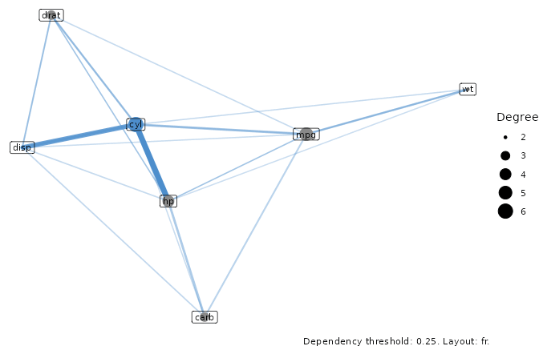
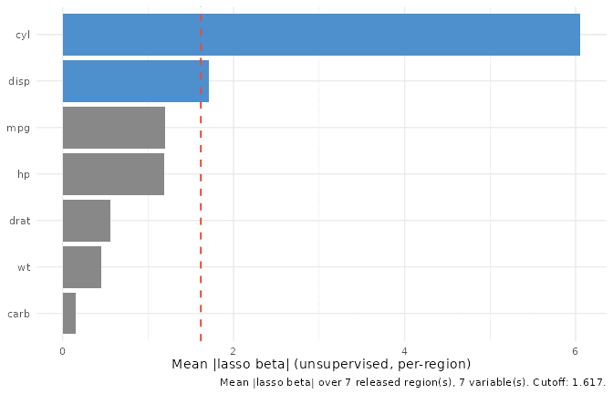
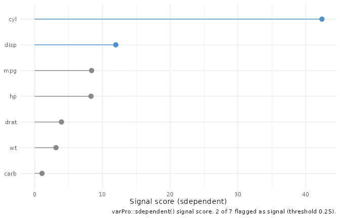

# Variable selection without an outcome: unsupervised varPro

``` r

library(ggplot2)

# Match the pattern used by the other vignettes: try the installed
# package first, fall back to pkgload::load_all() for the R CMD check
# vignette rebuild where the package isn't yet on .libPaths(). All varPro
# calls below are ::-qualified, so no library(varPro) is needed.
if (requireNamespace("ggRandomForests", quietly = TRUE)) {
  library(ggRandomForests)
} else if (requireNamespace("pkgload", quietly = TRUE)) {
  pkgload::load_all(export_all = FALSE, helpers = FALSE,
                    attach_testthat = FALSE)
} else {
  stop("Install ggRandomForests (or pkgload for dev builds) to render this vignette.")
}
```

## Importance without a response

Most measures of variable importance start from a question: which
predictors help explain *this* outcome? Permutation VIMP, the varPro
release rules, the per-rule lasso weights behind
[`gg_beta_varpro()`](https://ehrlinger.github.io/ggRandomForests/reference/gg_beta_varpro.md)
— all of them score a variable by how much it moves a response `y`. The
companion [varPro
vignette](https://ehrlinger.github.io/ggRandomForests/articles/varpro.md)
walks that supervised toolkit end to end.

But sometimes there is no `y`. You have a matrix of predictors and you
want to know which columns carry the structure of the data: which
variables define its shape, which travel together, and which are close
to noise. That is the job of unsupervised varPro.
[`varPro::uvarpro()`](https://www.randomforestsrc.org/reference/uvarpro.html)
grows a forest on the predictor matrix alone, with no response, and
scores each variable by how much entropy it contributes to the regions
the forest carves out ([Lu and Ishwaran 2024](#ref-Lu2024varpro)).
“Important” here does not mean useful for prediction. It means a
variable helps reconstruct the feature space that the others cannot.

This is a short vignette. It walks the three `gg_*` views of a single
`uvarpro()` fit, and each one answers a different question about that
fit: what depends on what, what ranks highest, and where to draw the
line between signal and noise.

## One fit, three views

We’ll use `mtcars`. Its columns are all numeric, and several of them
measure closely related things — displacement, horsepower, weight, and
cylinder count all track engine size — so the unsupervised structure is
easy to read.

``` r

set.seed(1)
u <- varPro::uvarpro(mtcars, ntree = 50)
```

Notice what `uvarpro()` was handed: the data frame, and nothing else. No
formula, no outcome column singled out. All three views below read off
this one fit. Two of them rest on the same `get.beta.entropy()` matrix,
which is the only part worth caching, so we compute it once and pass it
to both rather than paying for it twice:

``` r

beta_fit <- varPro::get.beta.entropy(u)
```

### What depends on what: `gg_udependent()`

[`gg_udependent()`](https://ehrlinger.github.io/ggRandomForests/reference/gg_udependent.md)
reads cross-variable structure off the fit and draws it as a network:
nodes are variables, edges are dependencies above a configurable
threshold. The picture is built with `ggraph`, which lives in `Suggests`
rather than `Imports`, so install it if you want this view.

``` r

plot(gg_udependent(u))
```



Clusters of mutually connected variables are worth a second look.
Because the fit has no response, a cluster tells you these columns are
correlated in feature space regardless of whether any of them would
matter for a prediction. When you do have a downstream model, that is
useful on its own: a variable can be important for prediction and still
sit in a tight cluster with a near-duplicate, and in that case parsimony
may favor dropping one member of the cluster without losing much.

### What ranks highest: `gg_beta_uvarpro()`

The network shows *structure*;
[`gg_beta_uvarpro()`](https://ehrlinger.github.io/ggRandomForests/reference/gg_beta_uvarpro.md)
turns the same fit into a *ranking*. It is the unsupervised analogue of
[`gg_beta_varpro()`](https://ehrlinger.github.io/ggRandomForests/reference/gg_beta_varpro.md):
from the entropy matrix it aggregates the per-region lasso coefficients
into a mean absolute weight per variable (`beta_mean`), orders them
most-important first, and flags the ones above a selection cutoff. Here
we hand it the `beta_fit` we already computed.

``` r

plot(gg_beta_uvarpro(u, beta_fit = beta_fit))
```



Read it as the unsupervised counterpart of a VIMP bar chart. The tall
bars are the variables that most define the structure of the predictor
space. Paired with the network above, you get both halves of the story:
*which* variables carry the most unsupervised signal, and *how* they
group.

### Where to draw the line: `gg_sdependent()`

A ranking invites the obvious next question: where is the cut? Which
variables are signal, and which are noise?
[`gg_sdependent()`](https://ehrlinger.github.io/ggRandomForests/reference/gg_sdependent.md)
answers that narrower question off the same fit. It wraps
[`varPro::sdependent()`](https://www.randomforestsrc.org/reference/utilities_internal.html)
and returns one row per candidate variable — an importance score, its
degree in the dependency graph, and a `signal` flag — drawn as a ranked
lollipop.

``` r

plot(gg_sdependent(u, beta_fit = beta_fit))
```



Where
[`gg_beta_uvarpro()`](https://ehrlinger.github.io/ggRandomForests/reference/gg_beta_uvarpro.md)
ranks *all* the variables,
[`gg_sdependent()`](https://ehrlinger.github.io/ggRandomForests/reference/gg_sdependent.md)
makes the cut explicit, separating the columns the unsupervised analysis
treats as signal from the ones it treats as noise.

## Reading the three together

The three views are one workflow, not three unrelated plots. Start with
[`gg_udependent()`](https://ehrlinger.github.io/ggRandomForests/reference/gg_udependent.md)
to see the structure, rank it with
[`gg_beta_uvarpro()`](https://ehrlinger.github.io/ggRandomForests/reference/gg_beta_uvarpro.md),
then let
[`gg_sdependent()`](https://ehrlinger.github.io/ggRandomForests/reference/gg_sdependent.md)
draw the signal-versus-noise line. They all derive from the one
`uvarpro()` fit, and two of them from the one `get.beta.entropy()`
matrix, so computing that matrix once (as we did above) and passing it
in keeps the whole sequence cheap.

For the supervised side of varPro — VIMP, partial dependence, per-rule
lasso refinement, local importance, and anomaly scoring — see the
companion [varPro
vignette](https://ehrlinger.github.io/ggRandomForests/articles/varpro.md).

## References

Lu, M., and H. Ishwaran. 2024. “Model-Independent Variable Selection via
the Rule-Based Variable Priority.” *arXiv Preprint*.
<https://arxiv.org/abs/2409.09003>.
