# Exploring variable importance with varPro

``` r

library(ggplot2)

# Match the pattern used by the regression/survival vignettes: try the
# installed package first, fall back to pkgload::load_all() for the
# R CMD check vignette rebuild where the package isn't yet on
# .libPaths(). All varPro calls below are ::-qualified, so no
# library(varPro) is needed.
if (requireNamespace("ggRandomForests", quietly = TRUE)) {
  library(ggRandomForests)
} else if (requireNamespace("pkgload", quietly = TRUE)) {
  pkgload::load_all(export_all = FALSE, helpers = FALSE,
                    attach_testthat = FALSE)
} else {
  stop("Install ggRandomForests (or pkgload for dev builds) to render this vignette.")
}
```

## What varPro is

Random-forest variable importance has, for two decades, mostly meant
*permutation importance*: shuffle a column, measure the drop in OOB
accuracy, repeat. It works, but the score is computed against
artificially modified data that never appeared in the training set, and
when predictors are correlated the shuffled column is an implausible
counterfactual, not a neutral baseline. Knockoff-style methods clean up
some of that, but they introduce their own synthetic features and rely
on explicit distributional assumptions about the predictors.

varPro ([Lu and Ishwaran 2024](#ref-Lu2024varpro)) takes a different
path: one grounded entirely in *observed* data. Think of each decision
tree as a long chain of “if/then” clauses. varPro harvests those clauses
as *rules*, and for each rule it identifies a specific region of the
predictor space where a handful of variables jointly constrain the
response. To measure one variable’s contribution, it compares a *local
estimator* (the response summary restricted to that rule’s region)
against a “released” estimator where the constraint on the tested
variable has been lifted. That comparison, averaged over rules and
trees, is the variable’s importance z-score. Every observation used in
the contrast is real training data; nothing is permuted, nothing is
synthesised.

The “release” metaphor is the right one. Imagine holding a rope at
several points along its length (the rule constraints). Releasing your
grip at one point (while keeping the others in place) tells you how taut
that section was. Variables that go slack when released were carrying
load; variables that stay taut were redundant given the rest.

Operationally, varPro’s *guided splitting* steers tree growth so that
rules concentrate in informative regions, and the subsequent *rule
harvesting* step selects the rules that survived the importance
pre-filter. Variables below a noise threshold are dropped before
reporting (the importance z is pre-filtered), so the final ranking
contains only variables that earned a seat at the table (see the [varPro
tools reference](https://www.varprotools.org/articles/getstarted.html)
for worked implementation details). Split-weights encode each variable’s
relative importance at each tree node, propagating that signal through
the release-rule contrasts and into the partial-dependence curves.

Cross-validation via `cv.varpro()` returns three views of the importance
ranking: `$imp` (the default, point-estimate ranking), `$imp.conserve`
(one-SD rule: only variables whose lower confidence bound is positive),
and `$imp.liberal` (any variable with a positive point estimate). The
conservative cut is the right default when you want to hand a short list
to a collaborator; the liberal cut is better for exploratory screening
when you’d rather miss nothing.

For classification, the importance decomposes into an `$unconditional`
score (averaged over all classes) and per-class `$conditional.z` scores.
When a variable separates *one* class from the others but is
uninformative overall, the unconditional z can be near zero while a
single conditional z is large; the conditional view catches that.
One-hot consolidation via `get.orgvimp()` and `get.topvars()` maps the
per-level scores back to the original factor, so downstream reporting
stays on familiar ground.

That core machinery feeds six ggRandomForests wrappers.
**[`gg_varpro()`](https://ehrlinger.github.io/ggRandomForests/reference/gg_varpro.md)**
summarises the per-tree importance distribution.
**[`gg_beta_varpro()`](https://ehrlinger.github.io/ggRandomForests/reference/gg_beta_varpro.md)**
refines those release-rule contrasts with a per-rule lasso.
**[`gg_partial_varpro()`](https://ehrlinger.github.io/ggRandomForests/reference/gg_partial_varpro.md)**
turns the release machinery into partial-dependence curves.
**[`gg_udependent()`](https://ehrlinger.github.io/ggRandomForests/reference/gg_udependent.md)**
reads cross-variable dependency off a `uvarpro()` fit.
**[`gg_isopro()`](https://ehrlinger.github.io/ggRandomForests/reference/gg_isopro.md)**
scores observations for anomaly using an isolation-forest variant.
**[`gg_ivarpro()`](https://ehrlinger.github.io/ggRandomForests/reference/gg_ivarpro.md)**
computes per-observation local importance.

This vignette walks all six wrappers on three worked examples: a
regression problem (Boston housing), a classification problem (iris,
binary and multi-class), and a survival problem (PBC). The closing
section is a one-page reference matrix mapping each wrapper to the
forest families it supports.

## Regression: Boston housing

We start with the Boston housing data: 506 census tracts, 13 numeric
predictors, median home value as the response.

``` r

data("Boston", package = "MASS")
set.seed(20260527L)
# Precomputed offline (see precompute_varpro.R); falls back to a live fit.
v_boston <- if (is.null(.vp$v_boston)) {
  varPro::varpro(medv ~ ., data = Boston, ntree = 50)
} else {
  .vp$v_boston
}
v_boston
```

    $rf
                             Sample size: 506
                         Number of trees: 50
               Forest terminal node size: 10
           Average no. of terminal nodes: 35.52
    No. of variables tried at each split: 5
                  Total no. of variables: 13
           Resampling used to grow trees: swor
        Resample size used to grow trees: 320
                                Analysis: RF-R
                                  Family: regr
                          Splitting rule: mse

    $split.weight
            crim           zn        indus         chas          nox           rm
    1.302876e-02 2.791837e-03 2.536208e-03 2.425298e-02 6.227862e-02 8.843053e-01
             age          dis          rad          tax      ptratio        black
    4.083874e-05 1.301459e-01 6.466314e-04 6.338821e-04 2.444241e-01 3.041675e-02
           lstat
    2.000000e+00

    $split.weight.raw
    $split.weight.raw$lasso
         crim        zn     indus      chas       nox        rm       age       dis
    0.2785744 0.1958371 0.0000000 0.5702061 0.8496357 2.9871926 0.0000000 1.3291519
          rad       tax   ptratio     black     lstat
    0.0000000 0.0000000 1.7657235 0.6460558 3.7123848

    $split.weight.raw$vimp
          crim         zn      indus       chas        nox         rm        age
     3.4094779  0.1190823  1.9963045  1.0194245  3.9440063 19.2910735  0.2533206
           dis        rad        tax    ptratio      black      lstat
     1.7545464  1.0080051  0.9980185  5.3476901  0.4542180 39.6400630


    $max.rules.tree
    [1] 150

    $max.tree
    [1] 50

    $results
         tree branch variable n.oob          imp
    1       1      1       13     1 3.688452e+00
    2       1      1        6     1           NA
    3       1      1        1     1 0.000000e+00
    4       1      1        8     1 2.245766e+00
    5       1      3       13     8 1.769579e+00
    6       1      3        6     8 4.408401e-01
    7       1      4       13     1 4.017569e+00
    8       1      4        6     1           NA
    9       1      4        1     1 2.620973e+00
    10      1      5       13     6 2.120957e-01
    11      1      5        6     6 5.959658e-01
    12      1      5        1     6           NA
    13      1      6       13     7 6.179896e-01
    14      1      6        6     7 1.592271e+00
    15      1      6        1     7           NA
    16      1      6        8     7 2.480594e+00
    17      1      7       13     4 5.494742e-01
    18      1      7        6     4 6.264968e-01
    19      1      7        1     4           NA
    20      1      7        8     4           NA
    21      1      8       13     2 2.320965e-01
    22      1      8        6     2 7.611091e-01
    23      1      8        1     2           NA
    24      1      8        8     2 2.534243e-01
    25      1      9       13    10 2.566025e-01
    26      1      9        6    10 2.658187e-01
    27      1      9        1    10           NA
    28      1     12       13    19 9.033573e-02
    29      1     12        6    19 3.988670e-01
    30      1     12        1    19           NA
    31      1     12        8    19           NA
    32      1     12       11    19           NA
    33      1     12        5    19 2.526539e-01
    34      1     13       13     5           NA
    35      1     13        6     5 3.287076e-01
    36      1     13        1     5           NA
    37      1     13        8     5           NA
    38      1     13       11     5           NA
    39      1     14       13     2 2.636700e-01
    40      1     14        6     2 9.966905e-02
    41      1     14        1     2           NA
    42      1     14        8     2 8.154741e-02
    43      1     14       11     2           NA
    44      1     14        5     2 2.526539e-01
    45      1     15       13    16           NA
    46      1     15        6    16 1.733175e+00
    47      1     16       13     4 1.162685e+00
    48      1     16        5     4 4.512290e-01
    49      1     17       13     6 6.936060e-01
    50      1     17        5     6 1.377245e-01
    51      1     18       13     1 1.209620e+00
    52      1     18        5     1 1.456980e+00
    53      1     18        6     1 8.236734e-01
    54      1     19       13     3 3.381321e-01
    55      1     19        5     3           NA
    56      1     19        6     3           NA
    57      1     19       11     3 3.914276e-01
    58      1     20       13     5 4.099116e-01
    59      1     20        5     5 2.448931e-01
    60      1     20        6     5 4.501417e-01
    61      1     20        8     5 3.816419e-01
    62      1     20       11     5 1.456980e-01
    63      1     22       13    13 1.979441e-01
    64      1     22        5    13 9.185013e-02
    65      1     22        6    13           NA
    66      1     22        8    13           NA
    67      1     22       11    13 2.445168e-01
    68      1     23       13     4 3.588086e-01
    69      1     23        5     4 2.663882e-01
    70      1     23        6     4           NA
    71      1     23        8     4 3.816419e-01
    72      1     23       11     4 1.168846e-01
    73      1     24       13     8 4.451529e-01
    74      1     24        5     8           NA
    75      1     24        6     8           NA
    76      1     24        8     8 6.012123e-02
    77      1     24       11     8 1.382423e-01
    78      1     26       13     1 6.523793e-01
    79      1     26        5     1           NA
    80      1     26        6     1           NA
    81      1     26        8     1           NA
    82      1     26       11     1           NA
    83      1     26       12     1 1.115161e+00
    84      1     27       13     1 5.738132e-01
    85      1     27        5     1           NA
    86      1     27        6     1           NA
    87      1     27        8     1 3.859911e-01
    88      1     27       11     1 2.537030e-01
    89      1     27       12     1           NA
    90      1     28       13     4 1.658131e-01
    91      1     28        5     4 4.764085e-02
    92      1     28        6     4           NA
    93      1     28        8     4 1.255830e-01
    94      1     28       11     4 2.609517e-01
    95      1     28       12     4           NA
    96      1     29       13    11 2.366522e-01
    97      1     29        5    11 1.886299e-01
    98      1     29        6    11           NA
    99      1     29        8    11           NA
    100     1     29       11    11 1.538693e-01
    101     1     29       12    11 1.100149e+00
    102     1     30       13    11 4.542191e-01
    103     1     30        5    11 1.482680e-01
    104     1     30        6    11           NA
    105     1     30       11    11 3.914276e-01
    106     1     31       13     2 1.026893e-01
    107     1     31        5     2 4.095492e-01
    108     1     32       13    15 1.890954e-02
    109     1     32        5    15 2.578451e-01
    110     1     33       13     3 2.526157e+00
    111     1     33        5     3           NA
    112     1     33        8     3 2.932919e-01
    113     1     35       13     8 8.283858e-01
    114     1     35        5     8 6.025447e-01
    115     1     35        8     8 3.234714e-01
    116     1     36       13     5 5.024465e-01
    117     1     36        5     5 2.392057e-01
    118     1     36        8     5 2.392057e-01
    119     1     36       11     5           NA
    120     2      3        6     9           NA
    121     2      3       13     9 1.364560e+00
    122     2      3        8     9 2.683911e-01
    123     2      3        5     9 4.222344e-01
    124     2      6        6     4 7.655572e-01
    125     2      6       13     4 8.837323e-01
    126     2      6        8     4           NA
    127     2      7        6     3 1.866530e-01
    128     2      7       13     3 6.866306e-01
    129     2      7        8     3           NA
    130     2      8        6     2 6.106995e-01
    131     2      8       13     2 4.798941e-01
    132     2      8        8     2           NA
    133     2      9        6    12 1.092282e+00
    134     2      9       13    12 5.345886e-01
    135     2      9        8    12 2.899463e-02
    136     2      9       11    12 2.111172e-01
    137     2     10        6     1 5.327764e-01
    138     2     10       13     1 5.001574e-01
    139     2     10        8     1 2.378466e-02
    140     2     11        6     4 9.867236e-01
    141     2     11       13     4 7.673538e-01
    142     2     11        8     4           NA
    143     2     11       11     4 2.111172e-01
    144     2     12        6     5 9.242040e-01
    145     2     12       13     5 8.200045e-02
    146     2     12        8     5           NA
    147     2     13        6    12 1.202705e-01
    148     2     13       13    12 1.475102e-01
    149     2     13        8    12           NA
    150     2     16        6     3 5.193664e-01
    151     2     16       13     3 6.306333e-02
    152     2     16        8     3           NA
    153     2     16       11     3 2.935707e-01
    154     2     16        9     3           NA
    155     2     17        6     7 3.906222e-02
    156     2     17       13     7 4.594844e-01
    157     2     17        8     7           NA
    158     2     17       11     7 1.119918e-01
    159     2     19        6     5 6.980458e-01
    160     2     19       13     5 2.892215e-01
    161     2     19        8     5 1.688937e-01
    162     2     19       11     5 5.653954e-02
    163     2     19        9     5           NA
    164     2     20        6     8 2.671200e-01
    165     2     20       13     8 4.213283e-02
    166     2     20        8     8           NA
    167     2     20       11     8 1.263985e-01
    168     2     20        9     8           NA
    169     2     20        5     8 4.661793e-01
    170     2     20        4     8           NA
    171     2     21        6     1           NA
    172     2     21       13     1 7.611091e-02
    173     2     21        8     1 4.262211e-01
    174     2     21       11     1           NA
    175     2     21        9     1           NA
    176     2     21        5     1 2.757079e-01
    177     2     22        6     1           NA
    178     2     22       13     1           NA
    179     2     22        8     1           NA
    180     2     22       11     1           NA
    181     2     22        9     1           NA
    182     2     22        5     1           NA
    183     2     22        4     1 3.671724e-01
    184     2     23        6     5 3.434505e-01
    185     2     23       13     5 1.522218e-01
    186     2     23        8     5           NA
    187     2     23       11     5 3.740308e-01
    188     2     23        9     5           NA
    189     2     23        5     5           NA
    190     2     23        4     5 1.043807e-01
    191     2     24        6    11           NA
    192     2     24       13    11 7.897882e-02
    193     2     24        8    11           NA
    194     2     24       11    11 3.031257e-01
    195     2     25        6    16           NA
    196     2     25       13    16 6.718600e-01
    197     2     25        8    16 8.562478e-02
    198     2     25       11    16 1.959079e-01
    199     2     26        6     4           NA
    200     2     26       13     4 3.844378e-02
    201     2     26        8     4 8.562478e-02
    202     2     26       11     4 5.599589e-02
    203     2     27        6     6           NA
    204     2     27       13     6 6.343944e-01
    205     2     27        8     6 2.210841e-01
    206     2     27       11     6 1.936427e-01
    207     2     28        6     3           NA
    208     2     28       13     3 4.729750e-01
    209     2     28        8     3           NA
    210     2     28        5     3           NA
    211     2     28       11     3 5.588716e-01
    212     2     29        6     1           NA
    213     2     29       13     1 2.094481e-01
    214     2     29        8     1 1.304759e-01
    215     2     29        5     1 2.754490e-01
    216     2     29       11     1           NA
    217     2     31        6    14 1.335824e-01
    218     2     31       13    14 5.949078e-01
    219     2     31        8    14           NA
    220     2     31        5    14 4.843657e-01
    221     2     31       11    14 5.840348e-01
    222     2     32        6    14 3.417225e-02
    223     2     32       13    14 3.101390e-01
    224     2     32        8    14 5.017107e-01
    225     2     32       11    14           NA
    226     2     32       12    14 4.690918e-01
    227     2     33        6     7           NA
    228     2     33       13     7 3.019584e-01
    229     2     33        8     7 7.482687e-01
    230     2     33       11     7 1.190851e-01
    231     2     33       12     7 4.690918e-01
    232     2     34        6     8 2.194531e+00
    233     2     34       11     8           NA
    234     2     35        6     1 6.767831e-01
    235     2     35        5     1 2.390913e+00
    236     2     36        6     1 2.718247e-01
    237     2     36        5     1           NA
    238     2     36        8     1 5.260853e-01
    239     2     36       13     1           NA
    240     2     37        6     5 8.449984e-01
    241     2     37        5     5 2.050645e+00
    242     2     37        8     5           NA
    243     2     37       13     5 4.617913e-01
    244     2     38        6     5 2.577887e-01
    245     2     38        5     5           NA
    246     2     38        8     5           NA
    247     2     38       13     5           NA
    248     2     38        1     5 1.839088e-01
    249     2     39        6     1 6.952672e-01
    250     2     39        5     1 8.553417e-01
    251     2     39        8     1 1.315632e+00
    252     2     39       13     1 3.653324e-01
    253     2     40        6     7 5.622888e-01
    254     2     40        5     7 9.319704e-01
    255     2     40        8     7           NA
    256     2     40       13     7           NA
    257     2     40        1     7 1.839088e-01
    258     3      1        6     2 3.805546e+00
    259     3      1       13     2 3.957768e+00
    260     3      1        8     2 2.818850e+00
    261     3      2        6    12 8.209731e-01
    262     3      3        6     3           NA
    263     3      3       13     3 2.805231e-01
    264     3      3        5     3 6.143238e-01
    265     3      3        1     3 2.810249e-01
    266     3      3        8     3 2.990072e-02
    267     3      5        6    15 8.447405e-01
    268     3      5       13    15 9.475141e-01
    269     3      5        8    15 1.936117e+00
    270     3      7        6     5 1.196029e+00
    271     3      7       13     5 3.681283e-01
    272     3      7        8     5           NA
    273     3      7       10     5           NA
    274     3      7        5     5 2.096933e-02
    275     3      8        6    14 1.199524e+00
    276     3      8       13    14 7.162742e-01
    277     3      8        8    14           NA
    278     3      8       10    14           NA
    279     3      8        5    14 2.096933e-02
    280     3      9        6    11 3.159521e-01
    281     3      9       13    11 4.216248e-01
    282     3      9        8    11           NA
    283     3     11        6     4 1.359123e-02
    284     3     11       13     4 9.554638e-01
    285     3     11        8     4 9.497875e-02
    286     3     11        5     4           NA
    287     3     13        6     4 4.196973e-01
    288     3     13       13     4 1.196029e-01
    289     3     13        8     4 1.957138e-01
    290     3     13        5     4           NA
    291     3     14        6     4 3.591106e-01
    292     3     14       13     4 1.087299e-02
    293     3     14        8     4 9.513864e-02
    294     3     14        5     4           NA
    295     3     14       12     4 1.023873e-01
    296     3     14       11     4 8.154741e-02
    297     3     15        6     4 6.143238e-01
    298     3     15       13     4 2.718247e-02
    299     3     15        8     4 2.935707e-01
    300     3     15        5     4           NA
    301     3     15       12     4 3.261896e-02
    302     3     16        6     4 4.271531e-03
    303     3     16       13     4 3.669633e-01
    304     3     16        8     4 6.953276e-01
    305     3     16        5     4           NA
    306     3     16       12     4 9.513864e-02
    307     3     16       11     4 8.154741e-02
    308     3     17        6     1 1.083549e-01
    309     3     17       13     1 1.739678e-01
    310     3     17        8     1           NA
    311     3     17       11     1 8.372201e-01
    312     3     18        6     6 3.080680e-02
    313     3     18       13     6 2.863220e-01
    314     3     18        8     6           NA
    315     3     18       11     6 3.171288e-01
    316     3     19        6    13 1.641772e-01
    317     3     19       13    13 2.569742e-01
    318     3     19        8    13           NA
    319     3     19       11    13 2.144488e-01
    320     3     20        6     3 5.172436e-01
    321     3     20       13     3 7.393632e-01
    322     3     20        8     3 4.316576e-01
    323     3     20       11     3 5.980143e-01
    324     3     21        6     1 4.871099e-01
    325     3     21       13     1           NA
    326     3     21        8     1           NA
    327     3     21       11     1 2.659700e-01
    328     3     22        6    10 2.429619e-01
    329     3     22       13    10 6.173348e-01
    330     3     22        8    10 4.316576e-01
    331     3     22       11    10           NA
    332     3     23        6     7           NA
    333     3     23       13     7 7.027057e-01
    334     3     23        5     7 1.149430e-01
    335     3     24        6    15           NA
    336     3     24       13    15 4.468226e-01
    337     3     24        5    15 4.346637e-01
    338     3     24        1    15 1.978884e-01
    339     3     24        4    15 3.827292e-01
    340     3     25        6     1 4.628786e-01
    341     3     25       13     1 1.181993e+00
    342     3     25        5     1           NA
    343     3     25        1     1 2.718247e-01
    344     3     26        6     4 4.756932e-01
    345     3     26       13     4 4.016965e-02
    346     3     26        5     4           NA
    347     3     26        1     4           NA
    348     3     26        8     4 2.990072e-02
    349     3     28        6     1           NA
    350     3     28       13     1 7.647335e-01
    351     3     28        5     1 7.176172e-01
    352     3     28        1     1 1.848408e-01
    353     3     28        4     1 3.827292e-01
    354     3     29        6     2           NA
    355     3     29       13     2 1.456980e+00
    356     3     29        5     2           NA
    357     3     29       11     2 3.718562e-01
    358     3     30        6     2           NA
    359     3     30       13     2 5.281165e-01
    360     3     30        5     2 2.957453e-01
    361     3     30        1     2 6.523793e-02
    362     3     30        8     2 1.739678e-02
    363     3     31        6     2           NA
    364     3     31       13     2 5.110304e-01
    365     3     31        5     2 1.957138e-01
    366     3     31        1     2 1.941605e-01
    367     3     32        6     5 2.022376e-01
    368     3     32       13     5 6.752125e-01
    369     3     32        5     5 2.022376e-01
    370     3     32        1     5 4.610147e-01
    371     3     32        8     5 1.739678e-02
    372     3     33        6    12           NA
    373     3     33       13    12 7.547666e-01
    374     3     33        5    12 7.128279e-01
    375     3     33       11    12           NA
    376     3     34        6     8           NA
    377     3     34       13     8 7.594302e-01
    378     3     34        5     8 8.992867e-01
    379     3     34       11     8 4.172509e-01
    380     3     35        6    11 2.711537e+00
    381     4      2        6     2 3.167196e-01
    382     4      2        8     2 1.839899e+00
    383     4      3        6     6 2.863220e-01
    384     4      3       13     6 1.495513e-01
    385     4      3        5     6 4.131735e-01
    386     4      3       11     6 4.685740e-01
    387     4      3        8     6 3.624329e-02
    388     4      5        6    12 5.939936e-01
    389     4      5       13    12 7.699887e-01
    390     4      5        8    12           NA
    391     4      6        6     6 1.128033e+00
    392     4      6       13     6 5.574593e-01
    393     4      6        8     6 1.919247e-01
    394     4      7        6     7 8.052224e-01
    395     4      7       13     7 1.130367e+00
    396     4      7        8     7           NA
    397     4      8        6     2 2.718247e-02
    398     4      8       13     2 5.281927e-01
    399     4      8        8     2           NA
    400     4      9        6     2 6.251968e-02
    401     4      9       13     2 7.056782e-02
    402     4      9        8     2           NA
    403     4     10        6     1 4.740623e-01
    404     4     10       13     1 6.265559e-01
    405     4     10        8     1           NA
    406     4     10       11     1           NA
    407     4     12        6    10 5.169611e-02
    408     4     12       13    10 2.359438e-01
    409     4     12        8    10 1.471478e-01
    410     4     12       11    10           NA
    411     4     14        6    12 2.920692e-01
    412     4     14       13    12 1.334961e-01
    413     4     14        8    12           NA
    414     4     15        6    15 6.023635e-01
    415     4     15       13    15 5.235344e-01
    416     4     15        8    15 3.191222e-01
    417     4     15        5    15 1.326505e-01
    418     4     16        6     4 3.669633e-01
    419     4     16       13     4 4.870840e-01
    420     4     16        8     4 2.306886e-01
    421     4     17        6     1           NA
    422     4     17       13     1 5.904032e-01
    423     4     17        8     1           NA
    424     4     17        5     1           NA
    425     4     17       12     1 6.006388e-01
    426     4     18        6    10 1.571147e-01
    427     4     18       13    10 1.890088e-01
    428     4     18        8    10           NA
    429     4     18        5    10 2.789180e-01
    430     4     18       12    10           NA
    431     4     19        6    10 5.634185e-02
    432     4     19       13    10 1.483386e-01
    433     4     19        8    10           NA
    434     4     19        5    10 1.902773e-01
    435     4     19       12    10           NA
    436     4     20        6     2           NA
    437     4     20       13     2 5.744562e-01
    438     4     20        8     2           NA
    439     4     20        5     2 9.560731e-03
    440     4     20       12     2           NA
    441     4     21        6     7 2.148709e-01
    442     4     21       13     7 6.715364e-01
    443     4     21        8     7           NA
    444     4     21        5     7 1.810870e-01
    445     4     21       12     7 7.347033e-01
    446     4     22        6     4 1.252865e-01
    447     4     22       13     4 1.108085e-01
    448     4     22        5     4 3.748160e-01
    449     4     24        6     2 8.310069e-02
    450     4     24       13     2 7.321145e-01
    451     4     24        5     2           NA
    452     4     24       11     2 9.242040e-02
    453     4     25        6     1 4.784115e-01
    454     4     25       13     1 5.028757e-02
    455     4     25        5     1           NA
    456     4     25       11     1           NA
    457     4     25        8     1 3.624329e-02
    458     4     27        6     1           NA
    459     4     27       13     1 5.767411e-02
    460     4     27        5     1 1.775921e-01
    461     4     27       11     1 1.413488e-01
    462     4     27       12     1           NA
    463     4     28        6     9           NA
    464     4     28       13     9 5.919738e-01
    465     4     28        5     9 4.427722e-01
    466     4     28       11     9 3.885583e-01
    467     4     28       12     9           NA
    468     4     29        6    10           NA
    469     4     29       13    10 3.103513e+00
    470     4     29        5    10           NA
    471     4     29        8    10 4.932383e-02
    472     4     31        6     2           NA
    473     4     31       13     2 1.848408e-01
    474     4     31        5     2           NA
    475     4     31       11     2 3.044437e-01
    476     4     32        6     7 9.604473e-02
    477     4     32       13     7 5.824815e-02
    478     4     32        5     7 5.219034e-01
    479     4     32       11     7 3.044437e-01
    480     4     33        6    11           NA
    481     4     33       13    11 9.039407e-01
    482     4     33        5    11 9.659167e-01
    483     4     33        8    11 4.932383e-02
    484     4     33       11    11           NA
    485     4     35        6     2 2.415842e+00
    486     4     35       11     2 7.361013e-01
    487     4     36        6     2 7.176172e-01
    488     4     36        8     2           NA
    489     4     36       13     2           NA
    490     4     36        5     2 2.329926e-01
    491     4     37        6     7 9.267761e-01
    492     4     37        8     7 1.652694e+00
    493     4     37       13     7 2.691064e-01
    494     4     38        6    14 1.260749e-01
    495     4     38        8    14           NA
    496     4     38       13    14 1.152019e-01
    497     4     38        5    14 2.329926e-01
    498     4     40        6     5 2.011196e+00
    499     4     40       11     5 7.361013e-01
    500     5      1       13     1 3.979514e+00
    501     5      1        6     1           NA
    502     5      1        8     1 2.684102e+00
    503     5      3       13     7 3.712349e-01
    504     5      3        6     7 5.006681e-01
    505     5      5       13     6 6.395294e-01
    506     5      5        6     6 1.216416e+00
    507     5      5        8     6 1.968011e+00
    508     5      7       13    11 2.334332e-01
    509     5      7        6    11 1.133218e+00
    510     5      7        8    11           NA
    511     5      8       13     4 5.252257e-01
    512     5      8        6     4 1.537363e+00
    513     5      8        8     4           NA
    514     5      9       13    13 8.020135e-01
    515     5      9        6    13 1.301214e+00
    516     5      9        8    13 3.354339e-02
    517     5     10       13     1 7.828551e-01
    518     5     10        6     1 5.980143e-01
    519     5     10        8     1           NA
    520     5     10        5     1           NA
    521     5     10        3     1 1.667191e-01
    522     5     12       13    11 1.790199e-02
    523     5     12        6    11 4.250350e-01
    524     5     12        8    11 1.749563e-01
    525     5     12        5    11           NA
    526     5     12        3    11 1.947253e-01
    527     5     12       11    11           NA
    528     5     14       13     4 1.413488e-01
    529     5     14        6     4 1.721556e-02
    530     5     14        8     4 9.513864e-02
    531     5     14        5     4           NA
    532     5     14        3     4           NA
    533     5     14       11     4           NA
    534     5     15       13     7 2.339246e-01
    535     5     15        6     7 9.356983e-02
    536     5     15        8     7           NA
    537     5     16       13    15           NA
    538     5     16        6    15 2.052039e+00
    539     5     17       13     1 1.439226e+00
    540     5     17        5     1 1.924046e-01
    541     5     18       13     9 9.066219e-01
    542     5     18       11     9 3.947975e-01
    543     5     19       13     3 1.016460e+00
    544     5     19        8     3 9.785689e-02
    545     5     20       13    15 1.129404e+00
    546     5     20        8    15 1.942640e-01
    547     5     20       11    15 3.111487e-01
    548     5     21       13     8 2.674755e-01
    549     5     21        8     8 3.289079e-01
    550     5     21       11     8 3.115111e-01
    551     5     21       12     8 1.328058e-01
    552     5     22       13     3 3.008193e-01
    553     5     22        8     3           NA
    554     5     22       11     3 2.609517e-01
    555     5     22       12     3 7.611091e-02
    556     5     22        6     3 1.456980e-01
    557     5     23       13     6 3.686818e-02
    558     5     23        8     6 3.189410e-01
    559     5     23       11     6 6.161360e-01
    560     5     23       12     6 3.080680e-01
    561     5     23        6     6           NA
    562     5     24       13     5 4.246396e-01
    563     5     24        8     5 6.795617e-02
    564     5     24       11     5 1.739678e-02
    565     5     24       12     5 9.676959e-02
    566     5     24        6     5 2.163725e-01
    567     5     25       13    14 1.721556e-01
    568     5     25        8    14 3.883210e-03
    569     5     25       11    14 5.910245e-01
    570     5     25       12    14 1.347474e-01
    571     5     25        6    14 1.126131e-01
    572     5     26       13     6 4.152221e-02
    573     5     26       11     6 1.866530e-01
    574     5     26        8     6 1.877403e-01
    575     5     27       13     3 3.153166e-01
    576     5     27       11     3 1.522218e-02
    577     5     28       13    10 6.230222e-01
    578     5     28       11    10 4.134454e-01
    579     5     28        8    10 1.877403e-01
    580     5     29       13     2 1.796459e+00
    581     5     29        5     2           NA
    582     5     29       11     2 2.107289e-01
    583     5     31       13     7 4.287064e-01
    584     5     31        5     7 6.526899e-01
    585     5     31       11     7           NA
    586     5     32       13    11 6.015169e-01
    587     5     32        5    11 6.666569e-01
    588     5     32       11    11           NA
    589     5     32       12    11           NA
    590     5     33       13     3 8.720136e-01
    591     5     33        5     3 3.336290e-01
    592     5     33       11     3 4.892844e-01
    593     6      1        6    10 1.247884e+00
    594     6      1       13    10 1.094837e+00
    595     6      2        6    10 6.397618e-01
    596     6      2       11    10 1.456980e-01
    597     6      3        6     5           NA
    598     6      3       13     5 6.987707e-01
    599     6      3       11     5 4.132681e-01
    600     6      3        8     5 5.710828e-01
    601     6      4        6     1 0.000000e+00
    602     6      4       13     1 4.039315e+00
    603     6      4        8     1 3.251529e+00
    604     6      5        6     1 3.705877e-01
    605     6      5       13     1 5.001574e-01
    606     6      6        6     2 6.904347e-01
    607     6      6       13     2 7.052615e-01
    608     6      6        8     2 6.549681e-02
    609     6      7        6     2           NA
    610     6      7       13     2 1.199135e+00
    611     6      7        8     2 1.053644e-01
    612     6      8        6     1 9.544445e-01
    613     6      8       13     1 8.263471e-01
    614     6      8        8     1 2.609517e-01
    615     6      8       11     1 5.110304e-01
    616     6      9        6    17 2.457082e-02
    617     6      9       13    17 5.148679e-01
    618     6      9        8    17 1.292180e+00
    619     6      9       11    17 3.206659e-02
    620     6     11        6     3 6.769729e-01
    621     6     11       13     3 3.212062e-01
    622     6     11        8     3 5.798927e-02
    623     6     11       11     3           NA
    624     6     12        6    10 3.881657e-01
    625     6     12       13    10 1.604370e-01
    626     6     12        8    10 2.392057e-02
    627     6     12       11    10 2.858042e-02
    628     6     13        6     8 7.004016e-01
    629     6     13       13     8 2.020564e-01
    630     6     13        8     8 8.018828e-02
    631     6     13       11     8 1.721556e-02
    632     6     13       12     8           NA
    633     6     14        6     2 5.817048e-01
    634     6     14       13     2 1.538381e-01
    635     6     16        6     8 8.585682e-02
    636     6     16       13     8 6.993661e-01
    637     6     17        6     5 1.338860e-01
    638     6     17       13     5 2.500787e-02
    639     6     18        6     3 3.027891e-01
    640     6     18       13     3 6.668766e-01
    641     6     19        6     6 3.574495e-01
    642     6     19       13     6 2.817092e-01
    643     6     20        6     3 1.010825e+00
    644     6     20       13     3 1.267307e+00
    645     6     21        6     1 5.389895e-01
    646     6     21       13     1 1.201751e-02
    647     6     22        6     1 8.616843e-01
    648     6     22       13     1 1.335236e+00
    649     6     23        6    13 1.296395e-01
    650     6     23       13    13 2.609517e-01
    651     6     23       11    13           NA
    652     6     24        6     1           NA
    653     6     24       13     1 1.183797e-01
    654     6     24       11     1 2.718247e-01
    655     6     25        6    13 1.131627e+00
    656     6     25       13    13 3.476472e-01
    657     6     25       11    13 4.059122e-01
    658     6     25        8    13 5.710828e-01
    659     6     26        6     7           NA
    660     6     26       13     7 8.003401e-01
    661     6     26       11     7 8.100376e-01
    662     6     27        6    15 1.196029e+00
    663     6     27       13    15 2.928208e-01
    664     6     27       11    15 3.479356e-01
    665     6     27        5    15 2.024048e-01
    666     6     28        6    10           NA
    667     6     28       13    10 1.382451e+00
    668     6     28       11    10 1.804916e-01
    669     6     28        5    10 1.570729e-01
    670     6     28        1    10 3.305388e-01
    671     6     29        6     3 2.065868e-01
    672     6     29       13     3 1.597493e-01
    673     6     29       11     3           NA
    674     6     29        5     3 2.555152e-01
    675     6     29        1     3 3.305388e-01
    676     6     30        6     3           NA
    677     6     30       13     3 6.877862e-01
    678     6     30       11     3           NA
    679     6     31        6     6           NA
    680     6     31       13     6 1.051925e+00
    681     6     31       11     6 8.435626e-01
    682     6     32        6     6 2.358179e+00
    683     6     32       11     6 3.461234e-01
    684     6     33        6     4 8.589996e-01
    685     6     33       11     4 6.438621e-01
    686     6     34        6     5 9.519074e-01
    687     6     34       11     5 2.028900e+00
    688     6     35        6     1 2.554008e+00
    689     6     35       11     1 3.461234e-01
    690     7      1       13     1 3.191222e+00
    691     7      1        6     1           NA
    692     7      1        8     1 2.658663e+00
    693     7      2       13     6 6.109008e-01
    694     7      2        8     6 1.676463e-01
    695     7      3       13    10 9.128650e-01
    696     7      3        6    10 7.911911e-01
    697     7      4       13    13 2.516531e-01
    698     7      4        6    13 1.079082e+00
    699     7      4        8    13           NA
    700     7      4        5    13 3.194986e-01
    701     7      5       13     9 1.100461e+00
    702     7      5        6     9 1.110762e+00
    703     7      5        8     9           NA
    704     7      6       13     1 7.965894e-01
    705     7      6        6     1 1.797305e+00
    706     7      6        8     1 1.170937e-01
    707     7      7       13     1 8.836115e-01
    708     7      7        6     1 2.146811e+00
    709     7      7        8     1 2.794358e+00
    710     7      7        5     1 3.194986e-01
    711     7      8       13     9 2.008482e-01
    712     7      8        6     9 9.665440e-01
    713     7      8        8     9 1.655110e-01
    714     7      8       11     9 1.573563e-01
    715     7      9       13     3 3.225653e-01
    716     7      9        6     3 7.248658e-02
    717     7      9        8     3           NA
    718     7      9       11     3 1.192404e-01
    719     7     10       13     1 4.367317e-01
    720     7     10        6     1 6.057807e-02
    721     7     10        8     1           NA
    722     7     10       11     1 1.739678e-01
    723     7     11       13     4 3.394788e-01
    724     7     11        6     4 6.237141e-01
    725     7     11        8     4 2.706166e-01
    726     7     12       13     9 5.086142e-01
    727     7     12        6     9 2.220765e-01
    728     7     12        8     9 2.706166e-01
    729     7     13       13    20 5.400910e-01
    730     7     13        6    20 1.345034e+00
    731     7     14       13    12 2.131047e-01
    732     7     14        5    12 6.804678e-01
    733     7     14        6    12           NA
    734     7     14       11    12 2.187283e-01
    735     7     15       13     8 1.554837e-01
    736     7     15        8     8 6.770906e-02
    737     7     15        6     8 5.074061e-02
    738     7     17       13     4 3.669633e-01
    739     7     17        8     4 5.617710e-02
    740     7     17        6     4           NA
    741     7     18       13     5 3.653324e-01
    742     7     18        8     5 8.505093e-02
    743     7     18        6     5 3.696816e-02
    744     7     18       11     5 3.780175e-01
    745     7     19       13     6 2.990072e-01
    746     7     19        8     6 7.611091e-02
    747     7     19        6     6 8.879607e-02
    748     7     20       13     6 1.257642e-01
    749     7     20        8     6 3.214780e-01
    750     7     20        6     6 1.667191e-01
    751     7     20       11     6 3.780175e-01
    752     7     21       13     2 5.458240e-01
    753     7     21        8     2 1.467853e-01
    754     7     21        6     2 1.032934e-01
    755     7     21       11     2 1.884651e-01
    756     7     23       13    12 1.775921e-01
    757     7     23        8    12 4.711628e-02
    758     7     23        6    12 7.940576e-02
    759     7     23       11    12 1.884651e-01
    760     7     24       13     7 4.753049e-01
    761     7     24        5     7 4.644319e-01
    762     7     24        1     7           NA
    763     7     24        6     7 1.001868e-01
    764     7     25       13     2 1.803631e+00
    765     7     25        5     2 2.065868e-01
    766     7     25        6     2 3.400280e-01
    767     7     26       13    10 2.574534e-01
    768     7     26        5    10 6.082660e-01
    769     7     26        6    10 2.207217e-01
    770     7     26       11    10 2.187283e-01
    771     7     27       13     2 1.782393e+00
    772     7     27        5     2           NA
    773     7     27       11     2 4.233217e-01
    774     7     29       13     8 1.703295e+00
    775     7     29        5     8           NA
    776     7     29        1     8           NA
    777     7     29        6     8 1.001868e-01
    778     7     30       13     4 8.348038e-01
    779     7     30        5     4 7.719821e-01
    780     7     30       11     4 4.457925e-01
    781     7     30       12     4 9.884534e-04
    782     7     31       13    11 1.312970e+00
    783     7     31        5    11 8.890433e-01
    784     7     31       11    11 4.013121e-01
    785     7     31       12    11 9.884534e-04
    786     8      1        6     2 2.612106e-01
    787     8      1       13     2 1.952675e+00
    788     8      1        1     2           NA
    789     8      1        8     2 1.511949e+00
    790     8      3        6     7           NA
    791     8      3       13     7 2.172171e-01
    792     8      3        8     7 2.478194e-01
    793     8      4        6    16 7.141223e-01
    794     8      4       13    16 2.908524e-01
    795     8      4        5    16 2.908524e-01
    796     8      6        6    10 7.459858e-01
    797     8      6       13    10 5.452027e-02
    798     8      6        1    10           NA
    799     8      6       11    10 8.180324e-02
    800     8      7        6     3 1.410504e+00
    801     8      7       13     3 3.742120e-01
    802     8      7        1     3           NA
    803     8      7        8     3           NA
    804     8      7       11     3           NA
    805     8      8        6     2           NA
    806     8      8       13     2 3.778363e-01
    807     8      8        1     2           NA
    808     8      8        8     2 2.973762e+00
    809     8      8       11     2 8.310069e-02
    810     8      9        6     3 5.571583e-01
    811     8      9       13     3 4.559406e-01
    812     8      9        1     3           NA
    813     8      9        8     3 1.123542e-01
    814     8      9       11     3 1.812165e-02
    815     8     10        6     1 5.846322e-01
    816     8     10       13     1 9.513864e-02
    817     8     10        1     1           NA
    818     8     10        8     1           NA
    819     8     10       11     1 1.087299e-02
    820     8     11        6     9 2.506828e-02
    821     8     11       13     9 9.689040e-02
    822     8     11        1     9           NA
    823     8     11        5     9 1.720801e-01
    824     8     13        6     4 1.159526e-01
    825     8     13       13     4 4.074899e-01
    826     8     13        1     4           NA
    827     8     13       11     4 5.699258e-01
    828     8     14        6     3 2.226374e-01
    829     8     14       13     3 2.537030e-02
    830     8     14        1     3           NA
    831     8     14       11     3 2.247084e-01
    832     8     14        8     3 4.204222e-01
    833     8     14        5     3 1.316840e-01
    834     8     15        6     1 9.840054e-01
    835     8     15       13     1 1.522218e-01
    836     8     15        1     1           NA
    837     8     15       11     1 3.696816e-01
    838     8     15        8     1 3.216592e-01
    839     8     16        6     2 1.817342e-01
    840     8     16       13     2 6.958712e-01
    841     8     16        1     2           NA
    842     8     16       11     2           NA
    843     8     16        8     2 2.997838e-01
    844     8     16        5     2           NA
    845     8     17        6     7 2.530300e-01
    846     8     17       13     7 1.013086e-01
    847     8     17        1     7           NA
    848     8     17       11     7 2.861926e-01
    849     8     17        8     7 2.997838e-01
    850     8     17        5     7 1.983026e-01
    851     8     18        6    11 7.464528e-02
    852     8     18       13    11 4.987736e-01
    853     8     18        1    11           NA
    854     8     18        5    11 1.057645e-01
    855     8     19        6     5 1.895006e-01
    856     8     19       13     5 4.153481e-01
    857     8     19        1     5           NA
    858     8     19        5     5 3.116923e-01
    859     8     20        6     3 2.118219e-01
    860     8     20       13     3 1.225748e+00
    861     8     20        5     3 3.438171e-01
    862     8     21        6     6 4.276267e-01
    863     8     21       13     6 2.908524e-01
    864     8     21        5     6 3.968641e-01
    865     8     22        6     8           NA
    866     8     22       13     8 7.380040e-01
    867     8     22        8     8 4.109083e-01
    868     8     22       12     8 3.508311e-01
    869     8     24        6     2           NA
    870     8     24       13     2 3.033564e-01
    871     8     24        8     2 1.812165e-03
    872     8     24       11     2 6.406002e-01
    873     8     26        6    15           NA
    874     8     26       13    15 1.547136e-01
    875     8     26        8    15 4.113614e-01
    876     8     26       11    15           NA
    877     8     27        6     9           NA
    878     8     27       13     9 3.474414e-01
    879     8     27        8     9           NA
    880     8     27       11     9 7.447997e-01
    881     8     28        6    10           NA
    882     8     28       13    10 5.772568e-01
    883     8     28        8    10           NA
    884     8     28       12    10           NA
    885     8     28        5    10 1.502145e-01
    886     8     29        6     2 8.154741e-03
    887     8     29       13     2           NA
    888     8     29        8     2 7.005311e-01
    889     8     29       12     2           NA
    890     8     29        5     2 1.902773e-01
    891     8     30        6    10 3.783800e-01
    892     8     30       13    10 2.895839e-01
    893     8     30        8    10 5.838794e-01
    894     8     30       12    10 1.127166e-01
    895     8     30        5    10 2.193625e-01
    896     8     31        6     1 2.300055e-01
    897     8     31       13     1 5.731618e-01
    898     8     31        8     1 3.624329e-01
    899     8     31       12     1 2.718247e-01
    900     8     31        5     1           NA
    901     8     32        6    14 2.544514e+00
    902     8     33        6     3 9.412383e-01
    903     8     33       13     3 8.683466e-01
    904     8     34        6    16 3.845616e-01
    905     8     34       13    16 2.385262e-01
    906     8     34        8    16           NA
    907     8     34       11    16 4.790910e-01
    908     8     35        6     1 1.622250e+00
    909     8     35       13     1 8.154741e-01
    910     8     35        8     1           NA
    911     8     35       11     1 4.790910e-01
    912     9      1       13     1 1.989757e+00
    913     9      1        6     1           NA
    914     9      1        8     1 2.270280e+00
    915     9      2       13     1           NA
    916     9      2        6     1           NA
    917     9      2        8     1 3.144131e+00
    918     9      3       13     9 1.225023e+00
    919     9      3        6     9 1.805822e+00
    920     9      4       13    11 9.140058e-01
    921     9      4        6    11 1.753897e+00
    922     9      4        8    11           NA
    923     9      5       13     4 1.630948e-01
    924     9      5        6     4 1.516782e-01
    925     9      5        8     4 1.666285e+00
    926     9      6       13     9 9.240255e-01
    927     9      6        1     9           NA
    928     9      6       11     9 1.624908e-01
    929     9      7       13     5           NA
    930     9      7        6     5           NA
    931     9      7       11     5 1.043807e+00
    932     9      8       13     6 7.083916e-02
    933     9      8        6     6 7.245034e-01
    934     9      8        8     6           NA
    935     9      8       11     6 1.641303e-01
    936     9     10       13     1 4.892844e-01
    937     9     10        6     1 4.406069e-01
    938     9     10        8     1           NA
    939     9     10       11     1           NA
    940     9     11       13     9 1.588664e-01
    941     9     11        6     9 6.322616e-01
    942     9     11        8     9 3.283862e-02
    943     9     11       11     9 5.557305e-02
    944     9     11        1     9 4.228384e-01
    945     9     12       13    11 5.535339e-02
    946     9     12        6    11 5.693492e-01
    947     9     12        8    11 7.512246e-02
    948     9     12       11    11 1.495860e-01
    949     9     13       13     1           NA
    950     9     13        6     1           NA
    951     9     13        8     1           NA
    952     9     13       11     1 4.276709e-01
    953     9     13        1     1 4.228384e-01
    954     9     14       13     4 3.118831e-01
    955     9     14        6     4 7.368540e-01
    956     9     14        8     4           NA
    957     9     14       11     4 4.784115e-01
    958     9     15       13     2 2.477488e-01
    959     9     15        6     2 1.007842e-01
    960     9     15        8     2           NA
    961     9     15       11     2 5.617710e-02
    962     9     16       13    10 1.039625e-01
    963     9     16        6    10 3.136857e-01
    964     9     16        8    10           NA
    965     9     16       11    10 6.161360e-03
    966     9     17       13     4 3.988057e-01
    967     9     17        6     4           NA
    968     9     17        8     4           NA
    969     9     17       11     4 1.875590e-01
    970     9     18       13     7 5.661123e-01
    971     9     18        6     7 6.616990e-01
    972     9     18        8     7           NA
    973     9     18       11     7 4.175438e-02
    974     9     19       13     1 6.457609e-01
    975     9     19        6     1           NA
    976     9     19        8     1           NA
    977     9     19       11     1 3.841789e-01
    978     9     20       13    15 9.506389e-01
    979     9     20        6    15 4.523163e-01
    980     9     20        8    15 3.170563e+00
    981     9     20       11    15 1.813812e-02
    982     9     22       13     1           NA
    983     9     22        6     1 7.395026e-01
    984     9     22       11     1           NA
    985     9     22        8     1           NA
    986     9     23       13     7 1.091570e+00
    987     9     23        6     7 1.344583e+00
    988     9     23       11     7 2.213430e-01
    989     9     23        8     7           NA
    990     9     24       13     5 8.535295e-01
    991     9     24        6     5 4.625962e-01
    992     9     24       11     5           NA
    993     9     24        8     5 4.504523e-02
    994     9     25       13     7 3.735648e-01
    995     9     25        6     7 4.910794e-01
    996     9     25       11     7           NA
    997     9     25        8     7 4.504523e-02
    998     9     26       13    14 1.878826e-01
    999     9     26        1    14 5.384718e-01
    1000    9     27       13     1 4.077370e-01
    1001    9     27        1     1 1.935392e-01
    1002    9     27       12     1 3.927067e-01
    1003    9     28       13     6 3.441905e-01
    1004    9     28        1     6 3.754805e-01
    1005    9     28       11     6 1.624908e-01
    1006    9     29       13    17 1.000283e+00
    1007    9     29        1    17 7.811689e-01
    1008    9     29       12    17 3.927067e-01
    1009    9     30       13     3 1.331941e+00
    1010    9     30        1     3 2.174598e-02
    1011    9     30        5     3 7.321145e-01
    1012    9     31       13    14 6.349825e-01
    1013    9     31        1    14 7.393632e-01
    1014    9     31        5    14 7.321145e-01
    1015   10      2        6     1 1.389568e+00
    1016   10      2       13     1           NA
    1017   10      2        8     1 1.852291e+00
    1018   10      3        6    11           NA
    1019   10      3       13    11 4.601061e-01
    1020   10      3        1    11 2.698478e-01
    1021   10      3        5    11 2.046099e-01
    1022   10      3       11    11 6.504024e-01
    1023   10      3        8    11 8.624256e-02
    1024   10      4        6     1           NA
    1025   10      4       13     1 3.936022e+00
    1026   10      4        8     1 3.028689e+00
    1027   10      5        6     8 1.282869e+00
    1028   10      5       13     8 8.852176e-01
    1029   10      5        8     8           NA
    1030   10      6        6     9 7.212415e-01
    1031   10      6       13     9 6.488757e-01
    1032   10      6        8     9           NA
    1033   10      8        6     5 4.349195e-03
    1034   10      8       13     5 2.457295e-01
    1035   10      8        8     5           NA
    1036   10      9        6     9 3.346464e-01
    1037   10      9       13     9 4.475745e-01
    1038   10      9        8     9           NA
    1039   10     10        6     7 3.501949e-01
    1040   10     10       13     7 1.312982e-01
    1041   10     10        8     7           NA
    1042   10     10        5     7 3.530614e-01
    1043   10     13        6     7 1.525325e-01
    1044   10     13       13     7 4.520056e-01
    1045   10     13        8     7 4.978275e-01
    1046   10     13        1     7           NA
    1047   10     13        5     7 4.846246e-01
    1048   10     14        6     2           NA
    1049   10     14       13     2 1.159785e-02
    1050   10     14        8     2 8.154741e-01
    1051   10     14        1     2           NA
    1052   10     15        6     2 4.892844e-01
    1053   10     15       13     2 3.240913e-01
    1054   10     15        8     2 3.142293e+00
    1055   10     15        1     2           NA
    1056   10     15        5     2 3.887093e-01
    1057   10     16        6     6 7.375510e-01
    1058   10     16       13     6 7.550686e-02
    1059   10     16        8     6           NA
    1060   10     16        1     6           NA
    1061   10     16        5     6 7.429875e-01
    1062   10     16       11     6 7.461854e-04
    1063   10     17        6    17 1.629349e-01
    1064   10     17       13    17 4.266049e-01
    1065   10     17        8    17 2.852560e-01
    1066   10     17        1    17           NA
    1067   10     17        5    17 1.343134e-02
    1068   10     17       11    17 7.461854e-04
    1069   10     18        6    13 3.023527e-01
    1070   10     18       13    13 2.070710e-01
    1071   10     18        8    13 1.540676e-01
    1072   10     18        1    13           NA
    1073   10     19        6    10 1.637938e-01
    1074   10     19       13    10 7.730694e-01
    1075   10     19        8    10           NA
    1076   10     19        5    10 3.530614e-01
    1077   10     20        6    16 2.555152e-01
    1078   10     20       13    16 1.945057e-01
    1079   10     20        1    16 3.408682e-01
    1080   10     22        6     4           NA
    1081   10     22       13     4 4.407443e-01
    1082   10     22        1     4           NA
    1083   10     22        5     4 1.304759e-01
    1084   10     22       11     4 5.238968e-01
    1085   10     23        6     4           NA
    1086   10     23       13     4 2.325337e-01
    1087   10     23        1     4           NA
    1088   10     23        5     4           NA
    1089   10     23       11     4 1.386306e-01
    1090   10     23        8     4 8.624256e-02
    1091   10     24        6     2           NA
    1092   10     24       13     2 1.909568e-01
    1093   10     24        1     2 1.087299e-02
    1094   10     24        5     2 2.913961e-01
    1095   10     26        6     7           NA
    1096   10     26       13     7 3.184232e-01
    1097   10     26        1     7 6.052630e-01
    1098   10     26        5     7 1.537751e-01
    1099   10     26        8     7           NA
    1100   10     27        6     6           NA
    1101   10     27       13     6 7.189763e-01
    1102   10     27        1     6 1.834817e-01
    1103   10     27        5     6 7.121807e-01
    1104   10     28        6     6           NA
    1105   10     28       13     6 4.369906e-01
    1106   10     28        1     6           NA
    1107   10     28        5     6 6.152299e-01
    1108   10     29        6     4           NA
    1109   10     29       13     4 5.239421e-01
    1110   10     29        1     4           NA
    1111   10     29        5     4 8.834303e-01
    1112   10     30        6     3 3.002153e+00
    1113   10     30       11     3 1.279388e+00
    1114   10     32        6     6 3.253842e-01
    1115   10     32       13     6           NA
    1116   10     32        8     6           NA
    1117   10     32       11     6 7.284902e-01
    1118   10     33        6     1 3.311319e-01
    1119   10     33       13     1           NA
    1120   10     33        8     1 9.676959e-01
    1121   10     33       11     1 9.526410e-01
    1122   10     34        6     7 7.821561e-01
    1123   10     34       13     7           NA
    1124   10     34        8     7           NA
    1125   10     34       11     7           NA
    1126   10     35        6    12 1.840152e+00
    1127   10     35       11    12 1.279388e+00
    1128   11      1        6     2 3.805546e+00
    1129   11      1       13     2           NA
    1130   11      1        8     2 3.031891e+00
    1131   11      3        6     4           NA
    1132   11      3       13     4 3.164534e-01
    1133   11      3        5     4 7.583909e-01
    1134   11      3       11     4 6.067731e-01
    1135   11      5        6     7           NA
    1136   11      5       13     7 5.234567e-01
    1137   11      5        8     7 4.249496e-01
    1138   11      6        6    12 1.054992e+00
    1139   11      6       13    12 8.641005e-01
    1140   11      6        8    12 9.578584e-02
    1141   11      7        6    11 1.228648e+00
    1142   11      7       13    11 4.723925e-01
    1143   11      7        8    11 3.142293e+00
    1144   11      9        6     5 1.640042e+00
    1145   11      9       13     5 1.083674e-01
    1146   11      9        8     5 5.403875e-01
    1147   11     10        6     6 9.889241e-02
    1148   11     10       13     6 1.105420e-01
    1149   11     10        8     6 2.845098e-01
    1150   11     11        6     2 1.606786e-01
    1151   11     11       13     2           NA
    1152   11     11        8     2 1.685313e-01
    1153   11     12        6     5 1.301922e-01
    1154   11     12       13     5 1.443933e+00
    1155   11     12        8     5           NA
    1156   11     12       11     5           NA
    1157   11     13        6     4 2.380865e-01
    1158   11     13       13     4 2.473605e-01
    1159   11     13        8     4 2.364875e-01
    1160   11     13       11     4 2.704656e-01
    1161   11     14        6     1           NA
    1162   11     14       13     1 9.568229e-02
    1163   11     14        8     1 7.611091e-02
    1164   11     14       11     1           NA
    1165   11     14       12     1 1.129512e+00
    1166   11     15        6     7 3.929808e-01
    1167   11     15       13     7 4.594269e-01
    1168   11     15        8     7 4.029219e-01
    1169   11     15       11     7 2.527538e-01
    1170   11     17        6     3 4.349195e-02
    1171   11     17       13     3 1.899149e-01
    1172   11     17        8     3 5.164669e-02
    1173   11     17       11     3 3.551843e-01
    1174   11     18        6     3 5.146548e-01
    1175   11     18       13     3 7.248658e-02
    1176   11     18        8     3           NA
    1177   11     18       11     3 2.250379e-01
    1178   11     19        6     8           NA
    1179   11     19       13     8 2.807043e-01
    1180   11     19        8     8 2.990072e-02
    1181   11     19       11     8 3.270957e-01
    1182   11     20        6     6           NA
    1183   11     20       13     6 4.455336e-01
    1184   11     20        8     6 2.416219e-02
    1185   11     20       11     6 2.138354e-01
    1186   11     20       12     6           NA
    1187   11     21        6     3           NA
    1188   11     21       13     3 1.198161e-01
    1189   11     21        8     3 1.123542e-01
    1190   11     21       11     3           NA
    1191   11     21       12     3 8.190984e-01
    1192   11     22        6     8           NA
    1193   11     22       13     8 3.455194e-01
    1194   11     22        8     8 2.174598e-01
    1195   11     22       11     8 1.351357e-01
    1196   11     22       12     8           NA
    1197   11     24        6    10           NA
    1198   11     24       13    10 4.759262e-01
    1199   11     24        5    10 1.725840e-01
    1200   11     24       11    10 1.200378e+00
    1201   11     26        6     9           NA
    1202   11     26       13     9 7.230537e-01
    1203   11     26        5     9 5.158629e-01
    1204   11     26       11     9 4.917007e-01
    1205   11     27        6     7           NA
    1206   11     27       13     7 3.580320e-01
    1207   11     27        5     7 1.605060e-01
    1208   11     28        6    15 1.232272e-02
    1209   11     28       13    15 6.668766e-02
    1210   11     28        5    15 5.681630e-01
    1211   11     28        8    15           NA
    1212   11     29        6     3 5.001574e-01
    1213   11     29       13     3 4.759952e-01
    1214   11     29        5     3 2.072264e-01
    1215   11     30        6    17 2.612719e+00
    1216   11     31        6     6 2.015127e-01
    1217   11     31       13     6 1.834734e+00
    1218   11     32        6     4 5.675862e-02
    1219   11     32       13     4           NA
    1220   11     32        8     4           NA
    1221   11     32       11     4 5.789866e-01
    1222   11     33        6     4 6.120586e-01
    1223   11     33       13     4 2.003892e+00
    1224   11     33        8     4           NA
    1225   11     33       11     4 2.313530e-01
    1226   11     34        6     3 8.935619e-01
    1227   11     34       13     3           NA
    1228   11     34        8     3           NA
    1229   11     34       11     3           NA
    1230   11     34       12     3 3.686931e-01
    1231   11     35        6     7 1.006758e-02
    1232   11     35       13     7           NA
    1233   11     35        8     7           NA
    1234   11     35       11     7 1.141664e-01
    1235   11     35       12     7 2.283327e-01
    1236   11     35        5     7 4.158918e-01
    1237   11     36        6     4 3.334860e-01
    1238   11     36       13     4 2.310510e-01
    1239   11     36        8     4           NA
    1240   11     36       11     4           NA
    1241   11     36       12     4 8.562478e-01
    1242   11     36        5     4 4.158918e-01
    1243   12      1        6     1 3.805546e+00
    1244   12      1       13     1 4.142608e+00
    1245   12      1        8     1 2.982343e+00
    1246   12      2        6     1 1.870154e+00
    1247   12      2       13     1 4.711628e-02
    1248   12      2        8     1 1.841372e+00
    1249   12      3        6     5           NA
    1250   12      3       13     5 3.110527e-01
    1251   12      3        5     5 7.393632e-01
    1252   12      3        4     5 1.196029e-01
    1253   12      3        1     5 2.742409e-01
    1254   12      5        6     1           NA
    1255   12      5       13     1 4.892844e-01
    1256   12      5        8     1 3.018853e-01
    1257   12      5       11     1           NA
    1258   12      7        6     1 1.820939e+00
    1259   12      7       13     1 4.120517e-01
    1260   12      7        8     1           NA
    1261   12      9        6     2 6.741252e-01
    1262   12      9       13     2 5.680911e-01
    1263   12      9        8     2           NA
    1264   12      9        5     2           NA
    1265   12     10        6    11 6.712258e-01
    1266   12     10       13    11 5.779187e-01
    1267   12     10        8    11           NA
    1268   12     10        5    11           NA
    1269   12     11        6    11 1.702258e-01
    1270   12     11       13    11 6.375525e-01
    1271   12     11        8    11           NA
    1272   12     12        6     1           NA
    1273   12     12       13     1 8.601310e-01
    1274   12     12        8     1           NA
    1275   12     12       11     1 6.088873e-01
    1276   12     13        6    10 1.132965e+00
    1277   12     13       13    10 2.271775e-01
    1278   12     13        8    10 4.309327e-01
    1279   12     13       11    10 2.468168e-01
    1280   12     14        6     8 1.794043e-01
    1281   12     14       13     8 3.217416e-01
    1282   12     14        8     8 2.744423e-01
    1283   12     14       11     8 6.415063e-02
    1284   12     15        6    16           NA
    1285   12     15       13    16 2.141665e-01
    1286   12     15        8    16 2.068133e-01
    1287   12     15       11    16 2.546266e-01
    1288   12     17        6     3           NA
    1289   12     17       13     3 4.965331e-01
    1290   12     17        8     3 8.343206e-01
    1291   12     17       11     3 4.365669e-01
    1292   12     17       12     3 4.494168e-02
    1293   12     18        6     7           NA
    1294   12     18       13     7 7.824668e-02
    1295   12     18        8     7 1.216739e+00
    1296   12     18       11     7 6.213136e-03
    1297   12     18       12     7           NA
    1298   12     19        6     3           NA
    1299   12     19       13     3 5.900408e-01
    1300   12     19        8     3 4.312952e-01
    1301   12     19       11     3 1.594705e-02
    1302   12     19       12     3           NA
    1303   12     20        6     5           NA
    1304   12     20       13     5 5.426829e-01
    1305   12     20        8     5 2.892215e-01
    1306   12     20       11     5 4.332109e-01
    1307   12     20       12     5 4.494168e-02
    1308   12     21        6     4           NA
    1309   12     21       13     4 1.505050e-01
    1310   12     21        8     4 1.256434e-01
    1311   12     21       11     4 8.698390e-02
    1312   12     21       12     4           NA
    1313   12     22        6    10 9.176802e-01
    1314   12     22       13    10 2.927197e-01
    1315   12     22        5    10 9.902094e-01
    1316   12     23        6     5           NA
    1317   12     23       13     5 2.087614e-01
    1318   12     23        5     5           NA
    1319   12     23       12     5 2.553435e-01
    1320   12     24        6     2           NA
    1321   12     24       13     2 2.196344e-01
    1322   12     24        5     2 5.219034e-01
    1323   12     24        4     2 3.067736e-01
    1324   12     25        6     9           NA
    1325   12     25       13     9 3.084132e-01
    1326   12     25        5     9 2.461798e-01
    1327   12     25        4     9 4.155898e-01
    1328   12     25        1     9 2.742409e-01
    1329   12     26        6     3           NA
    1330   12     26       13     3 1.264095e-02
    1331   12     26        5     3 6.161360e-01
    1332   12     26       12     3           NA
    1333   12     26        8     3 4.312952e-01
    1334   12     27        6     2           NA
    1335   12     27       13     2 2.256145e-01
    1336   12     27        5     2 1.326505e-01
    1337   12     27       12     2 1.685313e-01
    1338   12     27        8     2 1.678917e-01
    1339   12     28        6    14 5.956844e-01
    1340   12     28       13    14 7.403987e-03
    1341   12     28        5    14 3.393925e-01
    1342   12     28       12    14 3.782246e-01
    1343   12     28        8    14 1.064000e-01
    1344   12     29        6     1           NA
    1345   12     29       13     1 7.162581e-01
    1346   12     29        5     1           NA
    1347   12     29       11     1 5.368538e-01
    1348   12     30        6     8 1.875590e-01
    1349   12     30       13     8 6.194205e-01
    1350   12     30        5     8 1.130247e+00
    1351   12     30       11     8           NA
    1352   12     32        6     8           NA
    1353   12     32       13     8 6.260736e-01
    1354   12     32        5     8 9.133310e-01
    1355   12     32       11     8 5.871413e-01
    1356   12     32        8     8           NA
    1357   12     33        6    14 2.383749e+00
    1358   12     34        6     3 1.967493e-02
    1359   12     34       13     3 1.691958e+00
    1360   12     35        6     8 8.348901e-01
    1361   12     35       13     8 7.490280e-02
    1362   12     35        8     8           NA
    1363   12     36        6     9 9.512514e-01
    1364   12     36       13     9 7.490280e-02
    1365   12     36        8     9 1.806124e+00
    1366   13      1        6     1 1.402615e+00
    1367   13      1       13     1 1.529467e+00
    1368   13      1        8     1 5.577203e-01
    1369   13      3        6    11           NA
    1370   13      3       13    11 3.808496e-01
    1371   13      3        1    11           NA
    1372   13      3       11    11 3.035211e-01
    1373   13      4        6    10 1.070385e+00
    1374   13      4       13    10 1.075767e-01
    1375   13      4        8    10           NA
    1376   13      4       11    10 1.177907e-01
    1377   13      5        6     5 6.756958e-01
    1378   13      5       13     5 8.479895e-01
    1379   13      5        8     5           NA
    1380   13      6        6     6 9.314526e-01
    1381   13      6       13     6 6.451306e-01
    1382   13      6        8     6 7.248658e-01
    1383   13      6       12     6 8.625904e-02
    1384   13      7        6     6 1.064465e+00
    1385   13      7       13     6 4.723407e-01
    1386   13      7        8     6           NA
    1387   13      8        6     6 4.178852e-01
    1388   13      8       13     6 5.841966e-01
    1389   13      8        8     6           NA
    1390   13      8       11     6 1.177907e-01
    1391   13      9        6     2 3.515599e-02
    1392   13      9       13     2 3.424991e-01
    1393   13      9        8     2           NA
    1394   13     10        6     2 5.587111e-01
    1395   13     10       13     2 7.176172e-01
    1396   13     10        8     2           NA
    1397   13     11        6    13 1.656637e-01
    1398   13     11       13    13 5.577665e-01
    1399   13     11        8    13           NA
    1400   13     13        6     4           NA
    1401   13     13       13     4 2.326247e-01
    1402   13     13        8     4 1.753269e-01
    1403   13     13       12     4 2.174598e-01
    1404   13     14        6     2           NA
    1405   13     14       13     2 8.154741e-03
    1406   13     14        8     2 2.682004e-01
    1407   13     14       12     2 4.892844e-02
    1408   13     14       11     2 1.786277e-01
    1409   13     15        6     1 5.110304e-01
    1410   13     15       13     1 3.153166e-01
    1411   13     15        8     1           NA
    1412   13     15       12     1           NA
    1413   13     15       11     1           NA
    1414   13     16        6     7 3.753770e-01
    1415   13     16       13     7 4.613253e-01
    1416   13     16        8     7 2.539619e-01
    1417   13     16       12     7           NA
    1418   13     16       11     7 7.766420e-02
    1419   13     17        6     2           NA
    1420   13     17       13     2 3.285533e-02
    1421   13     17        8     2           NA
    1422   13     17       12     2 4.349195e-02
    1423   13     17       11     2           NA
    1424   13     19        6     2 1.354181e-01
    1425   13     19       13     2 2.222922e-01
    1426   13     19        8     2           NA
    1427   13     19       12     2           NA
    1428   13     19       11     2           NA
    1429   13     20        6     2 1.467853e-01
    1430   13     20       13     2 1.549401e-01
    1431   13     20        8     2 2.539619e-01
    1432   13     20       12     2           NA
    1433   13     20       11     2 2.228962e-01
    1434   13     22        6    15 2.880306e-01
    1435   13     22       13    15 2.396670e-01
    1436   13     22        8    15           NA
    1437   13     23        6    12 5.264338e-01
    1438   13     23       13    12 3.144106e-01
    1439   13     23        1    12 2.778048e-01
    1440   13     24        6    19           NA
    1441   13     24       13    19 5.819650e-01
    1442   13     24        1    19 4.186722e-01
    1443   13     25        6     7           NA
    1444   13     25       13     7 8.096493e-02
    1445   13     25        1     7 1.981990e-01
    1446   13     25       11     7 5.695375e-02
    1447   13     25       12     7 3.025021e-01
    1448   13     27        6     5           NA
    1449   13     27       13     5 2.591980e-01
    1450   13     27        1     5           NA
    1451   13     27       11     5 4.784115e-01
    1452   13     27       12     5 4.131735e-01
    1453   13     28        6     3           NA
    1454   13     28       13     3 1.723204e-01
    1455   13     28        1     3 1.576583e-01
    1456   13     28       11     3 4.349195e-02
    1457   13     28       12     3 3.207531e-01
    1458   13     29        6     9           NA
    1459   13     29       13     9 2.069019e-01
    1460   13     29        1     9 3.902194e-01
    1461   13     30        6     9           NA
    1462   13     30       13     9 4.270931e-01
    1463   13     30        1     9 6.258009e-01
    1464   13     31        6     5 2.626245e+00
    1465   13     31       11     5 6.088873e-01
    1466   13     32        6     8 3.742120e-01
    1467   13     32        8     8           NA
    1468   13     32       11     8           NA
    1469   13     32       13     8 2.260028e-01
    1470   13     33        6     4 3.759517e-01
    1471   13     33        8     4           NA
    1472   13     33       11     4 1.544508e+00
    1473   13     34        6     7 1.209789e+00
    1474   13     34        8     7           NA
    1475   13     34       11     7 1.423973e+00
    1476   13     34       13     7 2.260028e-01
    1477   13     35        6     1 2.665356e+00
    1478   13     35       11     1 6.088873e-01
    1479   14      1        6     3 1.528259e+00
    1480   14      1       13     3 4.495678e-01
    1481   14      1       11     3 5.617710e-02
    1482   14      2        6    19 1.030689e+00
    1483   14      3        6     6           NA
    1484   14      3       13     6 3.171288e-01
    1485   14      3        5     6 4.128111e-01
    1486   14      3       11     6           NA
    1487   14      3        8     6 3.891624e-01
    1488   14      5        6     3           NA
    1489   14      5       13     3 1.120514e+00
    1490   14      5       11     3 2.663882e-01
    1491   14      6        6     3 5.853292e-01
    1492   14      6       13     3 4.349195e-01
    1493   14      6       11     3 5.074061e-01
    1494   14      8        6     3 3.401294e-02
    1495   14      8       13     3 4.965331e-01
    1496   14      8        8     3           NA
    1497   14      8       11     3           NA
    1498   14      8        5     3 1.354593e-01
    1499   14      9        6    10 6.227115e-01
    1500   14      9       13    10 2.440209e-01
    1501   14      9        8    10 5.581467e-02
    1502   14      9       11    10           NA
    1503   14     10        6     5 2.275561e-01
    1504   14     10       13     5 1.148731e+00
    1505   14     10        8     5           NA
    1506   14     10       11     5 1.130791e-01
    1507   14     11        6     5 2.515284e-01
    1508   14     11       13     5 4.443428e-01
    1509   14     11        8     5           NA
    1510   14     11       11     5 1.327184e-01
    1511   14     13        6     2 4.796030e-01
    1512   14     13       13     2 5.545224e-01
    1513   14     13        8     2           NA
    1514   14     13       11     2 7.611091e-02
    1515   14     14        6     8 6.582294e-01
    1516   14     14       13     8 4.960801e-01
    1517   14     14        8     8 6.307932e-02
    1518   14     14       11     8           NA
    1519   14     15        6    17 2.594356e-01
    1520   14     15       13    17 2.791799e-01
    1521   14     15        8    17 6.307932e-02
    1522   14     15       11    17 7.802968e-02
    1523   14     16        6     9 1.890692e-01
    1524   14     16       13     9 1.269119e+00
    1525   14     16        8     9           NA
    1526   14     16       11     9 3.463248e-02
    1527   14     17        6     2 1.060116e-01
    1528   14     17       13     2 2.551754e-01
    1529   14     17        8     2           NA
    1530   14     17       11     2 7.611091e-02
    1531   14     18        6     5 1.863941e-02
    1532   14     18       13     5 1.158536e-01
    1533   14     18        8     5           NA
    1534   14     18       11     5 4.838480e-01
    1535   14     19        6     5 1.243598e-01
    1536   14     19       13     5 3.044437e-02
    1537   14     19        8     5 1.080050e-01
    1538   14     19       11     5 1.087299e-01
    1539   14     20        6     5 2.003046e-01
    1540   14     20       13     5 1.852986e-01
    1541   14     20        8     5 1.870154e-01
    1542   14     20       11     5 6.719506e-01
    1543   14     22        6    16 2.636490e-01
    1544   14     22       13    16 5.574348e-01
    1545   14     22        8    16           NA
    1546   14     22       11    16           NA
    1547   14     22        5    16 1.354593e-01
    1548   14     23        6     1           NA
    1549   14     23       13     1 2.039348e-01
    1550   14     23        5     1 1.522218e-01
    1551   14     24        6     8           NA
    1552   14     24       13     8 3.977701e-01
    1553   14     24        5     8 2.364875e-01
    1554   14     24       11     8 2.124116e-01
    1555   14     26        6     5           NA
    1556   14     26       13     5 4.531254e-01
    1557   14     26        5     5 4.929088e-01
    1558   14     26       11     5 4.582188e-01
    1559   14     26        8     5 2.996112e-01
    1560   14     28        6     3           NA
    1561   14     28       13     3 3.832728e-01
    1562   14     28        5     3           NA
    1563   14     28       11     3 3.624329e-02
    1564   14     28        8     3 1.574936e-01
    1565   14     30        6     4           NA
    1566   14     30       13     4 1.019343e+00
    1567   14     30        5     4           NA
    1568   14     30       11     4 5.458879e-01
    1569   14     31        6     3 8.879607e-02
    1570   14     31       13     3 7.629213e-01
    1571   14     31        5     3           NA
    1572   14     33        6     6 1.467853e-01
    1573   14     33       13     6 6.584198e-02
    1574   14     33        5     6 1.440671e-01
    1575   14     34        6     3 2.247084e-01
    1576   14     34       13     3 2.011503e-01
    1577   14     34        5     3 3.696816e-01
    1578   14     36        6     4           NA
    1579   14     36       13     4 1.377763e+00
    1580   14     36        5     4 1.931431e-16
    1581   14     36       11     4           NA
    1582   14     37        6     6           NA
    1583   14     37       13     6 4.584776e-01
    1584   14     37        5     6 5.603213e-01
    1585   14     37       11     6           NA
    1586   14     38        6     7           NA
    1587   14     38       13     7 6.864601e-01
    1588   14     38        5     7 7.385865e-01
    1589   14     38       11     7 6.842216e-01
    1590   14     39        6     9 2.698631e+00
    1591   14     40        6     1 3.014345e+00
    1592   15      1        6     1 3.805546e+00
    1593   15      1       13     1 3.932397e+00
    1594   15      1        8     1 2.969932e+00
    1595   15      2        6     1 1.234861e+00
    1596   15      2       13     1 3.207531e-01
    1597   15      2        8     1 1.713583e+00
    1598   15      3        6     4 1.225929e+00
    1599   15      3       13     4 3.430428e-01
    1600   15      3        8     4 2.288124e-01
    1601   15      3        5     4 2.745429e-01
    1602   15      4        6     5 4.711378e-01
    1603   15      4       13     5 8.725253e-01
    1604   15      4        8     5           NA
    1605   15      5        6     9 9.614010e-02
    1606   15      5       13     9           NA
    1607   15      5        8     9 3.533721e-01
    1608   15      5        5     9 6.523793e-01
    1609   15      6        6     2 7.551004e-01
    1610   15      6       13     2 2.750866e-01
    1611   15      6        8     2           NA
    1612   15      7        6    15 7.843048e-01
    1613   15      7       13    15 6.958712e-01
    1614   15      7        8    15 9.568229e-02
    1615   15      8        6     5 5.051628e-01
    1616   15      8       13     5 2.761739e-01
    1617   15      8        8     5           NA
    1618   15      9        6     1 1.158175e+00
    1619   15      9       13     1 1.794043e-01
    1620   15      9        8     1 4.661793e-01
    1621   15      9       12     1 3.180349e-01
    1622   15     10        6     4 6.496610e-01
    1623   15     10       13     4           NA
    1624   15     10        8     4 1.005751e-01
    1625   15     10       12     4 3.180349e-01
    1626   15     11        6     1 5.678116e-02
    1627   15     11       13     1 1.696186e-01
    1628   15     11        8     1           NA
    1629   15     11       11     1 1.014812e-02
    1630   15     12        6     4 7.934563e-01
    1631   15     12       13     4 6.693517e-01
    1632   15     12        8     4           NA
    1633   15     13        6     2 8.499052e-01
    1634   15     13       13     2 1.184397e+00
    1635   15     13        8     2 2.109360e+00
    1636   15     14        6     8 3.965620e-01
    1637   15     14       13     8 3.218551e-01
    1638   15     14        8     8           NA
    1639   15     15        6     2 1.697247e-02
    1640   15     15       13     2 3.696816e-02
    1641   15     15        8     2           NA
    1642   15     16        6    15 4.904926e-02
    1643   15     16       13    15 4.286546e-01
    1644   15     16        8    15           NA
    1645   15     16       11    15 1.014812e-02
    1646   15     17        6     5 3.101520e-01
    1647   15     17       13     5 8.644025e-01
    1648   15     17        8     5           NA
    1649   15     17        5     5 4.663939e-01
    1650   15     18        6    10 2.795502e-01
    1651   15     18       13    10           NA
    1652   15     18        8    10 3.533721e-01
    1653   15     18        5    10           NA
    1654   15     19        6     7           NA
    1655   15     19       13     7 3.782628e-01
    1656   15     19        8     7 1.910539e-01
    1657   15     19       11     7 5.234567e-01
    1658   15     20        6     2           NA
    1659   15     20       13     2 6.034508e-01
    1660   15     20        8     2 6.596279e-01
    1661   15     20       11     2 4.518330e-01
    1662   15     21        6     6           NA
    1663   15     21       13     6 9.319704e-02
    1664   15     21        8     6 7.145106e-02
    1665   15     21        5     6 2.745429e-01
    1666   15     22        6    18 3.201491e-01
    1667   15     22       13    18 8.128162e-01
    1668   15     22        8    18 2.657841e-02
    1669   15     22       11    18 4.518330e-01
    1670   15     23        6     4           NA
    1671   15     23       13     4 2.564213e-01
    1672   15     23        8     4 2.636700e-01
    1673   15     23       11     4 6.360698e-01
    1674   15     23       12     4 5.246217e-01
    1675   15     24        6     6           NA
    1676   15     24       13     6 2.617116e-01
    1677   15     24        8     6 5.853292e-01
    1678   15     24       11     6 7.582097e-01
    1679   15     25        6     2           NA
    1680   15     25       13     2 7.393632e-01
    1681   15     25        8     2 1.929955e-01
    1682   15     25       11     2 8.861485e-01
    1683   15     26        6     1           NA
    1684   15     26       13     1 1.181202e-01
    1685   15     26        8     1 3.298140e-01
    1686   15     26       11     1 1.196029e-01
    1687   15     26       12     1 5.246217e-01
    1688   15     27        6     9 7.490280e-02
    1689   15     27       13     9 5.231115e-01
    1690   15     27        8     9 3.649941e-01
    1691   15     27       11     9           NA
    1692   15     28        6     1           NA
    1693   15     28       13     1 6.401472e-01
    1694   15     28        8     1 2.441480e-01
    1695   15     28       11     1 6.940591e-01
    1696   15     29        6    13 2.513831e+00
    1697   15     30        6     3 2.249026e-01
    1698   15     30       13     3 1.450767e+00
    1699   15     31        6    15 4.600598e-01
    1700   15     31       13    15 1.723731e+00
    1701   15     31        8    15           NA
    1702   15     32        6     5 7.859263e-01
    1703   15     32       13     5           NA
    1704   15     32        8     5 1.976709e+00
    1705   16      1       13    10 1.798770e-01
    1706   16      1        6    10 1.325210e+00
    1707   16      1        1    10           NA
    1708   16      4       13     2 2.518272e+00
    1709   16      4        6     2 1.288449e+00
    1710   16      4        1     2 1.334271e+00
    1711   16      5       13     9 2.000932e-01
    1712   16      5        6     9 1.240197e+00
    1713   16      5        1     9           NA
    1714   16      6       13     6 4.488838e-01
    1715   16      6        6     6 1.171634e+00
    1716   16      6        1     6           NA
    1717   16      7       13     2 6.781311e-02
    1718   16      7        6     2 1.988203e-01
    1719   16      7        1     2 3.022691e+00
    1720   16     10       13     1 6.777496e-01
    1721   16     10        6     1 2.017543e-01
    1722   16     10        1     1           NA
    1723   16     11       13     7 2.942876e-01
    1724   16     11        6     7 7.106274e-01
    1725   16     11        1     7           NA
    1726   16     11       12     7           NA
    1727   16     12       13     1 1.377245e-01
    1728   16     12        6     1 3.061604e-02
    1729   16     12        1     1           NA
    1730   16     13       13     6 1.765566e-01
    1731   16     13        6     6 3.756123e-02
    1732   16     13        1     6 3.080680e-01
    1733   16     14       13    18           NA
    1734   16     14        6    18 2.005775e+00
    1735   16     15       13     9           NA
    1736   16     15        6     9 2.634715e-01
    1737   16     15        8     9           NA
    1738   16     15        5     9 2.684420e-01
    1739   16     16       13     5 2.935707e-02
    1740   16     16        6     5 1.109045e-01
    1741   16     16        8     5           NA
    1742   16     16        5     5 2.684420e-01
    1743   16     17       13     4 1.538528e+00
    1744   16     17       11     4 2.957947e-01
    1745   16     17        8     4 5.513099e-01
    1746   16     19       13    12 1.160148e+00
    1747   16     19        8    12 2.544279e-01
    1748   16     19       12    12           NA
    1749   16     19       11    12           NA
    1750   16     19        5    12 1.087299e-02
    1751   16     20       13     3 2.437361e-01
    1752   16     20        8     3           NA
    1753   16     20       12     3           NA
    1754   16     20       11     3 1.901985e-01
    1755   16     21       13     5 8.746413e-01
    1756   16     21        8     5 2.467373e-01
    1757   16     21       12     5           NA
    1758   16     21       11     5 2.826977e-02
    1759   16     23       13     9 8.063378e-01
    1760   16     23        8     9           NA
    1761   16     23       12     9           NA
    1762   16     23       11     9 4.590817e-02
    1763   16     23        5     9 2.307490e-01
    1764   16     23        6     9 1.226231e-01
    1765   16     24       13     4 3.677628e-03
    1766   16     24        8     4           NA
    1767   16     24       12     4           NA
    1768   16     24       11     4           NA
    1769   16     24        5     4           NA
    1770   16     24        6     4 6.022548e-01
    1771   16     25       13     4 2.627639e-01
    1772   16     25        8     4           NA
    1773   16     25       12     4           NA
    1774   16     25       11     4 1.835862e-01
    1775   16     25        5     4           NA
    1776   16     25        6     4 6.831861e-01
    1777   16     26       13     8 5.255810e-01
    1778   16     26        8     8 2.174598e-02
    1779   16     26       12     8           NA
    1780   16     26       11     8 7.882916e-02
    1781   16     26        5     8           NA
    1782   16     26        6     8 7.013077e-02
    1783   16     27       13     4 1.549401e-01
    1784   16     27        8     4 2.174598e-02
    1785   16     27       12     4           NA
    1786   16     27       11     4 2.854159e-01
    1787   16     27        5     4 1.519747e-01
    1788   16     27        6     4 1.630948e-03
    1789   16     28       13     3 1.170937e-02
    1790   16     28       11     3 1.196029e-01
    1791   16     28        6     3           NA
    1792   16     28        5     3 2.065868e-01
    1793   16     29       13    11 1.103091e+00
    1794   16     29       11    11 3.632978e-01
    1795   16     29        8    11 5.513099e-01
    1796   16     30       13    10 7.888276e-01
    1797   16     30       11    10 6.034508e-01
    1798   16     31       13     2 1.435234e+00
    1799   16     31       11     2           NA
    1800   16     31        6     2 4.186100e-01
    1801   16     32       13     9 1.485510e-01
    1802   16     32       11     9           NA
    1803   16     32        6     9           NA
    1804   16     32        5     9 1.156765e-01
    1805   16     33       13     2 1.141664e-01
    1806   16     33       11     2 4.675385e-01
    1807   16     33        6     2 1.280596e-01
    1808   16     33        5     2 7.882916e-01
    1809   16     34       13     8 2.837432e-01
    1810   16     34       11     8 2.025094e-01
    1811   16     34        6     8 2.238023e-01
    1812   16     34        5     8 3.465765e-01
    1813   16     35       13    10 6.808665e-01
    1814   16     35       11    10 4.794988e-01
    1815   16     35        6    10 2.816104e-01
    1816   16     35        5    10 3.816419e-01
    1817   16     36       13     2 3.522022e-01
    1818   16     36       11     2           NA
    1819   17      1        6    10 1.240064e+00
    1820   17      1       13    10 1.151014e+00
    1821   17      2        6     1 1.491153e-01
    1822   17      2       13     1 5.677253e-01
    1823   17      3        6     5           NA
    1824   17      3       13     5           NA
    1825   17      3        1     5 4.155372e-01
    1826   17      3        8     5 3.845084e-01
    1827   17      4        6     1           NA
    1828   17      4       13     1 3.936022e+00
    1829   17      4        8     1 2.974764e+00
    1830   17      6        6     2 1.304759e-01
    1831   17      6       13     2 8.722311e-01
    1832   17      6        8     2 2.174598e-02
    1833   17      7        6     1 1.522218e-01
    1834   17      7       13     1 1.087299e-01
    1835   17      7        8     1 1.630948e-02
    1836   17      7        5     1 1.830286e-01
    1837   17      8        6     1 4.023005e-01
    1838   17      8       13     1 3.624329e-03
    1839   17      8        8     1           NA
    1840   17      8        5     1 1.627842e-01
    1841   17      9        6     6 2.965360e-03
    1842   17      9       13     6 9.266202e-01
    1843   17      9        8     6 2.957453e+00
    1844   17      9        5     6 2.276079e-01
    1845   17     10        6     6 6.522010e-01
    1846   17     10       13     6 1.875590e-01
    1847   17     10        8     6           NA
    1848   17     10        5     6           NA
    1849   17     11        6     5 2.249500e-01
    1850   17     11       13     5 3.754805e-01
    1851   17     11        8     5           NA
    1852   17     11        5     5           NA
    1853   17     11       12     5 2.328099e-02
    1854   17     12        6     3 5.208679e-01
    1855   17     12       13     3 1.232272e-01
    1856   17     12        8     3           NA
    1857   17     12        5     3           NA
    1858   17     12       12     3 5.436494e-02
    1859   17     12       11     3           NA
    1860   17     13        6     2 3.052203e-01
    1861   17     13       13     2 2.083989e-01
    1862   17     13        8     2 1.467853e-01
    1863   17     13        5     2 3.751181e-01
    1864   17     13       12     2 1.630948e-02
    1865   17     13       11     2 2.410179e-01
    1866   17     14        6    12 7.069089e-01
    1867   17     14       13    12           NA
    1868   17     14        8    12           NA
    1869   17     14        5    12           NA
    1870   17     14       12    12 5.436494e-02
    1871   17     14       11    12 2.464544e-01
    1872   17     16        6    11 1.912778e-01
    1873   17     16       13    11 3.088917e-01
    1874   17     16        8    11           NA
    1875   17     18        6     1 9.242040e-01
    1876   17     18       13     1 1.630948e-01
    1877   17     18        8     1 1.304759e-01
    1878   17     18       11     1           NA
    1879   17     18       12     1 1.812165e-03
    1880   17     19        6     1 8.915850e-02
    1881   17     19       13     1 1.320291e-01
    1882   17     19        8     1 3.044437e-01
    1883   17     19       11     1 2.517515e-01
    1884   17     20        6     4 5.653954e-01
    1885   17     20       13     4 5.339845e-01
    1886   17     20        8     4           NA
    1887   17     20       11     4 6.088873e-01
    1888   17     20       12     4           NA
    1889   17     21        6     2 7.611091e-01
    1890   17     21       13     2           NA
    1891   17     21        8     2           NA
    1892   17     21       11     2 5.255277e-01
    1893   17     21       12     2           NA
    1894   17     23        6     6 2.316982e-01
    1895   17     23       13     6 3.579025e-01
    1896   17     23        8     6           NA
    1897   17     23       11     6           NA
    1898   17     23       12     6 4.530412e-02
    1899   17     23        1     6           NA
    1900   17     24        6     3 2.899463e-02
    1901   17     24       13     3 8.233268e-01
    1902   17     24        8     3 5.074061e-02
    1903   17     25        6    10 2.289050e-02
    1904   17     25       13    10 4.645731e-01
    1905   17     25        8    10 5.074061e-02
    1906   17     26        6    12           NA
    1907   17     26       13    12 2.122261e-01
    1908   17     26        1    12 1.150725e-01
    1909   17     27        6     1           NA
    1910   17     27       13     1 9.246389e-01
    1911   17     27        1     1 9.785689e-02
    1912   17     27        8     1           NA
    1913   17     27       11     1 4.109989e-01
    1914   17     28        6     1 1.063137e-01
    1915   17     28       13     1 1.377245e-01
    1916   17     28        1     1 3.292962e-01
    1917   17     28        8     1 4.023005e-01
    1918   17     28       11     1           NA
    1919   17     30        6     9 1.063137e-01
    1920   17     30       13     9 3.656328e-01
    1921   17     30        1     9 4.517401e-01
    1922   17     30        8     9 3.183369e-01
    1923   17     30       11     9           NA
    1924   17     31        6     1           NA
    1925   17     31       13     1 4.335604e-01
    1926   17     31        1     1           NA
    1927   17     31       11     1 6.503082e-01
    1928   17     32        6     1           NA
    1929   17     32       13     1 9.437196e-01
    1930   17     32        1     1           NA
    1931   17     33        6     5           NA
    1932   17     33       13     5 8.147945e-02
    1933   17     33        1     5 1.456980e-01
    1934   17     33        8     5 8.046011e-02
    1935   17     34        6    17           NA
    1936   17     34       13    17 4.510115e-01
    1937   17     34        1    17 4.827607e-01
    1938   17     34        8    17 8.046011e-02
    1939   17     35        6     5           NA
    1940   17     35       13     5 1.712133e+00
    1941   17     35        1     5 5.219034e-02
    1942   17     35       11     5           NA
    1943   17     35        8     5 1.304759e-02
    1944   17     35        5     5 6.534666e-01
    1945   17     36        6     6           NA
    1946   17     36       13     6 5.531871e-01
    1947   17     36        1     6 3.443113e-01
    1948   17     36       11     6           NA
    1949   17     36        8     6 2.305073e-01
    1950   17     37        6    10           NA
    1951   17     37       13    10 5.656672e-01
    1952   17     37        1    10           NA
    1953   17     37       11    10 9.339896e-01
    1954   17     37        8    10 2.562401e-01
    1955   17     37        5    10 6.534666e-01
    1956   17     38        6     3 1.948879e+00
    1957   17     40        6    14 7.811349e-01
    1958   17     40       13    14 5.677253e-01
    1959   17     41        6     8 2.205292e+00
    1960   18      1       13     4 8.292623e-01
    1961   18      1        6     4 1.347474e+00
    1962   18      1       11     4           NA
    1963   18      2       13     4 1.190295e+00
    1964   18      2        6     4 2.147415e-01
    1965   18      3       13    14           NA
    1966   18      3        6    14 2.046711e+00
    1967   18      6       13     3 5.304700e-02
    1968   18      6        6     3 8.770877e-01
    1969   18      6       11     3           NA
    1970   18      7       13     7 1.050110e+00
    1971   18      7        6     7 1.348509e+00
    1972   18      7        8     7 2.885056e-01
    1973   18      8       13     7 2.096933e-02
    1974   18      8        6     7 9.419558e-01
    1975   18      8        8     7           NA
    1976   18      9       13    16 2.705072e-01
    1977   18      9        6    16 1.510666e+00
    1978   18      9        8    16           NA
    1979   18     10       13    14 6.076965e-01
    1980   18     10        6    14 8.442098e-01
    1981   18     10        8    14 4.038538e-01
    1982   18     10       12    14 1.041563e-01
    1983   18     11       13     9 4.165562e-01
    1984   18     11        6     9 1.203881e+00
    1985   18     11        8     9 2.894631e-01
    1986   18     11       12     9 1.041563e-01
    1987   18     12       13     4 2.153395e+00
    1988   18     12        1     4           NA
    1989   18     12       11     4 1.205089e-01
    1990   18     12        8     4 6.926587e-01
    1991   18     13       13     2 5.444080e-01
    1992   18     13        6     2 8.546621e-01
    1993   18     14       13     1 7.730694e-01
    1994   18     14        6     1           NA
    1995   18     14       12     1 2.103797e-01
    1996   18     16       13     4 9.776628e-01
    1997   18     16        6     4 1.721556e-02
    1998   18     16       12     4 1.446711e-01
    1999   18     16        8     4           NA
    2000   18     17       13     6 1.856174e-01
    2001   18     17        6     6 1.082357e-01
    2002   18     17       12     6           NA
    2003   18     17        8     6           NA
    2004   18     17       11     6 1.866530e-01
    2005   18     18       13     9 7.894997e-01
    2006   18     18        6     9 6.570258e-02
    2007   18     18       12     9 2.869261e-02
    2008   18     18        8     9 3.467275e-01
    2009   18     19       13     9 2.808855e-02
    2010   18     19        6     9 3.624329e-03
    2011   18     19       12     9           NA
    2012   18     19        8     9 3.467275e-01
    2013   18     20       13    15 8.973839e-02
    2014   18     20        6    15 8.154741e-03
    2015   18     20       12    15 1.341002e-01
    2016   18     20        8    15           NA
    2017   18     20       11    15 1.866530e-01
    2018   18     21       13     3 6.070751e-01
    2019   18     21        1     3 4.494168e-01
    2020   18     21        5     3 3.181173e-01
    2021   18     22       13     6 2.351284e-01
    2022   18     22        1     6 4.754841e-01
    2023   18     22       11     6 1.794043e-01
    2024   18     22        8     6 1.014812e-01
    2025   18     23       13    11 8.904013e-01
    2026   18     23        1    11           NA
    2027   18     23       11    11 3.648382e-01
    2028   18     23        8    11 6.926587e-01
    2029   18     24       13     1 1.368514e+00
    2030   18     24        1     1 3.769302e-01
    2031   18     24       11     1 9.368891e-01
    2032   18     25       13     6 4.726850e-01
    2033   18     25        1     6 4.167979e-02
    2034   18     25       11     6 5.185380e-01
    2035   18     25        8     6 1.014812e-01
    2036   18     26       13     9 4.963383e-01
    2037   18     26        1     9 4.216303e-01
    2038   18     27       13    11 4.216742e-01
    2039   18     27        1    11 1.723204e-01
    2040   18     27        5    11           NA
    2041   18     27        8    11 1.650717e-01
    2042   18     28       13    11 9.242040e-01
    2043   18     28        1    11 5.518041e-01
    2044   18     28        5    11 2.355814e-01
    2045   18     28        8    11 1.650717e-01
    2046   19      1        6     1           NA
    2047   19      1       13     1           NA
    2048   19      1        8     1 2.965826e+00
    2049   19      3        6     5 5.001574e-01
    2050   19      3       13     5 3.755711e-01
    2051   19      3        8     5 2.002919e-01
    2052   19      4        6     2 1.233390e+00
    2053   19      4       13     2 1.676729e-01
    2054   19      4        8     2           NA
    2055   19      4       11     2 1.234084e+00
    2056   19      6        6     8 2.165004e-01
    2057   19      6       13     8 1.333494e+00
    2058   19      6        8     8           NA
    2059   19      7        6     4 2.736369e-01
    2060   19      7       13     4 1.601591e+00
    2061   19      7        8     4           NA
    2062   19      7       11     4 7.498737e-01
    2063   19      8        6    13 1.336471e+00
    2064   19      8       13    13 1.232272e-01
    2065   19      8        8    13           NA
    2066   19      8       11    13 2.065868e-01
    2067   19      9        6     3 1.262852e-01
    2068   19      9       13     3 2.981011e-01
    2069   19      9        8     3           NA
    2070   19     10        6    12 4.756932e-01
    2071   19     10       13    12 3.849202e-01
    2072   19     10        8    12           NA
    2073   19     10       11    12 2.026604e-01
    2074   19     11        6     8 7.502362e-02
    2075   19     11       13     8 3.533721e-02
    2076   19     11        8     8           NA
    2077   19     11       11     8           NA
    2078   19     11        5     8 1.304759e-01
    2079   19     12        6    12 8.625207e-01
    2080   19     12       13    12 2.799794e-01
    2081   19     12        8    12           NA
    2082   19     12       11    12 3.412910e-02
    2083   19     14        6     1 3.261896e-01
    2084   19     14       13     1 1.087299e-01
    2085   19     14        8     1 5.369583e-01
    2086   19     14       11     1 2.239835e-01
    2087   19     15        6     7 8.077077e-02
    2088   19     15       13     7 3.895507e-01
    2089   19     15        8     7 8.848541e-01
    2090   19     15       11     7 6.472017e-02
    2091   19     16        6     4 1.495036e-01
    2092   19     16       13     4 2.496101e-01
    2093   19     16        8     4           NA
    2094   19     16       11     4           NA
    2095   19     17        6     1 4.023005e-01
    2096   19     17       13     1 2.065868e-01
    2097   19     17        8     1 5.400251e-01
    2098   19     17       11     1 2.790734e-01
    2099   19     18        6    11 8.039421e-02
    2100   19     18       13    11 7.097096e-01
    2101   19     18        8    11           NA
    2102   19     18       11    11 2.344047e-01
    2103   19     18        5    11 3.220162e-01
    2104   19     20        6     1 3.434585e-01
    2105   19     20       13     1 2.754490e-01
    2106   19     20        8     1           NA
    2107   19     20       11     1           NA
    2108   19     20        5     1 4.186100e-01
    2109   19     21        6    12           NA
    2110   19     21       13    12 3.777155e-01
    2111   19     21        8    12 3.742120e-01
    2112   19     21       11    12 6.206664e-01
    2113   19     22        6     1           NA
    2114   19     22       13     1 2.174598e-03
    2115   19     22        8     1 2.370311e-01
    2116   19     22       11     1 7.991646e-01
    2117   19     23        6     6 7.592970e-01
    2118   19     23       13     6 2.631625e+00
    2119   19     23        8     6 1.960762e-01
    2120   19     23       11     6           NA
    2121   19     23        5     6 6.451306e-01
    2122   19     24        6     1           NA
    2123   19     24       13     1 8.517174e-01
    2124   19     24        8     1 2.174598e-02
    2125   19     24       11     1 7.067442e-01
    2126   19     24        5     1 1.920895e-01
    2127   19     24        1     1 4.979828e-01
    2128   19     25        6     5 1.337377e-01
    2129   19     25       13     5 7.299399e-01
    2130   19     25        8     5 8.350455e-01
    2131   19     25       11     5           NA
    2132   19     25        5     5 7.661832e-01
    2133   19     25        1     5 4.979828e-01
    2134   19     26        6    13 1.078935e-01
    2135   19     26       13    13 5.499223e-01
    2136   19     26        8    13 1.170937e-02
    2137   19     26       11    13 5.684063e-01
    2138   19     26        5    13 9.339618e-02
    2139   19     27        6     2           NA
    2140   19     27       13     2 7.656929e-01
    2141   19     27        8     2 2.620390e-01
    2142   19     27       11     2 8.915850e-01
    2143   19     28        6     6 9.060823e-03
    2144   19     28       13     6 6.306333e-01
    2145   19     28        8     6 2.682004e-01
    2146   19     28       11     6           NA
    2147   19     28        5     6 9.339618e-02
    2148   19     29        6    15 2.534462e+00
    2149   19     30        6     4 4.959755e-01
    2150   19     30        8     4           NA
    2151   19     30       13     4 1.254018e+00
    2152   19     30       12     4 3.334383e-01
    2153   19     31        6     7 1.518563e-01
    2154   19     31        8     7           NA
    2155   19     31       13     7 3.005604e-01
    2156   19     32        6     6 6.438127e-01
    2157   19     32        8     6           NA
    2158   19     32       13     6 1.014812e+00
    2159   19     32       12     6 3.334383e-01
    2160   19     33        6    10 1.542392e-01
    2161   19     33        8    10           NA
    2162   19     33       13    10 1.677208e+00
    2163   19     34        6     5 1.108224e+00
    2164   19     34        8     5           NA
    2165   19     34       13     5 5.055939e-01
    2166   20      1       13     1 2.638512e+00
    2167   20      1        6     1           NA
    2168   20      1        8     1 2.380931e+00
    2169   20      3       13     5 4.544909e-01
    2170   20      3        6     5 2.171215e+00
    2171   20      3       11     5 5.740938e-01
    2172   20      4       13     4 9.260161e-01
    2173   20      4        6     4 1.154209e+00
    2174   20      4        8     4 1.898591e-01
    2175   20      5       13     2 4.729750e-01
    2176   20      5        6     2 1.194703e-01
    2177   20      5        8     2           NA
    2178   20      5       11     2           NA
    2179   20      6       13    11 6.781497e-01
    2180   20      6        6    11 3.211433e-01
    2181   20      6        8    11           NA
    2182   20      7       13    13 4.570837e-01
    2183   20      7        6    13 8.937420e-01
    2184   20      7        8    13 1.898591e-01
    2185   20      8       13     1 5.653954e-01
    2186   20      8        6     1 1.522218e-01
    2187   20      8        8     1 2.718247e+00
    2188   20      8       11     1 8.403266e-01
    2189   20      9       13    12 2.533147e-01
    2190   20      9        6    12 1.894297e-01
    2191   20      9        8    12           NA
    2192   20      9       11    12 8.435626e-01
    2193   20     11       13     1           NA
    2194   20     11        6     1 1.691168e+00
    2195   20     11       11     1 5.740938e-01
    2196   20     12       13     5 6.584281e-01
    2197   20     12        5     5 3.974077e-01
    2198   20     13       13     2 3.533721e-01
    2199   20     13        8     2 1.145846e-01
    2200   20     13        6     2 1.130791e+00
    2201   20     13        5     2 8.792938e-02
    2202   20     14       13    17 2.526736e-01
    2203   20     14        8    17           NA
    2204   20     14        6    17 9.651706e-01
    2205   20     15       13     1 3.936022e+00
    2206   20     15        8     1 3.254773e+00
    2207   20     15        6     1           NA
    2208   20     15        5     1           NA
    2209   20     16       13     7 1.607649e-01
    2210   20     16        8     7           NA
    2211   20     16        6     7 3.936643e-01
    2212   20     16        5     7 1.762977e-01
    2213   20     17       13    10 2.250708e-01
    2214   20     17        8    10           NA
    2215   20     17        6    10 3.671446e-01
    2216   20     17        5    10 1.837535e-01
    2217   20     17        1    10 1.489599e-01
    2218   20     18       13     4 2.156476e-01
    2219   20     18        8     4 2.663882e-01
    2220   20     18        6     4 2.795911e-01
    2221   20     18        5     4 1.032934e-01
    2222   20     19       13     5 1.674440e-01
    2223   20     19        8     5           NA
    2224   20     19        6     5 1.500472e-01
    2225   20     19        5     5 2.566025e-01
    2226   20     19        1     5 1.489599e-01
    2227   20     20       13     4 1.094475e+00
    2228   20     20        8     4 1.739678e-01
    2229   20     20        6     4           NA
    2230   20     20        5     4           NA
    2231   20     21       13     3 1.440671e-01
    2232   20     21        8     3 5.255277e-02
    2233   20     21        6     3 6.052630e-01
    2234   20     21        5     3 2.183658e-01
    2235   20     22       13     3 2.609517e-01
    2236   20     22        8     3 2.492733e-01
    2237   20     22        6     3 2.174598e-01
    2238   20     22        5     3 1.642393e-01
    2239   20     24       13     4 1.638715e-01
    2240   20     24        8     4 1.932674e+00
    2241   20     24        6     4 1.848408e+00
    2242   20     24        5     4 3.358271e-01
    2243   20     25       13     1 2.011503e-01
    2244   20     25        8     1           NA
    2245   20     25        6     1           NA
    2246   20     25        5     1           NA
    2247   20     25       12     1 1.067883e+00
    2248   20     26       13     1           NA
    2249   20     26        8     1 2.500787e-01
    2250   20     26        6     1 7.502362e-01
    2251   20     26        5     1           NA
    2252   20     26       12     1           NA
    2253   20     26       11     1 3.604814e-01
    2254   20     27       13     3 2.561193e-01
    2255   20     27        8     3 2.102111e-01
    2256   20     27        6     3           NA
    2257   20     27        5     3 3.769302e-01
    2258   20     27       12     3           NA
    2259   20     27       11     3 3.225653e-01
    2260   20     28       13    10 2.516534e-01
    2261   20     28        8    10           NA
    2262   20     28        6    10           NA
    2263   20     28        5    10           NA
    2264   20     28       12    10 1.030759e+00
    2265   20     28       11    10           NA
    2266   20     29       13     4 7.575884e-01
    2267   20     29       11     4 8.306186e-01
    2268   20     30       13     9 2.161537e-01
    2269   20     30        5     9           NA
    2270   20     30        8     9 1.009980e-01
    2271   20     31       13     7 2.450305e-01
    2272   20     31        5     7           NA
    2273   20     31        8     7 1.300875e-01
    2274   20     31       12     7 3.061911e-01
    2275   20     32       13     8 6.004982e-01
    2276   20     32        5     8 2.166443e-01
    2277   20     32        8     8 8.997397e-02
    2278   20     32       12     8 3.061911e-01
    2279   20     33       13    14 5.476189e-01
    2280   20     33       11    14 8.473164e-01
    2281   20     34       13    14 8.124538e-01
    2282   20     34       11    14 8.139208e-01
    2283   21      2       13     1 7.957050e-01
    2284   21      2       12     1 2.145876e-01
    2285   21      3       13     6           NA
    2286   21      3        6     6 2.229199e+00
    2287   21      3       11     6 1.394461e+00
    2288   21      4       13     6 6.846099e-01
    2289   21      4        6     6 1.822313e+00
    2290   21      4        8     6 1.002731e-01
    2291   21      6       13    11 4.625962e-01
    2292   21      6        6    11 2.578269e-01
    2293   21      6        8    11           NA
    2294   21      7       13    12 2.755921e-01
    2295   21      7        6    12 8.676282e-01
    2296   21      7        8    12 4.167979e-02
    2297   21      8       13     5 9.806399e-02
    2298   21      8        6     5 9.476413e-01
    2299   21      8        8     5           NA
    2300   21     10       13    10 1.905491e-01
    2301   21     10        6    10 3.751181e-02
    2302   21     10        8    10 2.609517e-02
    2303   21     11       13     3 1.295698e+00
    2304   21     11        6     3 3.399621e-01
    2305   21     11        8     3           NA
    2306   21     11       11     3 8.116232e-01
    2307   21     12       13     8 3.506539e-01
    2308   21     12        6     8 1.336290e-01
    2309   21     12        8     8           NA
    2310   21     12       11     8 6.931530e-01
    2311   21     13       13     3           NA
    2312   21     13        6     3 6.448011e-01
    2313   21     13        8     3           NA
    2314   21     13       11     3           NA
    2315   21     13        5     3 1.667191e-02
    2316   21     14       13     5 2.479041e-01
    2317   21     14        6     5 1.244637e-01
    2318   21     14        8     5           NA
    2319   21     14       11     5 9.002834e-01
    2320   21     14        5     5 1.667191e-02
    2321   21     15       13     4           NA
    2322   21     15        6     4 1.109588e+00
    2323   21     15       11     4 1.394461e+00
    2324   21     16       13     6 5.191852e-01
    2325   21     16        1     6 6.387880e-01
    2326   21     16       12     6 2.029624e-01
    2327   21     17       13     2 2.511660e+00
    2328   21     17       12     2           NA
    2329   21     17       11     2 7.148456e-01
    2330   21     18       13     9 4.145327e-02
    2331   21     18       12     9           NA
    2332   21     18       11     9 4.457925e-01
    2333   21     18        1     9           NA
    2334   21     18        6     9 3.022691e-01
    2335   21     19       13     9 5.310701e-01
    2336   21     19       12     9           NA
    2337   21     19       11     9 2.561193e-01
    2338   21     20       13     4 6.095920e-01
    2339   21     20       12     4           NA
    2340   21     20       11     4           NA
    2341   21     20        1     4 8.782750e-02
    2342   21     21       13     5 7.161901e-01
    2343   21     21       12     5           NA
    2344   21     21       11     5 1.893259e-01
    2345   21     21        1     5           NA
    2346   21     21        6     5 3.762054e-01
    2347   21     23       13     5 3.615687e-01
    2348   21     23       12     5           NA
    2349   21     23       11     5 4.686258e-01
    2350   21     23        1     5 9.133310e-02
    2351   21     23        6     5 2.609517e-02
    2352   21     24       13    10 4.303621e-01
    2353   21     24       12    10 2.402930e-01
    2354   21     24       11    10 3.631578e-01
    2355   21     24        1    10 1.112669e-01
    2356   21     24        6    10 3.468483e-01
    2357   21     25       13     9 1.296345e-01
    2358   21     25       12     9           NA
    2359   21     25       11     9 2.561193e-01
    2360   21     26       13     5 8.198233e-01
    2361   21     26        1     5 4.349195e-01
    2362   21     26        5     5 2.910336e-01
    2363   21     27       13     7 8.437352e-01
    2364   21     27        1     7           NA
    2365   21     27       12     7           NA
    2366   21     27        5     7 2.306289e-01
    2367   21     28       13     5 2.617881e-01
    2368   21     28        1     5 3.965016e-01
    2369   21     28       12     5 2.071304e-01
    2370   21     28        5     5 2.413803e-01
    2371   21     29       13    18 6.373708e-01
    2372   21     29        1    18 4.660283e-01
    2373   21     29       12    18 3.437072e-01
    2374   21     29        5    18 2.042914e-01
    2375   21     30       13     1 4.926300e-01
    2376   21     30        1     1 2.228962e-01
    2377   21     30        5     1           NA
    2378   21     30        8     1 1.576583e-01
    2379   21     31       13     9 5.387071e-01
    2380   21     31        1     9 5.545224e-01
    2381   21     31        5     9 3.370626e-01
    2382   21     32       13     4 2.718247e-02
    2383   21     32        1     4 1.685313e-01
    2384   21     32        5     4 2.355814e-02
    2385   21     32        8     4 3.685943e-01
    2386   21     33       13     4 2.141979e-01
    2387   21     33        1     4 2.772612e-01
    2388   21     33        5     4 5.436494e-02
    2389   21     33        8     4 3.968641e-01
    2390   22      1        6    15 9.370099e-01
    2391   22      1       13    15 1.305529e+00
    2392   22      3        6     2           NA
    2393   22      3       13     2 5.406291e-01
    2394   22      3        5     2 9.060823e-04
    2395   22      3       11     2 1.032934e-01
    2396   22      4        6    11 1.092439e+00
    2397   22      4       13    11 5.277724e-01
    2398   22      4        1    11           NA
    2399   22      4        8    11 3.105391e-01
    2400   22      6        6     4 2.106641e-01
    2401   22      6       13     4 4.199188e-01
    2402   22      8        6     6           NA
    2403   22      8       13     6 1.313819e-01
    2404   22      8        1     6           NA
    2405   22      8        8     6 3.105391e-01
    2406   22      9        6     4 5.668048e-01
    2407   22      9       13     4 1.141664e-01
    2408   22     10        6     4           NA
    2409   22     10       13     4 2.012197e+00
    2410   22     10        8     4 1.288449e+00
    2411   22     12        6    18 5.478778e-01
    2412   22     12       13    18 3.018326e-02
    2413   22     12        8    18           NA
    2414   22     12        5    18 1.262475e-01
    2415   22     13        6     4           NA
    2416   22     13       13     4 2.182364e-01
    2417   22     13        8     4 1.391742e+00
    2418   22     13        5     4 1.262475e-01
    2419   22     14        6     3 7.770562e-02
    2420   22     14       13     3 7.701700e-03
    2421   22     15        6     1           NA
    2422   22     15       13     1 2.271246e-01
    2423   22     15        8     1 1.630948e-02
    2424   22     15       11     1 1.375433e-01
    2425   22     16        6     3           NA
    2426   22     16       13     3 1.732429e-01
    2427   22     16        8     3 1.998559e-01
    2428   22     17        6     6           NA
    2429   22     17       13     6 1.754175e-01
    2430   22     17        8     6 5.019696e-01
    2431   22     17       11     6           NA
    2432   22     17        5     6 1.788865e-01
    2433   22     19        6     3 3.080680e-01
    2434   22     19       13     3 9.572760e-01
    2435   22     19        8     3           NA
    2436   22     19       11     3           NA
    2437   22     19        5     3           NA
    2438   22     19        1     3 2.668824e-01
    2439   22     20        6     2           NA
    2440   22     20       13     2 4.923047e-01
    2441   22     20        8     2 1.128072e-01
    2442   22     20       11     2 8.154741e-02
    2443   22     20        5     2           NA
    2444   22     20        1     2           NA
    2445   22     21        6     1 3.864853e-01
    2446   22     21       13     1           NA
    2447   22     21        8     1           NA
    2448   22     21       11     1           NA
    2449   22     21        5     1           NA
    2450   22     21        1     1           NA
    2451   22     22        6     8 2.324101e-01
    2452   22     22       13     8 1.565463e-01
    2453   22     22        8     8 1.128072e-01
    2454   22     22       11     8           NA
    2455   22     22        5     8 2.940237e-01
    2456   22     22        1     8 3.248305e-01
    2457   22     23        6     2           NA
    2458   22     23       13     2 2.194984e-01
    2459   22     23        5     2 7.020844e-01
    2460   22     24        6     5 3.008193e-01
    2461   22     24       13     5 5.762684e-01
    2462   22     24        5     5 3.098802e-01
    2463   22     24       11     5 5.719192e-01
    2464   22     25        6    11 1.152537e+00
    2465   22     25       13    11 4.840233e-01
    2466   22     25        5    11 1.304759e-01
    2467   22     25       11    11 4.652494e-01
    2468   22     26        6     6 6.415063e-01
    2469   22     26       13     6 2.303261e+00
    2470   22     26        5     6 6.836391e-01
    2471   22     26       11     6 2.718247e-01
    2472   22     26        8     6 8.758796e-02
    2473   22     27        6     9 7.369469e-02
    2474   22     27       13     9 4.885294e-01
    2475   22     27        5     9 8.094335e-02
    2476   22     27       11     9 5.007615e-01
    2477   22     27        8     9 8.758796e-02
    2478   22     28        6     1           NA
    2479   22     28       13     1 1.298718e-01
    2480   22     28        5     1 2.090030e-01
    2481   22     29        6     4           NA
    2482   22     29       13     4 4.044751e+00
    2483   22     29        5     4           NA
    2484   22     29        8     4 2.065868e-01
    2485   22     30        6     9           NA
    2486   22     30       13     9 5.738521e-03
    2487   22     30        5     9 4.873410e-01
    2488   22     30        8     9 1.570543e-01
    2489   22     31        6     2           NA
    2490   22     31       13     2 8.846658e-02
    2491   22     31        5     2 2.935707e-01
    2492   22     31        8     2 3.751181e-01
    2493   22     32        6     5           NA
    2494   22     32       13     5           NA
    2495   22     32        5     5 3.160415e-01
    2496   22     32       12     5 1.514970e-01
    2497   22     33        6     9 3.660573e-01
    2498   22     33       13     9 6.618025e-01
    2499   22     33        5     9 7.906760e-02
    2500   22     33       12     9 1.514970e-01
    2501   22     34        6    14 2.385176e+00
    2502   22     35        6     8 8.613848e-01
    2503   22     35        8     8           NA
    2504   22     35        5     8 9.264692e-01
    2505   22     36        6     6 6.659540e-01
    2506   22     36        8     6           NA
    2507   22     36        5     6 9.264692e-01
    2508   23      2       13     1           NA
    2509   23      2        6     1           NA
    2510   23      2        8     1 3.177631e+00
    2511   23      3       13     8           NA
    2512   23      3        6     8 1.936550e+00
    2513   23      3       11     8 4.960801e-01
    2514   23      4       13    12 4.222344e-01
    2515   23      4        6    12 1.226835e+00
    2516   23      4        8    12           NA
    2517   23      4        5    12 7.594617e-02
    2518   23      5       13     9 1.414351e-01
    2519   23      5        6     9 8.205853e-01
    2520   23      5        8     9           NA
    2521   23      6       13     3 3.551843e-01
    2522   23      6        6     3 7.363692e-01
    2523   23      6        8     3           NA
    2524   23      6       11     3 2.754490e-01
    2525   23      7       13    11 6.544706e-01
    2526   23      7        6    11 1.531114e+00
    2527   23      7        8    11           NA
    2528   23      7        5    11 7.594617e-02
    2529   23      8       13     4 1.450185e+00
    2530   23      8        6     4 3.107165e-01
    2531   23      8        8     4           NA
    2532   23      8       11     4 2.754490e-01
    2533   23      9       13     8 1.341002e-02
    2534   23      9        6     8 8.819666e-01
    2535   23      9        8     8           NA
    2536   23     10       13     1           NA
    2537   23     10        6     1 1.791868e+00
    2538   23     10       11     1 4.960801e-01
    2539   23     11       13     2           NA
    2540   23     11       11     2 5.490859e-01
    2541   23     11        8     2 3.633390e-01
    2542   23     12       13     9 5.273399e-01
    2543   23     12        6     9 8.599139e-01
    2544   23     13       13     1 1.576583e-01
    2545   23     13        6     1 7.988785e-01
    2546   23     13        8     1           NA
    2547   23     13       11     1           NA
    2548   23     14       13     3 2.262617e-01
    2549   23     14        6     3 5.690197e-01
    2550   23     14        8     3           NA
    2551   23     14       11     3 1.854998e-01
    2552   23     14        1     3 4.303891e-02
    2553   23     15       13     9 1.277576e-01
    2554   23     15        6     9 1.293886e+00
    2555   23     15        8     9 1.630948e-02
    2556   23     15       11     9 2.011503e-01
    2557   23     16       13    15 3.787424e-02
    2558   23     16        6    15 5.040107e-01
    2559   23     16        8    15 3.841789e-02
    2560   23     16       11    15 1.319256e-01
    2561   23     17       13     9 1.727597e-01
    2562   23     17        6     9 4.349195e-03
    2563   23     17        8     9 2.500787e-01
    2564   23     17       11     9 3.015442e-01
    2565   23     18       13     5 1.185156e-01
    2566   23     18        6     5           NA
    2567   23     18        8     5           NA
    2568   23     18       11     5 3.269145e-01
    2569   23     19       13     2 3.087929e-01
    2570   23     19        6     2 1.128072e-01
    2571   23     19        8     2 3.588086e-01
    2572   23     19       11     2 7.907627e-02
    2573   23     20       13     2           NA
    2574   23     20        6     2 3.189410e-01
    2575   23     20        8     2           NA
    2576   23     20       11     2 3.242127e-01
    2577   23     22       13    10 1.442483e-01
    2578   23     22        6    10 1.456980e-01
    2579   23     22        8    10           NA
    2580   23     22       11    10 1.436845e-01
    2581   23     22        1    10           NA
    2582   23     24       13     8 6.656987e-01
    2583   23     24        6     8 1.047884e+00
    2584   23     24        8     8 3.244228e+00
    2585   23     24       11     8 1.549401e-02
    2586   23     24        1     8 4.303891e-02
    2587   23     25       13     7 2.451859e-01
    2588   23     25       11     7 2.935707e-01
    2589   23     25        8     7 1.014812e-02
    2590   23     26       13     6 9.769215e-01
    2591   23     26       11     6 4.561079e-01
    2592   23     26        8     6 4.004884e-01
    2593   23     26       12     6 3.443113e-02
    2594   23     27       13     6 9.934147e-01
    2595   23     27       11     6 5.436494e-01
    2596   23     27        8     6 3.261896e-01
    2597   23     27       12     6 3.443113e-02
    2598   23     28       13     6 8.161905e-01
    2599   23     28       11     6 5.875038e-01
    2600   23     28        5     6 3.238199e-01
    2601   23     29       13     1 9.924863e-01
    2602   23     29       11     1           NA
    2603   23     30       13     3 7.429875e-02
    2604   23     30       11     3           NA
    2605   23     30        8     3 1.346724e-01
    2606   23     31       13    12 5.853292e-01
    2607   23     31       11    12 3.859911e-01
    2608   23     31        8    12 5.508980e-02
    2609   23     32       13     5           NA
    2610   23     32       11     5 6.197603e-01
    2611   23     32        5     5 4.711628e-01
    2612   23     32        8     5 1.481445e-01
    2613   23     33       13     8 4.754991e-01
    2614   23     33       11     8           NA
    2615   23     33        5     8 2.106641e-01
    2616   23     33        8     8 1.481445e-01
    2617   24      2       13     8 1.499667e+00
    2618   24      2        6     8 8.807120e-01
    2619   24      2        8     8 7.154426e-01
    2620   24      3       13    12 2.745429e-01
    2621   24      3        6    12 1.622321e+00
    2622   24      4       13    12 7.789994e-01
    2623   24      4        6    12 1.085098e+00
    2624   24      4        8    12 2.094862e-01
    2625   24      5       13    11 6.237141e-01
    2626   24      5        6    11 3.610052e-01
    2627   24      5        8    11           NA
    2628   24      6       13    14 8.046011e-01
    2629   24      6        6    14 4.502405e-01
    2630   24      6        8    14           NA
    2631   24      7       13     5 2.396717e-01
    2632   24      7        6     5 8.755264e-01
    2633   24      7        8     5 2.094862e-01
    2634   24      8       13     4 1.990361e-01
    2635   24      8        6     4 2.388795e-01
    2636   24      8        8     4           NA
    2637   24      9       13     2 1.269581e-01
    2638   24      9        8     2 8.743694e-02
    2639   24      9       11     2           NA
    2640   24     10       13     8 2.764845e-01
    2641   24     10        6     8 7.798557e-01
    2642   24     11       13     2 4.349195e-02
    2643   24     11        6     2 4.403560e-01
    2644   24     11        8     2 3.805546e-02
    2645   24     11       11     2           NA
    2646   24     11       12     2 1.386306e-01
    2647   24     12       13     4 1.929955e-01
    2648   24     12        6     4 5.980143e-01
    2649   24     12        8     4           NA
    2650   24     12        3     4 1.399897e-01
    2651   24     14       13     1 3.805546e-02
    2652   24     14        6     1 6.731659e-01
    2653   24     14        8     1           NA
    2654   24     14       11     1           NA
    2655   24     14       12     1           NA
    2656   24     15       13     1 1.250394e-01
    2657   24     15        6     1 4.605030e-01
    2658   24     15        8     1           NA
    2659   24     15       11     1 2.935707e-01
    2660   24     15       12     1           NA
    2661   24     16       13     2 6.440154e-02
    2662   24     16        6     2 6.285946e-01
    2663   24     16        8     2           NA
    2664   24     16       11     2 1.449732e-02
    2665   24     16       12     2 9.785689e-02
    2666   24     17       13     1 4.178334e-01
    2667   24     17        6     1           NA
    2668   24     17        8     1           NA
    2669   24     17       11     1 7.502362e-01
    2670   24     17       12     1           NA
    2671   24     18       13     7 3.184232e-02
    2672   24     18        6     7 8.077077e-02
    2673   24     18        8     7           NA
    2674   24     18       11     7 3.215298e-01
    2675   24     18       12     7 1.693080e-01
    2676   24     19       13     6 2.192719e-01
    2677   24     19        6     6 5.617710e-02
    2678   24     19        8     6           NA
    2679   24     19       11     6 1.177907e-01
    2680   24     19        1     6 3.714937e-01
    2681   24     20       13     2 1.077414e-01
    2682   24     20        6     2 5.980143e-01
    2683   24     20        8     2 1.877403e+00
    2684   24     20       11     2 5.327764e-01
    2685   24     20        1     2 3.714937e-01
    2686   24     21       13     5 3.228013e-01
    2687   24     21        6     5 1.739678e-02
    2688   24     21        8     5           NA
    2689   24     21        3     5 4.316576e-01
    2690   24     22       13     9 4.662374e-01
    2691   24     22        6     9 3.044437e-01
    2692   24     22        8     9 2.822144e+00
    2693   24     22        3     9 1.321672e+00
    2694   24     23       13     8 9.269222e-02
    2695   24     23        6     8 3.212474e-02
    2696   24     23        8     8 2.083989e-01
    2697   24     23        3     8 2.718247e-02
    2698   24     24       13     2 3.108256e-01
    2699   24     24        6     2 3.261896e-02
    2700   24     24        8     2           NA
    2701   24     24        3     2           NA
    2702   24     25       13    10 7.197918e-01
    2703   24     25        8    10 6.632523e-02
    2704   24     25       12    10 2.930270e-01
    2705   24     26       13     3 3.131420e+00
    2706   24     26        8     3 1.597604e-01
    2707   24     26       11     3           NA
    2708   24     27       13     1           NA
    2709   24     27        8     1 3.174912e-01
    2710   24     27       11     1 1.133897e-01
    2711   24     28       13     5 8.752755e-02
    2712   24     28        8     5 8.719101e-02
    2713   24     28       11     5 1.565710e-01
    2714   24     30       13    21 8.798897e-01
    2715   24     30        8    21 2.081401e-01
    2716   24     30       11    21           NA
    2717   24     31       13     9 3.129004e-01
    2718   24     31        8     9 2.996112e-01
    2719   24     31       12     9           NA
    2720   24     31       11     9 4.826398e-01
    2721   24     31        6     9           NA
    2722   24     32       13    11 6.934413e-01
    2723   24     32        8    11 2.977222e-01
    2724   24     32       12    11 8.569891e-02
    2725   24     32       11    11 4.607291e-01
    2726   25      2        6     9 4.901673e-01
    2727   25      2        1     9 1.773505e+00
    2728   25      2       13     9 2.923626e-01
    2729   25      2        8     9 1.328921e-02
    2730   25      3        6    13           NA
    2731   25      3       13    13 3.180518e-01
    2732   25      3       11    13 4.341211e-01
    2733   25      5        6     9 1.267637e+00
    2734   25      5       13     9 5.840594e-01
    2735   25      5        8     9 1.389326e-01
    2736   25      6        6     9 1.217593e+00
    2737   25      6       13     9 6.161360e-01
    2738   25      6        8     9           NA
    2739   25      6       11     9 9.423256e-02
    2740   25      7        6     5 1.223815e+00
    2741   25      7       13     5 2.224781e-01
    2742   25      7        8     5 1.389326e-01
    2743   25      8        6     9 3.878032e-01
    2744   25      8       13     9 1.280113e+00
    2745   25      8        8     9           NA
    2746   25      8       11     9 9.423256e-02
    2747   25      9        6     2 2.663882e+00
    2748   25      9       13     2 1.423373e+00
    2749   25      9        8     2 4.408502e-01
    2750   25      9       11     2           NA
    2751   25     10        6    10 6.424947e-02
    2752   25     10       13    10 3.318275e-01
    2753   25     10        8    10           NA
    2754   25     11        6     2 2.682004e-01
    2755   25     11       13     2 4.204222e-01
    2756   25     11        8     2           NA
    2757   25     11       11     2 2.693394e-01
    2758   25     12        6     4 6.175857e-01
    2759   25     12       13     4 4.729750e-01
    2760   25     12        8     4 1.341002e-01
    2761   25     12       11     4 2.627639e-02
    2762   25     13        6    18 2.487196e-01
    2763   25     13       13    18 3.986762e-02
    2764   25     13        8    18 2.411245e-01
    2765   25     13       11    18 2.609517e-01
    2766   25     14        6     4 6.224785e-01
    2767   25     14       13     4 1.100890e+00
    2768   25     14        8     4 4.764699e-01
    2769   25     14       11     4 3.325322e-01
    2770   25     16        6     7 3.370626e-01
    2771   25     16       13     7 2.065868e-01
    2772   25     16        8     7 1.274556e-01
    2773   25     16       11     7 9.785689e-02
    2774   25     18        6     8 7.203354e-02
    2775   25     18       13     8 1.137463e-01
    2776   25     18        8     8           NA
    2777   25     19        6     4 5.579559e-03
    2778   25     19       13     4 2.990532e-01
    2779   25     19        8     4           NA
    2780   25     20        6     6           NA
    2781   25     20       13     6 6.271432e-01
    2782   25     20       11     6 6.691418e-01
    2783   25     21        6     2           NA
    2784   25     21       13     2 4.457925e-01
    2785   25     21       11     2           NA
    2786   25     21        8     2           NA
    2787   25     21        5     2           NA
    2788   25     21       12     2 3.968641e-01
    2789   25     23        6    10           NA
    2790   25     23       13    10 2.864614e-01
    2791   25     23       11    10 2.520359e-01
    2792   25     24        6     2           NA
    2793   25     24       13     2 1.130791e-01
    2794   25     24       11     2 1.576583e-01
    2795   25     24        8     2 4.871099e-01
    2796   25     27        6     1 2.935707e-01
    2797   25     27       13     1 4.585842e-01
    2798   25     27       11     1 3.370626e-01
    2799   25     27        8     1 4.711628e-01
    2800   25     27        5     1           NA
    2801   25     27       12     1           NA
    2802   25     28        6     5 1.587456e-01
    2803   25     28       13     5 7.355576e-01
    2804   25     28       11     5 3.392372e-01
    2805   25     28        8     5 3.522848e-01
    2806   25     28        5     5           NA
    2807   25     28       12     5 1.348250e-01
    2808   25     29        6     2           NA
    2809   25     29       13     2 5.219034e-01
    2810   25     29       11     2 1.485975e-01
    2811   25     29        8     2 2.609517e-01
    2812   25     29        5     2           NA
    2813   25     29       12     2 2.531853e-01
    2814   25     30        6     5           NA
    2815   25     30       13     5 1.123278e+00
    2816   25     30       11     5           NA
    2817   25     30        8     5 1.891900e-01
    2818   25     30        5     5 1.720348e-01
    2819   25     31        6     8           NA
    2820   25     31       13     8 7.480749e-01
    2821   25     31       11     8 6.618931e-01
    2822   25     32        6     2           NA
    2823   25     32       13     2 5.636322e-01
    2824   25     32       11     2 6.958712e-01
    2825   25     32        8     2 2.997838e-01
    2826   25     33        6     9           NA
    2827   25     33       13     9 6.282171e-03
    2828   25     33       11     9 5.786846e-01
    2829   25     33        8     9           NA
    2830   25     33        5     9 1.720348e-01
    2831   25     34        6    11 2.573114e+00
    2832   25     35        6     3 1.097266e+00
    2833   25     35        1     3 8.055072e-01
    2834   25     36        6     1 1.293886e+00
    2835   25     36        1     1 1.837535e+00
    2836   25     36       13     1 2.870469e-01
    2837   25     37        6     6 1.250394e+00
    2838   25     37        1     6           NA
    2839   25     37       13     6           NA
    2840   25     37        8     6 1.328921e-02
    2841   26      1       13     2 4.033878e+00
    2842   26      1        6     2           NA
    2843   26      1        8     2 2.604317e+00
    2844   26      3       13     6 1.070989e+00
    2845   26      3        6     6 3.747616e-01
    2846   26      4       13     5 5.442570e-01
    2847   26      4        6     5 9.742197e-01
    2848   26      4        8     5           NA
    2849   26      5       13     8 7.425345e-01
    2850   26      5        6     8 8.173274e-01
    2851   26      5        8     8           NA
    2852   26      5        5     8 9.309996e-01
    2853   26      6       13     4 3.517412e-01
    2854   26      6        6     4 5.741740e-01
    2855   26      6        8     4           NA
    2856   26      7       13     6 6.549514e-01
    2857   26      7        6     6 1.515134e+00
    2858   26      7        8     6 3.314614e-01
    2859   26      8       13     2 9.024580e-02
    2860   26      8        6     2 1.340096e+00
    2861   26      8        8     2           NA
    2862   26      9       13     8 4.335604e-01
    2863   26      9        6     8 6.976834e-03
    2864   26      9        8     8 3.283254e-01
    2865   26     10       13     2 1.254743e+00
    2866   26     10        6     2 1.424361e+00
    2867   26     10        8     2           NA
    2868   26     10       11     2 4.490544e-01
    2869   26     11       13     1 2.532198e+00
    2870   26     11        6     1 9.459499e-01
    2871   26     11        8     1 9.459499e-01
    2872   26     11        5     1 9.309996e-01
    2873   26     13       13    10 2.550134e-01
    2874   26     13        6    10 9.069884e-02
    2875   26     13        8    10           NA
    2876   26     13       11    10 4.490544e-01
    2877   26     14       13    13           NA
    2878   26     14        6    13 1.829992e+00
    2879   26     15       13    12 1.117219e+00
    2880   26     15        5    12 5.414748e-01
    2881   26     16       13     7 7.953728e-02
    2882   26     16       11     7 5.830463e-01
    2883   26     16        6     7           NA
    2884   26     17       13     5 2.011503e-02
    2885   26     17        8     5           NA
    2886   26     17        6     5 5.081310e-01
    2887   26     17       11     5 2.213947e-01
    2888   26     18       13     1 1.079688e+00
    2889   26     18        8     1 2.863220e-01
    2890   26     19       13     4 8.464900e-01
    2891   26     19        8     4           NA
    2892   26     19        6     4 5.773138e-01
    2893   26     20       13    21 2.241537e-01
    2894   26     20        8    21           NA
    2895   26     20        6    21 2.909819e-01
    2896   26     20       11    21 2.213947e-01
    2897   26     22       13     3 2.600456e-01
    2898   26     22        8     3           NA
    2899   26     22       11     3 1.712496e-01
    2900   26     23       13     4 7.900505e-01
    2901   26     23        8     4 3.579025e-01
    2902   26     23       11     4           NA
    2903   26     24       13     5 1.303813e-01
    2904   26     24        8     5 6.618931e-02
    2905   26     24       11     5 1.152537e-01
    2906   26     25       13     2 2.625275e-01
    2907   26     25        8     2           NA
    2908   26     25       11     2           NA
    2909   26     26       13     2 9.784113e-01
    2910   26     26        8     2           NA
    2911   26     26       11     2           NA
    2912   26     27       13    11 3.843056e-01
    2913   26     27        8    11 2.478053e-01
    2914   26     27       11    11 3.924160e-01
    2915   26     28       13     8 3.194484e-01
    2916   26     28       11     8 4.294830e-01
    2917   26     28        1     8 2.576898e-01
    2918   26     28        5     8 4.167979e-02
    2919   26     30       13     3 4.628403e-01
    2920   26     30       11     3           NA
    2921   26     31       13    13 2.079720e-01
    2922   26     31       11    13           NA
    2923   26     31        1    13 2.533482e-01
    2924   26     32       13     3 7.611091e-01
    2925   26     32       11     3 8.335957e-02
    2926   26     32        1     3 2.274267e-01
    2927   26     32        5     3 4.167979e-02
    2928   26     34       13    10 3.440213e-01
    2929   26     34        5    10 2.674755e-01
    2930   26     34       11    10           NA
    2931   26     35       13     5 6.444057e-01
    2932   26     35        5     5 8.685964e-01
    2933   26     35       11     5           NA
    2934   27      3        6     3           NA
    2935   27      3       13     3 4.324770e-01
    2936   27      3        5     3           NA
    2937   27      3       11     3 9.332648e-02
    2938   27      3        1     3 9.060823e-03
    2939   27      4        6     1 1.480280e+00
    2940   27      4       13     1 7.587792e-01
    2941   27      5        6     3 6.052630e-01
    2942   27      5       13     3 5.708319e-02
    2943   27      5       11     3 6.981603e-02
    2944   27      6        6    13 9.067893e-01
    2945   27      6       13    13 1.042674e+00
    2946   27      6        8    13 4.969048e-01
    2947   27      7        6    10 7.959027e-01
    2948   27      7       13    10 4.819262e-01
    2949   27      7        8    10 1.422808e-01
    2950   27      8        6     9 1.167517e+00
    2951   27      8       13     9 5.025737e-01
    2952   27      8        8     9 4.969048e-01
    2953   27      9        6     7 1.166516e+00
    2954   27      9       13     7 5.739185e-02
    2955   27      9        8     7 1.422808e-01
    2956   27     12        6    19           NA
    2957   27     12       13    19 3.605731e-01
    2958   27     12       11    19 6.981603e-02
    2959   27     13        6     3 2.019269e-02
    2960   27     13       13     3 5.624959e-01
    2961   27     13        8     3           NA
    2962   27     16        6    15 1.322880e-02
    2963   27     16       13    15 6.524734e-02
    2964   27     16        8    15 1.797667e-01
    2965   27     16       12    15           NA
    2966   27     17        6     2           NA
    2967   27     17       13     2 1.831240e-01
    2968   27     17        8     2 1.896732e-01
    2969   27     17       12     2           NA
    2970   27     18        6     3           NA
    2971   27     18       13     3 1.178925e-01
    2972   27     18        8     3           NA
    2973   27     18       12     3           NA
    2974   27     19        6     2 1.357764e+00
    2975   27     19       13     2 1.145846e-01
    2976   27     20        6    10 3.744314e-01
    2977   27     20       13    10 4.447052e-01
    2978   27     21        6     7 2.085488e-01
    2979   27     21       13     7 6.583534e-02
    2980   27     21        5     7 3.708112e-01
    2981   27     22        6     5           NA
    2982   27     22       13     5 3.948448e-01
    2983   27     22        5     5 3.890113e-02
    2984   27     22       11     5 6.067127e-01
    2985   27     23        6     3           NA
    2986   27     23       13     3 5.255277e-01
    2987   27     23        5     3 1.485975e-01
    2988   27     23       11     3           NA
    2989   27     24        6     2           NA
    2990   27     24       13     2 3.714937e-01
    2991   27     24        5     2 7.665456e-01
    2992   27     24       11     2 4.457925e-01
    2993   27     24        1     2 9.060823e-03
    2994   27     25        6     7           NA
    2995   27     25       13     7 1.841818e-01
    2996   27     25        5     7 6.193854e-01
    2997   27     25       11     7 1.786277e-01
    2998   27     26        6     1           NA
    2999   27     26       13     1 1.712496e-01
    3000   27     26        5     1           NA
    3001   27     26       11     1 8.909054e-01
    3002   27     27        6    15 8.988337e-02
    3003   27     27       13    15 4.913475e-01
    3004   27     27        5    15 2.421052e-01
    3005   27     27        1    15 7.582097e-01
    3006   27     28        6     1 2.120233e-01
    3007   27     28       13     1 1.739678e-01
    3008   27     28        5     1           NA
    3009   27     28        1     1 7.582097e-01
    3010   27     29        6     4           NA
    3011   27     29       13     4 1.088658e+00
    3012   27     29        5     4 3.382707e-02
    3013   27     29       11     4           NA
    3014   27     30        6     3           NA
    3015   27     30       13     3           NA
    3016   27     30        5     3 4.639141e-01
    3017   27     30       11     3           NA
    3018   27     30        8     3 1.087299e-02
    3019   27     31        6     9           NA
    3020   27     31       13     9 8.930774e-01
    3021   27     31        5     9 7.840632e-01
    3022   27     31       11     9 9.858176e-01
    3023   27     31        8     9 1.087299e-02
    3024   27     32        6    11 2.712085e+00
    3025   27     33        6     3 1.724145e-01
    3026   27     33        8     3           NA
    3027   27     33        5     3           NA
    3028   27     33       13     3 7.849262e-01
    3029   27     34        6     2 2.516320e-02
    3030   27     34        8     2           NA
    3031   27     34        5     2 1.975486e+00
    3032   27     35        6     6 1.042811e+00
    3033   27     35        8     6           NA
    3034   27     35        5     6 1.734242e+00
    3035   27     36        6     7 8.337550e-01
    3036   27     36        8     7           NA
    3037   27     36        5     7 2.045675e+00
    3038   27     36       13     7 7.849262e-01
    3039   28      3        6    13 4.692112e-01
    3040   28      3       13    13 2.494415e-01
    3041   28      3        5    13 3.822273e-01
    3042   28      3       11    13 3.654997e-01
    3043   28      5        6     8 7.008547e-01
    3044   28      5       13     8 1.049938e+00
    3045   28      5        8     8 3.965922e-01
    3046   28      7        6    10 1.023642e+00
    3047   28      7       13    10 4.392687e-01
    3048   28      7        8    10 3.965922e-01
    3049   28      8        6     4 5.409311e-01
    3050   28      8       13     4 3.171288e-01
    3051   28      8        8     4           NA
    3052   28      8       11     4 2.267963e-01
    3053   28      9        6    11 8.430096e-02
    3054   28      9       13    11 6.359050e-02
    3055   28      9        8    11           NA
    3056   28      9       11    11           NA
    3057   28      9        5    11 2.569979e-02
    3058   28     10        6     4 4.856601e-01
    3059   28     10       13     4 2.143123e-01
    3060   28     10        8     4           NA
    3061   28     10       11     4 1.359123e-01
    3062   28     11        6     6 1.057096e-01
    3063   28     11       13     6 3.361565e-01
    3064   28     11        8     6           NA
    3065   28     11       11     6           NA
    3066   28     12        6     4 2.473605e-01
    3067   28     12       13     4 4.576669e-01
    3068   28     12        8     4           NA
    3069   28     12       11     4 1.386306e-01
    3070   28     14        6    10 4.494168e-02
    3071   28     14       13    10 4.443428e-01
    3072   28     14        8    10           NA
    3073   28     14       11    10 2.739993e-01
    3074   28     15        6     6 3.102426e-01
    3075   28     15       13     6 9.189940e-01
    3076   28     15        8     6           NA
    3077   28     15       11     6           NA
    3078   28     15        5     6 2.890403e-01
    3079   28     16        6     4 2.022376e-01
    3080   28     16       13     4 1.087299e-02
    3081   28     16        8     4           NA
    3082   28     16       11     4 9.785689e-02
    3083   28     16        5     4 2.923626e-01
    3084   28     17        6     1 6.741252e-01
    3085   28     17       13     1           NA
    3086   28     17        8     1           NA
    3087   28     17       11     1           NA
    3088   28     17        5     1 4.670207e-01
    3089   28     18        6     8 8.934383e-01
    3090   28     18       13     8 5.292427e-01
    3091   28     18        8     8           NA
    3092   28     19        6    15 3.316104e-01
    3093   28     19       13    15 2.379233e-01
    3094   28     19        8    15           NA
    3095   28     20        6     7           NA
    3096   28     20       13     7 2.864256e-01
    3097   28     20        5     7 4.038538e-01
    3098   28     20       11     7           NA
    3099   28     20       12     7 2.127999e-02
    3100   28     21        6    15           NA
    3101   28     21       13    15 4.634563e-01
    3102   28     21        5    15 4.444463e-01
    3103   28     21       11    15 2.233105e-01
    3104   28     22        6     1 4.692112e-01
    3105   28     22       13     1 1.133897e+00
    3106   28     22        5     1           NA
    3107   28     22       11     1 9.187675e-01
    3108   28     23        6     2           NA
    3109   28     23       13     2 1.117743e+00
    3110   28     23        5     2           NA
    3111   28     23       11     2 2.222922e-01
    3112   28     24        6     3           NA
    3113   28     24       13     3 2.935707e-01
    3114   28     24        5     3 6.886226e-02
    3115   28     24       11     3 1.272779e-01
    3116   28     25        6    10 5.664827e-01
    3117   28     25       13    10 4.460100e-01
    3118   28     25        5    10 4.088243e-01
    3119   28     25       11    10 1.185156e-01
    3120   28     25       12    10 2.127999e-02
    3121   28     26        6    10           NA
    3122   28     26       13    10 6.907972e-01
    3123   28     26        5    10 8.263471e-01
    3124   28     26       11    10 3.261896e-01
    3125   28     27        6     1           NA
    3126   28     27       13     1 2.935707e-01
    3127   28     27        5     1 5.436494e-02
    3128   28     27       11     1 3.708261e-01
    3129   28     28        6     7           NA
    3130   28     28       13     7 8.351019e-01
    3131   28     28        5     7 8.042128e-01
    3132   28     28       11     7 3.448290e-01
    3133   28     29        6     7 2.029911e+00
    3134   28     29       11     7 2.350636e-01
    3135   28     30        6     1 3.925721e-01
    3136   28     30        5     1 2.444973e+00
    3137   28     31        6    13 7.708301e-01
    3138   28     31        5    13 3.684270e-01
    3139   28     31        8    13           NA
    3140   28     32        6     2 9.129253e-01
    3141   28     32        5     2 3.684270e-01
    3142   28     32        8     2           NA
    3143   28     33        6     3 2.794189e+00
    3144   28     33       11     3 2.350636e-01
    3145   29      3        6    11           NA
    3146   29      3       13    11 3.806534e+00
    3147   29      3        1    11 3.664041e-01
    3148   29      3        8    11 2.975586e-01
    3149   29      4        6     4 9.008270e-01
    3150   29      4       13     4 1.253031e+00
    3151   29      4        8     4           NA
    3152   29      5        6     4 2.339123e-01
    3153   29      5       13     4 1.478338e+00
    3154   29      5        8     4           NA
    3155   29      8        6     8 4.801413e-01
    3156   29      8       13     8 7.193626e-01
    3157   29      8        8     8 3.104238e-01
    3158   29      9        6     5 4.871099e-01
    3159   29      9       13     5 1.333753e-01
    3160   29      9        8     5 3.104238e-01
    3161   29     10        6     6           NA
    3162   29     10       13     6 2.555152e-01
    3163   29     10        8     6           NA
    3164   29     10       11     6 2.424274e-01
    3165   29     12        6     3 4.062785e-01
    3166   29     12       13     3 3.330568e-01
    3167   29     12        8     3           NA
    3168   29     12       11     3 1.196029e-01
    3169   29     13        6     7 1.759871e-01
    3170   29     13       13     7 2.525640e-01
    3171   29     13        8     7           NA
    3172   29     13       11     7           NA
    3173   29     14        6     7 2.322369e-01
    3174   29     14       13     7 1.489958e-01
    3175   29     14        8     7           NA
    3176   29     14       11     7 9.630361e-02
    3177   29     15        6    15 1.389766e-01
    3178   29     15       13    15 2.566025e-01
    3179   29     15        8    15 6.069104e-02
    3180   29     15       11    15           NA
    3181   29     16        6    13 2.798168e-01
    3182   29     16       13    13 5.145154e-01
    3183   29     16        8    13 2.502181e-01
    3184   29     16       11    13 1.179301e-01
    3185   29     16        3    13           NA
    3186   29     17        6     9 6.946631e-02
    3187   29     17       13     9 2.727912e-01
    3188   29     17        8     9 2.303175e-01
    3189   29     17       11     9 6.318414e-01
    3190   29     17        3     9           NA
    3191   29     18        6     6 3.895088e-01
    3192   29     18       13     6 1.054680e-01
    3193   29     18        8     6           NA
    3194   29     19        6     5 4.243992e-01
    3195   29     19       13     5 1.219949e+00
    3196   29     19        8     5           NA
    3197   29     20        6     8           NA
    3198   29     20       13     8 4.025724e-01
    3199   29     20        1     8 2.768081e-01
    3200   29     20       12     8 1.167336e-01
    3201   29     21        6    12 1.377245e-01
    3202   29     21       13    12 3.004686e-02
    3203   29     21        1    12 1.138039e+00
    3204   29     21        8    12 5.400251e-01
    3205   29     21       11    12 7.640086e-01
    3206   29     21        5    12 2.627639e-01
    3207   29     22        6     6           NA
    3208   29     22       13     6 5.939370e-01
    3209   29     22        1     6           NA
    3210   29     22        8     6 3.896154e-01
    3211   29     22       11     6 5.453040e-01
    3212   29     23        6     6           NA
    3213   29     23       13     6 2.591395e-01
    3214   29     23        1     6 1.060116e-01
    3215   29     23        8     6 2.011503e-01
    3216   29     23       11     6           NA
    3217   29     23        5     6 4.435539e-01
    3218   29     24        6     1           NA
    3219   29     24       13     1 6.418647e-01
    3220   29     24        1     1           NA
    3221   29     24        8     1           NA
    3222   29     24       11     1           NA
    3223   29     24        5     1           NA
    3224   29     25        6     2 3.222029e-01
    3225   29     25       13     2 7.816470e-01
    3226   29     25        1     2 6.904347e-01
    3227   29     25        8     2 6.034508e-01
    3228   29     25       11     2           NA
    3229   29     25        5     2 2.500787e-01
    3230   29     27        6     2 5.925778e-01
    3231   29     27       13     2 3.071619e-01
    3232   29     27        1     2 3.424991e-01
    3233   29     27        8     2 3.316261e-01
    3234   29     27       11     2 4.294830e-01
    3235   29     27        5     2 2.627639e-01
    3236   29     29        6    10           NA
    3237   29     29       13    10 1.878062e-01
    3238   29     29        1    10 3.062558e-01
    3239   29     30        6     1 1.739678e-01
    3240   29     30       13     1 9.785689e-02
    3241   29     30        1     1 7.675050e-01
    3242   29     31        6     5           NA
    3243   29     31       13     5 1.812165e-02
    3244   29     31        1     5 6.752698e-01
    3245   29     31       12     5 3.171288e-02
    3246   29     32        6     4           NA
    3247   29     32       13     4 4.240465e-01
    3248   29     32        1     4 3.669633e-01
    3249   29     32       12     4 1.982229e-01
    3250   29     33        6    12 2.498600e+00
    3251   29     34        6     2 4.672639e-01
    3252   29     34       13     2 1.041089e+00
    3253   29     36        6     2 1.032758e+00
    3254   29     36       13     2 2.416769e-01
    3255   29     36        8     2           NA
    3256   29     37        6     1 1.572959e+00
    3257   29     37       13     1 9.078945e-01
    3258   29     37        8     1 7.055361e-01
    3259   29     37        5     1           NA
    3260   29     38        6     9 4.931930e-02
    3261   29     38       13     9 9.664878e-03
    3262   29     38        8     9 7.055361e-01
    3263   29     38        5     9           NA
    3264   30      1       13    17 7.819406e-01
    3265   30      1        6    17 9.347572e-01
    3266   30      2       13     1 3.936022e+00
    3267   30      2        8     1 2.974915e+00
    3268   30      3       13     9           NA
    3269   30      3        6     9 2.125669e+00
    3270   30      3       11     9 4.675385e-01
    3271   30      4       13     7 7.517894e-01
    3272   30      4        6     7 9.959291e-03
    3273   30      4        1     7           NA
    3274   30      5       13     5 3.153166e-01
    3275   30      5        6     5 9.680467e-01
    3276   30      5       11     5 1.902773e-02
    3277   30      6       13     4 9.673076e-01
    3278   30      6        6     4 6.466957e-01
    3279   30      6       11     4 1.902773e-02
    3280   30      7       13     2 1.594252e+00
    3281   30      7        6     2 2.854159e-02
    3282   30      7        1     2 7.335085e-01
    3283   30      8       13     3 1.558462e-01
    3284   30      8        6     3 5.708319e-01
    3285   30      8        1     3           NA
    3286   30      8        8     3 1.920895e-01
    3287   30      8        5     3 6.396941e-01
    3288   30      9       13     1 2.609517e-01
    3289   30      9        6     1 1.007110e+00
    3290   30      9        1     1           NA
    3291   30      9        8     1 4.479671e-01
    3292   30     10       13     2 9.513864e-01
    3293   30     10        6     2 7.230537e-01
    3294   30     10        1     2 1.060116e+00
    3295   30     10        8     2           NA
    3296   30     10        5     2 6.396941e-01
    3297   30     11       13     1           NA
    3298   30     11        6     1 1.641821e+00
    3299   30     11       11     1 4.675385e-01
    3300   30     12       13    14 1.789815e+00
    3301   30     12        1    14 5.952961e-01
    3302   30     12        8    14 2.634228e-01
    3303   30     13       13     5 6.860855e-01
    3304   30     13        8     5           NA
    3305   30     13        6     5 3.612248e-02
    3306   30     13       11     5           NA
    3307   30     14       13     7 2.067324e-01
    3308   30     14        8     7           NA
    3309   30     14        6     7 1.091616e+00
    3310   30     15       13     7 4.526528e-01
    3311   30     15        8     7           NA
    3312   30     15        6     7           NA
    3313   30     15       11     7 1.854382e-01
    3314   30     16       13     8 5.295145e-01
    3315   30     16        8     8           NA
    3316   30     16        6     8 1.045193e-01
    3317   30     16       11     8 5.191852e-01
    3318   30     17       13     4 1.685313e-01
    3319   30     17        8     4           NA
    3320   30     17        6     4 6.415063e-01
    3321   30     17       11     4 4.539472e-02
    3322   30     18       13     9 7.701700e-01
    3323   30     18        8     9 6.926496e-02
    3324   30     18        6     9 3.710623e-01
    3325   30     18       11     9 4.832439e-03
    3326   30     19       13    16 4.168432e-01
    3327   30     19        8    16 3.358394e-01
    3328   30     19        6    16 6.372024e-01
    3329   30     19       11    16 4.417151e-02
    3330   30     20       13    10 5.436494e-03
    3331   30     20        8    10 5.687409e-02
    3332   30     20        6    10 3.859911e-01
    3333   30     20       11    10           NA
    3334   30     21       13     7 1.708095e+00
    3335   30     21        1     7 2.229894e-01
    3336   30     21        6     7 1.258160e-01
    3337   30     21        5     7 4.307539e-01
    3338   30     22       13     7 1.391225e+00
    3339   30     22        1     7 5.488270e-02
    3340   30     22        8     7 1.531538e-01
    3341   30     22       12     7 4.626715e-01
    3342   30     23       13    10 6.542072e-01
    3343   30     23        1    10           NA
    3344   30     23        8    10           NA
    3345   30     23       12    10           NA
    3346   30     23       11    10 4.023005e-01
    3347   30     25       13     5 4.082807e-01
    3348   30     25        1     5 2.181846e-01
    3349   30     25        8     5 1.605578e-01
    3350   30     25       12     5 3.327134e-01
    3351   30     25       11     5 4.023005e-01
    3352   30     26       13     3 2.616766e+00
    3353   30     26        1     3 1.877403e+00
    3354   30     26        6     3 1.284762e-01
    3355   30     27       13     8 7.269369e-01
    3356   30     27        1     8 8.335957e-02
    3357   30     27        6     8 2.446422e-01
    3358   30     27        5     8 4.621020e-02
    3359   30     28       13     6 5.674340e-01
    3360   30     28        1     6 7.647335e-01
    3361   30     28        6     6           NA
    3362   30     28        5     6 6.849982e-01
    3363   30     29       13     8 2.405649e-01
    3364   30     29        1     8 5.993734e-01
    3365   30     29        6     8 1.617357e-01
    3366   30     29        5     8 5.069531e-01
    3367   31      2       13     2 2.359438e-01
    3368   31      2       12     2 8.078227e-01
    3369   31      3       13     4 1.726087e-01
    3370   31      3        6     4 1.272140e+00
    3371   31      4       13     7 1.895524e-01
    3372   31      4        6     7 9.820953e-01
    3373   31      4        8     7           NA
    3374   31      4        5     7 4.349195e-02
    3375   31      4       11     7 3.261896e-02
    3376   31      5       13     1 2.896875e+00
    3377   31      5        6     1 8.752755e-01
    3378   31      5        8     1           NA
    3379   31      6       13    16 5.276597e-02
    3380   31      6        6    16           NA
    3381   31      6        8    16           NA
    3382   31      6        5    16 9.785689e-02
    3383   31      7       13     7 7.038965e-01
    3384   31      7        6     7 1.129579e+00
    3385   31      7        8     7           NA
    3386   31      8       13     2 8.482838e-01
    3387   31      8        6     2 2.803872e+00
    3388   31      8        8     2           NA
    3389   31      8        5     2 3.941458e-02
    3390   31      9       13     1 6.539325e-01
    3391   31      9        6     1 8.154741e-02
    3392   31      9        8     1           NA
    3393   31      9        5     1           NA
    3394   31      9       11     1 3.261896e-02
    3395   31     10       13     2 8.095559e-01
    3396   31     10        6     2 4.349195e-02
    3397   31     10        8     2           NA
    3398   31     10        5     2 9.785689e-02
    3399   31     11       13     2 1.886463e+00
    3400   31     11        6     2 1.525080e-01
    3401   31     11        8     2           NA
    3402   31     12       13     3 9.450439e-01
    3403   31     12        6     3 1.342296e-01
    3404   31     12        8     3           NA
    3405   31     14       13     7 3.968641e-01
    3406   31     14        6     7 8.698390e-02
    3407   31     14        8     7           NA
    3408   31     15       13    13 5.925040e-01
    3409   31     15        6    13 1.247637e+00
    3410   31     15       11    13           NA
    3411   31     16       13    11 9.502332e-01
    3412   31     16        6    11 1.418289e+00
    3413   31     18       13    11 1.213356e+00
    3414   31     18        1    11 2.967105e-01
    3415   31     18       12    11 1.908951e-01
    3416   31     21       13     3 4.167979e-01
    3417   31     21       12     3           NA
    3418   31     21       11     3           NA
    3419   31     21        6     3           NA
    3420   31     21        8     3 3.080680e-02
    3421   31     22       13     3 1.092317e+00
    3422   31     22       12     3           NA
    3423   31     22       11     3 7.611091e-02
    3424   31     22        6     3 1.046913e+00
    3425   31     23       13     2 7.866926e-02
    3426   31     23       12     2           NA
    3427   31     23       11     2 5.780805e-01
    3428   31     23        6     2 3.825315e-01
    3429   31     25       13     3 3.986762e-02
    3430   31     25       12     3           NA
    3431   31     25       11     3 1.377245e-01
    3432   31     25        6     3           NA
    3433   31     25        8     3 8.675738e-02
    3434   31     27       13     7 2.493478e-01
    3435   31     27       12     7           NA
    3436   31     27       11     7 6.213136e-03
    3437   31     27        6     7 8.859932e-01
    3438   31     27        8     7 9.475032e-02
    3439   31     28       13     6 1.274556e-01
    3440   31     28       12     6           NA
    3441   31     28       11     6 3.642451e-01
    3442   31     28        6     6           NA
    3443   31     28        8     6 4.530412e-02
    3444   31     29       13     1 2.102111e-01
    3445   31     29       12     1           NA
    3446   31     29       11     1 5.436494e-03
    3447   31     29        6     1 1.171658e+00
    3448   31     30       13     7 7.044143e-01
    3449   31     30       12     7           NA
    3450   31     30       11     7 8.523646e-02
    3451   31     30        6     7 1.649305e-01
    3452   31     30        8     7           NA
    3453   31     31       13     4 2.975245e-01
    3454   31     31       12     4           NA
    3455   31     31       11     4 6.088873e-02
    3456   31     31        6     4           NA
    3457   31     31        8     4 4.740623e-02
    3458   31     32       13     8 4.096786e-02
    3459   31     32       12     8 7.352858e-01
    3460   31     32       11     8 2.867751e-01
    3461   31     32        6     8           NA
    3462   31     32        8     8 5.300582e-02
    3463   31     33       13     5 2.367895e-01
    3464   31     33       12     5 9.966905e-02
    3465   31     33       11     5 3.914276e-01
    3466   31     33        6     5 1.848408e-01
    3467   31     33        8     5 1.304759e-01
    3468   31     36       13     5 3.921524e-01
    3469   31     36       12     5 2.471793e-01
    3470   31     36       11     5 1.377245e-02
    3471   31     36        6     5 1.674440e-01
    3472   31     36        8     5 1.261267e-01
    3473   31     37       13     7 1.177389e+00
    3474   31     37        1     7 3.774480e-01
    3475   31     37        8     7           NA
    3476   31     37        5     7 7.181350e-01
    3477   31     38       13     5 3.905577e+00
    3478   31     38        1     5 5.281856e-01
    3479   31     38       12     5 2.682004e-02
    3480   31     38        8     5 4.519209e-01
    3481   31     39       13    10 2.280941e-01
    3482   31     39        1    10           NA
    3483   31     39       12    10 4.273084e-01
    3484   31     39        8    10           NA
    3485   31     39        6    10 1.837535e-01
    3486   31     41       13     1 1.463711e+00
    3487   31     41        1     1 4.349195e-02
    3488   31     41       12     1 2.120233e-01
    3489   31     41        8     1           NA
    3490   31     41        6     1 1.837535e-01
    3491   31     42       13     2 7.910099e-01
    3492   31     42        1     2 4.482087e-01
    3493   31     42        8     2 1.939741e-01
    3494   31     43       13     2 4.412144e-01
    3495   31     43        1     2 1.739678e-01
    3496   31     43        8     2 1.087299e-01
    3497   31     43        5     2           NA
    3498   31     44       13    16 6.010044e-01
    3499   31     44        1    16 6.455836e-01
    3500   31     44        8    16 4.770523e-01
    3501   31     44        5    16 7.783894e-01
    3502   32      1        6     2 2.604081e+00
    3503   32      1       13     2 2.734556e+00
    3504   32      1        8     2 1.666097e+00
    3505   32      3        6     7           NA
    3506   32      3       13     7 2.503611e-01
    3507   32      3        8     7 2.659103e-01
    3508   32      4        6     2           NA
    3509   32      4       13     2 1.068271e+00
    3510   32      4        8     2 3.588086e-02
    3511   32      5        6    13 1.137133e+00
    3512   32      5       13    13 7.307792e-01
    3513   32      5        8    13           NA
    3514   32      7        6     5 4.473598e-01
    3515   32      7       13     5 6.378819e-01
    3516   32      7        8     5 1.341002e-01
    3517   32      8        6    15 8.454606e-01
    3518   32      8       13    15 3.957768e-01
    3519   32      8        8    15 2.068974e-01
    3520   32     10        6     7 1.046459e+00
    3521   32     10       13     7 1.087299e-01
    3522   32     10        8     7 3.914276e-01
    3523   32     11        6     6 3.624329e-02
    3524   32     11       13     6 1.061411e-01
    3525   32     11        8     6 5.889535e-02
    3526   32     13        6     7 1.106844e+00
    3527   32     13       13     7 1.208973e-01
    3528   32     13        8     7 1.879474e-01
    3529   32     13        5     7           NA
    3530   32     15        6     6 1.910539e-01
    3531   32     15       13     6 9.060823e-02
    3532   32     15        8     6           NA
    3533   32     15        5     6 2.808855e-01
    3534   32     17        6     1 5.762684e-01
    3535   32     17       13     1 1.157653e-01
    3536   32     17        8     1           NA
    3537   32     17        5     1           NA
    3538   32     18        6     4 8.216872e-01
    3539   32     18       13     4 3.370626e-01
    3540   32     18        8     4 1.879474e-01
    3541   32     18        5     4           NA
    3542   32     19        6     4 4.234425e-01
    3543   32     19       13     4           NA
    3544   32     19        8     4           NA
    3545   32     19        5     4 1.359123e-01
    3546   32     19       11     4 3.191999e-01
    3547   32     21        6     1 6.016387e-01
    3548   32     21       13     1 5.083122e-01
    3549   32     21        8     1           NA
    3550   32     21        5     1           NA
    3551   32     21       11     1 8.263471e-01
    3552   32     21       12     1 4.817570e-01
    3553   32     22        6    13 9.451135e-02
    3554   32     22       13    13 6.903207e-01
    3555   32     22        8    13           NA
    3556   32     22        5    13 3.731317e-01
    3557   32     22       11    13 1.053843e-01
    3558   32     22       12    13 4.817570e-01
    3559   32     23        6     5 3.238942e-01
    3560   32     23       13     5 3.109674e-01
    3561   32     23        8     5 1.341002e-02
    3562   32     24        6    12 3.820949e-01
    3563   32     24       13    12 6.288211e-01
    3564   32     24        8    12 1.341002e-02
    3565   32     25        6     8           NA
    3566   32     25       13     8 4.561558e-01
    3567   32     25        8     8 4.417151e-01
    3568   32     25       11     8 4.703803e-01
    3569   32     26        6     1           NA
    3570   32     26       13     1 6.352931e-01
    3571   32     26        8     1 2.754490e-01
    3572   32     26       11     1 5.840348e-01
    3573   32     27        6     9           NA
    3574   32     27       13     9 1.593255e+00
    3575   32     27        8     9 1.352154e-01
    3576   32     27       11     9           NA
    3577   32     27        1     9 3.269145e-01
    3578   32     28        6     5           NA
    3579   32     28       13     5 2.609517e-02
    3580   32     28        8     5           NA
    3581   32     28       11     5           NA
    3582   32     28        1     5 1.810352e-01
    3583   32     29        6     7           NA
    3584   32     29       13     7 8.350455e-01
    3585   32     29        8     7 3.718562e-01
    3586   32     29       11     7 7.284902e-01
    3587   32     29        1     7           NA
    3588   32     31        6     3           NA
    3589   32     31       13     3 4.774660e-01
    3590   32     31        8     3 2.754490e-01
    3591   32     31       11     3 7.864794e-01
    3592   32     32        6     4           NA
    3593   32     32       13     4 6.578158e-01
    3594   32     32        8     4           NA
    3595   32     32       11     4 1.070989e+00
    3596   32     32       12     4 5.123895e-01
    3597   32     32        1     4 3.184232e-02
    3598   32     33        6    13           NA
    3599   32     33       13    13 3.723766e-01
    3600   32     33        8    13 6.072906e-01
    3601   32     33       11    13 2.608681e-01
    3602   32     33       12    13 4.095999e-01
    3603   32     34        6     7 4.613253e-01
    3604   32     34       13     7 1.095583e+00
    3605   32     34        8     7 8.014945e-02
    3606   32     34       11     7           NA
    3607   32     34       12     7 2.242942e-01
    3608   32     34        1     7 3.184232e-02
    3609   32     35        6     7 2.528365e+00
    3610   32     35       11     7 7.631802e-01
    3611   32     36        6     2 1.131508e+00
    3612   32     36        8     2           NA
    3613   32     37        6     7 7.194250e-01
    3614   32     37        8     7           NA
    3615   32     38        6     3 2.465516e+00
    3616   32     38       11     3 7.631802e-01
    3617   33      1        6     1 0.000000e+00
    3618   33      1       13     1           NA
    3619   33      1        8     1 2.979871e+00
    3620   33      3        6     8           NA
    3621   33      3       13     8 1.495579e+00
    3622   33      3        1     8 5.342865e-01
    3623   33      3        8     8 2.556239e-01
    3624   33      4        6    14 1.295678e+00
    3625   33      4       13    14 7.285212e-01
    3626   33      4        8    14 3.880621e-01
    3627   33      5        6    15 1.799558e-01
    3628   33      5       13    15           NA
    3629   33      5        8    15           NA
    3630   33      5       11    15 2.595020e-01
    3631   33      6        6     1 7.347631e-01
    3632   33      6       13     1           NA
    3633   33      6        8     1           NA
    3634   33      6       11     1 7.611091e-01
    3635   33      7        6     5 5.281856e-01
    3636   33      7       13     5 3.526686e-01
    3637   33      7        8     5 2.848723e-01
    3638   33      9        6    12 3.252835e-01
    3639   33      9       13    12 9.966905e-02
    3640   33      9        8    12 1.542811e-01
    3641   33      9       11    12 8.788998e-02
    3642   33     10        6     2 5.958397e-02
    3643   33     10       13     2 2.609517e-01
    3644   33     10        8     2 8.698390e-02
    3645   33     10       11     2 1.372715e-01
    3646   33     11        6    13 2.182961e-01
    3647   33     11       13    13 3.727990e-01
    3648   33     11        8    13 3.253532e-01
    3649   33     11       11    13 4.465871e-01
    3650   33     13        6     2 8.698390e-02
    3651   33     13       13     2 5.708319e-02
    3652   33     13        8     2 9.121229e-02
    3653   33     13       11     2 2.990072e-01
    3654   33     15        6     4           NA
    3655   33     15       13     4 2.598644e-01
    3656   33     15        8     4 8.776054e-02
    3657   33     15       11     4 1.087299e-03
    3658   33     16        6     4           NA
    3659   33     16       13     4 1.015636e-01
    3660   33     16        8     4           NA
    3661   33     16       11     4 1.902773e-02
    3662   33     17        6     7 2.466615e-01
    3663   33     17       13     7 6.229266e-01
    3664   33     17        8     7 3.689049e-03
    3665   33     17       11     7 3.418420e-01
    3666   33     18        6     5 2.486290e-01
    3667   33     18       13     5 6.254686e-01
    3668   33     18        8     5           NA
    3669   33     18       11     5 9.133310e-02
    3670   33     19        6     8           NA
    3671   33     19       13     8 2.898816e-01
    3672   33     19        8     8 3.689049e-03
    3673   33     19       11     8 6.695948e-02
    3674   33     20        6     5 4.661845e-01
    3675   33     20       13     5 1.520044e+00
    3676   33     20        8     5           NA
    3677   33     20       11     5 2.595020e-01
    3678   33     21        6    12 2.754490e-01
    3679   33     21       13    12 3.550030e-01
    3680   33     21        1    12 3.528779e-01
    3681   33     22        6    14           NA
    3682   33     22       13    14 4.542870e-01
    3683   33     22        1    14           NA
    3684   33     22        8    14 3.675070e-01
    3685   33     22       11    14 4.013121e-01
    3686   33     23        6     2           NA
    3687   33     23       13     2 1.685313e-01
    3688   33     23        1     2 5.019696e-01
    3689   33     23        8     2 3.569964e-01
    3690   33     23       11     2 1.522218e-01
    3691   33     24        6     9           NA
    3692   33     24       13     9 5.809498e-01
    3693   33     24        1     9 2.235003e-02
    3694   33     24        8     9 8.867526e-02
    3695   33     24       11     9 4.581756e-01
    3696   33     25        6     3           NA
    3697   33     25       13     3 6.125116e-01
    3698   33     25        1     3 1.395367e-01
    3699   33     25        5     3 5.089594e-01
    3700   33     26        6    10           NA
    3701   33     26       13    10 2.290576e-01
    3702   33     26        1    10 4.892844e-01
    3703   33     26        5    10 4.312952e-01
    3704   33     27        6     4           NA
    3705   33     27       13     4 4.872134e-01
    3706   33     27        1     4 1.098172e+00
    3707   33     27        5     4           NA
    3708   33     28        6     2 2.596832e+00
    3709   33     28        1     2 6.523793e-02
    3710   33     28       11     2 5.400251e-01
    3711   33     29        6     6 9.509515e-01
    3712   33     29       11     6 7.672046e-01
    3713   33     30        6     4 1.131194e+00
    3714   33     30       11     4           NA
    3715   33     31        6     7 5.540496e-01
    3716   33     31       11     7 9.966905e-01
    3717   33     31        8     7           NA
    3718   33     32        6     1 3.647111e+00
    3719   33     32        1     1 4.702567e-01
    3720   33     33        6     6 2.375543e+00
    3721   33     33        1     6           NA
    3722   33     33       11     6 5.400251e-01
    3723   34      1        6     2 1.902773e+00
    3724   34      1       13     2 4.015757e+00
    3725   34      1        8     2 2.902704e+00
    3726   34      3        6     4           NA
    3727   34      3       13     4 7.013077e-01
    3728   34      3        5     4 3.458569e-01
    3729   34      3       11     4           NA
    3730   34      3        8     4 4.322013e-01
    3731   34      5        6     4 1.637291e+00
    3732   34      5       13     4 5.424844e-01
    3733   34      5        8     4           NA
    3734   34      5       11     4 4.811297e-01
    3735   34      6        6     1           NA
    3736   34      6       13     1 1.360677e+00
    3737   34      6        8     1 3.762054e-01
    3738   34      6       11     1           NA
    3739   34      8        6     1 1.413488e-01
    3740   34      8       13     1 4.784115e-01
    3741   34      8        8     1 3.196658e+00
    3742   34      8       11     1 4.349195e-01
    3743   34      9        6     5 1.125581e+00
    3744   34      9       13     5 1.475620e-01
    3745   34      9        8     5           NA
    3746   34      9       11     5           NA
    3747   34     10        6     3 8.594838e-02
    3748   34     10       13     3 4.161938e-01
    3749   34     10        8     3 2.906712e+00
    3750   34     11        6     2 2.221196e-01
    3751   34     11       13     2 3.339561e-01
    3752   34     11        8     2           NA
    3753   34     11       11     2 9.837465e-02
    3754   34     12        6     2 4.832439e-01
    3755   34     12       13     2 5.653954e-01
    3756   34     12        8     2 3.624329e-02
    3757   34     12       11     2 1.377245e-01
    3758   34     13        6     2 3.782246e-01
    3759   34     13       13     2 0.000000e+00
    3760   34     13        8     2 2.881342e-01
    3761   34     13       11     2           NA
    3762   34     14        6    10 2.803419e-01
    3763   34     14       13    10 5.523478e-01
    3764   34     14        8    10 7.393632e-02
    3765   34     14       11    10 1.304759e-02
    3766   34     15        6     6 2.975574e-01
    3767   34     15       13     6           NA
    3768   34     15        8     6 6.614401e-02
    3769   34     15       11     6           NA
    3770   34     16        6     4 1.848408e-01
    3771   34     16       13     4 2.799794e-01
    3772   34     16        8     4           NA
    3773   34     16       11     4 9.078945e-02
    3774   34     17        6     2 1.014812e-01
    3775   34     17       13     2 5.735501e-01
    3776   34     17        8     2           NA
    3777   34     17       11     2 5.364007e-01
    3778   34     17       12     2 4.607429e-01
    3779   34     18        6     6 2.296722e-01
    3780   34     18       13     6 3.769302e-01
    3781   34     18        8     6           NA
    3782   34     18       11     6 2.410179e-01
    3783   34     18       12     6 2.627639e-01
    3784   34     19        6     2 1.586651e-01
    3785   34     19       13     2 2.102111e-01
    3786   34     19        8     2           NA
    3787   34     19       11     2           NA
    3788   34     19       12     2 6.415063e-01
    3789   34     20        6    14 2.120233e-01
    3790   34     20       13    14 1.109045e+00
    3791   34     20        8    14           NA
    3792   34     20       11    14 2.918310e-01
    3793   34     21        6    21 5.182216e-01
    3794   34     21       13    21 5.424844e-01
    3795   34     21        8    21           NA
    3796   34     21       11    21 2.494315e-01
    3797   34     22        6    10 1.632035e+00
    3798   34     22       13    10 5.933027e-01
    3799   34     22        5    10 4.196973e-01
    3800   34     22        1    10 3.647393e-02
    3801   34     23        6     3           NA
    3802   34     23       13     3 5.581467e-01
    3803   34     23        5     3 1.703435e-01
    3804   34     23       11     3 4.548533e-01
    3805   34     25        6     8           NA
    3806   34     25       13     8 4.145327e-01
    3807   34     25        5     8 4.118144e-01
    3808   34     25       11     8 5.821579e-01
    3809   34     25        8     8 2.291482e-01
    3810   34     26        6     6           NA
    3811   34     26       13     6 4.705104e-01
    3812   34     26        5     6           NA
    3813   34     26       11     6           NA
    3814   34     26        8     6 8.154741e-02
    3815   34     27        6     3           NA
    3816   34     27       13     3 4.015757e+00
    3817   34     27        5     3           NA
    3818   34     27        8     3 2.535218e-01
    3819   34     28        6    11 2.658940e-01
    3820   34     28       13    11 2.543785e-01
    3821   34     28        5    11 4.789057e-01
    3822   34     28        1    11 3.647393e-02
    3823   34     29        6     3           NA
    3824   34     29       13     3 5.784429e-01
    3825   34     29        5     3           NA
    3826   34     29        8     3 2.174598e-01
    3827   34     29       11     3 5.967352e-01
    3828   34     30        6     1           NA
    3829   34     30       13     1 6.777496e-01
    3830   34     30        5     1           NA
    3831   34     30        8     1 1.087299e-01
    3832   34     30       11     1 6.741252e-01
    3833   34     30        1     1 5.831875e-02
    3834   34     31        6     3           NA
    3835   34     31       13     3 6.686887e-01
    3836   34     31        5     3 6.865515e-01
    3837   34     31        8     3 1.128072e-01
    3838   34     31       11     3           NA
    3839   34     32        6     2           NA
    3840   34     32       13     2 3.751181e-01
    3841   34     32        5     2           NA
    3842   34     32        8     2           NA
    3843   34     32       11     2 3.671446e-01
    3844   34     33        6    11           NA
    3845   34     33       13    11 1.181202e+00
    3846   34     33        5    11           NA
    3847   34     33        8    11 3.657278e-01
    3848   34     33       11    11           NA
    3849   34     33        1    11 5.831875e-02
    3850   34     34        6    20 2.157050e+00
    3851   34     35        6     2 7.197551e-01
    3852   34     35       13     2 1.297510e+00
    3853   34     36        6     2 1.476688e+00
    3854   34     36       13     2 2.533406e+00
    3855   34     36       11     2 4.588401e-01
    3856   34     38        6    10 8.639577e-01
    3857   34     38       13    10 3.675070e-01
    3858   34     38       11    10 8.132995e-01
    3859   34     38        8    10           NA
    3860   35      1        6     1           NA
    3861   35      1       13     1 4.039315e+00
    3862   35      1        8     1 3.028182e+00
    3863   35      3        6     1           NA
    3864   35      3       13     1 3.588086e-01
    3865   35      3        5     1 6.712888e-02
    3866   35      3       11     1           NA
    3867   35      3        8     1 7.401996e-01
    3868   35      4        6    10 1.237416e+00
    3869   35      4       13    10 5.424652e-01
    3870   35      4        8    10 2.174598e-02
    3871   35      5        6     2 4.077370e-01
    3872   35      5       13     2           NA
    3873   35      5        8     2           NA
    3874   35      5       11     2 1.662014e-01
    3875   35      6        6    13 2.796759e-01
    3876   35      6       13    13 1.869698e-01
    3877   35      6        8    13           NA
    3878   35      6       11    13 1.146891e-01
    3879   35      7        6     6 1.110404e+00
    3880   35      7       13     6 4.784115e-01
    3881   35      7        8     6 2.174598e-02
    3882   35      8        6    14 5.988773e-02
    3883   35      8       13    14 6.846099e-01
    3884   35      8        8    14 3.308495e+00
    3885   35      8       11    14 6.583534e-02
    3886   35      9        6     4 3.153166e-01
    3887   35      9       13     4 2.826977e-01
    3888   35      9        8     4           NA
    3889   35      9       11     4 1.359123e-02
    3890   35      9        1     4 1.065294e-01
    3891   35     10        6     5 3.631578e-01
    3892   35     10       13     5 1.690187e-01
    3893   35     10        8     5           NA
    3894   35     10       11     5 3.174912e-01
    3895   35     10        1     5 1.217775e-01
    3896   35     12        6    16 1.331941e-01
    3897   35     12       13    16 5.527102e-02
    3898   35     12        8    16           NA
    3899   35     12       11    16 2.059072e-01
    3900   35     12        1    16 4.158918e-01
    3901   35     13        6    15 1.257855e-01
    3902   35     13       13    15 4.112660e-01
    3903   35     13        8    15           NA
    3904   35     13       11    15 4.113614e-01
    3905   35     14        6     3 1.951960e-01
    3906   35     14       13     3 1.734695e+00
    3907   35     14        8     3           NA
    3908   35     14       11     3           NA
    3909   35     15        6     4 4.673120e-01
    3910   35     15       13     4 6.224785e-01
    3911   35     15        8     4           NA
    3912   35     15       11     4 3.506539e-01
    3913   35     16        6     7 3.433426e-01
    3914   35     16       13     7 2.159065e-01
    3915   35     16        8     7           NA
    3916   35     16       11     7 5.125837e-01
    3917   35     17        6    15 3.479356e-02
    3918   35     17       13    15 5.618879e-02
    3919   35     17        5    15 2.538066e-01
    3920   35     18        6     1           NA
    3921   35     18       13     1 7.079523e-01
    3922   35     18        5     1 3.751181e-01
    3923   35     18       11     1 4.916144e-01
    3924   35     20        6    10 3.450361e-01
    3925   35     20       13    10 1.087299e-01
    3926   35     20        5    10 2.022376e-01
    3927   35     20       11    10           NA
    3928   35     20        8    10 8.198233e-01
    3929   35     21        6     3 3.450361e-01
    3930   35     21       13     3 8.960457e-01
    3931   35     21        5     3 1.649070e-01
    3932   35     21       11     3 2.790734e-01
    3933   35     21        8     3           NA
    3934   35     22        6     4           NA
    3935   35     22       13     4 6.345165e-01
    3936   35     22        5     4           NA
    3937   35     22       11     4 5.128426e-01
    3938   35     23        6     5 3.479356e-02
    3939   35     23       13     5 7.382759e-01
    3940   35     23        5     5           NA
    3941   35     24        6     6 2.821799e-01
    3942   35     24       13     6 1.409864e+00
    3943   35     24        5     6           NA
    3944   35     24       11     6 7.683578e-01
    3945   35     24        8     6           NA
    3946   35     25        6     1           NA
    3947   35     25       13     1 5.371256e-01
    3948   35     25        5     1 2.174598e-02
    3949   35     25       11     1 1.806124e-01
    3950   35     26        6     1           NA
    3951   35     26       13     1 4.366363e-01
    3952   35     26        5     1 4.815180e-01
    3953   35     26       11     1           NA
    3954   35     26        8     1 3.337171e-01
    3955   35     27        6     7 2.821799e-01
    3956   35     27       13     7 1.292138e+00
    3957   35     27        5     7           NA
    3958   35     27       11     7 2.197897e-01
    3959   35     27        8     7 2.034802e-01
    3960   35     28        6    12 2.328194e+00
    3961   35     30        6     1 1.697545e+00
    3962   35     30        5     1           NA
    3963   35     30        8     1 7.665456e-01
    3964   35     30       13     1 8.589660e-01
    3965   35     31        6     3 1.118220e+00
    3966   35     31        5     3           NA
    3967   35     31        8     3           NA
    3968   35     31       13     3 1.833484e-02
    3969   35     32        6     2 3.422402e-01
    3970   35     32        5     2           NA
    3971   35     32        8     2           NA
    3972   35     32       13     2           NA
    3973   35     33        6    14 3.045472e-01
    3974   35     33        5    14           NA
    3975   35     33        8    14 8.333368e-01
    3976   35     33       13    14 4.419093e-01
    3977   36      1        6     1           NA
    3978   36      1       13     1           NA
    3979   36      1        8     1 2.863753e+00
    3980   36      3        6     9           NA
    3981   36      3       13     9 1.089111e+00
    3982   36      3        8     9 3.841789e-01
    3983   36      3       11     9 4.043002e-01
    3984   36      4        6    10 4.838480e-01
    3985   36      4       13    10 8.301290e-01
    3986   36      5        6     2           NA
    3987   36      5       13     2 4.166331e-01
    3988   36      5       12     2 6.770034e-01
    3989   36      6        6    13 7.180666e-01
    3990   36      6       13    13 7.141851e-01
    3991   36      6        8    13 2.896397e+00
    3992   36      7        6     3 9.734619e-01
    3993   36      7       13     3 8.313305e-01
    3994   36      7        8     3 1.558462e-01
    3995   36      8        6     2 2.174598e-02
    3996   36      8       13     2 4.281239e-01
    3997   36      8        8     2           NA
    3998   36     10        6     7 1.752622e-01
    3999   36     10       13     7 4.912946e-01
    4000   36     10        8     7           NA
    4001   36     11        6     6 9.399094e-01
    4002   36     11       13     6 1.455772e-01
    4003   36     11        8     6 1.685313e-01
    4004   36     12        6     3 9.785689e-02
    4005   36     12       13     3 7.429875e-02
    4006   36     12        8     3 1.304759e-01
    4007   36     15        6     4           NA
    4008   36     15       13     4 2.976480e-01
    4009   36     15       12     4           NA
    4010   36     15        8     4 1.819413e-01
    4011   36     16        6     1           NA
    4012   36     16       13     1 3.479356e-01
    4013   36     16       12     1           NA
    4014   36     16        8     1           NA
    4015   36     16       11     1 2.219589e-01
    4016   36     18        6     7           NA
    4017   36     18       13     7 1.325469e-01
    4018   36     18       12     7           NA
    4019   36     18        8     7 1.863941e-01
    4020   36     18       11     7           NA
    4021   36     18        5     7 1.242627e-02
    4022   36     19        6     2 1.049243e+00
    4023   36     19       13     2 2.740981e-01
    4024   36     19       12     2 1.103608e+00
    4025   36     19        8     2           NA
    4026   36     19       11     2           NA
    4027   36     19        5     2           NA
    4028   36     20        6     4           NA
    4029   36     20       13     4 1.087299e-01
    4030   36     20       12     4 1.739678e-01
    4031   36     20        8     4 1.413488e-01
    4032   36     20       11     4           NA
    4033   36     20        5     4 1.347305e-01
    4034   36     21        6    16 3.751181e-01
    4035   36     21       13    16 6.125701e-01
    4036   36     21       12    16           NA
    4037   36     21        8    16           NA
    4038   36     21       11    16 2.446422e-01
    4039   36     21        5    16 5.189381e-02
    4040   36     22        6     2 4.179305e-01
    4041   36     22       13     2 4.131735e-01
    4042   36     22       11     2 4.090962e-01
    4043   36     23        6     2 5.062909e-01
    4044   36     23       13     2           NA
    4045   36     23       11     2           NA
    4046   36     24        6    14 4.307774e-01
    4047   36     24       13    14 3.100214e-01
    4048   36     24       11    14 4.263764e-01
    4049   36     25        6     9           NA
    4050   36     25       13     9 4.552192e-01
    4051   36     25        8     9 3.014234e-01
    4052   36     25        1     9 4.575893e-01
    4053   36     26        6    10           NA
    4054   36     26       13    10 2.913961e+00
    4055   36     26        8    10 1.630948e-02
    4056   36     26       11    10 2.808855e-01
    4057   36     26        5    10 6.143238e-01
    4058   36     27        6     5           NA
    4059   36     27       13     5 5.282913e-01
    4060   36     27        8     5 9.242040e-03
    4061   36     27       11     5 1.424361e-01
    4062   36     27        5     5 1.505909e-01
    4063   36     28        6     1           NA
    4064   36     28       13     1           NA
    4065   36     28        8     1           NA
    4066   36     28       11     1           NA
    4067   36     28        5     1 3.427852e-01
    4068   36     29        6     2           NA
    4069   36     29       13     2           NA
    4070   36     29        8     2 2.100464e-01
    4071   36     29       11     2 7.447997e-01
    4072   36     29        5     2 1.288449e+00
    4073   36     30        6    11           NA
    4074   36     30       13    11 8.127911e-01
    4075   36     30        8    11 2.100464e-01
    4076   36     30       11    11 7.304671e-01
    4077   36     30        5    11 5.048526e-01
    4078   36     31        6    13           NA
    4079   36     31       13    13 8.019127e-01
    4080   36     31        8    13 3.681761e-01
    4081   36     31        1    13 4.468147e-01
    4082   36     31        5    13 4.579201e-02
    4083   36     33        6     4           NA
    4084   36     33       13     4 9.595412e-01
    4085   36     33        8     4 1.242980e-01
    4086   36     33        1     4           NA
    4087   36     33        5     4 4.579201e-02
    4088   36     34        6     6 2.127595e+00
    4089   36     34       11     6           NA
    4090   36     35        6     2 7.680222e-01
    4091   36     35       13     2 1.139127e+00
    4092   36     36        6    15 7.472617e-01
    4093   36     36       13    15 1.139127e+00
    4094   36     36        8    15           NA
    4095   37      1        6     1 1.902773e+00
    4096   37      1       13     1 3.930585e+00
    4097   37      1        8     1 2.985150e+00
    4098   37      2        6     1 0.000000e+00
    4099   37      2       13     1 2.721354e+00
    4100   37      2        8     1 1.727252e+00
    4101   37      3        6     8           NA
    4102   37      3       13     8 1.757152e-01
    4103   37      3        8     8 4.297785e-01
    4104   37      4        6    12 1.192483e+00
    4105   37      4       13    12 1.495036e-01
    4106   37      4        8    12 1.196029e-01
    4107   37      4       11    12           NA
    4108   37      4        5    12 4.409601e-02
    4109   37      7        6     3 9.332648e-02
    4110   37      7       13     3 4.008508e-01
    4111   37      7        8     3           NA
    4112   37      7       11     3 1.907715e-01
    4113   37      8        6     3 8.744989e-01
    4114   37      8       13     3           NA
    4115   37      8        8     3 2.476235e-01
    4116   37      8       11     3 1.250394e-01
    4117   37     10        6     8 6.566076e-01
    4118   37     10       13     8 1.234861e+00
    4119   37     10        8     8 1.065553e-01
    4120   37     10       11     8           NA
    4121   37     10        5     8 2.990072e-01
    4122   37     11        6     1           NA
    4123   37     11       13     1 2.392057e-01
    4124   37     11        8     1           NA
    4125   37     11       11     1           NA
    4126   37     11        5     1 1.623450e-01
    4127   37     12        6     9 3.870784e-01
    4128   37     12       13     9 3.035376e-01
    4129   37     12        8     9 5.496899e-01
    4130   37     12       11     9 3.624329e-03
    4131   37     12        5     9 4.711628e-02
    4132   37     13        6    15 2.256922e-01
    4133   37     13       13    15 5.983250e-01
    4134   37     13        8    15           NA
    4135   37     13       11    15 5.135050e-01
    4136   37     14        6     2 4.792522e-01
    4137   37     14       13     2           NA
    4138   37     14        8     2           NA
    4139   37     14       11     2 3.859911e-01
    4140   37     15        6     1 2.407590e-02
    4141   37     15       13     1 6.088873e-01
    4142   37     15        8     1           NA
    4143   37     15       11     1 7.393632e-01
    4144   37     16        6    11 1.128216e+00
    4145   37     16       13    11 1.630948e-01
    4146   37     16        8    11           NA
    4147   37     16       11    11 2.935707e-01
    4148   37     19        6     4 4.439803e-02
    4149   37     19       13     4 3.363213e-01
    4150   37     19        8     4           NA
    4151   37     19       11     4 3.071619e-01
    4152   37     20        6     8 8.756638e-02
    4153   37     20       13     8 3.302670e-01
    4154   37     20        8     8 3.307200e-02
    4155   37     20       11     8 3.030845e-01
    4156   37     21        6     3 1.268515e-01
    4157   37     21       13     3 1.567522e-01
    4158   37     21        8     3 3.307200e-02
    4159   37     21       11     3           NA
    4160   37     22        6     2 2.446422e-01
    4161   37     22       13     2           NA
    4162   37     22        8     2           NA
    4163   37     22       11     2 4.311558e-01
    4164   37     23        6    13 1.841135e-01
    4165   37     23       13    13           NA
    4166   37     23        8    13           NA
    4167   37     23       11    13 4.311558e-01
    4168   37     23        5    13           NA
    4169   37     25        6     9           NA
    4170   37     25       13     9 4.307014e-01
    4171   37     25        8     9 4.026026e-01
    4172   37     25       11     9 4.363408e-01
    4173   37     26        6     1           NA
    4174   37     26       13     1           NA
    4175   37     26        8     1 9.785689e-02
    4176   37     26        5     1 5.273399e-01
    4177   37     27        6     2           NA
    4178   37     27       13     2 7.529544e-01
    4179   37     27        8     2           NA
    4180   37     27        5     2           NA
    4181   37     27       11     2 4.587042e-01
    4182   37     28        6     2           NA
    4183   37     28       13     2 3.930585e+00
    4184   37     28        8     2 4.356962e-01
    4185   37     28        5     2           NA
    4186   37     28       11     2           NA
    4187   37     29        6     1           NA
    4188   37     29       13     1 2.682004e-01
    4189   37     29        8     1           NA
    4190   37     29        5     1           NA
    4191   37     29       11     1 3.626461e-01
    4192   37     30        6     2 1.576583e-01
    4193   37     30       13     2 2.136542e-01
    4194   37     30        8     2           NA
    4195   37     30        5     2           NA
    4196   37     30       11     2 6.034508e-01
    4197   37     31        6    11           NA
    4198   37     31       13    11 4.606193e-01
    4199   37     31        8    11 4.546886e-01
    4200   37     31        5    11 6.721483e-01
    4201   37     31       11    11 4.764346e-01
    4202   37     32        6    11           NA
    4203   37     32       13    11 4.613606e-01
    4204   37     32        8    11 5.779158e-01
    4205   37     32       11    11 5.401898e-01
    4206   37     32       12    11 4.260234e-01
    4207   37     34        6     6 5.436494e-02
    4208   37     34       13     6 3.067089e-01
    4209   37     34        8     6 7.131401e-01
    4210   37     34       11     6 1.739678e-01
    4211   37     34       12     6 4.260234e-01
    4212   37     35        6    12 2.663757e+00
    4213   37     36        6     2 1.526245e-01
    4214   37     36       13     2 2.094705e+00
    4215   37     37        6    15 8.805308e-01
    4216   37     37       13    15 1.225023e-01
    4217   37     38        6     7 5.357002e-01
    4218   37     38       13     7 3.712349e-01
    4219   37     38        8     7 1.727252e+00
    4220   38      3        6     1           NA
    4221   38      3       13     1 8.318396e-01
    4222   38      3        5     1           NA
    4223   38      3        1     1           NA
    4224   38      4        6     4 1.283013e+00
    4225   38      4       13     4 6.799846e-01
    4226   38      4        8     4 6.614401e-02
    4227   38      5        6     5 7.857272e-02
    4228   38      5       13     5 8.311040e-01
    4229   38      5        8     5           NA
    4230   38      5       11     5 1.196029e-01
    4231   38      7        6    15 1.028101e+00
    4232   38      7       13    15 3.362572e-01
    4233   38      7        8    15 6.614401e-02
    4234   38      8        6    11 1.085322e+00
    4235   38      8       13    11 7.558374e-01
    4236   38      8        8    11           NA
    4237   38      8       11    11 2.303096e-01
    4238   38      9        6     5 5.124284e-01
    4239   38      9       13     5 6.400565e-01
    4240   38      9        8     5           NA
    4241   38      9       11     5 2.355814e-01
    4242   38     10        6     4 3.800109e-01
    4243   38     10       13     4 5.743865e-01
    4244   38     10        8     4           NA
    4245   38     10       11     4 8.154741e-03
    4246   38     11        6     2           NA
    4247   38     11       13     2 2.582335e-01
    4248   38     11        8     2           NA
    4249   38     11       11     2 1.982229e-01
    4250   38     12        6     3 2.971950e-01
    4251   38     12       13     3 3.028904e-01
    4252   38     12        8     3           NA
    4253   38     12       11     3 1.143311e-01
    4254   38     13        6     6 2.682004e-01
    4255   38     13       13     6 3.624329e-02
    4256   38     13        8     6           NA
    4257   38     13       11     6 1.812165e-03
    4258   38     14        6    11 1.986791e-01
    4259   38     14       13    11 6.589690e-03
    4260   38     14        8    11 4.210812e-01
    4261   38     14       11    11 7.954143e-02
    4262   38     15        6     1 6.886226e-01
    4263   38     15       13     1           NA
    4264   38     15        8     1 3.888388e-01
    4265   38     15       11     1 3.696816e-01
    4266   38     16        6    10 1.219328e-01
    4267   38     16       13    10 6.780084e-01
    4268   38     16        8    10           NA
    4269   38     16       11    10 3.020274e-02
    4270   38     17        6     4 9.060823e-02
    4271   38     17       13     4 6.543209e-01
    4272   38     17        8     4           NA
    4273   38     17       11     4 6.795617e-02
    4274   38     18        6     9 2.174598e-01
    4275   38     18       13     9 6.093486e-01
    4276   38     18        8     9           NA
    4277   38     18       11     9 1.449732e-01
    4278   38     19        6     4 3.672831e-01
    4279   38     19       13     4 9.151431e-02
    4280   38     19        8     4           NA
    4281   38     19       11     4           NA
    4282   38     20        6     9 9.811577e-02
    4283   38     20       13     9 1.607497e-01
    4284   38     20        8     9           NA
    4285   38     20       11     9 3.769302e-02
    4286   38     21        6     1 3.370626e-01
    4287   38     21       13     1 8.082254e-01
    4288   38     21        8     1           NA
    4289   38     21       11     1 1.891900e-01
    4290   38     22        6     2 1.359123e-01
    4291   38     22       13     2 2.924459e-02
    4292   38     22        8     2           NA
    4293   38     22       11     2           NA
    4294   38     23        6    10           NA
    4295   38     23       13    10 1.098172e-01
    4296   38     23        5    10 2.294200e-01
    4297   38     23        1    10 6.317206e-01
    4298   38     23        8    10 5.653954e-02
    4299   38     24        6    13           NA
    4300   38     24       13    13 5.994083e-01
    4301   38     24        5    13 3.469231e-01
    4302   38     24        1    13 3.819485e-01
    4303   38     25        6     3           NA
    4304   38     25       13     3 5.798927e-02
    4305   38     25        5     3 2.682004e-01
    4306   38     25        1     3 6.226598e-01
    4307   38     25        8     3 8.607782e-02
    4308   38     26        6     8           NA
    4309   38     26       13     8 4.945220e-01
    4310   38     26        5     8 1.386306e-01
    4311   38     26        1     8 3.044437e-01
    4312   38     26        8     8 8.607782e-02
    4313   38     27        6     3           NA
    4314   38     27       13     3 8.093127e-01
    4315   38     27        5     3           NA
    4316   38     27       11     3 3.501102e-01
    4317   38     28        6     2           NA
    4318   38     28       13     2 2.174598e-03
    4319   38     28        5     2 1.027497e+00
    4320   38     28        1     2 5.458240e-01
    4321   38     29        6    10           NA
    4322   38     29       13    10 7.393632e-01
    4323   38     29        5    10 4.229592e-01
    4324   38     29        1    10 4.599274e-01
    4325   38     29        8    10 5.653954e-02
    4326   38     30        6     1           NA
    4327   38     30       13     1           NA
    4328   38     30        5     1           NA
    4329   38     30       11     1 4.349195e-02
    4330   38     30        8     1 4.372494e-01
    4331   38     32        6     9           NA
    4332   38     32       13     9 4.876736e-01
    4333   38     32        5     9 5.669055e-01
    4334   38     32       11     9           NA
    4335   38     32        8     9           NA
    4336   38     33        6     5           NA
    4337   38     33       13     5 7.544451e-01
    4338   38     33        5     5 8.752755e-01
    4339   38     33       11     5 5.545224e-01
    4340   38     33        8     5 6.197603e-01
    4341   38     34        6     5 2.531007e+00
    4342   38     34        8     5 5.420184e-01
    4343   38     36        6     1 2.005148e-01
    4344   38     36        8     1           NA
    4345   38     36       11     1 1.926693e+00
    4346   38     37        6     5 8.204202e-01
    4347   38     37        8     5           NA
    4348   38     37       11     5 1.926693e+00
    4349   38     38        6     4 2.439959e+00
    4350   38     38        8     4 5.420184e-01
    4351   39      1        6     1 9.981403e-01
    4352   39      1       13     1 1.204218e+00
    4353   39      2        6     4 3.662220e-01
    4354   39      2        5     4           NA
    4355   39      2        1     4           NA
    4356   39      2       11     4 1.345532e-01
    4357   39      3        6     8           NA
    4358   39      3       13     8 4.966397e-01
    4359   39      3        1     8           NA
    4360   39      3        5     8 3.576126e-01
    4361   39      4        6     1 0.000000e+00
    4362   39      4       13     1 3.936022e+00
    4363   39      4       11     1           NA
    4364   39      4        8     1 3.202953e+00
    4365   39      6        6     5 3.555467e-01
    4366   39      6       13     5           NA
    4367   39      6       11     5 3.530097e-01
    4368   39      7        6     2 1.266703e+00
    4369   39      7       13     2 3.588086e-01
    4370   39      7       11     2           NA
    4371   39      7        5     2 2.166831e-01
    4372   39      8        6     2 2.973762e+00
    4373   39      8       13     2 5.723579e-01
    4374   39      8       11     2 1.950342e-01
    4375   39      9        6    14 1.149236e+00
    4376   39      9       13    14 4.966625e-01
    4377   39      9       11    14 2.221196e-01
    4378   39      9        5    14 2.166831e-01
    4379   39     10        6    10 3.624329e-03
    4380   39     10       13    10 9.356206e-01
    4381   39     10       11    10 2.174598e-03
    4382   39     11        6     2 3.948611e-02
    4383   39     11       13     2 4.131735e-01
    4384   39     11       11     2 4.131735e-01
    4385   39     12        6     1 2.762597e-01
    4386   39     12       13     1 5.001574e-01
    4387   39     13        6     6 3.696816e-01
    4388   39     13       13     6 2.341317e-01
    4389   39     13       11     6 2.787946e-01
    4390   39     14        6     9 2.237017e-01
    4391   39     14       13     9 5.962022e-01
    4392   39     14       11     9 1.365164e-01
    4393   39     14        8     9           NA
    4394   39     15        6     3 5.617710e-01
    4395   39     15       13     3 1.910539e-01
    4396   39     15       11     3           NA
    4397   39     15        8     3 3.696816e-01
    4398   39     16        6    14 1.256218e-01
    4399   39     16       13    14 1.623182e-01
    4400   39     16       11    14 2.399824e-01
    4401   39     16        8    14 2.594955e-01
    4402   39     17        6     1 7.611091e-02
    4403   39     17       13     1 1.957138e-01
    4404   39     17       11     1           NA
    4405   39     17        8     1 5.291521e-01
    4406   39     17        5     1 1.719909e-01
    4407   39     18        6    11 4.803884e-02
    4408   39     18       13    11 5.202560e-01
    4409   39     18       11    11 2.140002e-01
    4410   39     18        8    11 1.976907e-03
    4411   39     18        5    11 1.719909e-01
    4412   39     19        6    12 3.548822e-01
    4413   39     19       13    12 4.049891e-01
    4414   39     20        6     6 6.083696e-02
    4415   39     20       13     6 6.928093e-01
    4416   39     20       11     6 2.615558e-01
    4417   39     21        6     9 6.402982e-02
    4418   39     21       13     9 3.376042e-01
    4419   39     21       11     9 2.615558e-01
    4420   39     22        6     1           NA
    4421   39     22       13     1 7.556726e-01
    4422   39     22        1     1 7.312084e-01
    4423   39     22        5     1 4.276709e-01
    4424   39     23        6     5 7.284902e-02
    4425   39     23       13     5 7.611091e-02
    4426   39     23        1     5 5.762684e-01
    4427   39     23        5     5 4.312952e-01
    4428   39     24        6     1 7.611091e-02
    4429   39     24       13     1 3.914276e-01
    4430   39     24        1     1 1.277576e-01
    4431   39     24        5     1           NA
    4432   39     24        8     1 6.523793e-02
    4433   39     24       12     1 2.835341e-01
    4434   39     25        6     6           NA
    4435   39     25       13     6 6.505671e-01
    4436   39     25        1     6           NA
    4437   39     25        5     6 3.461234e-01
    4438   39     25        8     6 5.488270e-02
    4439   39     27        6    13 4.704658e-02
    4440   39     27       13    13 9.308428e-01
    4441   39     27        1    13 4.864965e-01
    4442   39     27        5    13 3.362262e-01
    4443   39     27        8    13 2.040776e-02
    4444   39     27       12    13 2.835341e-01
    4445   39     28        6     2           NA
    4446   39     28       13     2 1.269810e+00
    4447   39     28        1     2 1.924519e-01
    4448   39     28        5     2 4.729750e-01
    4449   39     29        6     3           NA
    4450   39     29       13     3 5.678116e-02
    4451   39     29        1     3 5.568288e-02
    4452   39     29        5     3 4.276709e-01
    4453   39     30        6     3           NA
    4454   39     30       13     3 4.240465e-01
    4455   39     30        1     3 7.842142e-01
    4456   39     31        6     3           NA
    4457   39     31       13     3 1.007137e+00
    4458   39     31        1     3           NA
    4459   39     32        6     5           NA
    4460   39     32       13     5 3.243775e-01
    4461   39     32        1     5 5.281165e-02
    4462   39     32        5     5 4.729750e-01
    4463   39     33        6    15 2.408615e+00
    4464   39     36        6     1 1.075895e+00
    4465   39     36        5     1           NA
    4466   39     36        1     1           NA
    4467   39     36       11     1 2.965360e-01
    4468   39     37        6     7 8.441477e-01
    4469   39     37        5     7           NA
    4470   39     37        1     7           NA
    4471   39     37       11     7 2.982305e-02
    4472   40      1        6     2           NA
    4473   40      1       13     2 2.872281e+00
    4474   40      1        8     2 1.745341e+00
    4475   40      3        6     2 5.588716e-01
    4476   40      3       13     2 2.065868e-01
    4477   40      3        5     2 7.919159e-01
    4478   40      3       12     2 1.908813e-01
    4479   40      4        6     1 1.007901e+00
    4480   40      4       13     1 5.223383e-01
    4481   40      4        8     1 2.957453e+00
    4482   40      5        6    10 4.964813e-01
    4483   40      5       13    10 1.319228e+00
    4484   40      5        8    10           NA
    4485   40      6        6    18 1.178616e+00
    4486   40      6       13    18 4.193349e-01
    4487   40      6        8    18           NA
    4488   40      6       11    18 1.395367e-01
    4489   40      6       12    18 1.630948e-02
    4490   40      8        6     2 9.991394e-03
    4491   40      8       13     2 8.879607e-01
    4492   40      8        8     2           NA
    4493   40      9        6     4 1.391742e+00
    4494   40      9       13     4 1.288449e-01
    4495   40      9        8     4           NA
    4496   40      9       11     4 8.698390e-03
    4497   40     10        6     5 5.933545e-01
    4498   40     10       13     5 3.261896e-02
    4499   40     10        8     5 2.065868e-01
    4500   40     12        6     7 5.747151e-02
    4501   40     12       13     7 3.705118e-01
    4502   40     12        8     7 2.578451e-01
    4503   40     13        6     1 2.075982e-01
    4504   40     13       13     1 5.798927e-01
    4505   40     13        8     1 2.772612e-01
    4506   40     13       11     1 5.327764e-01
    4507   40     14        6    13 2.837542e-01
    4508   40     14       13    13 2.992395e-02
    4509   40     14        8    13 2.304237e-01
    4510   40     14       11    13 1.718304e-01
    4511   40     15        6     6 4.077370e-01
    4512   40     15       13     6 4.229592e-01
    4513   40     15        8     6 1.250394e-01
    4514   40     15       11     6 3.098802e-01
    4515   40     16        6     9 1.402337e-01
    4516   40     16       13     9 8.757286e-01
    4517   40     16        8     9           NA
    4518   40     16       11     9 2.225338e-01
    4519   40     17        6     8 6.948257e-01
    4520   40     17       13     8           NA
    4521   40     17        8     8           NA
    4522   40     17       11     8           NA
    4523   40     17       12     8 4.275061e-02
    4524   40     19        6     4 1.044583e-01
    4525   40     19       13     4 2.505079e-01
    4526   40     19        8     4           NA
    4527   40     19       11     4 1.096360e-01
    4528   40     19       12     4 4.077370e-02
    4529   40     20        6     3 2.328155e-01
    4530   40     20       13     3 1.060116e+00
    4531   40     20        8     3 3.406869e-01
    4532   40     20       11     3           NA
    4533   40     22        6     5 1.392918e-01
    4534   40     22       13     5 7.973524e-01
    4535   40     22        8     5 3.406869e-01
    4536   40     22       11     5           NA
    4537   40     23        6     4           NA
    4538   40     23       13     4 6.246531e-01
    4539   40     23        5     4           NA
    4540   40     23       12     4 2.111172e-01
    4541   40     24        6     6           NA
    4542   40     24       13     6 4.004884e-01
    4543   40     24        5     6           NA
    4544   40     24       12     6 1.866530e-01
    4545   40     24        1     6 1.377245e-01
    4546   40     25        6     1 3.841789e-01
    4547   40     25       13     1 2.957453e+00
    4548   40     25        5     1 4.167979e-01
    4549   40     25       12     1           NA
    4550   40     26        6     4 2.736369e-01
    4551   40     26       13     4 6.447682e-01
    4552   40     26        5     4 4.881971e-01
    4553   40     26       12     4 4.012132e-01
    4554   40     27        6     8           NA
    4555   40     27       13     8 3.114334e-01
    4556   40     27        5     8 6.474370e-01
    4557   40     27       12     8 1.975259e-01
    4558   40     27        1     8 1.377245e-01
    4559   40     28        6     2           NA
    4560   40     28       13     2 4.240465e-01
    4561   40     28        5     2           NA
    4562   40     28       11     2 4.082807e-01
    4563   40     29        6     4           NA
    4564   40     29       13     4 1.848408e-01
    4565   40     29        5     4           NA
    4566   40     29       12     4           NA
    4567   40     29        8     4 6.795617e-02
    4568   40     30        6     3 1.420737e+00
    4569   40     30       13     3 8.421236e-02
    4570   40     30        5     3 2.428301e-01
    4571   40     30       12     3 4.765993e-01
    4572   40     30        8     3           NA
    4573   40     31        6     1           NA
    4574   40     31       13     1 4.549487e-01
    4575   40     31        5     1           NA
    4576   40     31       12     1 2.065868e-01
    4577   40     31        8     1 5.436494e-02
    4578   40     32        6     7 2.764845e-01
    4579   40     32       13     7 2.873575e-01
    4580   40     32        5     7 4.544062e-01
    4581   40     32       12     7 1.040700e-01
    4582   40     32        8     7 2.547386e-01
    4583   40     33        6     7           NA
    4584   40     33       13     7 9.811577e-01
    4585   40     33        5     7 7.137340e-01
    4586   40     33       11     7 3.603619e-01
    4587   40     33        1     7 7.372125e-02
    4588   40     34        6    13           NA
    4589   40     34       13    13 1.086462e+00
    4590   40     34        5    13 9.451135e-01
    4591   40     34       11    13           NA
    4592   40     34        1    13 7.372125e-02
    4593   40     35        6    12 2.318009e+00
    4594   40     36        6     2 8.400844e-01
    4595   40     36       13     2 9.966905e-01
    4596   40     37        6    11 4.295020e-01
    4597   40     37       13    11 2.569979e-01
    4598   40     37        8    11           NA
    4599   40     37       11    11 4.606193e-01
    4600   40     38        6     1 1.517386e+00
    4601   40     38       13     1 2.120233e+00
    4602   40     38        8     1           NA
    4603   40     38       11     1 4.606193e-01
    4604   41      1        6     1 3.805546e+00
    4605   41      1       13     1           NA
    4606   41      1        8     1 3.006680e+00
    4607   41      3        6     5           NA
    4608   41      3       13     5 3.446737e-01
    4609   41      3        1     5           NA
    4610   41      3        5     5 4.525140e-01
    4611   41      4        6     5 1.233590e+00
    4612   41      4       13     5 8.585911e-02
    4613   41      4        8     5           NA
    4614   41      4       11     5 5.219034e-02
    4615   41      5        6    11 6.343443e-02
    4616   41      5       13    11           NA
    4617   41      5        8    11           NA
    4618   41      5        5    11 3.726469e-01
    4619   41      6        6     9 1.014208e+00
    4620   41      6       13     9 9.217877e-02
    4621   41      6        8     9 8.940012e-02
    4622   41      6       11     9 1.293847e-02
    4623   41      7        6     1 1.111996e+00
    4624   41      7       13     1 4.077370e-02
    4625   41      7        8     1           NA
    4626   41      8        6     5 4.117238e-01
    4627   41      8       13     5 8.106475e-01
    4628   41      8        8     5 3.133595e+00
    4629   41      8       11     5 5.219034e-02
    4630   41      9        6    13 7.687087e-01
    4631   41      9       13    13 7.126546e-01
    4632   41      9        8    13           NA
    4633   41     13        6     4 3.566340e-01
    4634   41     13       13     4 7.248658e-01
    4635   41     13        8     4           NA
    4636   41     14        6     2           NA
    4637   41     14       13     2 5.910952e-01
    4638   41     14        8     2           NA
    4639   41     14       11     2 3.479356e-01
    4640   41     14       12     2 3.684024e-01
    4641   41     15        6     1 2.500787e-01
    4642   41     15       13     1 1.209620e-01
    4643   41     15        8     1 8.940012e-02
    4644   41     15       11     1 1.449732e-01
    4645   41     16        6     3           NA
    4646   41     16       13     3 3.257366e-01
    4647   41     16        8     3 2.214348e-01
    4648   41     16       11     3 1.449732e-01
    4649   41     17        6     1           NA
    4650   41     17       13     1 1.800917e-01
    4651   41     17        8     1           NA
    4652   41     17       11     1           NA
    4653   41     18        6    17 3.709608e-01
    4654   41     18       13    17 3.954692e-01
    4655   41     18        8    17 3.684024e-01
    4656   41     18       11    17 1.074507e-01
    4657   41     18       12    17 3.684024e-01
    4658   41     19        6    11           NA
    4659   41     19       13    11 4.260234e-01
    4660   41     19        8    11 1.566699e-01
    4661   41     19       11    11 1.423373e-01
    4662   41     20        6     8 4.808277e-02
    4663   41     20       13     8 1.038370e+00
    4664   41     20        8     8           NA
    4665   41     20        5     8 3.726469e-01
    4666   41     21        6    14 5.980143e-02
    4667   41     21       13    14 9.762052e-02
    4668   41     21        1    14 4.642766e-01
    4669   41     22        6     3           NA
    4670   41     22       13     3 6.212100e-01
    4671   41     22        1     3 2.393633e-01
    4672   41     22        5     3           NA
    4673   41     23        6     7           NA
    4674   41     23       13     7 8.868576e-01
    4675   41     23        1     7 2.247084e-01
    4676   41     23        5     7 4.457925e-01
    4677   41     26        6     4 1.416207e+00
    4678   41     26       13     4 1.545651e-01
    4679   41     26        1     4 1.805693e-01
    4680   41     26        5     4 3.995823e-01
    4681   41     27        6     8           NA
    4682   41     27       13     8 2.848723e-01
    4683   41     27        1     8 2.842510e-01
    4684   41     27        5     8 3.588086e-01
    4685   41     29        6     4           NA
    4686   41     29       13     4 6.170421e-01
    4687   41     29        1     4 5.191852e-01
    4688   41     29        8     4 1.316408e-01
    4689   41     30        6     6 4.113614e-01
    4690   41     30       13     6 1.611433e-01
    4691   41     30        1     6 1.993381e-02
    4692   41     30        8     6 2.917585e-01
    4693   41     31        6     8           NA
    4694   41     31       13     8 5.925778e-01
    4695   41     31        1     8 3.261896e-01
    4696   41     31        8     8 5.436494e-02
    4697   41     32        6    12 2.829726e+00
    4698   41     33        6     7 2.480077e-01
    4699   41     33       13     7 1.305380e+00
    4700   41     34        6    10 4.953423e-01
    4701   41     34       13    10 5.882286e-01
    4702   41     34        8    10           NA
    4703   41     35        6     6 9.225801e-01
    4704   41     35       13     6 6.893474e-01
    4705   42      3       13    11           NA
    4706   42      3        6    11 1.695373e+00
    4707   42      6       13     6 8.221187e-01
    4708   42      6        6     6 4.567380e-01
    4709   42      6        8     6           NA
    4710   42      8       13     9 7.963859e-01
    4711   42      8        6     9 1.294127e+00
    4712   42      8        8     9           NA
    4713   42      8       12     9 2.332581e-02
    4714   42      9       13    13 5.030772e-01
    4715   42      9        6    13 1.124936e+00
    4716   42      9        8    13           NA
    4717   42      9       12    13 2.332581e-02
    4718   42     10       13     2 1.272140e+00
    4719   42     10        6     2 2.761739e-01
    4720   42     10        8     2           NA
    4721   42     10       11     2 8.538920e-01
    4722   42     11       13     8           NA
    4723   42     11        6     8 4.097963e-02
    4724   42     11        8     8           NA
    4725   42     11       11     8 7.461588e-01
    4726   42     12       13     7 4.116203e-01
    4727   42     12        6     7 2.386118e-01
    4728   42     12        8     7           NA
    4729   42     12       11     7           NA
    4730   42     13       13     6 2.071563e-01
    4731   42     13        5     6 7.665456e-01
    4732   42     13        6     6           NA
    4733   42     13        1     6 5.853292e-01
    4734   42     14       13     3 1.522218e-01
    4735   42     14        8     3 5.178260e-01
    4736   42     14        6     3 3.805546e-01
    4737   42     14       11     3           NA
    4738   42     14        5     3 8.190984e-01
    4739   42     15       13     9 6.725849e-01
    4740   42     15        8     9           NA
    4741   42     15        6     9 5.962022e-01
    4742   42     16       13     1 3.936022e+00
    4743   42     16        8     1 3.447726e+00
    4744   42     16        6     1           NA
    4745   42     16       11     1           NA
    4746   42     17       13     2 2.555152e-01
    4747   42     17        8     2           NA
    4748   42     17        6     2 7.674306e-02
    4749   42     17       11     2 5.991016e-01
    4750   42     18       13     4 1.114481e-01
    4751   42     18        8     4 1.712496e-01
    4752   42     18        6     4 5.469717e-01
    4753   42     18       11     4 2.392057e-01
    4754   42     19       13    15 2.950204e-01
    4755   42     19        8    15 7.429875e-02
    4756   42     19        6    15 1.175189e+00
    4757   42     19       11    15 9.785689e-02
    4758   42     19        5    15 8.190984e-01
    4759   42     20       13     3 1.047431e-01
    4760   42     20        8     3 5.074061e-02
    4761   42     20        6     3 9.423256e-02
    4762   42     20       11     3 1.522218e-01
    4763   42     21       13     1 2.960418e-01
    4764   42     21        8     1 1.491153e-01
    4765   42     21        6     1 9.785689e-02
    4766   42     21       11     1 3.044437e-01
    4767   42     22       13    10 6.607431e-03
    4768   42     22        8    10 1.283013e-01
    4769   42     22        6    10 5.104868e-01
    4770   42     22       11    10 5.041442e-01
    4771   42     25       13    13 1.295895e-01
    4772   42     25        8    13           NA
    4773   42     25        6    13           NA
    4774   42     25       11    13 2.733929e-01
    4775   42     26       13     1 1.087299e-02
    4776   42     26        8     1 7.067442e-02
    4777   42     26        6     1           NA
    4778   42     26       11     1 7.901038e-01
    4779   42     26        5     1 1.766861e-01
    4780   42     27       13     8 9.630361e-02
    4781   42     27        8     8 3.383172e-01
    4782   42     27        6     8           NA
    4783   42     27       11     8 2.145816e-01
    4784   42     28       13     1 6.436046e-01
    4785   42     28        8     1           NA
    4786   42     28        6     1           NA
    4787   42     28       11     1 1.087299e-02
    4788   42     29       13     2           NA
    4789   42     29        8     2 2.917585e-01
    4790   42     29        6     2           NA
    4791   42     29       11     2           NA
    4792   42     30       13     8 7.990464e-01
    4793   42     30        8     8 3.001721e-01
    4794   42     30        6     8 4.077370e-02
    4795   42     30       11     8 1.032934e-01
    4796   42     30        5     8 1.766861e-01
    4797   42     31       13    12 2.655974e-01
    4798   42     31        5    12 4.589954e-01
    4799   42     33       13     7 3.347327e-01
    4800   42     33        5     7 3.621034e-01
    4801   42     33        6     7           NA
    4802   42     33        1     7 5.853292e-01
    4803   42     34       13     1 9.760597e-01
    4804   42     34        5     1           NA
    4805   42     34       11     1 3.531357e-01
    4806   42     35       13     1 3.936022e+00
    4807   42     35        5     1           NA
    4808   42     35       11     1           NA
    4809   42     35        8     1 2.782496e-01
    4810   42     36       13    13 2.012163e-01
    4811   42     36        5    13 5.302672e-01
    4812   42     36       11    13           NA
    4813   42     36        8    13           NA
    4814   42     37       13     9 6.926784e-01
    4815   42     37        5     9 8.203065e-01
    4816   42     37       11     9 6.137198e-01
    4817   42     37        8     9 5.267359e-01
    4818   43      1       13     1 3.915157e+00
    4819   43      1        6     1           NA
    4820   43      1        8     1 1.966561e+00
    4821   43      3       13     7 7.197918e-01
    4822   43      3        6     7 1.658810e+00
    4823   43      4       13     6 7.551476e-01
    4824   43      4        6     6 1.489146e+00
    4825   43      4        8     6           NA
    4826   43      5       13     9 4.876449e-01
    4827   43      5        6     9 3.771161e-01
    4828   43      5        8     9 1.622491e+00
    4829   43      6       13     2 1.051055e-01
    4830   43      6        8     2 2.256145e-01
    4831   43      6        6     2           NA
    4832   43      6       11     2 6.901758e-01
    4833   43      7       13    15 8.582412e-01
    4834   43      7        6    15 1.277913e+00
    4835   43      9       13     6 1.674440e-01
    4836   43      9        6     6 6.813739e-01
    4837   43      9        8     6           NA
    4838   43      9        1     6 9.060823e-03
    4839   43     10       13     4 1.607088e+00
    4840   43     10        6     4 8.116685e-01
    4841   43     10        8     4 6.029711e-01
    4842   43     11       13     6 5.309642e-01
    4843   43     11        6     6 1.169059e+00
    4844   43     11        8     6           NA
    4845   43     11        1     6 9.060823e-03
    4846   43     12       13     9 1.126288e+00
    4847   43     12        6     9 1.687498e-01
    4848   43     12        8     9           NA
    4849   43     13       13     1 1.386306e-01
    4850   43     13        6     1 7.937281e-01
    4851   43     13        8     1 8.698390e-02
    4852   43     13       11     1 6.116056e-02
    4853   43     14       13    10 2.591395e-01
    4854   43     14        6    10 4.832439e-01
    4855   43     14        8    10           NA
    4856   43     14       11    10           NA
    4857   43     15       13     3 1.828112e-01
    4858   43     15        6     3 1.659943e-01
    4859   43     15        8     3 1.098172e+00
    4860   43     15       11     3           NA
    4861   43     16       13     3 7.698075e-02
    4862   43     16        6     3 6.523793e-02
    4863   43     16        8     3           NA
    4864   43     16       11     3 4.349195e-02
    4865   43     17       13     4 7.115011e-01
    4866   43     17        6     4           NA
    4867   43     17        8     4 1.847745e-01
    4868   43     18       13    12 3.896154e-01
    4869   43     18        6    12 1.190851e-02
    4870   43     18        8    12 2.884966e-01
    4871   43     19       13     9 2.252370e-01
    4872   43     19        6     9 4.202496e-01
    4873   43     19        8     9 1.585213e-01
    4874   43     20       13     7 4.970509e-02
    4875   43     20        6     7 5.850703e-02
    4876   43     20        8     7 1.672369e-01
    4877   43     21       13    13 4.637538e-01
    4878   43     21        6    13 1.129118e-01
    4879   43     21        8    13 1.318141e-01
    4880   43     22       13     4 3.533721e-01
    4881   43     22        8     4 2.277287e-01
    4882   43     22        1     4 5.893159e-01
    4883   43     23       13     2 4.414433e+00
    4884   43     23        8     2           NA
    4885   43     23        6     2 2.524572e-01
    4886   43     24       13     9 3.214780e-01
    4887   43     24        8     9 5.146548e-01
    4888   43     24        6     9           NA
    4889   43     25       13     3 1.932544e-01
    4890   43     25        8     3 1.864882e-01
    4891   43     25        6     3 4.530412e-01
    4892   43     25       11     3 5.255277e-01
    4893   43     26       13    18 6.165542e-01
    4894   43     26        8    18 2.969361e-01
    4895   43     26        6    18 2.373936e-01
    4896   43     26       11    18 5.454616e-01
    4897   43     27       13     1 9.242040e-01
    4898   43     27        8     1 3.339561e-02
    4899   43     27        1     1 6.306333e-01
    4900   43     27        6     1 3.348880e-01
    4901   43     28       13     1 1.074669e+00
    4902   43     28        8     1 9.133310e-01
    4903   43     28        1     1           NA
    4904   43     29       13     6 8.778082e-01
    4905   43     29        8     6 1.581761e-01
    4906   43     29        1     6 5.001574e-01
    4907   43     30       13     6 1.377385e+00
    4908   43     30        8     6 1.858166e-01
    4909   43     30        1     6 5.092183e-01
    4910   43     30        6     6 3.932397e-01
    4911   43     31       13     3 9.106604e-01
    4912   43     31        8     3 3.914276e-01
    4913   43     31        1     3 9.278283e-01
    4914   43     31        6     3           NA
    4915   43     32       13     6 4.845275e-01
    4916   43     32        8     6 1.434398e-01
    4917   43     32        1     6 4.530412e-01
    4918   43     32        6     6           NA
    4919   44      1       13     2 3.439488e+00
    4920   44      1        6     2           NA
    4921   44      1        8     2 2.682576e+00
    4922   44      2       13     4 1.183948e-01
    4923   44      2       12     4 8.144626e-01
    4924   44      3       13     8 2.500787e-01
    4925   44      3        6     8 4.555624e-01
    4926   44      4       13    10 5.824063e-01
    4927   44      4        6    10 1.022479e+00
    4928   44      4        8    10 3.169476e+00
    4929   44      5       13    11           NA
    4930   44      5        6    11 6.554682e-02
    4931   44      5        8    11           NA
    4932   44      5        5    11 6.735604e-02
    4933   44      6       13     5 6.219349e-01
    4934   44      6        6     5 1.470226e+00
    4935   44      6        8     5 3.786216e-01
    4936   44      6       11     5 3.580837e-01
    4937   44      7       13     6 2.790734e-01
    4938   44      7        6     6 8.724566e-01
    4939   44      7        8     6 5.617710e-02
    4940   44      7       11     6 2.047746e-01
    4941   44      8       13     3 6.868104e-01
    4942   44      8        6     3 2.971950e-01
    4943   44      8        8     3 1.775921e-02
    4944   44      8       11     3 3.580837e-01
    4945   44      9       13     5 2.295409e-03
    4946   44      9        6     5 2.102111e-02
    4947   44      9        8     5 8.625904e-02
    4948   44     10       13     3 5.472737e-01
    4949   44     10        6     3 7.973524e-02
    4950   44     10        8     3           NA
    4951   44     10       11     3 3.502420e-01
    4952   44     11       13     5 5.349510e-01
    4953   44     11        6     5 4.641212e-01
    4954   44     11        8     5 6.132365e-01
    4955   44     11       11     5           NA
    4956   44     12       13     9 1.588423e+00
    4957   44     12        6     9 7.112090e-02
    4958   44     12        8     9 2.164933e+00
    4959   44     12        5     9 2.172401e-01
    4960   44     14       13     5           NA
    4961   44     14        6     5 1.508627e+00
    4962   44     14       11     5 7.583909e-01
    4963   44     15       13     1           NA
    4964   44     15        6     1 2.253284e+00
    4965   44     16       13     4           NA
    4966   44     16        6     4 1.671042e+00
    4967   44     16       11     4 7.583909e-01
    4968   44     17       13    16 1.042245e+00
    4969   44     17       11    16 4.818388e-01
    4970   44     18       13    11 3.701758e-01
    4971   44     18       12    11 7.235479e-01
    4972   44     18       11    11 1.615133e-01
    4973   44     18        6    11 1.222717e+00
    4974   44     18        8    11 1.496366e-01
    4975   44     20       13     1 1.031847e+00
    4976   44     20       12     1           NA
    4977   44     20       11     1 1.304759e-01
    4978   44     20        6     1 1.141664e+00
    4979   44     21       13     7 5.704788e-01
    4980   44     21       12     7           NA
    4981   44     21       11     7 2.252262e-01
    4982   44     21        6     7           NA
    4983   44     21        8     7           NA
    4984   44     21        5     7 2.966772e-01
    4985   44     22       13     6 2.494391e-01
    4986   44     22       12     6           NA
    4987   44     22       11     6 5.255277e-01
    4988   44     22        6     6           NA
    4989   44     22        8     6 3.093859e-01
    4990   44     22        5     6 2.966772e-01
    4991   44     23       13     4 8.087667e-02
    4992   44     23       12     4 9.377952e-01
    4993   44     23       11     4 8.100376e-02
    4994   44     24       13     1 2.591395e-01
    4995   44     24       12     1           NA
    4996   44     24       11     1 1.304759e-01
    4997   44     24        6     1 1.063880e+00
    4998   44     25       13     3 8.306963e-01
    4999   44     25       12     3           NA
    5000   44     25       11     3 2.736369e-01
    5001   44     25        6     3           NA
    5002   44     25        8     3 3.653324e-01
    5003   44     26       13     4 1.223211e-01
    5004   44     26       12     4           NA
    5005   44     26       11     4 3.171288e-02
    5006   44     26        6     4 3.374509e-01
    5007   44     26        8     4 6.387880e-01
    5008   44     27       13     6 1.791454e-01
    5009   44     27       12     6 1.431610e-01
    5010   44     27       11     6 3.321439e-01
    5011   44     27        6     6 6.777496e-02
    5012   44     27        8     6 3.443113e-02
    5013   44     28       13     6 3.261896e-01
    5014   44     28       11     6 4.693506e-01
    5015   44     28        5     6 2.118839e-02
    5016   44     29       13     6 7.165817e-01
    5017   44     29       11     6 5.481798e-01
    5018   44     29        5     6 2.333162e-01
    5019   44     30       13     2 5.874352e-01
    5020   44     30       11     2           NA
    5021   44     33       13     2 7.882916e-01
    5022   44     33       11     2           NA
    5023   44     33        5     2           NA
    5024   44     33        8     2           NA
    5025   44     33       12     2 7.828551e-02
    5026   44     34       13     1 7.248658e-03
    5027   44     34       11     1 1.369996e-01
    5028   44     34        5     1 2.283327e-01
    5029   44     34        8     1           NA
    5030   44     35       13    10 1.736054e-01
    5031   44     35       11    10 2.821540e-01
    5032   44     35        5    10 3.936022e-01
    5033   44     35        8    10           NA
    5034   44     35       12    10 7.828551e-02
    5035   44     36       13    11 8.825825e-01
    5036   44     36       11    11 6.630875e-01
    5037   44     37       13     8 2.585053e-01
    5038   44     37       11     8 4.634611e-01
    5039   44     37        5     8 2.333162e-01
    5040   45      1       13     5 5.989808e-01
    5041   45      1        6     5 1.361479e+00
    5042   45      1        1     5 4.153481e-01
    5043   45      2       13     1           NA
    5044   45      2        6     1           NA
    5045   45      2        8     1 3.129091e+00
    5046   45      3       13     8 4.262211e-01
    5047   45      3        6     8 1.975538e+00
    5048   45      4       13     2 1.061010e+00
    5049   45      4        6     2 2.484478e+00
    5050   45      4        1     2 2.545268e-01
    5051   45      5       13     2           NA
    5052   45      5        6     2 1.728805e+00
    5053   45      5        1     2           NA
    5054   45      5       12     2 4.865662e-01
    5055   45      6       13     4 5.934839e-01
    5056   45      6        6     4 3.582649e-01
    5057   45      6        1     4 2.038685e-01
    5058   45      6       12     4 4.865662e-01
    5059   45      7       13     3 7.132680e-01
    5060   45      7        8     3 7.113570e-01
    5061   45      8       13     8 9.954609e-01
    5062   45      8        6     8 2.195129e-01
    5063   45      8        8     8 3.533721e-03
    5064   45     11       13    13 3.226977e-01
    5065   45     11        6    13 7.326721e-01
    5066   45     11        8    13           NA
    5067   45     12       13    11 2.765693e-01
    5068   45     12        6    11 7.434720e-01
    5069   45     12        8    11 3.318238e+00
    5070   45     14       13     3 3.280018e-01
    5071   45     14        6     3 2.717114e-01
    5072   45     14        8     3           NA
    5073   45     15       13     6 4.983453e-02
    5074   45     15        6     6 1.463323e-01
    5075   45     15        8     6           NA
    5076   45     16       13     4 7.099009e-01
    5077   45     16        6     4 1.812165e-01
    5078   45     16        8     4           NA
    5079   45     17       13     1 2.576062e-02
    5080   45     17        6     1           NA
    5081   45     17        8     1           NA
    5082   45     18       13     7 4.465691e-01
    5083   45     18        6     7 3.777392e-01
    5084   45     18        8     7           NA
    5085   45     19       13    12 2.729120e-01
    5086   45     19        6    12           NA
    5087   45     19        8    12           NA
    5088   45     19        5    12 3.865951e-02
    5089   45     20       13     8 5.215151e-01
    5090   45     20        6     8           NA
    5091   45     20        8     8           NA
    5092   45     20        5     8 1.730617e-01
    5093   45     21       13    19 3.956242e-01
    5094   45     21        6    19           NA
    5095   45     21        8    19           NA
    5096   45     21        5    19 1.634127e-02
    5097   45     22       13     9 4.521625e-01
    5098   45     22        6     9 1.705863e+00
    5099   45     23       13     5 2.993696e-01
    5100   45     23        6     5 4.706847e-01
    5101   45     23        8     5 3.533721e-03
    5102   45     24       13     8 1.007110e+00
    5103   45     24        8     8 1.988851e-01
    5104   45     24       11     8 3.685696e-01
    5105   45     25       13     2 1.146013e+00
    5106   45     25        8     2 9.785689e-02
    5107   45     25       11     2 5.353347e-01
    5108   45     26       13     6 1.990792e-01
    5109   45     26        8     6 8.756379e-02
    5110   45     28       13     5 5.394675e-01
    5111   45     28        8     5 4.077370e-01
    5112   45     28       11     5           NA
    5113   45     29       13    12 4.676815e-01
    5114   45     29        8    12           NA
    5115   45     29       11    12 4.865662e-01
    5116   45     30       13    14 6.446128e-01
    5117   45     30        8    14 4.046305e-01
    5118   45     30       11    14           NA
    5119   45     30       12    14 5.087005e-01
    5120   45     31       13     8 2.231379e-01
    5121   45     31        8     8 6.962894e-01
    5122   45     31       11     8 4.485107e-02
    5123   45     31       12     8 5.087005e-01
    5124   46      3        6     7 1.270586e+00
    5125   46      3       13     7 2.497059e+00
    5126   46      3        8     7 2.245299e-01
    5127   46      3        5     7 4.434626e-01
    5128   46      4        6     4 4.586684e-01
    5129   46      4       13     4 1.383777e+00
    5130   46      4        8     4 8.879607e-01
    5131   46      6        6     1 1.037876e+00
    5132   46      6       13     1           NA
    5133   46      6        8     1           NA
    5134   46      7        6    10 9.228803e-01
    5135   46      7       13    10 4.088243e-01
    5136   46      7        8    10           NA
    5137   46      7       11    10 4.909154e-01
    5138   46      8        6    12 1.045619e+00
    5139   46      8       13    12 3.933973e-01
    5140   46      8        8    12 8.879607e-01
    5141   46      9        6     4 6.490888e-01
    5142   46      9       13     4 1.576281e+00
    5143   46      9        8     4           NA
    5144   46      9       11     4 4.909154e-01
    5145   46     10        6     4 2.636700e-01
    5146   46     10       13     4 1.083007e-01
    5147   46     10        8     4           NA
    5148   46     10        5     4 2.678983e-01
    5149   46     11        6     2           NA
    5150   46     11       13     2 4.403560e-01
    5151   46     11        8     2 7.494595e-02
    5152   46     13        6    13 3.805546e-01
    5153   46     13       13    13 2.826977e-01
    5154   46     13        8    13 1.630948e-01
    5155   46     13       11    13 8.915850e-02
    5156   46     14        6     2 1.658131e-01
    5157   46     14       13     2 7.089188e-01
    5158   46     14        8     2 1.048467e-01
    5159   46     14       11     2           NA
    5160   46     15        6     1 5.868016e-01
    5161   46     15       13     1 3.022691e-01
    5162   46     15        8     1 6.306333e-01
    5163   46     15       11     1 2.283327e-01
    5164   46     16        6     1 2.718247e-02
    5165   46     16       13     1 5.327764e-01
    5166   46     16        8     1 8.797236e-02
    5167   46     16       11     1 2.718247e-03
    5168   46     17        6    10 1.420737e-01
    5169   46     17       13    10 2.409849e-01
    5170   46     17        8    10 1.446107e-01
    5171   46     17       11    10 1.310972e-01
    5172   46     18        6     1           NA
    5173   46     18       13     1 3.370626e-01
    5174   46     18        8     1 3.509010e-01
    5175   46     18       11     1           NA
    5176   46     19        6     1 2.433876e-01
    5177   46     19       13     1 1.082571e-01
    5178   46     19        8     1           NA
    5179   46     19       11     1 2.754490e-01
    5180   46     20        6     9 4.073056e-01
    5181   46     20       13     9 7.971201e-01
    5182   46     20        8     9           NA
    5183   46     20        5     9 2.678983e-01
    5184   46     21        6    18 1.133427e-01
    5185   46     21       13    18 7.352211e-02
    5186   46     21        8    18           NA
    5187   46     21       11    18 2.754490e-01
    5188   46     22        6     2           NA
    5189   46     22       13     2 9.009047e-01
    5190   46     22        8     2           NA
    5191   46     22        1     2           NA
    5192   46     22       11     2 5.409311e-01
    5193   46     23        6     1           NA
    5194   46     23       13     1 1.413488e-01
    5195   46     23        8     1 3.131420e-01
    5196   46     23        5     1 5.001574e-01
    5197   46     24        6     4           NA
    5198   46     24       13     4 5.626771e-01
    5199   46     24        8     4           NA
    5200   46     24        5     4 4.270846e-01
    5201   46     25        6     5           NA
    5202   46     25       13     5 2.609517e-01
    5203   46     25        8     5 4.312952e-01
    5204   46     25        5     5 4.747871e-01
    5205   46     25        1     5           NA
    5206   46     26        6     4           NA
    5207   46     26       13     4 6.865515e-01
    5208   46     26        8     4           NA
    5209   46     26        5     4 5.980143e-01
    5210   46     28        6    15 3.044437e-02
    5211   46     28       13    15 5.175542e-01
    5212   46     28        8    15 1.163410e-01
    5213   46     28        1    15 8.339582e-01
    5214   46     28       12    15 3.352834e-01
    5215   46     29        6    12           NA
    5216   46     29       13    12 2.307649e-01
    5217   46     29        8    12 5.898596e-01
    5218   46     29        1    12 5.480404e-01
    5219   46     29       11    12 5.409311e-01
    5220   46     30        6    11           NA
    5221   46     30       13    11 3.422245e-01
    5222   46     30        8    11 8.808356e-01
    5223   46     30        1    11 2.404413e-01
    5224   46     30       12    11 3.352834e-01
    5225   46     31        6     3 2.356332e+00
    5226   46     31       11     3 3.308495e-01
    5227   46     32        6     1 5.183960e-01
    5228   46     32        5     1 2.172009e+00
    5229   46     33        6     9 4.043543e-01
    5230   46     33        5     9           NA
    5231   46     33        8     9           NA
    5232   46     33       11     9 6.366738e-01
    5233   46     34        6     4 4.949384e-01
    5234   46     34        5     4 1.489599e+00
    5235   46     34        8     4           NA
    5236   46     34       11     4 8.429763e-01
    5237   46     35        6     8 8.768437e-01
    5238   46     35        5     8           NA
    5239   46     35        8     8           NA
    5240   46     35       11     8           NA
    5241   46     36        6     7 2.363638e+00
    5242   46     36       11     7 3.308495e-01
    5243   47      1        6     1 3.805546e+00
    5244   47      1       13     1 4.004884e+00
    5245   47      1        8     1 2.997709e+00
    5246   47      2        6     1 1.641821e+00
    5247   47      2       13     1 6.684299e-01
    5248   47      3        6     9           NA
    5249   47      3       13     9 2.451533e-01
    5250   47      3        8     9 1.707601e-01
    5251   47      6        6     2 8.317836e-01
    5252   47      6       13     2 3.610172e-01
    5253   47      6        8     2           NA
    5254   47      7        6     3 1.460818e+00
    5255   47      7       13     3 5.100710e-01
    5256   47      7        8     3 2.816104e+00
    5257   47      7       12     3 3.352505e-02
    5258   47      8        6    12 1.036398e+00
    5259   47      8       13    12 5.126484e-01
    5260   47      8        8    12           NA
    5261   47      8       12    12 3.352505e-02
    5262   47      9        6     8 3.954004e-01
    5263   47      9       13     8 3.974363e-01
    5264   47      9        8     8           NA
    5265   47     10        6     8 3.647887e-01
    5266   47     10       13     8 4.724313e-01
    5267   47     10        8     8 8.970215e-02
    5268   47     10       11     8 2.854159e-01
    5269   47     10       12     8 1.440671e-01
    5270   47     11        6     1 3.914276e-01
    5271   47     11       13     1 8.345018e-01
    5272   47     11        8     1           NA
    5273   47     11       11     1           NA
    5274   47     11       12     1 1.353687e-01
    5275   47     12        6     8 2.718247e-02
    5276   47     12       13     8 1.519198e-01
    5277   47     12        8     8 1.191847e-02
    5278   47     12       11     8 3.038164e-01
    5279   47     13        6     5 1.957138e-01
    5280   47     13       13     5 2.718247e-03
    5281   47     13        8     5 1.775921e-01
    5282   47     13       11     5 2.392057e-01
    5283   47     13       12     5 1.440671e-01
    5284   47     14        6     1           NA
    5285   47     14       13     1           NA
    5286   47     14        8     1 5.436494e-02
    5287   47     14       11     1 4.349195e-02
    5288   47     15        6     1 7.502362e-01
    5289   47     15       13     1 2.500787e-01
    5290   47     15        8     1 5.090535e-01
    5291   47     15       11     1           NA
    5292   47     16        6     7 2.935707e-01
    5293   47     16       13     7 2.228962e-01
    5294   47     16        8     7           NA
    5295   47     16       11     7 2.955476e-01
    5296   47     16       12     7           NA
    5297   47     16        1     7 4.265557e-02
    5298   47     17        6    13 4.600110e-03
    5299   47     17       13    13 3.056308e-01
    5300   47     17        8    13 3.036073e-01
    5301   47     17       11    13 3.301857e-01
    5302   47     17       12    13 1.204392e-01
    5303   47     17        1    13 4.265557e-02
    5304   47     18        6     1 8.361328e-01
    5305   47     18       13     1 5.723851e-01
    5306   47     18        8     1           NA
    5307   47     19        6    14 2.857814e-01
    5308   47     19       13    14 5.723851e-01
    5309   47     19        8    14           NA
    5310   47     20        6     7 9.630361e-02
    5311   47     20       13     7 8.134030e-01
    5312   47     20        8     7 4.170567e-01
    5313   47     20       12     7 3.974800e-01
    5314   47     21        6     1 1.109045e+00
    5315   47     21       13     1 1.920895e-01
    5316   47     21        8     1 1.141664e-01
    5317   47     21        5     1 6.218313e-01
    5318   47     22        6    12           NA
    5319   47     22       13    12 9.577290e-01
    5320   47     22        8    12           NA
    5321   47     22        5    12 5.445555e-01
    5322   47     22        1    12 1.803104e-01
    5323   47     23        6     9 2.428301e-01
    5324   47     23       13     9           NA
    5325   47     23        8     9 1.485975e-01
    5326   47     23        5     9           NA
    5327   47     23        1     9 1.803104e-01
    5328   47     24        6    12 7.388689e-02
    5329   47     24       13    12 1.943547e-01
    5330   47     24        8    12 3.753652e-01
    5331   47     24       12    12 3.017254e-01
    5332   47     25        6    11 3.818552e-02
    5333   47     25       13    11 6.125940e-01
    5334   47     25        8    11 3.505715e-01
    5335   47     25       12    11 3.659749e-01
    5336   47     26        6     6 7.792308e-01
    5337   47     26       13     6 6.523793e-02
    5338   47     26        8     6 5.204796e-01
    5339   47     26       12     6 6.560036e-01
    5340   47     27        6    12 2.414303e+00
    5341   47     28        6     4 1.770871e-01
    5342   47     28       13     4 1.605578e+00
    5343   47     29        6     8 1.680783e-01
    5344   47     29       13     8 1.068854e+00
    5345   47     30        6     9 5.869106e-01
    5346   47     30       13     9 1.551027e-01
    5347   48      2        6     7 1.998144e-01
    5348   48      2       13     7 4.323954e-01
    5349   48      3        6     6           NA
    5350   48      3       13     6 3.529694e-01
    5351   48      3        5     6 5.672075e-01
    5352   48      3       11     6 4.490544e-01
    5353   48      4        6     6 1.296604e+00
    5354   48      4       13     6 1.659697e+00
    5355   48      4        8     6 9.255219e-01
    5356   48      6        6    10 4.407342e-01
    5357   48      6       13    10 6.780562e-01
    5358   48      6        8    10           NA
    5359   48      7        6     7 1.084894e+00
    5360   48      7       13     7 4.481512e-02
    5361   48      7        8     7 1.296215e+00
    5362   48      8        6     3 1.402357e+00
    5363   48      8       13     3 4.602898e-01
    5364   48      8        8     3 2.482666e-01
    5365   48      8       11     3 9.911753e-02
    5366   48      9        6    12 7.678400e-01
    5367   48      9       13    12 0.000000e+00
    5368   48      9        8    12           NA
    5369   48      9       11    12 7.611091e-02
    5370   48     10        6     2 2.089788e-01
    5371   48     10       13     2           NA
    5372   48     10        8     2           NA
    5373   48     10       11     2           NA
    5374   48     11        6     9 1.754175e-01
    5375   48     11       13     9 4.292241e-01
    5376   48     11        8     9 1.431610e+00
    5377   48     11       11     9 1.246769e-01
    5378   48     12        6    11 2.812574e-01
    5379   48     12       13    11 2.390410e-01
    5380   48     12        8    11           NA
    5381   48     13        6     1 2.446422e-02
    5382   48     13       13     1 6.523793e-02
    5383   48     13        8     1 6.197603e-01
    5384   48     13        5     1 1.812165e-01
    5385   48     14        6     1           NA
    5386   48     14       13     1 5.219034e-02
    5387   48     14        8     1           NA
    5388   48     14        5     1           NA
    5389   48     14       12     1 1.073131e+00
    5390   48     15        6     7 4.442392e-01
    5391   48     15       13     7 6.392281e-01
    5392   48     15        8     7 5.420961e-01
    5393   48     15        5     7           NA
    5394   48     16        6     1 7.067442e-01
    5395   48     16       13     1 6.697760e-01
    5396   48     16        8     1 1.032097e+00
    5397   48     16        5     1 9.910527e-01
    5398   48     17        6     7           NA
    5399   48     17       13     7 3.784576e-01
    5400   48     17        8     7 2.454189e-01
    5401   48     17        5     7 2.380408e-01
    5402   48     18        6     6           NA
    5403   48     18       13     6 7.359977e-01
    5404   48     18        8     6           NA
    5405   48     18        5     6           NA
    5406   48     18       12     6 1.738284e-01
    5407   48     19        6     2           NA
    5408   48     19       13     2 1.594705e-01
    5409   48     19        8     2 2.279820e-01
    5410   48     19        5     2 8.447475e-02
    5411   48     19       12     2           NA
    5412   48     20        6    25 1.107957e+00
    5413   48     20       13    25 3.897966e-01
    5414   48     20        8    25 2.022376e-01
    5415   48     20        5    25 5.443743e-01
    5416   48     20       12    25 3.758947e-02
    5417   48     21        6     8           NA
    5418   48     21       13     8 1.848999e-01
    5419   48     21        5     8 1.622793e-01
    5420   48     21        8     8 5.572406e-02
    5421   48     22        6     2           NA
    5422   48     22       13     2 9.459499e-01
    5423   48     22        5     2           NA
    5424   48     22       11     2 7.413401e-01
    5425   48     23        6     5           NA
    5426   48     23       13     5 8.910546e-02
    5427   48     23        5     5 8.644025e-01
    5428   48     23       11     5 9.486682e-01
    5429   48     24        6     2 3.283642e-01
    5430   48     24       13     2 1.155799e+00
    5431   48     24        5     2 2.881342e-01
    5432   48     24       11     2 4.993808e-01
    5433   48     25        6     9 2.899463e-01
    5434   48     25       13     9 1.019552e+00
    5435   48     25        5     9 4.095492e-01
    5436   48     25       11     9 6.324455e-01
    5437   48     26        6     4           NA
    5438   48     26       13     4 3.229277e-01
    5439   48     26        5     4           NA
    5440   48     26       11     4 4.784115e-01
    5441   48     27        6     2 2.935707e-01
    5442   48     27       13     2 6.871728e-01
    5443   48     27        5     2 5.481798e-01
    5444   48     27        8     2 5.572406e-02
    5445   48     28        6     1           NA
    5446   48     28       13     1 2.065868e-01
    5447   48     28        5     1           NA
    5448   48     28       11     1           NA
    5449   48     28        8     1 2.120233e-01
    5450   48     29        6     5           NA
    5451   48     29       13     5 4.216907e-01
    5452   48     29        5     5 5.675700e-01
    5453   48     29       11     5 4.479671e-01
    5454   48     30        6     8           NA
    5455   48     30       13     8 6.318414e-01
    5456   48     30        5     8 5.643081e-01
    5457   48     30       11     8 5.164669e-01
    5458   48     30        8     8 2.120233e-01
    5459   48     32        6     3 9.078523e-01
    5460   48     32       13     3 7.964464e-01
    5461   48     33        6     1 2.546658e-01
    5462   48     33       13     1 9.405134e-01
    5463   48     34        6     4 1.143402e+00
    5464   48     34       13     4 3.343444e-01
    5465   48     35        6     8 2.096645e+00
    5466   48     35       12     8           NA
    5467   48     35       11     8 1.114481e-01
    5468   48     36        6     1 2.561555e+00
    5469   48     36       12     1           NA
    5470   48     36       11     1 1.114481e-01
    5471   49      1       13     1 3.936022e+00
    5472   49      1        6     1           NA
    5473   49      1        8     1 2.597491e+00
    5474   49      2       13     4 1.026893e-02
    5475   49      2        5     4 4.566655e-01
    5476   49      2        6     4 4.175227e-01
    5477   49      3       13     8           NA
    5478   49      3        6     8 1.976244e+00
    5479   49      4       13    10 4.165056e-01
    5480   49      4        6    10 9.655543e-01
    5481   49      4        8    10           NA
    5482   49      6       13     1 4.949573e-01
    5483   49      6        6     1 2.030530e+00
    5484   49      6        8     1 3.227561e-01
    5485   49      7       13     6 6.602869e-01
    5486   49      7        6     6 1.538034e+00
    5487   49      7        8     6           NA
    5488   49      8       13     4 2.848723e-01
    5489   49      8        6     4 7.471528e-01
    5490   49      8        8     4 1.304759e-01
    5491   49      9       13     6 1.580208e-01
    5492   49      9        6     6 9.354167e-01
    5493   49      9        8     6           NA
    5494   49     10       13     1 1.527655e-01
    5495   49     10        6     1 2.247084e-01
    5496   49     10        8     1           NA
    5497   49     11       13     8 4.161009e-02
    5498   49     11        6     8 1.368184e-01
    5499   49     11        8     8           NA
    5500   49     12       13    11 2.975245e-01
    5501   49     12        6    11 7.571553e-02
    5502   49     12        8    11           NA
    5503   49     12       11    11 8.085549e-02
    5504   49     13       13     5 1.181894e+00
    5505   49     13        6     5 4.195301e-01
    5506   49     13        8     5           NA
    5507   49     13       11     5 8.085549e-02
    5508   49     15       13     4           NA
    5509   49     15        6     4 2.024048e-01
    5510   49     15        8     4           NA
    5511   49     15       11     4           NA
    5512   49     15        5     4           NA
    5513   49     16       13     3 4.892844e-02
    5514   49     16        6     3 3.334383e-01
    5515   49     16        8     3           NA
    5516   49     16       11     3           NA
    5517   49     16        5     3 2.896169e-01
    5518   49     17       13     4 1.421643e+00
    5519   49     17        6     4 5.570043e-01
    5520   49     17        8     4 3.887093e-01
    5521   49     17       11     4           NA
    5522   49     17        5     4 5.844231e-01
    5523   49     18       13     3           NA
    5524   49     18        6     3 8.606388e-01
    5525   49     18        8     3 3.887093e-01
    5526   49     18       11     3           NA
    5527   49     18        5     3           NA
    5528   49     19       13     2           NA
    5529   49     19        6     2 2.340012e+00
    5530   49     20       13     2 2.225765e-01
    5531   49     20        8     2 3.563924e-01
    5532   49     21       13    11 8.236123e-01
    5533   49     21        5    11 5.683607e-02
    5534   49     22       13     4 8.185030e-01
    5535   49     22        5     4           NA
    5536   49     22        6     4 8.293371e-01
    5537   49     23       13     3 3.865951e-02
    5538   49     23        5     3           NA
    5539   49     23        6     3 1.348250e+00
    5540   49     23        8     3 1.594705e-01
    5541   49     24       13     5 1.693770e-01
    5542   49     24        5     5 8.915850e-02
    5543   49     24        6     5           NA
    5544   49     24       11     5 8.915850e-02
    5545   49     24        8     5 3.018613e-01
    5546   49     24        4     5           NA
    5547   49     25       13     3 5.983438e-01
    5548   49     25        5     3           NA
    5549   49     25        6     3 7.013077e-01
    5550   49     25        8     3 2.283327e-01
    5551   49     25       11     3 2.881342e-01
    5552   49     26       13     6 3.515599e-02
    5553   49     26        5     6 5.436494e-02
    5554   49     26        6     6           NA
    5555   49     26        8     6 6.469428e-01
    5556   49     26       11     6 2.881342e-01
    5557   49     27       13     2 1.172729e-01
    5558   49     27        5     2           NA
    5559   49     27        6     2           NA
    5560   49     27       11     2 1.764389e-01
    5561   49     28       13     4 3.546406e-01
    5562   49     28        5     4           NA
    5563   49     28        6     4 1.331941e-01
    5564   49     28       11     4 1.902773e-02
    5565   49     28        8     4 2.588375e-01
    5566   49     29       13     1 3.153166e-01
    5567   49     29        5     1 6.415063e-01
    5568   49     29        6     1           NA
    5569   49     29       11     1           NA
    5570   49     29        8     1           NA
    5571   49     29        4     1 3.792754e-01
    5572   49     30       13     8 1.488995e-01
    5573   49     30        5     8 1.685313e-02
    5574   49     30        6     8 6.496610e-01
    5575   49     30       11     8           NA
    5576   49     30        8     8 3.642451e-01
    5577   49     30        4     8 2.527970e-01
    5578   49     31       13     4 1.467853e-01
    5579   49     31        5     4 4.167979e-02
    5580   49     31        6     4 2.065868e-01
    5581   49     31       11     4           NA
    5582   49     31        8     4 3.664197e-01
    5583   49     31        4     4           NA
    5584   49     32       13     8 7.957248e-01
    5585   49     32        8     8 5.812518e-01
    5586   49     32       11     8 5.634926e-01
    5587   49     33       13     2 1.265616e+00
    5588   49     33        8     2           NA
    5589   49     33       11     2 3.039494e-01
    5590   49     34       13    11 4.886255e-01
    5591   49     34        8    11 3.823118e-01
    5592   49     34       11    11 4.487579e-01
    5593   49     35       13    11 3.023020e-01
    5594   49     35        8    11 1.235567e+00
    5595   49     35       11    11 1.591410e-01
    5596   49     36       13     2 1.739678e-01
    5597   49     36        8     2 1.022837e+00
    5598   49     36       11     2 4.349195e-02
    5599   49     36        6     2 7.574848e-01
    5600   49     37       13    10 7.937281e-02
    5601   49     37        8    10 1.353687e-01
    5602   49     37       11    10           NA
    5603   49     37        6    10           NA
    5604   49     37       12    10 4.925463e-01
    5605   49     38       13     8 5.497072e-01
    5606   49     38        8     8 5.577843e-01
    5607   49     38       11     8 3.207531e-01
    5608   49     38        6     8 4.838480e-01
    5609   49     38       12     8 4.925463e-01
    5610   50      2        6    11 2.667784e-01
    5611   50      2       13    11 9.756035e-01
    5612   50      3        6     5           NA
    5613   50      3       13     5 1.659218e+00
    5614   50      3        8     5 6.940804e-01
    5615   50      3        5     5 3.415930e-02
    5616   50      5        6     1 1.357033e-01
    5617   50      5       13     1 1.105783e+00
    5618   50      5        8     1           NA
    5619   50      6        6    13 1.890804e-01
    5620   50      6       13    13           NA
    5621   50      6        8    13           NA
    5622   50      6       11    13 2.900393e-01
    5623   50      8        6     7 8.604222e-01
    5624   50      8       13     7 6.235503e-01
    5625   50      8        8     7           NA
    5626   50      8       12     7 7.507539e-02
    5627   50      9        6     9 6.316688e-01
    5628   50      9       13     9 3.807811e-01
    5629   50      9        8     9           NA
    5630   50      9       12     9 7.507539e-02
    5631   50     10        6     1 1.814178e-01
    5632   50     10       13     1           NA
    5633   50     10        8     1           NA
    5634   50     10       11     1 2.065868e-01
    5635   50     11        6    10 1.384494e-01
    5636   50     11       13    10 6.213912e-01
    5637   50     11        8    10           NA
    5638   50     11       12    10 3.985186e-02
    5639   50     12        6     1 4.564341e-01
    5640   50     12       13     1 4.240465e-01
    5641   50     12        8     1           NA
    5642   50     12       12     1 2.392057e-01
    5643   50     13        6     4 2.770141e-01
    5644   50     13       13     4 8.154741e-03
    5645   50     13        8     4           NA
    5646   50     13       12     4 1.060116e-01
    5647   50     14        6     9 2.253125e-01
    5648   50     14       13     9 5.557305e-02
    5649   50     14        8     9           NA
    5650   50     14       12     9 6.282171e-02
    5651   50     14       11     9 1.328921e-01
    5652   50     15        6     9 6.342576e-02
    5653   50     15       13     9 3.327134e-01
    5654   50     15        8     9           NA
    5655   50     15       12     9 1.957138e-01
    5656   50     15       11     9 1.328921e-01
    5657   50     16        6     3 6.315839e-02
    5658   50     16       13     3 3.678694e-01
    5659   50     16        8     3           NA
    5660   50     17        6     4 2.272454e-01
    5661   50     17       13     4 6.904347e-01
    5662   50     17        8     4           NA
    5663   50     17       11     4 2.639720e-01
    5664   50     18        6     3 5.591225e-01
    5665   50     18       13     3 1.275764e+00
    5666   50     18        8     3           NA
    5667   50     18       11     3 6.523793e-01
    5668   50     19        6     6 7.263452e-02
    5669   50     19       13     6 7.669081e-01
    5670   50     19        8     6           NA
    5671   50     19       11     6 7.248658e-02
    5672   50     20        6     8 3.490345e-02
    5673   50     20       13     8 1.350329e-01
    5674   50     20        8     8           NA
    5675   50     20       11     8 2.623108e-01
    5676   50     22        6     9 2.954691e-01
    5677   50     22       13     9 1.484767e+00
    5678   50     22        8     9           NA
    5679   50     22       11     9 2.900393e-01
    5680   50     23        6     1           NA
    5681   50     23       13     1 1.087299e-02
    5682   50     23        8     1           NA
    5683   50     23       11     1 3.044437e-01
    5684   50     23        5     1 2.826977e-02
    5685   50     25        6    11           NA
    5686   50     25       13    11 1.047761e+00
    5687   50     25        8    11 5.831875e-02
    5688   50     25        5    11 2.388762e-01
    5689   50     26        6     2 4.403560e-01
    5690   50     26       13     2 4.502405e-01
    5691   50     26        8     2 7.230537e-01
    5692   50     26        5     2 1.946265e-01
    5693   50     27        6    11           NA
    5694   50     27       13    11 4.502405e-01
    5695   50     27        8    11 8.797236e-02
    5696   50     27        5    11 8.708275e-02
    5697   50     28        6     5           NA
    5698   50     28       13     5 3.283642e-01
    5699   50     28        8     5 5.088558e-01
    5700   50     28       11     5           NA
    5701   50     28       12     5 4.510737e-01
    5702   50     28        5     5           NA
    5703   50     28        1     5 3.783800e-01
    5704   50     32        6     5           NA
    5705   50     32       13     5 7.200334e-02
    5706   50     32        8     5 5.914905e-01
    5707   50     32       11     5 5.262526e-01
    5708   50     32        5     5 2.826977e-02
    5709   50     33        6     6           NA
    5710   50     33       13     6 3.214501e-01
    5711   50     33        8     6 6.868104e-01
    5712   50     33       11     6 3.950519e-01
    5713   50     33       12     6 4.167979e-01
    5714   50     35        6     2           NA
    5715   50     35       13     2 1.152537e+00
    5716   50     35        8     2 2.392057e-01
    5717   50     35       11     2           NA
    5718   50     35       12     2           NA
    5719   50     35        5     2           NA
    5720   50     35        1     2 4.683749e-01
    5721   50     36        6     8 1.549401e-01
    5722   50     36       13     8 4.920027e-01
    5723   50     36        8     8 5.757247e-01
    5724   50     36       11     8 4.430743e-01
    5725   50     36       12     8 4.472752e-02
    5726   50     36        5     8           NA
    5727   50     36        1     8 4.756932e-01
    5728   50     37        6    11 2.474438e+00
    5729   50     38        6    11 6.277088e-01
    5730   50     38       13    11 9.756035e-01

    $xvar.org.names
     [1] "crim"    "zn"      "indus"   "chas"    "nox"     "rm"      "age"
     [8] "dis"     "rad"     "tax"     "ptratio" "black"   "lstat"

    $xvar.names
     [1] "crim"    "zn"      "indus"   "chas"    "nox"     "rm"      "age"
     [8] "dis"     "rad"     "tax"     "ptratio" "black"   "lstat"

    $yvar.names
    [1] "medv"

    $x
            crim    zn indus chas    nox    rm   age     dis rad tax ptratio  black
    1    0.00632  18.0  2.31    0 0.5380 6.575  65.2  4.0900   1 296    15.3 396.90
    2    0.02731   0.0  7.07    0 0.4690 6.421  78.9  4.9671   2 242    17.8 396.90
    3    0.02729   0.0  7.07    0 0.4690 7.185  61.1  4.9671   2 242    17.8 392.83
    4    0.03237   0.0  2.18    0 0.4580 6.998  45.8  6.0622   3 222    18.7 394.63
    5    0.06905   0.0  2.18    0 0.4580 7.147  54.2  6.0622   3 222    18.7 396.90
    6    0.02985   0.0  2.18    0 0.4580 6.430  58.7  6.0622   3 222    18.7 394.12
    7    0.08829  12.5  7.87    0 0.5240 6.012  66.6  5.5605   5 311    15.2 395.60
    8    0.14455  12.5  7.87    0 0.5240 6.172  96.1  5.9505   5 311    15.2 396.90
    9    0.21124  12.5  7.87    0 0.5240 5.631 100.0  6.0821   5 311    15.2 386.63
    10   0.17004  12.5  7.87    0 0.5240 6.004  85.9  6.5921   5 311    15.2 386.71
    11   0.22489  12.5  7.87    0 0.5240 6.377  94.3  6.3467   5 311    15.2 392.52
    12   0.11747  12.5  7.87    0 0.5240 6.009  82.9  6.2267   5 311    15.2 396.90
    13   0.09378  12.5  7.87    0 0.5240 5.889  39.0  5.4509   5 311    15.2 390.50
    14   0.62976   0.0  8.14    0 0.5380 5.949  61.8  4.7075   4 307    21.0 396.90
    15   0.63796   0.0  8.14    0 0.5380 6.096  84.5  4.4619   4 307    21.0 380.02
    16   0.62739   0.0  8.14    0 0.5380 5.834  56.5  4.4986   4 307    21.0 395.62
    17   1.05393   0.0  8.14    0 0.5380 5.935  29.3  4.4986   4 307    21.0 386.85
    18   0.78420   0.0  8.14    0 0.5380 5.990  81.7  4.2579   4 307    21.0 386.75
    19   0.80271   0.0  8.14    0 0.5380 5.456  36.6  3.7965   4 307    21.0 288.99
    20   0.72580   0.0  8.14    0 0.5380 5.727  69.5  3.7965   4 307    21.0 390.95
    21   1.25179   0.0  8.14    0 0.5380 5.570  98.1  3.7979   4 307    21.0 376.57
    22   0.85204   0.0  8.14    0 0.5380 5.965  89.2  4.0123   4 307    21.0 392.53
    23   1.23247   0.0  8.14    0 0.5380 6.142  91.7  3.9769   4 307    21.0 396.90
    24   0.98843   0.0  8.14    0 0.5380 5.813 100.0  4.0952   4 307    21.0 394.54
    25   0.75026   0.0  8.14    0 0.5380 5.924  94.1  4.3996   4 307    21.0 394.33
    26   0.84054   0.0  8.14    0 0.5380 5.599  85.7  4.4546   4 307    21.0 303.42
    27   0.67191   0.0  8.14    0 0.5380 5.813  90.3  4.6820   4 307    21.0 376.88
    28   0.95577   0.0  8.14    0 0.5380 6.047  88.8  4.4534   4 307    21.0 306.38
    29   0.77299   0.0  8.14    0 0.5380 6.495  94.4  4.4547   4 307    21.0 387.94
    30   1.00245   0.0  8.14    0 0.5380 6.674  87.3  4.2390   4 307    21.0 380.23
    31   1.13081   0.0  8.14    0 0.5380 5.713  94.1  4.2330   4 307    21.0 360.17
    32   1.35472   0.0  8.14    0 0.5380 6.072 100.0  4.1750   4 307    21.0 376.73
    33   1.38799   0.0  8.14    0 0.5380 5.950  82.0  3.9900   4 307    21.0 232.60
    34   1.15172   0.0  8.14    0 0.5380 5.701  95.0  3.7872   4 307    21.0 358.77
    35   1.61282   0.0  8.14    0 0.5380 6.096  96.9  3.7598   4 307    21.0 248.31
    36   0.06417   0.0  5.96    0 0.4990 5.933  68.2  3.3603   5 279    19.2 396.90
    37   0.09744   0.0  5.96    0 0.4990 5.841  61.4  3.3779   5 279    19.2 377.56
    38   0.08014   0.0  5.96    0 0.4990 5.850  41.5  3.9342   5 279    19.2 396.90
    39   0.17505   0.0  5.96    0 0.4990 5.966  30.2  3.8473   5 279    19.2 393.43
    40   0.02763  75.0  2.95    0 0.4280 6.595  21.8  5.4011   3 252    18.3 395.63
    41   0.03359  75.0  2.95    0 0.4280 7.024  15.8  5.4011   3 252    18.3 395.62
    42   0.12744   0.0  6.91    0 0.4480 6.770   2.9  5.7209   3 233    17.9 385.41
    43   0.14150   0.0  6.91    0 0.4480 6.169   6.6  5.7209   3 233    17.9 383.37
    44   0.15936   0.0  6.91    0 0.4480 6.211   6.5  5.7209   3 233    17.9 394.46
    45   0.12269   0.0  6.91    0 0.4480 6.069  40.0  5.7209   3 233    17.9 389.39
    46   0.17142   0.0  6.91    0 0.4480 5.682  33.8  5.1004   3 233    17.9 396.90
    47   0.18836   0.0  6.91    0 0.4480 5.786  33.3  5.1004   3 233    17.9 396.90
    48   0.22927   0.0  6.91    0 0.4480 6.030  85.5  5.6894   3 233    17.9 392.74
    49   0.25387   0.0  6.91    0 0.4480 5.399  95.3  5.8700   3 233    17.9 396.90
    50   0.21977   0.0  6.91    0 0.4480 5.602  62.0  6.0877   3 233    17.9 396.90
    51   0.08873  21.0  5.64    0 0.4390 5.963  45.7  6.8147   4 243    16.8 395.56
    52   0.04337  21.0  5.64    0 0.4390 6.115  63.0  6.8147   4 243    16.8 393.97
    53   0.05360  21.0  5.64    0 0.4390 6.511  21.1  6.8147   4 243    16.8 396.90
    54   0.04981  21.0  5.64    0 0.4390 5.998  21.4  6.8147   4 243    16.8 396.90
    55   0.01360  75.0  4.00    0 0.4100 5.888  47.6  7.3197   3 469    21.1 396.90
    56   0.01311  90.0  1.22    0 0.4030 7.249  21.9  8.6966   5 226    17.9 395.93
    57   0.02055  85.0  0.74    0 0.4100 6.383  35.7  9.1876   2 313    17.3 396.90
    58   0.01432 100.0  1.32    0 0.4110 6.816  40.5  8.3248   5 256    15.1 392.90
    59   0.15445  25.0  5.13    0 0.4530 6.145  29.2  7.8148   8 284    19.7 390.68
    60   0.10328  25.0  5.13    0 0.4530 5.927  47.2  6.9320   8 284    19.7 396.90
    61   0.14932  25.0  5.13    0 0.4530 5.741  66.2  7.2254   8 284    19.7 395.11
    62   0.17171  25.0  5.13    0 0.4530 5.966  93.4  6.8185   8 284    19.7 378.08
    63   0.11027  25.0  5.13    0 0.4530 6.456  67.8  7.2255   8 284    19.7 396.90
    64   0.12650  25.0  5.13    0 0.4530 6.762  43.4  7.9809   8 284    19.7 395.58
    65   0.01951  17.5  1.38    0 0.4161 7.104  59.5  9.2229   3 216    18.6 393.24
    66   0.03584  80.0  3.37    0 0.3980 6.290  17.8  6.6115   4 337    16.1 396.90
    67   0.04379  80.0  3.37    0 0.3980 5.787  31.1  6.6115   4 337    16.1 396.90
    68   0.05789  12.5  6.07    0 0.4090 5.878  21.4  6.4980   4 345    18.9 396.21
    69   0.13554  12.5  6.07    0 0.4090 5.594  36.8  6.4980   4 345    18.9 396.90
    70   0.12816  12.5  6.07    0 0.4090 5.885  33.0  6.4980   4 345    18.9 396.90
    71   0.08826   0.0 10.81    0 0.4130 6.417   6.6  5.2873   4 305    19.2 383.73
    72   0.15876   0.0 10.81    0 0.4130 5.961  17.5  5.2873   4 305    19.2 376.94
    73   0.09164   0.0 10.81    0 0.4130 6.065   7.8  5.2873   4 305    19.2 390.91
    74   0.19539   0.0 10.81    0 0.4130 6.245   6.2  5.2873   4 305    19.2 377.17
    75   0.07896   0.0 12.83    0 0.4370 6.273   6.0  4.2515   5 398    18.7 394.92
    76   0.09512   0.0 12.83    0 0.4370 6.286  45.0  4.5026   5 398    18.7 383.23
    77   0.10153   0.0 12.83    0 0.4370 6.279  74.5  4.0522   5 398    18.7 373.66
    78   0.08707   0.0 12.83    0 0.4370 6.140  45.8  4.0905   5 398    18.7 386.96
    79   0.05646   0.0 12.83    0 0.4370 6.232  53.7  5.0141   5 398    18.7 386.40
    80   0.08387   0.0 12.83    0 0.4370 5.874  36.6  4.5026   5 398    18.7 396.06
    81   0.04113  25.0  4.86    0 0.4260 6.727  33.5  5.4007   4 281    19.0 396.90
    82   0.04462  25.0  4.86    0 0.4260 6.619  70.4  5.4007   4 281    19.0 395.63
    83   0.03659  25.0  4.86    0 0.4260 6.302  32.2  5.4007   4 281    19.0 396.90
    84   0.03551  25.0  4.86    0 0.4260 6.167  46.7  5.4007   4 281    19.0 390.64
    85   0.05059   0.0  4.49    0 0.4490 6.389  48.0  4.7794   3 247    18.5 396.90
    86   0.05735   0.0  4.49    0 0.4490 6.630  56.1  4.4377   3 247    18.5 392.30
    87   0.05188   0.0  4.49    0 0.4490 6.015  45.1  4.4272   3 247    18.5 395.99
    88   0.07151   0.0  4.49    0 0.4490 6.121  56.8  3.7476   3 247    18.5 395.15
    89   0.05660   0.0  3.41    0 0.4890 7.007  86.3  3.4217   2 270    17.8 396.90
    90   0.05302   0.0  3.41    0 0.4890 7.079  63.1  3.4145   2 270    17.8 396.06
    91   0.04684   0.0  3.41    0 0.4890 6.417  66.1  3.0923   2 270    17.8 392.18
    92   0.03932   0.0  3.41    0 0.4890 6.405  73.9  3.0921   2 270    17.8 393.55
    93   0.04203  28.0 15.04    0 0.4640 6.442  53.6  3.6659   4 270    18.2 395.01
    94   0.02875  28.0 15.04    0 0.4640 6.211  28.9  3.6659   4 270    18.2 396.33
    95   0.04294  28.0 15.04    0 0.4640 6.249  77.3  3.6150   4 270    18.2 396.90
    96   0.12204   0.0  2.89    0 0.4450 6.625  57.8  3.4952   2 276    18.0 357.98
    97   0.11504   0.0  2.89    0 0.4450 6.163  69.6  3.4952   2 276    18.0 391.83
    98   0.12083   0.0  2.89    0 0.4450 8.069  76.0  3.4952   2 276    18.0 396.90
    99   0.08187   0.0  2.89    0 0.4450 7.820  36.9  3.4952   2 276    18.0 393.53
    100  0.06860   0.0  2.89    0 0.4450 7.416  62.5  3.4952   2 276    18.0 396.90
    101  0.14866   0.0  8.56    0 0.5200 6.727  79.9  2.7778   5 384    20.9 394.76
    102  0.11432   0.0  8.56    0 0.5200 6.781  71.3  2.8561   5 384    20.9 395.58
    103  0.22876   0.0  8.56    0 0.5200 6.405  85.4  2.7147   5 384    20.9  70.80
    104  0.21161   0.0  8.56    0 0.5200 6.137  87.4  2.7147   5 384    20.9 394.47
    105  0.13960   0.0  8.56    0 0.5200 6.167  90.0  2.4210   5 384    20.9 392.69
    106  0.13262   0.0  8.56    0 0.5200 5.851  96.7  2.1069   5 384    20.9 394.05
    107  0.17120   0.0  8.56    0 0.5200 5.836  91.9  2.2110   5 384    20.9 395.67
    108  0.13117   0.0  8.56    0 0.5200 6.127  85.2  2.1224   5 384    20.9 387.69
    109  0.12802   0.0  8.56    0 0.5200 6.474  97.1  2.4329   5 384    20.9 395.24
    110  0.26363   0.0  8.56    0 0.5200 6.229  91.2  2.5451   5 384    20.9 391.23
    111  0.10793   0.0  8.56    0 0.5200 6.195  54.4  2.7778   5 384    20.9 393.49
    112  0.10084   0.0 10.01    0 0.5470 6.715  81.6  2.6775   6 432    17.8 395.59
    113  0.12329   0.0 10.01    0 0.5470 5.913  92.9  2.3534   6 432    17.8 394.95
    114  0.22212   0.0 10.01    0 0.5470 6.092  95.4  2.5480   6 432    17.8 396.90
    115  0.14231   0.0 10.01    0 0.5470 6.254  84.2  2.2565   6 432    17.8 388.74
    116  0.17134   0.0 10.01    0 0.5470 5.928  88.2  2.4631   6 432    17.8 344.91
    117  0.13158   0.0 10.01    0 0.5470 6.176  72.5  2.7301   6 432    17.8 393.30
    118  0.15098   0.0 10.01    0 0.5470 6.021  82.6  2.7474   6 432    17.8 394.51
    119  0.13058   0.0 10.01    0 0.5470 5.872  73.1  2.4775   6 432    17.8 338.63
    120  0.14476   0.0 10.01    0 0.5470 5.731  65.2  2.7592   6 432    17.8 391.50
    121  0.06899   0.0 25.65    0 0.5810 5.870  69.7  2.2577   2 188    19.1 389.15
    122  0.07165   0.0 25.65    0 0.5810 6.004  84.1  2.1974   2 188    19.1 377.67
    123  0.09299   0.0 25.65    0 0.5810 5.961  92.9  2.0869   2 188    19.1 378.09
    124  0.15038   0.0 25.65    0 0.5810 5.856  97.0  1.9444   2 188    19.1 370.31
    125  0.09849   0.0 25.65    0 0.5810 5.879  95.8  2.0063   2 188    19.1 379.38
    126  0.16902   0.0 25.65    0 0.5810 5.986  88.4  1.9929   2 188    19.1 385.02
    127  0.38735   0.0 25.65    0 0.5810 5.613  95.6  1.7572   2 188    19.1 359.29
    128  0.25915   0.0 21.89    0 0.6240 5.693  96.0  1.7883   4 437    21.2 392.11
    129  0.32543   0.0 21.89    0 0.6240 6.431  98.8  1.8125   4 437    21.2 396.90
    130  0.88125   0.0 21.89    0 0.6240 5.637  94.7  1.9799   4 437    21.2 396.90
    131  0.34006   0.0 21.89    0 0.6240 6.458  98.9  2.1185   4 437    21.2 395.04
    132  1.19294   0.0 21.89    0 0.6240 6.326  97.7  2.2710   4 437    21.2 396.90
    133  0.59005   0.0 21.89    0 0.6240 6.372  97.9  2.3274   4 437    21.2 385.76
    134  0.32982   0.0 21.89    0 0.6240 5.822  95.4  2.4699   4 437    21.2 388.69
    135  0.97617   0.0 21.89    0 0.6240 5.757  98.4  2.3460   4 437    21.2 262.76
    136  0.55778   0.0 21.89    0 0.6240 6.335  98.2  2.1107   4 437    21.2 394.67
    137  0.32264   0.0 21.89    0 0.6240 5.942  93.5  1.9669   4 437    21.2 378.25
    138  0.35233   0.0 21.89    0 0.6240 6.454  98.4  1.8498   4 437    21.2 394.08
    139  0.24980   0.0 21.89    0 0.6240 5.857  98.2  1.6686   4 437    21.2 392.04
    140  0.54452   0.0 21.89    0 0.6240 6.151  97.9  1.6687   4 437    21.2 396.90
    141  0.29090   0.0 21.89    0 0.6240 6.174  93.6  1.6119   4 437    21.2 388.08
    142  1.62864   0.0 21.89    0 0.6240 5.019 100.0  1.4394   4 437    21.2 396.90
    143  3.32105   0.0 19.58    1 0.8710 5.403 100.0  1.3216   5 403    14.7 396.90
    144  4.09740   0.0 19.58    0 0.8710 5.468 100.0  1.4118   5 403    14.7 396.90
    145  2.77974   0.0 19.58    0 0.8710 4.903  97.8  1.3459   5 403    14.7 396.90
    146  2.37934   0.0 19.58    0 0.8710 6.130 100.0  1.4191   5 403    14.7 172.91
    147  2.15505   0.0 19.58    0 0.8710 5.628 100.0  1.5166   5 403    14.7 169.27
    148  2.36862   0.0 19.58    0 0.8710 4.926  95.7  1.4608   5 403    14.7 391.71
    149  2.33099   0.0 19.58    0 0.8710 5.186  93.8  1.5296   5 403    14.7 356.99
    150  2.73397   0.0 19.58    0 0.8710 5.597  94.9  1.5257   5 403    14.7 351.85
    151  1.65660   0.0 19.58    0 0.8710 6.122  97.3  1.6180   5 403    14.7 372.80
    152  1.49632   0.0 19.58    0 0.8710 5.404 100.0  1.5916   5 403    14.7 341.60
    153  1.12658   0.0 19.58    1 0.8710 5.012  88.0  1.6102   5 403    14.7 343.28
    154  2.14918   0.0 19.58    0 0.8710 5.709  98.5  1.6232   5 403    14.7 261.95
    155  1.41385   0.0 19.58    1 0.8710 6.129  96.0  1.7494   5 403    14.7 321.02
    156  3.53501   0.0 19.58    1 0.8710 6.152  82.6  1.7455   5 403    14.7  88.01
    157  2.44668   0.0 19.58    0 0.8710 5.272  94.0  1.7364   5 403    14.7  88.63
    158  1.22358   0.0 19.58    0 0.6050 6.943  97.4  1.8773   5 403    14.7 363.43
    159  1.34284   0.0 19.58    0 0.6050 6.066 100.0  1.7573   5 403    14.7 353.89
    160  1.42502   0.0 19.58    0 0.8710 6.510 100.0  1.7659   5 403    14.7 364.31
    161  1.27346   0.0 19.58    1 0.6050 6.250  92.6  1.7984   5 403    14.7 338.92
    162  1.46336   0.0 19.58    0 0.6050 7.489  90.8  1.9709   5 403    14.7 374.43
    163  1.83377   0.0 19.58    1 0.6050 7.802  98.2  2.0407   5 403    14.7 389.61
    164  1.51902   0.0 19.58    1 0.6050 8.375  93.9  2.1620   5 403    14.7 388.45
    165  2.24236   0.0 19.58    0 0.6050 5.854  91.8  2.4220   5 403    14.7 395.11
    166  2.92400   0.0 19.58    0 0.6050 6.101  93.0  2.2834   5 403    14.7 240.16
    167  2.01019   0.0 19.58    0 0.6050 7.929  96.2  2.0459   5 403    14.7 369.30
    168  1.80028   0.0 19.58    0 0.6050 5.877  79.2  2.4259   5 403    14.7 227.61
    169  2.30040   0.0 19.58    0 0.6050 6.319  96.1  2.1000   5 403    14.7 297.09
    170  2.44953   0.0 19.58    0 0.6050 6.402  95.2  2.2625   5 403    14.7 330.04
    171  1.20742   0.0 19.58    0 0.6050 5.875  94.6  2.4259   5 403    14.7 292.29
    172  2.31390   0.0 19.58    0 0.6050 5.880  97.3  2.3887   5 403    14.7 348.13
    173  0.13914   0.0  4.05    0 0.5100 5.572  88.5  2.5961   5 296    16.6 396.90
    174  0.09178   0.0  4.05    0 0.5100 6.416  84.1  2.6463   5 296    16.6 395.50
    175  0.08447   0.0  4.05    0 0.5100 5.859  68.7  2.7019   5 296    16.6 393.23
    176  0.06664   0.0  4.05    0 0.5100 6.546  33.1  3.1323   5 296    16.6 390.96
    177  0.07022   0.0  4.05    0 0.5100 6.020  47.2  3.5549   5 296    16.6 393.23
    178  0.05425   0.0  4.05    0 0.5100 6.315  73.4  3.3175   5 296    16.6 395.60
    179  0.06642   0.0  4.05    0 0.5100 6.860  74.4  2.9153   5 296    16.6 391.27
    180  0.05780   0.0  2.46    0 0.4880 6.980  58.4  2.8290   3 193    17.8 396.90
    181  0.06588   0.0  2.46    0 0.4880 7.765  83.3  2.7410   3 193    17.8 395.56
    182  0.06888   0.0  2.46    0 0.4880 6.144  62.2  2.5979   3 193    17.8 396.90
    183  0.09103   0.0  2.46    0 0.4880 7.155  92.2  2.7006   3 193    17.8 394.12
    184  0.10008   0.0  2.46    0 0.4880 6.563  95.6  2.8470   3 193    17.8 396.90
    185  0.08308   0.0  2.46    0 0.4880 5.604  89.8  2.9879   3 193    17.8 391.00
    186  0.06047   0.0  2.46    0 0.4880 6.153  68.8  3.2797   3 193    17.8 387.11
    187  0.05602   0.0  2.46    0 0.4880 7.831  53.6  3.1992   3 193    17.8 392.63
    188  0.07875  45.0  3.44    0 0.4370 6.782  41.1  3.7886   5 398    15.2 393.87
    189  0.12579  45.0  3.44    0 0.4370 6.556  29.1  4.5667   5 398    15.2 382.84
    190  0.08370  45.0  3.44    0 0.4370 7.185  38.9  4.5667   5 398    15.2 396.90
    191  0.09068  45.0  3.44    0 0.4370 6.951  21.5  6.4798   5 398    15.2 377.68
    192  0.06911  45.0  3.44    0 0.4370 6.739  30.8  6.4798   5 398    15.2 389.71
    193  0.08664  45.0  3.44    0 0.4370 7.178  26.3  6.4798   5 398    15.2 390.49
    194  0.02187  60.0  2.93    0 0.4010 6.800   9.9  6.2196   1 265    15.6 393.37
    195  0.01439  60.0  2.93    0 0.4010 6.604  18.8  6.2196   1 265    15.6 376.70
    196  0.01381  80.0  0.46    0 0.4220 7.875  32.0  5.6484   4 255    14.4 394.23
    197  0.04011  80.0  1.52    0 0.4040 7.287  34.1  7.3090   2 329    12.6 396.90
    198  0.04666  80.0  1.52    0 0.4040 7.107  36.6  7.3090   2 329    12.6 354.31
    199  0.03768  80.0  1.52    0 0.4040 7.274  38.3  7.3090   2 329    12.6 392.20
    200  0.03150  95.0  1.47    0 0.4030 6.975  15.3  7.6534   3 402    17.0 396.90
    201  0.01778  95.0  1.47    0 0.4030 7.135  13.9  7.6534   3 402    17.0 384.30
    202  0.03445  82.5  2.03    0 0.4150 6.162  38.4  6.2700   2 348    14.7 393.77
    203  0.02177  82.5  2.03    0 0.4150 7.610  15.7  6.2700   2 348    14.7 395.38
    204  0.03510  95.0  2.68    0 0.4161 7.853  33.2  5.1180   4 224    14.7 392.78
    205  0.02009  95.0  2.68    0 0.4161 8.034  31.9  5.1180   4 224    14.7 390.55
    206  0.13642   0.0 10.59    0 0.4890 5.891  22.3  3.9454   4 277    18.6 396.90
    207  0.22969   0.0 10.59    0 0.4890 6.326  52.5  4.3549   4 277    18.6 394.87
    208  0.25199   0.0 10.59    0 0.4890 5.783  72.7  4.3549   4 277    18.6 389.43
    209  0.13587   0.0 10.59    1 0.4890 6.064  59.1  4.2392   4 277    18.6 381.32
    210  0.43571   0.0 10.59    1 0.4890 5.344 100.0  3.8750   4 277    18.6 396.90
    211  0.17446   0.0 10.59    1 0.4890 5.960  92.1  3.8771   4 277    18.6 393.25
    212  0.37578   0.0 10.59    1 0.4890 5.404  88.6  3.6650   4 277    18.6 395.24
    213  0.21719   0.0 10.59    1 0.4890 5.807  53.8  3.6526   4 277    18.6 390.94
    214  0.14052   0.0 10.59    0 0.4890 6.375  32.3  3.9454   4 277    18.6 385.81
    215  0.28955   0.0 10.59    0 0.4890 5.412   9.8  3.5875   4 277    18.6 348.93
    216  0.19802   0.0 10.59    0 0.4890 6.182  42.4  3.9454   4 277    18.6 393.63
    217  0.04560   0.0 13.89    1 0.5500 5.888  56.0  3.1121   5 276    16.4 392.80
    218  0.07013   0.0 13.89    0 0.5500 6.642  85.1  3.4211   5 276    16.4 392.78
    219  0.11069   0.0 13.89    1 0.5500 5.951  93.8  2.8893   5 276    16.4 396.90
    220  0.11425   0.0 13.89    1 0.5500 6.373  92.4  3.3633   5 276    16.4 393.74
    221  0.35809   0.0  6.20    1 0.5070 6.951  88.5  2.8617   8 307    17.4 391.70
    222  0.40771   0.0  6.20    1 0.5070 6.164  91.3  3.0480   8 307    17.4 395.24
    223  0.62356   0.0  6.20    1 0.5070 6.879  77.7  3.2721   8 307    17.4 390.39
    224  0.61470   0.0  6.20    0 0.5070 6.618  80.8  3.2721   8 307    17.4 396.90
    225  0.31533   0.0  6.20    0 0.5040 8.266  78.3  2.8944   8 307    17.4 385.05
    226  0.52693   0.0  6.20    0 0.5040 8.725  83.0  2.8944   8 307    17.4 382.00
    227  0.38214   0.0  6.20    0 0.5040 8.040  86.5  3.2157   8 307    17.4 387.38
    228  0.41238   0.0  6.20    0 0.5040 7.163  79.9  3.2157   8 307    17.4 372.08
    229  0.29819   0.0  6.20    0 0.5040 7.686  17.0  3.3751   8 307    17.4 377.51
    230  0.44178   0.0  6.20    0 0.5040 6.552  21.4  3.3751   8 307    17.4 380.34
    231  0.53700   0.0  6.20    0 0.5040 5.981  68.1  3.6715   8 307    17.4 378.35
    232  0.46296   0.0  6.20    0 0.5040 7.412  76.9  3.6715   8 307    17.4 376.14
    233  0.57529   0.0  6.20    0 0.5070 8.337  73.3  3.8384   8 307    17.4 385.91
    234  0.33147   0.0  6.20    0 0.5070 8.247  70.4  3.6519   8 307    17.4 378.95
    235  0.44791   0.0  6.20    1 0.5070 6.726  66.5  3.6519   8 307    17.4 360.20
    236  0.33045   0.0  6.20    0 0.5070 6.086  61.5  3.6519   8 307    17.4 376.75
    237  0.52058   0.0  6.20    1 0.5070 6.631  76.5  4.1480   8 307    17.4 388.45
    238  0.51183   0.0  6.20    0 0.5070 7.358  71.6  4.1480   8 307    17.4 390.07
    239  0.08244  30.0  4.93    0 0.4280 6.481  18.5  6.1899   6 300    16.6 379.41
    240  0.09252  30.0  4.93    0 0.4280 6.606  42.2  6.1899   6 300    16.6 383.78
    241  0.11329  30.0  4.93    0 0.4280 6.897  54.3  6.3361   6 300    16.6 391.25
    242  0.10612  30.0  4.93    0 0.4280 6.095  65.1  6.3361   6 300    16.6 394.62
    243  0.10290  30.0  4.93    0 0.4280 6.358  52.9  7.0355   6 300    16.6 372.75
    244  0.12757  30.0  4.93    0 0.4280 6.393   7.8  7.0355   6 300    16.6 374.71
    245  0.20608  22.0  5.86    0 0.4310 5.593  76.5  7.9549   7 330    19.1 372.49
    246  0.19133  22.0  5.86    0 0.4310 5.605  70.2  7.9549   7 330    19.1 389.13
    247  0.33983  22.0  5.86    0 0.4310 6.108  34.9  8.0555   7 330    19.1 390.18
    248  0.19657  22.0  5.86    0 0.4310 6.226  79.2  8.0555   7 330    19.1 376.14
    249  0.16439  22.0  5.86    0 0.4310 6.433  49.1  7.8265   7 330    19.1 374.71
    250  0.19073  22.0  5.86    0 0.4310 6.718  17.5  7.8265   7 330    19.1 393.74
    251  0.14030  22.0  5.86    0 0.4310 6.487  13.0  7.3967   7 330    19.1 396.28
    252  0.21409  22.0  5.86    0 0.4310 6.438   8.9  7.3967   7 330    19.1 377.07
    253  0.08221  22.0  5.86    0 0.4310 6.957   6.8  8.9067   7 330    19.1 386.09
    254  0.36894  22.0  5.86    0 0.4310 8.259   8.4  8.9067   7 330    19.1 396.90
    255  0.04819  80.0  3.64    0 0.3920 6.108  32.0  9.2203   1 315    16.4 392.89
    256  0.03548  80.0  3.64    0 0.3920 5.876  19.1  9.2203   1 315    16.4 395.18
    257  0.01538  90.0  3.75    0 0.3940 7.454  34.2  6.3361   3 244    15.9 386.34
    258  0.61154  20.0  3.97    0 0.6470 8.704  86.9  1.8010   5 264    13.0 389.70
    259  0.66351  20.0  3.97    0 0.6470 7.333 100.0  1.8946   5 264    13.0 383.29
    260  0.65665  20.0  3.97    0 0.6470 6.842 100.0  2.0107   5 264    13.0 391.93
    261  0.54011  20.0  3.97    0 0.6470 7.203  81.8  2.1121   5 264    13.0 392.80
    262  0.53412  20.0  3.97    0 0.6470 7.520  89.4  2.1398   5 264    13.0 388.37
    263  0.52014  20.0  3.97    0 0.6470 8.398  91.5  2.2885   5 264    13.0 386.86
    264  0.82526  20.0  3.97    0 0.6470 7.327  94.5  2.0788   5 264    13.0 393.42
    265  0.55007  20.0  3.97    0 0.6470 7.206  91.6  1.9301   5 264    13.0 387.89
    266  0.76162  20.0  3.97    0 0.6470 5.560  62.8  1.9865   5 264    13.0 392.40
    267  0.78570  20.0  3.97    0 0.6470 7.014  84.6  2.1329   5 264    13.0 384.07
    268  0.57834  20.0  3.97    0 0.5750 8.297  67.0  2.4216   5 264    13.0 384.54
    269  0.54050  20.0  3.97    0 0.5750 7.470  52.6  2.8720   5 264    13.0 390.30
    270  0.09065  20.0  6.96    1 0.4640 5.920  61.5  3.9175   3 223    18.6 391.34
    271  0.29916  20.0  6.96    0 0.4640 5.856  42.1  4.4290   3 223    18.6 388.65
    272  0.16211  20.0  6.96    0 0.4640 6.240  16.3  4.4290   3 223    18.6 396.90
    273  0.11460  20.0  6.96    0 0.4640 6.538  58.7  3.9175   3 223    18.6 394.96
    274  0.22188  20.0  6.96    1 0.4640 7.691  51.8  4.3665   3 223    18.6 390.77
    275  0.05644  40.0  6.41    1 0.4470 6.758  32.9  4.0776   4 254    17.6 396.90
    276  0.09604  40.0  6.41    0 0.4470 6.854  42.8  4.2673   4 254    17.6 396.90
    277  0.10469  40.0  6.41    1 0.4470 7.267  49.0  4.7872   4 254    17.6 389.25
    278  0.06127  40.0  6.41    1 0.4470 6.826  27.6  4.8628   4 254    17.6 393.45
    279  0.07978  40.0  6.41    0 0.4470 6.482  32.1  4.1403   4 254    17.6 396.90
    280  0.21038  20.0  3.33    0 0.4429 6.812  32.2  4.1007   5 216    14.9 396.90
    281  0.03578  20.0  3.33    0 0.4429 7.820  64.5  4.6947   5 216    14.9 387.31
    282  0.03705  20.0  3.33    0 0.4429 6.968  37.2  5.2447   5 216    14.9 392.23
    283  0.06129  20.0  3.33    1 0.4429 7.645  49.7  5.2119   5 216    14.9 377.07
    284  0.01501  90.0  1.21    1 0.4010 7.923  24.8  5.8850   1 198    13.6 395.52
    285  0.00906  90.0  2.97    0 0.4000 7.088  20.8  7.3073   1 285    15.3 394.72
    286  0.01096  55.0  2.25    0 0.3890 6.453  31.9  7.3073   1 300    15.3 394.72
    287  0.01965  80.0  1.76    0 0.3850 6.230  31.5  9.0892   1 241    18.2 341.60
    288  0.03871  52.5  5.32    0 0.4050 6.209  31.3  7.3172   6 293    16.6 396.90
    289  0.04590  52.5  5.32    0 0.4050 6.315  45.6  7.3172   6 293    16.6 396.90
    290  0.04297  52.5  5.32    0 0.4050 6.565  22.9  7.3172   6 293    16.6 371.72
    291  0.03502  80.0  4.95    0 0.4110 6.861  27.9  5.1167   4 245    19.2 396.90
    292  0.07886  80.0  4.95    0 0.4110 7.148  27.7  5.1167   4 245    19.2 396.90
    293  0.03615  80.0  4.95    0 0.4110 6.630  23.4  5.1167   4 245    19.2 396.90
    294  0.08265   0.0 13.92    0 0.4370 6.127  18.4  5.5027   4 289    16.0 396.90
    295  0.08199   0.0 13.92    0 0.4370 6.009  42.3  5.5027   4 289    16.0 396.90
    296  0.12932   0.0 13.92    0 0.4370 6.678  31.1  5.9604   4 289    16.0 396.90
    297  0.05372   0.0 13.92    0 0.4370 6.549  51.0  5.9604   4 289    16.0 392.85
    298  0.14103   0.0 13.92    0 0.4370 5.790  58.0  6.3200   4 289    16.0 396.90
    299  0.06466  70.0  2.24    0 0.4000 6.345  20.1  7.8278   5 358    14.8 368.24
    300  0.05561  70.0  2.24    0 0.4000 7.041  10.0  7.8278   5 358    14.8 371.58
    301  0.04417  70.0  2.24    0 0.4000 6.871  47.4  7.8278   5 358    14.8 390.86
    302  0.03537  34.0  6.09    0 0.4330 6.590  40.4  5.4917   7 329    16.1 395.75
    303  0.09266  34.0  6.09    0 0.4330 6.495  18.4  5.4917   7 329    16.1 383.61
    304  0.10000  34.0  6.09    0 0.4330 6.982  17.7  5.4917   7 329    16.1 390.43
    305  0.05515  33.0  2.18    0 0.4720 7.236  41.1  4.0220   7 222    18.4 393.68
    306  0.05479  33.0  2.18    0 0.4720 6.616  58.1  3.3700   7 222    18.4 393.36
    307  0.07503  33.0  2.18    0 0.4720 7.420  71.9  3.0992   7 222    18.4 396.90
    308  0.04932  33.0  2.18    0 0.4720 6.849  70.3  3.1827   7 222    18.4 396.90
    309  0.49298   0.0  9.90    0 0.5440 6.635  82.5  3.3175   4 304    18.4 396.90
    310  0.34940   0.0  9.90    0 0.5440 5.972  76.7  3.1025   4 304    18.4 396.24
    311  2.63548   0.0  9.90    0 0.5440 4.973  37.8  2.5194   4 304    18.4 350.45
    312  0.79041   0.0  9.90    0 0.5440 6.122  52.8  2.6403   4 304    18.4 396.90
    313  0.26169   0.0  9.90    0 0.5440 6.023  90.4  2.8340   4 304    18.4 396.30
    314  0.26938   0.0  9.90    0 0.5440 6.266  82.8  3.2628   4 304    18.4 393.39
    315  0.36920   0.0  9.90    0 0.5440 6.567  87.3  3.6023   4 304    18.4 395.69
    316  0.25356   0.0  9.90    0 0.5440 5.705  77.7  3.9450   4 304    18.4 396.42
    317  0.31827   0.0  9.90    0 0.5440 5.914  83.2  3.9986   4 304    18.4 390.70
    318  0.24522   0.0  9.90    0 0.5440 5.782  71.7  4.0317   4 304    18.4 396.90
    319  0.40202   0.0  9.90    0 0.5440 6.382  67.2  3.5325   4 304    18.4 395.21
    320  0.47547   0.0  9.90    0 0.5440 6.113  58.8  4.0019   4 304    18.4 396.23
    321  0.16760   0.0  7.38    0 0.4930 6.426  52.3  4.5404   5 287    19.6 396.90
    322  0.18159   0.0  7.38    0 0.4930 6.376  54.3  4.5404   5 287    19.6 396.90
    323  0.35114   0.0  7.38    0 0.4930 6.041  49.9  4.7211   5 287    19.6 396.90
    324  0.28392   0.0  7.38    0 0.4930 5.708  74.3  4.7211   5 287    19.6 391.13
    325  0.34109   0.0  7.38    0 0.4930 6.415  40.1  4.7211   5 287    19.6 396.90
    326  0.19186   0.0  7.38    0 0.4930 6.431  14.7  5.4159   5 287    19.6 393.68
    327  0.30347   0.0  7.38    0 0.4930 6.312  28.9  5.4159   5 287    19.6 396.90
    328  0.24103   0.0  7.38    0 0.4930 6.083  43.7  5.4159   5 287    19.6 396.90
    329  0.06617   0.0  3.24    0 0.4600 5.868  25.8  5.2146   4 430    16.9 382.44
    330  0.06724   0.0  3.24    0 0.4600 6.333  17.2  5.2146   4 430    16.9 375.21
    331  0.04544   0.0  3.24    0 0.4600 6.144  32.2  5.8736   4 430    16.9 368.57
    332  0.05023  35.0  6.06    0 0.4379 5.706  28.4  6.6407   1 304    16.9 394.02
    333  0.03466  35.0  6.06    0 0.4379 6.031  23.3  6.6407   1 304    16.9 362.25
    334  0.05083   0.0  5.19    0 0.5150 6.316  38.1  6.4584   5 224    20.2 389.71
    335  0.03738   0.0  5.19    0 0.5150 6.310  38.5  6.4584   5 224    20.2 389.40
    336  0.03961   0.0  5.19    0 0.5150 6.037  34.5  5.9853   5 224    20.2 396.90
    337  0.03427   0.0  5.19    0 0.5150 5.869  46.3  5.2311   5 224    20.2 396.90
    338  0.03041   0.0  5.19    0 0.5150 5.895  59.6  5.6150   5 224    20.2 394.81
    339  0.03306   0.0  5.19    0 0.5150 6.059  37.3  4.8122   5 224    20.2 396.14
    340  0.05497   0.0  5.19    0 0.5150 5.985  45.4  4.8122   5 224    20.2 396.90
    341  0.06151   0.0  5.19    0 0.5150 5.968  58.5  4.8122   5 224    20.2 396.90
    342  0.01301  35.0  1.52    0 0.4420 7.241  49.3  7.0379   1 284    15.5 394.74
    343  0.02498   0.0  1.89    0 0.5180 6.540  59.7  6.2669   1 422    15.9 389.96
    344  0.02543  55.0  3.78    0 0.4840 6.696  56.4  5.7321   5 370    17.6 396.90
    345  0.03049  55.0  3.78    0 0.4840 6.874  28.1  6.4654   5 370    17.6 387.97
    346  0.03113   0.0  4.39    0 0.4420 6.014  48.5  8.0136   3 352    18.8 385.64
    347  0.06162   0.0  4.39    0 0.4420 5.898  52.3  8.0136   3 352    18.8 364.61
    348  0.01870  85.0  4.15    0 0.4290 6.516  27.7  8.5353   4 351    17.9 392.43
    349  0.01501  80.0  2.01    0 0.4350 6.635  29.7  8.3440   4 280    17.0 390.94
    350  0.02899  40.0  1.25    0 0.4290 6.939  34.5  8.7921   1 335    19.7 389.85
    351  0.06211  40.0  1.25    0 0.4290 6.490  44.4  8.7921   1 335    19.7 396.90
    352  0.07950  60.0  1.69    0 0.4110 6.579  35.9 10.7103   4 411    18.3 370.78
    353  0.07244  60.0  1.69    0 0.4110 5.884  18.5 10.7103   4 411    18.3 392.33
    354  0.01709  90.0  2.02    0 0.4100 6.728  36.1 12.1265   5 187    17.0 384.46
    355  0.04301  80.0  1.91    0 0.4130 5.663  21.9 10.5857   4 334    22.0 382.80
    356  0.10659  80.0  1.91    0 0.4130 5.936  19.5 10.5857   4 334    22.0 376.04
    357  8.98296   0.0 18.10    1 0.7700 6.212  97.4  2.1222  24 666    20.2 377.73
    358  3.84970   0.0 18.10    1 0.7700 6.395  91.0  2.5052  24 666    20.2 391.34
    359  5.20177   0.0 18.10    1 0.7700 6.127  83.4  2.7227  24 666    20.2 395.43
    360  4.26131   0.0 18.10    0 0.7700 6.112  81.3  2.5091  24 666    20.2 390.74
    361  4.54192   0.0 18.10    0 0.7700 6.398  88.0  2.5182  24 666    20.2 374.56
    362  3.83684   0.0 18.10    0 0.7700 6.251  91.1  2.2955  24 666    20.2 350.65
    363  3.67822   0.0 18.10    0 0.7700 5.362  96.2  2.1036  24 666    20.2 380.79
    364  4.22239   0.0 18.10    1 0.7700 5.803  89.0  1.9047  24 666    20.2 353.04
    365  3.47428   0.0 18.10    1 0.7180 8.780  82.9  1.9047  24 666    20.2 354.55
    366  4.55587   0.0 18.10    0 0.7180 3.561  87.9  1.6132  24 666    20.2 354.70
    367  3.69695   0.0 18.10    0 0.7180 4.963  91.4  1.7523  24 666    20.2 316.03
    368 13.52220   0.0 18.10    0 0.6310 3.863 100.0  1.5106  24 666    20.2 131.42
    369  4.89822   0.0 18.10    0 0.6310 4.970 100.0  1.3325  24 666    20.2 375.52
    370  5.66998   0.0 18.10    1 0.6310 6.683  96.8  1.3567  24 666    20.2 375.33
    371  6.53876   0.0 18.10    1 0.6310 7.016  97.5  1.2024  24 666    20.2 392.05
    372  9.23230   0.0 18.10    0 0.6310 6.216 100.0  1.1691  24 666    20.2 366.15
    373  8.26725   0.0 18.10    1 0.6680 5.875  89.6  1.1296  24 666    20.2 347.88
    374 11.10810   0.0 18.10    0 0.6680 4.906 100.0  1.1742  24 666    20.2 396.90
    375 18.49820   0.0 18.10    0 0.6680 4.138 100.0  1.1370  24 666    20.2 396.90
    376 19.60910   0.0 18.10    0 0.6710 7.313  97.9  1.3163  24 666    20.2 396.90
    377 15.28800   0.0 18.10    0 0.6710 6.649  93.3  1.3449  24 666    20.2 363.02
    378  9.82349   0.0 18.10    0 0.6710 6.794  98.8  1.3580  24 666    20.2 396.90
    379 23.64820   0.0 18.10    0 0.6710 6.380  96.2  1.3861  24 666    20.2 396.90
    380 17.86670   0.0 18.10    0 0.6710 6.223 100.0  1.3861  24 666    20.2 393.74
    381 88.97620   0.0 18.10    0 0.6710 6.968  91.9  1.4165  24 666    20.2 396.90
    382 15.87440   0.0 18.10    0 0.6710 6.545  99.1  1.5192  24 666    20.2 396.90
    383  9.18702   0.0 18.10    0 0.7000 5.536 100.0  1.5804  24 666    20.2 396.90
    384  7.99248   0.0 18.10    0 0.7000 5.520 100.0  1.5331  24 666    20.2 396.90
    385 20.08490   0.0 18.10    0 0.7000 4.368  91.2  1.4395  24 666    20.2 285.83
    386 16.81180   0.0 18.10    0 0.7000 5.277  98.1  1.4261  24 666    20.2 396.90
    387 24.39380   0.0 18.10    0 0.7000 4.652 100.0  1.4672  24 666    20.2 396.90
    388 22.59710   0.0 18.10    0 0.7000 5.000  89.5  1.5184  24 666    20.2 396.90
    389 14.33370   0.0 18.10    0 0.7000 4.880 100.0  1.5895  24 666    20.2 372.92
    390  8.15174   0.0 18.10    0 0.7000 5.390  98.9  1.7281  24 666    20.2 396.90
    391  6.96215   0.0 18.10    0 0.7000 5.713  97.0  1.9265  24 666    20.2 394.43
    392  5.29305   0.0 18.10    0 0.7000 6.051  82.5  2.1678  24 666    20.2 378.38
    393 11.57790   0.0 18.10    0 0.7000 5.036  97.0  1.7700  24 666    20.2 396.90
    394  8.64476   0.0 18.10    0 0.6930 6.193  92.6  1.7912  24 666    20.2 396.90
    395 13.35980   0.0 18.10    0 0.6930 5.887  94.7  1.7821  24 666    20.2 396.90
    396  8.71675   0.0 18.10    0 0.6930 6.471  98.8  1.7257  24 666    20.2 391.98
    397  5.87205   0.0 18.10    0 0.6930 6.405  96.0  1.6768  24 666    20.2 396.90
    398  7.67202   0.0 18.10    0 0.6930 5.747  98.9  1.6334  24 666    20.2 393.10
    399 38.35180   0.0 18.10    0 0.6930 5.453 100.0  1.4896  24 666    20.2 396.90
    400  9.91655   0.0 18.10    0 0.6930 5.852  77.8  1.5004  24 666    20.2 338.16
    401 25.04610   0.0 18.10    0 0.6930 5.987 100.0  1.5888  24 666    20.2 396.90
    402 14.23620   0.0 18.10    0 0.6930 6.343 100.0  1.5741  24 666    20.2 396.90
    403  9.59571   0.0 18.10    0 0.6930 6.404 100.0  1.6390  24 666    20.2 376.11
    404 24.80170   0.0 18.10    0 0.6930 5.349  96.0  1.7028  24 666    20.2 396.90
    405 41.52920   0.0 18.10    0 0.6930 5.531  85.4  1.6074  24 666    20.2 329.46
    406 67.92080   0.0 18.10    0 0.6930 5.683 100.0  1.4254  24 666    20.2 384.97
    407 20.71620   0.0 18.10    0 0.6590 4.138 100.0  1.1781  24 666    20.2 370.22
    408 11.95110   0.0 18.10    0 0.6590 5.608 100.0  1.2852  24 666    20.2 332.09
    409  7.40389   0.0 18.10    0 0.5970 5.617  97.9  1.4547  24 666    20.2 314.64
    410 14.43830   0.0 18.10    0 0.5970 6.852 100.0  1.4655  24 666    20.2 179.36
    411 51.13580   0.0 18.10    0 0.5970 5.757 100.0  1.4130  24 666    20.2   2.60
    412 14.05070   0.0 18.10    0 0.5970 6.657 100.0  1.5275  24 666    20.2  35.05
    413 18.81100   0.0 18.10    0 0.5970 4.628 100.0  1.5539  24 666    20.2  28.79
    414 28.65580   0.0 18.10    0 0.5970 5.155 100.0  1.5894  24 666    20.2 210.97
    415 45.74610   0.0 18.10    0 0.6930 4.519 100.0  1.6582  24 666    20.2  88.27
    416 18.08460   0.0 18.10    0 0.6790 6.434 100.0  1.8347  24 666    20.2  27.25
    417 10.83420   0.0 18.10    0 0.6790 6.782  90.8  1.8195  24 666    20.2  21.57
    418 25.94060   0.0 18.10    0 0.6790 5.304  89.1  1.6475  24 666    20.2 127.36
    419 73.53410   0.0 18.10    0 0.6790 5.957 100.0  1.8026  24 666    20.2  16.45
    420 11.81230   0.0 18.10    0 0.7180 6.824  76.5  1.7940  24 666    20.2  48.45
    421 11.08740   0.0 18.10    0 0.7180 6.411 100.0  1.8589  24 666    20.2 318.75
    422  7.02259   0.0 18.10    0 0.7180 6.006  95.3  1.8746  24 666    20.2 319.98
    423 12.04820   0.0 18.10    0 0.6140 5.648  87.6  1.9512  24 666    20.2 291.55
    424  7.05042   0.0 18.10    0 0.6140 6.103  85.1  2.0218  24 666    20.2   2.52
    425  8.79212   0.0 18.10    0 0.5840 5.565  70.6  2.0635  24 666    20.2   3.65
    426 15.86030   0.0 18.10    0 0.6790 5.896  95.4  1.9096  24 666    20.2   7.68
    427 12.24720   0.0 18.10    0 0.5840 5.837  59.7  1.9976  24 666    20.2  24.65
    428 37.66190   0.0 18.10    0 0.6790 6.202  78.7  1.8629  24 666    20.2  18.82
    429  7.36711   0.0 18.10    0 0.6790 6.193  78.1  1.9356  24 666    20.2  96.73
    430  9.33889   0.0 18.10    0 0.6790 6.380  95.6  1.9682  24 666    20.2  60.72
    431  8.49213   0.0 18.10    0 0.5840 6.348  86.1  2.0527  24 666    20.2  83.45
    432 10.06230   0.0 18.10    0 0.5840 6.833  94.3  2.0882  24 666    20.2  81.33
    433  6.44405   0.0 18.10    0 0.5840 6.425  74.8  2.2004  24 666    20.2  97.95
    434  5.58107   0.0 18.10    0 0.7130 6.436  87.9  2.3158  24 666    20.2 100.19
    435 13.91340   0.0 18.10    0 0.7130 6.208  95.0  2.2222  24 666    20.2 100.63
    436 11.16040   0.0 18.10    0 0.7400 6.629  94.6  2.1247  24 666    20.2 109.85
    437 14.42080   0.0 18.10    0 0.7400 6.461  93.3  2.0026  24 666    20.2  27.49
    438 15.17720   0.0 18.10    0 0.7400 6.152 100.0  1.9142  24 666    20.2   9.32
    439 13.67810   0.0 18.10    0 0.7400 5.935  87.9  1.8206  24 666    20.2  68.95
    440  9.39063   0.0 18.10    0 0.7400 5.627  93.9  1.8172  24 666    20.2 396.90
    441 22.05110   0.0 18.10    0 0.7400 5.818  92.4  1.8662  24 666    20.2 391.45
    442  9.72418   0.0 18.10    0 0.7400 6.406  97.2  2.0651  24 666    20.2 385.96
    443  5.66637   0.0 18.10    0 0.7400 6.219 100.0  2.0048  24 666    20.2 395.69
    444  9.96654   0.0 18.10    0 0.7400 6.485 100.0  1.9784  24 666    20.2 386.73
    445 12.80230   0.0 18.10    0 0.7400 5.854  96.6  1.8956  24 666    20.2 240.52
    446 10.67180   0.0 18.10    0 0.7400 6.459  94.8  1.9879  24 666    20.2  43.06
    447  6.28807   0.0 18.10    0 0.7400 6.341  96.4  2.0720  24 666    20.2 318.01
    448  9.92485   0.0 18.10    0 0.7400 6.251  96.6  2.1980  24 666    20.2 388.52
    449  9.32909   0.0 18.10    0 0.7130 6.185  98.7  2.2616  24 666    20.2 396.90
    450  7.52601   0.0 18.10    0 0.7130 6.417  98.3  2.1850  24 666    20.2 304.21
    451  6.71772   0.0 18.10    0 0.7130 6.749  92.6  2.3236  24 666    20.2   0.32
    452  5.44114   0.0 18.10    0 0.7130 6.655  98.2  2.3552  24 666    20.2 355.29
    453  5.09017   0.0 18.10    0 0.7130 6.297  91.8  2.3682  24 666    20.2 385.09
    454  8.24809   0.0 18.10    0 0.7130 7.393  99.3  2.4527  24 666    20.2 375.87
    455  9.51363   0.0 18.10    0 0.7130 6.728  94.1  2.4961  24 666    20.2   6.68
    456  4.75237   0.0 18.10    0 0.7130 6.525  86.5  2.4358  24 666    20.2  50.92
    457  4.66883   0.0 18.10    0 0.7130 5.976  87.9  2.5806  24 666    20.2  10.48
    458  8.20058   0.0 18.10    0 0.7130 5.936  80.3  2.7792  24 666    20.2   3.50
    459  7.75223   0.0 18.10    0 0.7130 6.301  83.7  2.7831  24 666    20.2 272.21
    460  6.80117   0.0 18.10    0 0.7130 6.081  84.4  2.7175  24 666    20.2 396.90
    461  4.81213   0.0 18.10    0 0.7130 6.701  90.0  2.5975  24 666    20.2 255.23
    462  3.69311   0.0 18.10    0 0.7130 6.376  88.4  2.5671  24 666    20.2 391.43
    463  6.65492   0.0 18.10    0 0.7130 6.317  83.0  2.7344  24 666    20.2 396.90
    464  5.82115   0.0 18.10    0 0.7130 6.513  89.9  2.8016  24 666    20.2 393.82
    465  7.83932   0.0 18.10    0 0.6550 6.209  65.4  2.9634  24 666    20.2 396.90
    466  3.16360   0.0 18.10    0 0.6550 5.759  48.2  3.0665  24 666    20.2 334.40
    467  3.77498   0.0 18.10    0 0.6550 5.952  84.7  2.8715  24 666    20.2  22.01
    468  4.42228   0.0 18.10    0 0.5840 6.003  94.5  2.5403  24 666    20.2 331.29
    469 15.57570   0.0 18.10    0 0.5800 5.926  71.0  2.9084  24 666    20.2 368.74
    470 13.07510   0.0 18.10    0 0.5800 5.713  56.7  2.8237  24 666    20.2 396.90
    471  4.34879   0.0 18.10    0 0.5800 6.167  84.0  3.0334  24 666    20.2 396.90
    472  4.03841   0.0 18.10    0 0.5320 6.229  90.7  3.0993  24 666    20.2 395.33
    473  3.56868   0.0 18.10    0 0.5800 6.437  75.0  2.8965  24 666    20.2 393.37
    474  4.64689   0.0 18.10    0 0.6140 6.980  67.6  2.5329  24 666    20.2 374.68
    475  8.05579   0.0 18.10    0 0.5840 5.427  95.4  2.4298  24 666    20.2 352.58
    476  6.39312   0.0 18.10    0 0.5840 6.162  97.4  2.2060  24 666    20.2 302.76
    477  4.87141   0.0 18.10    0 0.6140 6.484  93.6  2.3053  24 666    20.2 396.21
    478 15.02340   0.0 18.10    0 0.6140 5.304  97.3  2.1007  24 666    20.2 349.48
    479 10.23300   0.0 18.10    0 0.6140 6.185  96.7  2.1705  24 666    20.2 379.70
    480 14.33370   0.0 18.10    0 0.6140 6.229  88.0  1.9512  24 666    20.2 383.32
    481  5.82401   0.0 18.10    0 0.5320 6.242  64.7  3.4242  24 666    20.2 396.90
    482  5.70818   0.0 18.10    0 0.5320 6.750  74.9  3.3317  24 666    20.2 393.07
    483  5.73116   0.0 18.10    0 0.5320 7.061  77.0  3.4106  24 666    20.2 395.28
    484  2.81838   0.0 18.10    0 0.5320 5.762  40.3  4.0983  24 666    20.2 392.92
    485  2.37857   0.0 18.10    0 0.5830 5.871  41.9  3.7240  24 666    20.2 370.73
    486  3.67367   0.0 18.10    0 0.5830 6.312  51.9  3.9917  24 666    20.2 388.62
    487  5.69175   0.0 18.10    0 0.5830 6.114  79.8  3.5459  24 666    20.2 392.68
    488  4.83567   0.0 18.10    0 0.5830 5.905  53.2  3.1523  24 666    20.2 388.22
    489  0.15086   0.0 27.74    0 0.6090 5.454  92.7  1.8209   4 711    20.1 395.09
    490  0.18337   0.0 27.74    0 0.6090 5.414  98.3  1.7554   4 711    20.1 344.05
    491  0.20746   0.0 27.74    0 0.6090 5.093  98.0  1.8226   4 711    20.1 318.43
    492  0.10574   0.0 27.74    0 0.6090 5.983  98.8  1.8681   4 711    20.1 390.11
    493  0.11132   0.0 27.74    0 0.6090 5.983  83.5  2.1099   4 711    20.1 396.90
    494  0.17331   0.0  9.69    0 0.5850 5.707  54.0  2.3817   6 391    19.2 396.90
    495  0.27957   0.0  9.69    0 0.5850 5.926  42.6  2.3817   6 391    19.2 396.90
    496  0.17899   0.0  9.69    0 0.5850 5.670  28.8  2.7986   6 391    19.2 393.29
    497  0.28960   0.0  9.69    0 0.5850 5.390  72.9  2.7986   6 391    19.2 396.90
    498  0.26838   0.0  9.69    0 0.5850 5.794  70.6  2.8927   6 391    19.2 396.90
    499  0.23912   0.0  9.69    0 0.5850 6.019  65.3  2.4091   6 391    19.2 396.90
    500  0.17783   0.0  9.69    0 0.5850 5.569  73.5  2.3999   6 391    19.2 395.77
    501  0.22438   0.0  9.69    0 0.5850 6.027  79.7  2.4982   6 391    19.2 396.90
    502  0.06263   0.0 11.93    0 0.5730 6.593  69.1  2.4786   1 273    21.0 391.99
    503  0.04527   0.0 11.93    0 0.5730 6.120  76.7  2.2875   1 273    21.0 396.90
    504  0.06076   0.0 11.93    0 0.5730 6.976  91.0  2.1675   1 273    21.0 396.90
    505  0.10959   0.0 11.93    0 0.5730 6.794  89.3  2.3889   1 273    21.0 393.45
    506  0.04741   0.0 11.93    0 0.5730 6.030  80.8  2.5050   1 273    21.0 396.90
        lstat
    1    4.98
    2    9.14
    3    4.03
    4    2.94
    5    5.33
    6    5.21
    7   12.43
    8   19.15
    9   29.93
    10  17.10
    11  20.45
    12  13.27
    13  15.71
    14   8.26
    15  10.26
    16   8.47
    17   6.58
    18  14.67
    19  11.69
    20  11.28
    21  21.02
    22  13.83
    23  18.72
    24  19.88
    25  16.30
    26  16.51
    27  14.81
    28  17.28
    29  12.80
    30  11.98
    31  22.60
    32  13.04
    33  27.71
    34  18.35
    35  20.34
    36   9.68
    37  11.41
    38   8.77
    39  10.13
    40   4.32
    41   1.98
    42   4.84
    43   5.81
    44   7.44
    45   9.55
    46  10.21
    47  14.15
    48  18.80
    49  30.81
    50  16.20
    51  13.45
    52   9.43
    53   5.28
    54   8.43
    55  14.80
    56   4.81
    57   5.77
    58   3.95
    59   6.86
    60   9.22
    61  13.15
    62  14.44
    63   6.73
    64   9.50
    65   8.05
    66   4.67
    67  10.24
    68   8.10
    69  13.09
    70   8.79
    71   6.72
    72   9.88
    73   5.52
    74   7.54
    75   6.78
    76   8.94
    77  11.97
    78  10.27
    79  12.34
    80   9.10
    81   5.29
    82   7.22
    83   6.72
    84   7.51
    85   9.62
    86   6.53
    87  12.86
    88   8.44
    89   5.50
    90   5.70
    91   8.81
    92   8.20
    93   8.16
    94   6.21
    95  10.59
    96   6.65
    97  11.34
    98   4.21
    99   3.57
    100  6.19
    101  9.42
    102  7.67
    103 10.63
    104 13.44
    105 12.33
    106 16.47
    107 18.66
    108 14.09
    109 12.27
    110 15.55
    111 13.00
    112 10.16
    113 16.21
    114 17.09
    115 10.45
    116 15.76
    117 12.04
    118 10.30
    119 15.37
    120 13.61
    121 14.37
    122 14.27
    123 17.93
    124 25.41
    125 17.58
    126 14.81
    127 27.26
    128 17.19
    129 15.39
    130 18.34
    131 12.60
    132 12.26
    133 11.12
    134 15.03
    135 17.31
    136 16.96
    137 16.90
    138 14.59
    139 21.32
    140 18.46
    141 24.16
    142 34.41
    143 26.82
    144 26.42
    145 29.29
    146 27.80
    147 16.65
    148 29.53
    149 28.32
    150 21.45
    151 14.10
    152 13.28
    153 12.12
    154 15.79
    155 15.12
    156 15.02
    157 16.14
    158  4.59
    159  6.43
    160  7.39
    161  5.50
    162  1.73
    163  1.92
    164  3.32
    165 11.64
    166  9.81
    167  3.70
    168 12.14
    169 11.10
    170 11.32
    171 14.43
    172 12.03
    173 14.69
    174  9.04
    175  9.64
    176  5.33
    177 10.11
    178  6.29
    179  6.92
    180  5.04
    181  7.56
    182  9.45
    183  4.82
    184  5.68
    185 13.98
    186 13.15
    187  4.45
    188  6.68
    189  4.56
    190  5.39
    191  5.10
    192  4.69
    193  2.87
    194  5.03
    195  4.38
    196  2.97
    197  4.08
    198  8.61
    199  6.62
    200  4.56
    201  4.45
    202  7.43
    203  3.11
    204  3.81
    205  2.88
    206 10.87
    207 10.97
    208 18.06
    209 14.66
    210 23.09
    211 17.27
    212 23.98
    213 16.03
    214  9.38
    215 29.55
    216  9.47
    217 13.51
    218  9.69
    219 17.92
    220 10.50
    221  9.71
    222 21.46
    223  9.93
    224  7.60
    225  4.14
    226  4.63
    227  3.13
    228  6.36
    229  3.92
    230  3.76
    231 11.65
    232  5.25
    233  2.47
    234  3.95
    235  8.05
    236 10.88
    237  9.54
    238  4.73
    239  6.36
    240  7.37
    241 11.38
    242 12.40
    243 11.22
    244  5.19
    245 12.50
    246 18.46
    247  9.16
    248 10.15
    249  9.52
    250  6.56
    251  5.90
    252  3.59
    253  3.53
    254  3.54
    255  6.57
    256  9.25
    257  3.11
    258  5.12
    259  7.79
    260  6.90
    261  9.59
    262  7.26
    263  5.91
    264 11.25
    265  8.10
    266 10.45
    267 14.79
    268  7.44
    269  3.16
    270 13.65
    271 13.00
    272  6.59
    273  7.73
    274  6.58
    275  3.53
    276  2.98
    277  6.05
    278  4.16
    279  7.19
    280  4.85
    281  3.76
    282  4.59
    283  3.01
    284  3.16
    285  7.85
    286  8.23
    287 12.93
    288  7.14
    289  7.60
    290  9.51
    291  3.33
    292  3.56
    293  4.70
    294  8.58
    295 10.40
    296  6.27
    297  7.39
    298 15.84
    299  4.97
    300  4.74
    301  6.07
    302  9.50
    303  8.67
    304  4.86
    305  6.93
    306  8.93
    307  6.47
    308  7.53
    309  4.54
    310  9.97
    311 12.64
    312  5.98
    313 11.72
    314  7.90
    315  9.28
    316 11.50
    317 18.33
    318 15.94
    319 10.36
    320 12.73
    321  7.20
    322  6.87
    323  7.70
    324 11.74
    325  6.12
    326  5.08
    327  6.15
    328 12.79
    329  9.97
    330  7.34
    331  9.09
    332 12.43
    333  7.83
    334  5.68
    335  6.75
    336  8.01
    337  9.80
    338 10.56
    339  8.51
    340  9.74
    341  9.29
    342  5.49
    343  8.65
    344  7.18
    345  4.61
    346 10.53
    347 12.67
    348  6.36
    349  5.99
    350  5.89
    351  5.98
    352  5.49
    353  7.79
    354  4.50
    355  8.05
    356  5.57
    357 17.60
    358 13.27
    359 11.48
    360 12.67
    361  7.79
    362 14.19
    363 10.19
    364 14.64
    365  5.29
    366  7.12
    367 14.00
    368 13.33
    369  3.26
    370  3.73
    371  2.96
    372  9.53
    373  8.88
    374 34.77
    375 37.97
    376 13.44
    377 23.24
    378 21.24
    379 23.69
    380 21.78
    381 17.21
    382 21.08
    383 23.60
    384 24.56
    385 30.63
    386 30.81
    387 28.28
    388 31.99
    389 30.62
    390 20.85
    391 17.11
    392 18.76
    393 25.68
    394 15.17
    395 16.35
    396 17.12
    397 19.37
    398 19.92
    399 30.59
    400 29.97
    401 26.77
    402 20.32
    403 20.31
    404 19.77
    405 27.38
    406 22.98
    407 23.34
    408 12.13
    409 26.40
    410 19.78
    411 10.11
    412 21.22
    413 34.37
    414 20.08
    415 36.98
    416 29.05
    417 25.79
    418 26.64
    419 20.62
    420 22.74
    421 15.02
    422 15.70
    423 14.10
    424 23.29
    425 17.16
    426 24.39
    427 15.69
    428 14.52
    429 21.52
    430 24.08
    431 17.64
    432 19.69
    433 12.03
    434 16.22
    435 15.17
    436 23.27
    437 18.05
    438 26.45
    439 34.02
    440 22.88
    441 22.11
    442 19.52
    443 16.59
    444 18.85
    445 23.79
    446 23.98
    447 17.79
    448 16.44
    449 18.13
    450 19.31
    451 17.44
    452 17.73
    453 17.27
    454 16.74
    455 18.71
    456 18.13
    457 19.01
    458 16.94
    459 16.23
    460 14.70
    461 16.42
    462 14.65
    463 13.99
    464 10.29
    465 13.22
    466 14.13
    467 17.15
    468 21.32
    469 18.13
    470 14.76
    471 16.29
    472 12.87
    473 14.36
    474 11.66
    475 18.14
    476 24.10
    477 18.68
    478 24.91
    479 18.03
    480 13.11
    481 10.74
    482  7.74
    483  7.01
    484 10.42
    485 13.34
    486 10.58
    487 14.98
    488 11.45
    489 18.06
    490 23.97
    491 29.68
    492 18.07
    493 13.35
    494 12.01
    495 13.59
    496 17.60
    497 21.14
    498 14.10
    499 12.92
    500 15.10
    501 14.33
    502  9.67
    503  9.08
    504  5.64
    505  6.48
    506  7.88

    $y
      [1] 24.0 21.6 34.7 33.4 36.2 28.7 22.9 27.1 16.5 18.9 15.0 18.9 21.7 20.4 18.2
     [16] 19.9 23.1 17.5 20.2 18.2 13.6 19.6 15.2 14.5 15.6 13.9 16.6 14.8 18.4 21.0
     [31] 12.7 14.5 13.2 13.1 13.5 18.9 20.0 21.0 24.7 30.8 34.9 26.6 25.3 24.7 21.2
     [46] 19.3 20.0 16.6 14.4 19.4 19.7 20.5 25.0 23.4 18.9 35.4 24.7 31.6 23.3 19.6
     [61] 18.7 16.0 22.2 25.0 33.0 23.5 19.4 22.0 17.4 20.9 24.2 21.7 22.8 23.4 24.1
     [76] 21.4 20.0 20.8 21.2 20.3 28.0 23.9 24.8 22.9 23.9 26.6 22.5 22.2 23.6 28.7
     [91] 22.6 22.0 22.9 25.0 20.6 28.4 21.4 38.7 43.8 33.2 27.5 26.5 18.6 19.3 20.1
    [106] 19.5 19.5 20.4 19.8 19.4 21.7 22.8 18.8 18.7 18.5 18.3 21.2 19.2 20.4 19.3
    [121] 22.0 20.3 20.5 17.3 18.8 21.4 15.7 16.2 18.0 14.3 19.2 19.6 23.0 18.4 15.6
    [136] 18.1 17.4 17.1 13.3 17.8 14.0 14.4 13.4 15.6 11.8 13.8 15.6 14.6 17.8 15.4
    [151] 21.5 19.6 15.3 19.4 17.0 15.6 13.1 41.3 24.3 23.3 27.0 50.0 50.0 50.0 22.7
    [166] 25.0 50.0 23.8 23.8 22.3 17.4 19.1 23.1 23.6 22.6 29.4 23.2 24.6 29.9 37.2
    [181] 39.8 36.2 37.9 32.5 26.4 29.6 50.0 32.0 29.8 34.9 37.0 30.5 36.4 31.1 29.1
    [196] 50.0 33.3 30.3 34.6 34.9 32.9 24.1 42.3 48.5 50.0 22.6 24.4 22.5 24.4 20.0
    [211] 21.7 19.3 22.4 28.1 23.7 25.0 23.3 28.7 21.5 23.0 26.7 21.7 27.5 30.1 44.8
    [226] 50.0 37.6 31.6 46.7 31.5 24.3 31.7 41.7 48.3 29.0 24.0 25.1 31.5 23.7 23.3
    [241] 22.0 20.1 22.2 23.7 17.6 18.5 24.3 20.5 24.5 26.2 24.4 24.8 29.6 42.8 21.9
    [256] 20.9 44.0 50.0 36.0 30.1 33.8 43.1 48.8 31.0 36.5 22.8 30.7 50.0 43.5 20.7
    [271] 21.1 25.2 24.4 35.2 32.4 32.0 33.2 33.1 29.1 35.1 45.4 35.4 46.0 50.0 32.2
    [286] 22.0 20.1 23.2 22.3 24.8 28.5 37.3 27.9 23.9 21.7 28.6 27.1 20.3 22.5 29.0
    [301] 24.8 22.0 26.4 33.1 36.1 28.4 33.4 28.2 22.8 20.3 16.1 22.1 19.4 21.6 23.8
    [316] 16.2 17.8 19.8 23.1 21.0 23.8 23.1 20.4 18.5 25.0 24.6 23.0 22.2 19.3 22.6
    [331] 19.8 17.1 19.4 22.2 20.7 21.1 19.5 18.5 20.6 19.0 18.7 32.7 16.5 23.9 31.2
    [346] 17.5 17.2 23.1 24.5 26.6 22.9 24.1 18.6 30.1 18.2 20.6 17.8 21.7 22.7 22.6
    [361] 25.0 19.9 20.8 16.8 21.9 27.5 21.9 23.1 50.0 50.0 50.0 50.0 50.0 13.8 13.8
    [376] 15.0 13.9 13.3 13.1 10.2 10.4 10.9 11.3 12.3  8.8  7.2 10.5  7.4 10.2 11.5
    [391] 15.1 23.2  9.7 13.8 12.7 13.1 12.5  8.5  5.0  6.3  5.6  7.2 12.1  8.3  8.5
    [406]  5.0 11.9 27.9 17.2 27.5 15.0 17.2 17.9 16.3  7.0  7.2  7.5 10.4  8.8  8.4
    [421] 16.7 14.2 20.8 13.4 11.7  8.3 10.2 10.9 11.0  9.5 14.5 14.1 16.1 14.3 11.7
    [436] 13.4  9.6  8.7  8.4 12.8 10.5 17.1 18.4 15.4 10.8 11.8 14.9 12.6 14.1 13.0
    [451] 13.4 15.2 16.1 17.8 14.9 14.1 12.7 13.5 14.9 20.0 16.4 17.7 19.5 20.2 21.4
    [466] 19.9 19.0 19.1 19.1 20.1 19.9 19.6 23.2 29.8 13.8 13.3 16.7 12.0 14.6 21.4
    [481] 23.0 23.7 25.0 21.8 20.6 21.2 19.1 20.6 15.2  7.0  8.1 13.6 20.1 21.8 24.5
    [496] 23.1 19.7 18.3 21.2 17.5 16.8 22.4 20.6 23.9 22.0 11.9

    $y.org
      [1] 24.0 21.6 34.7 33.4 36.2 28.7 22.9 27.1 16.5 18.9 15.0 18.9 21.7 20.4 18.2
     [16] 19.9 23.1 17.5 20.2 18.2 13.6 19.6 15.2 14.5 15.6 13.9 16.6 14.8 18.4 21.0
     [31] 12.7 14.5 13.2 13.1 13.5 18.9 20.0 21.0 24.7 30.8 34.9 26.6 25.3 24.7 21.2
     [46] 19.3 20.0 16.6 14.4 19.4 19.7 20.5 25.0 23.4 18.9 35.4 24.7 31.6 23.3 19.6
     [61] 18.7 16.0 22.2 25.0 33.0 23.5 19.4 22.0 17.4 20.9 24.2 21.7 22.8 23.4 24.1
     [76] 21.4 20.0 20.8 21.2 20.3 28.0 23.9 24.8 22.9 23.9 26.6 22.5 22.2 23.6 28.7
     [91] 22.6 22.0 22.9 25.0 20.6 28.4 21.4 38.7 43.8 33.2 27.5 26.5 18.6 19.3 20.1
    [106] 19.5 19.5 20.4 19.8 19.4 21.7 22.8 18.8 18.7 18.5 18.3 21.2 19.2 20.4 19.3
    [121] 22.0 20.3 20.5 17.3 18.8 21.4 15.7 16.2 18.0 14.3 19.2 19.6 23.0 18.4 15.6
    [136] 18.1 17.4 17.1 13.3 17.8 14.0 14.4 13.4 15.6 11.8 13.8 15.6 14.6 17.8 15.4
    [151] 21.5 19.6 15.3 19.4 17.0 15.6 13.1 41.3 24.3 23.3 27.0 50.0 50.0 50.0 22.7
    [166] 25.0 50.0 23.8 23.8 22.3 17.4 19.1 23.1 23.6 22.6 29.4 23.2 24.6 29.9 37.2
    [181] 39.8 36.2 37.9 32.5 26.4 29.6 50.0 32.0 29.8 34.9 37.0 30.5 36.4 31.1 29.1
    [196] 50.0 33.3 30.3 34.6 34.9 32.9 24.1 42.3 48.5 50.0 22.6 24.4 22.5 24.4 20.0
    [211] 21.7 19.3 22.4 28.1 23.7 25.0 23.3 28.7 21.5 23.0 26.7 21.7 27.5 30.1 44.8
    [226] 50.0 37.6 31.6 46.7 31.5 24.3 31.7 41.7 48.3 29.0 24.0 25.1 31.5 23.7 23.3
    [241] 22.0 20.1 22.2 23.7 17.6 18.5 24.3 20.5 24.5 26.2 24.4 24.8 29.6 42.8 21.9
    [256] 20.9 44.0 50.0 36.0 30.1 33.8 43.1 48.8 31.0 36.5 22.8 30.7 50.0 43.5 20.7
    [271] 21.1 25.2 24.4 35.2 32.4 32.0 33.2 33.1 29.1 35.1 45.4 35.4 46.0 50.0 32.2
    [286] 22.0 20.1 23.2 22.3 24.8 28.5 37.3 27.9 23.9 21.7 28.6 27.1 20.3 22.5 29.0
    [301] 24.8 22.0 26.4 33.1 36.1 28.4 33.4 28.2 22.8 20.3 16.1 22.1 19.4 21.6 23.8
    [316] 16.2 17.8 19.8 23.1 21.0 23.8 23.1 20.4 18.5 25.0 24.6 23.0 22.2 19.3 22.6
    [331] 19.8 17.1 19.4 22.2 20.7 21.1 19.5 18.5 20.6 19.0 18.7 32.7 16.5 23.9 31.2
    [346] 17.5 17.2 23.1 24.5 26.6 22.9 24.1 18.6 30.1 18.2 20.6 17.8 21.7 22.7 22.6
    [361] 25.0 19.9 20.8 16.8 21.9 27.5 21.9 23.1 50.0 50.0 50.0 50.0 50.0 13.8 13.8
    [376] 15.0 13.9 13.3 13.1 10.2 10.4 10.9 11.3 12.3  8.8  7.2 10.5  7.4 10.2 11.5
    [391] 15.1 23.2  9.7 13.8 12.7 13.1 12.5  8.5  5.0  6.3  5.6  7.2 12.1  8.3  8.5
    [406]  5.0 11.9 27.9 17.2 27.5 15.0 17.2 17.9 16.3  7.0  7.2  7.5 10.4  8.8  8.4
    [421] 16.7 14.2 20.8 13.4 11.7  8.3 10.2 10.9 11.0  9.5 14.5 14.1 16.1 14.3 11.7
    [436] 13.4  9.6  8.7  8.4 12.8 10.5 17.1 18.4 15.4 10.8 11.8 14.9 12.6 14.1 13.0
    [451] 13.4 15.2 16.1 17.8 14.9 14.1 12.7 13.5 14.9 20.0 16.4 17.7 19.5 20.2 21.4
    [466] 19.9 19.0 19.1 19.1 20.1 19.9 19.6 23.2 29.8 13.8 13.3 16.7 12.0 14.6 21.4
    [481] 23.0 23.7 25.0 21.8 20.6 21.2 19.1 20.6 15.2  7.0  8.1 13.6 20.1 21.8 24.5
    [496] 23.1 19.7 18.3 21.2 17.5 16.8 22.4 20.6 23.9 22.0 11.9

    $family
    [1] "regr"

    attr(,"class")
    [1] "varpro"

`varpro()` builds the importance machinery (release rules, per-tree
scores, the splitweight vector) once. Every subsequent figure in this
section reads off that single fit. The formula interface is intentional:
varPro is model-independent in the sense that it doesn’t assume a linear
or parametric relationship between predictors and response, but it does
require you to name a response so the guided splitting has something to
optimise toward.

### Per-tree importance with `gg_varpro()`

The first question varPro answers is the same one permutation importance
answers: which variables matter, ranked.
[`gg_varpro()`](https://ehrlinger.github.io/ggRandomForests/reference/gg_varpro.md)
extracts the per-tree importance scores and draws their distribution as
a horizontal boxplot, one row per variable, sorted by median z-score.
Variables above a configurable cutoff (default 0.79) are highlighted.

``` r

plot(gg_varpro(v_boston))
```

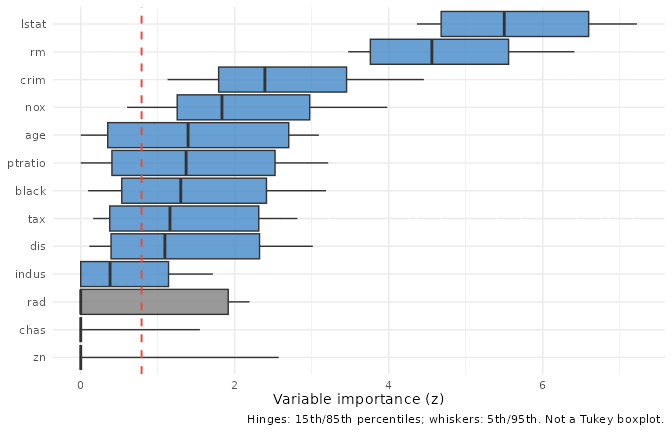

The narrow boxes near the top are the variables varPro is confident
about: every tree agrees they matter. Wide boxes that straddle the
cutoff line are the ones to look at twice; the forest disagrees with
itself. That disagreement isn’t noise to suppress: it can mean the
variable matters in some rule regions but not others, which is exactly
the kind of structured heterogeneity that model-independent methods are
built to detect. Variables that fall entirely below the cutoff were
pre-filtered by the importance z threshold; they’re gone before the plot
is drawn.

### Partial dependence with `gg_partial_varpro()`

The ranking view tells you *which* variables matter. Partial dependence
asks the next question: *how* does the response change with a variable,
holding the others fixed?
[`gg_partial_varpro()`](https://ehrlinger.github.io/ggRandomForests/reference/gg_partial_varpro.md)
wraps
[`varPro::partialpro()`](https://www.randomforestsrc.org/reference/partialpro.html)
and returns a tidy frame of parametric, non-parametric, and causal
partial-dependence curves.

``` r

# Precomputed offline (see precompute_varpro.R); falls back to a live fit.
gg_pd <- if (is.null(.vp$pd_boston)) {
  gg_partial_varpro(object = v_boston)
} else {
  .vp$pd_boston
}
plot(gg_pd)
```

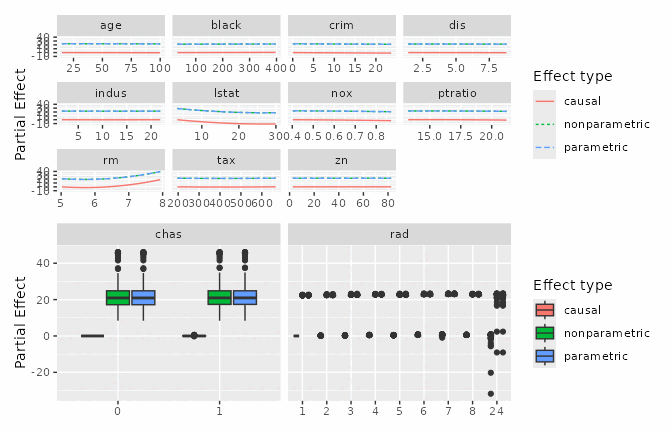

Each panel is a single predictor. The three curves correspond to the
three estimators varPro carries (parametric, non-parametric, and
causal); read them as a sensitivity analysis. When all three agree, you
have a stable signal; when the causal curve diverges from the others,
that’s a hint that the variable’s observed relationship with the
response may be partly driven by its correlation with other predictors
in the rule regions, not by a direct effect.

Because `partialpro()` operates within the *local* neighborhoods defined
by the release rules, these curves reflect what happens in the part of
the predictor space the forest actually visited, not a global
extrapolation from a fitted model. That is both a strength (no
out-of-distribution extrapolation) and a limit (sparse regions of the
predictor space will have wider effective intervals, even if the plot
doesn’t always show them explicitly).

### Per-rule lasso refinement with `gg_beta_varpro()`

[`gg_varpro()`](https://ehrlinger.github.io/ggRandomForests/reference/gg_varpro.md)’s
ranking is built from the release-rule contrast.
[`gg_beta_varpro()`](https://ehrlinger.github.io/ggRandomForests/reference/gg_beta_varpro.md)
re-asks the question variable by variable inside each rule: it fits a
one-predictor lasso of the response on the released variable, restricted
to the OOB observations in that rule’s region. The fitted coefficient
(call it a “local β”) captures the variable’s linear effect *within that
rule’s neighborhood*, not globally. Aggregating `mean(|β|)` across rules
gives one number per variable: a regression-coefficient-flavoured
importance, not a VIMP score, and not a global slope.

That distinction matters in practice. A variable with a strong nonlinear
global relationship may have locally small β values inside any single
rule (the local-standardisation step within each rule normalises the
scale), but many rules will fire on it, so the aggregated mean is still
large. Conversely, a variable with a nearly linear global effect will
concentrate most of its weight in a handful of rules, and the
between-rule variability in β will be low.

Because `beta.varpro()` is expensive (a `glmnet` per rule), the wrapper
accepts a pre-computed `beta_fit` so you can iterate on selection,
cutoff, or class choice without re-fitting.

``` r

# Precomputed offline (see precompute_varpro.R); falls back to a live fit.
b_boston <- if (is.null(.vp$b_boston)) {
  varPro::beta.varpro(v_boston)
} else {
  .vp$b_boston
}
```

``` r

plot(gg_beta_varpro(v_boston, beta_fit = b_boston))
```

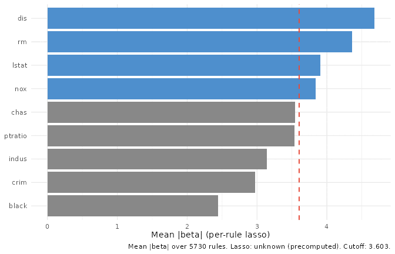

Compare against
[`gg_varpro()`](https://ehrlinger.github.io/ggRandomForests/reference/gg_varpro.md)
above. Disagreement is the diagnostic signal: a variable that ranks high
here but low there is one whose local linear effect inside many rules is
real even when the release contrast is modest.

### Cross-variable dependency with `gg_udependent()`

The three views so far take one variable at a time.
[`gg_udependent()`](https://ehrlinger.github.io/ggRandomForests/reference/gg_udependent.md)
reads cross-variable structure off a `uvarpro()` fit and draws the
result as a network: nodes are variables, edges are dependencies above a
configurable threshold. The visual is built with `ggraph`, which is in
`Suggests` rather than `Imports`; install it if you want this view.

``` r

# Precomputed offline (see precompute_varpro.R); falls back to a live fit.
u_boston <- if (is.null(.vp$u_boston)) {
  varPro::uvarpro(Boston[, setdiff(names(Boston), "medv")], ntree = 50)
} else {
  .vp$u_boston
}
```

``` r

plot(gg_udependent(u_boston))
```

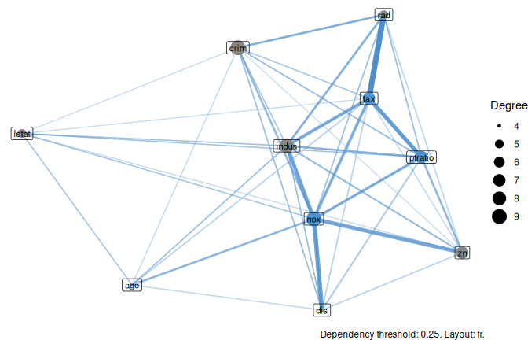

Clusters of mutually-connected variables are worth checking for
redundancy: they may be several views of the same underlying quantity.
`uvarpro()` operates on the predictor matrix alone; there is no response
in the fit, which is what makes the network genuinely unsupervised.
Variables that cluster here are correlated in feature space regardless
of whether any of them matters for prediction. That information is
complementary to the ranking from
[`gg_varpro()`](https://ehrlinger.github.io/ggRandomForests/reference/gg_varpro.md):
a variable can be important for prediction and still sit in a tight
cluster with a near-duplicate; in that situation, model parsimony may
favour dropping one of the cluster members without losing much
predictive accuracy.

### Unsupervised importance with `gg_beta_uvarpro()`

The dependency network shows *structure*;
[`gg_beta_uvarpro()`](https://ehrlinger.github.io/ggRandomForests/reference/gg_beta_uvarpro.md)
turns the same `uvarpro()` fit into a *ranking*. It is the unsupervised
analogue of
[`gg_beta_varpro()`](https://ehrlinger.github.io/ggRandomForests/reference/gg_beta_varpro.md):
from
[`varPro::get.beta.entropy()`](https://www.randomforestsrc.org/reference/utilities_internal.html)
it aggregates the per-region lasso coefficients into a mean absolute
weight per variable (`beta_mean`), orders most-important first, and
flags the variables above a selection cutoff. With no response in the
fit, “important” means a variable that carries entropy the others do not
— it helps reconstruct the feature space, not predict an outcome.

``` r

plot(gg_beta_uvarpro(u_boston))
```

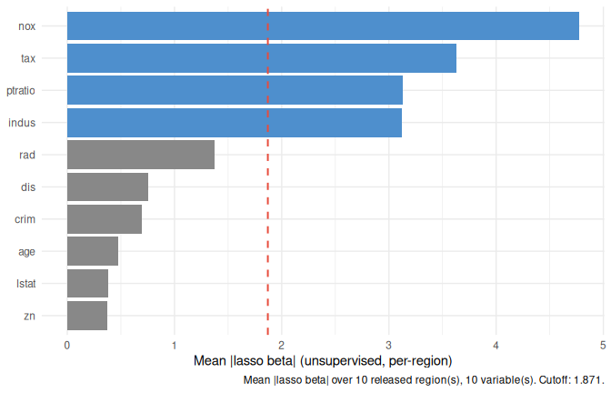

Read it as the unsupervised counterpart to a VIMP bar chart: the tall
bars are the variables that most define the structure of the predictor
space. Pairing this with the
[`gg_udependent()`](https://ehrlinger.github.io/ggRandomForests/reference/gg_udependent.md)
network tells you both *which* variables carry the most unsupervised
signal and *how* they group.

### Signal-variable detection with `gg_sdependent()`

[`gg_sdependent()`](https://ehrlinger.github.io/ggRandomForests/reference/gg_sdependent.md)
answers a narrower question off the same fit: *which* variables are
signal rather than noise? It wraps
[`varPro::sdependent()`](https://www.randomforestsrc.org/reference/utilities_internal.html)
and returns one row per candidate variable with an importance score, its
degree in the dependency graph, and a `signal` flag, drawn as a ranked
lollipop.

``` r

plot(gg_sdependent(u_boston))
```

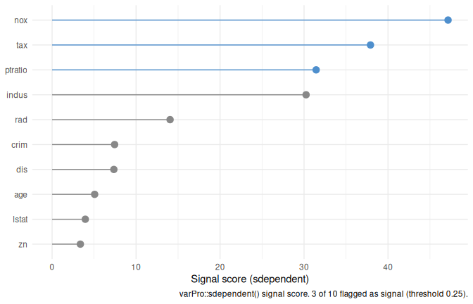

Where
[`gg_beta_uvarpro()`](https://ehrlinger.github.io/ggRandomForests/reference/gg_beta_uvarpro.md)
ranks *all* variables by entropy contribution,
[`gg_sdependent()`](https://ehrlinger.github.io/ggRandomForests/reference/gg_sdependent.md)
makes the cut explicit: it separates the variables the unsupervised
analysis treats as carrying genuine signal from those it treats as
noise. The two views share the `get.beta.entropy()` matrix, so they are
cheap to compute together once `uvarpro()` has run.

### Anomaly scoring with `gg_isopro()`

Variable importance is one axis; *observation* outlierness is another.
[`gg_isopro()`](https://ehrlinger.github.io/ggRandomForests/reference/gg_isopro.md)
wraps
[`varPro::isopro()`](https://www.randomforestsrc.org/reference/isopro.html)
(an isolation-forest variant that scores how anomalous each training row
looks) and renders the result as a ranked elbow plus a density of the
scores. The score is on `[0, 1]`; the wrapper’s convention is “higher =
more anomalous” (opposite of varPro’s native polarity; the wrapper flips
it for consistency).

``` r

# Precomputed offline (see precompute_varpro.R); falls back to a live fit.
iso_boston <- if (is.null(.vp$iso_boston)) {
  varPro::isopro(data = Boston[, setdiff(names(Boston), "medv")],
                 method = "rnd", sampsize = 256, ntree = 50)
} else {
  .vp$iso_boston
}
```

``` r

plot(gg_isopro(iso_boston))
```

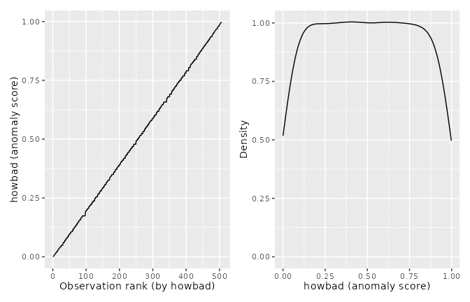

The elbow flags rows that diverge from the bulk. Pair with the domain:
anomalous in feature space is not the same as wrong, but it’s often
where the most interesting cases live. In a regression context, a
high-scoring row is one that the isolation forest isolated quickly
because its feature combination is rare; it may or may not be an outlier
in the response. Anomaly scoring and residual analysis answer different
questions, and it’s worth doing both.

Note that `isopro()` scores are not calibrated to a universal scale: a
score of 0.7 in one dataset is not comparable to 0.7 in another. What
matters is the relative ordering within a dataset and the shape of the
elbow: a sharp kink at a small number of observations is a cleaner
signal than a gradual slope that never levels off.

### Local importance with `gg_ivarpro()`

The wrappers so far aggregate across observations.
[`gg_ivarpro()`](https://ehrlinger.github.io/ggRandomForests/reference/gg_ivarpro.md)
does the opposite: it returns one value per (observation, variable)
pair, capturing how much variable *v* contributed to predicting
observation *i*. The aggregate view is a distribution of those local
importances per variable; the per-observation view is a horizontal bar
of one row’s local importances across variables.

`ivarpro()` is the most expensive call in varPro, so the wrapper accepts
a pre-computed `ivarpro_fit` for reuse across views.

``` r

# Precomputed offline (see precompute_varpro.R); falls back to a live fit.
iv_boston <- if (is.null(.vp$iv_boston)) {
  varPro::ivarpro(v_boston)
} else {
  .vp$iv_boston
}
```

``` r

plot(gg_ivarpro(v_boston, ivarpro_fit = iv_boston))
```

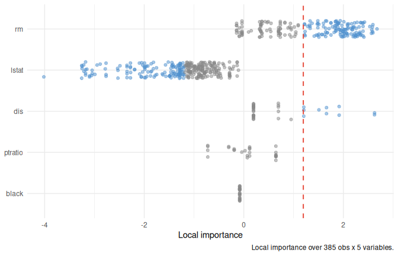

``` r

plot(gg_ivarpro(v_boston, ivarpro_fit = iv_boston, which_obs = 1L))
```

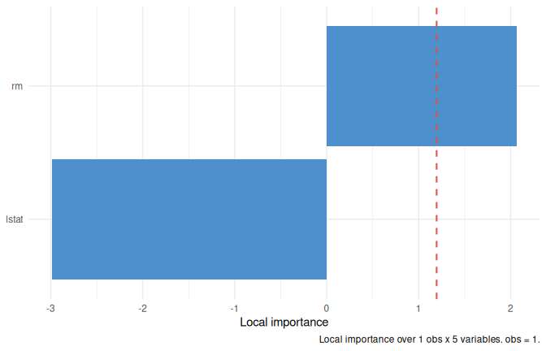

The distribution view tells you which variables drive predictions
*across* observations. The per-observation view answers the same
question for a specific case, useful for explaining one prediction back
to whoever asked.

The per-observation importance is computed by replaying the release-rule
contrasts restricted to the rules that fire for that observation. It is
not a Shapley value, but it shares the local-attribution spirit: each
bar shows how much that variable’s release shifted the local estimator
for this specific row, averaged over the rules that covered it. Cases
that are well-represented in the training data (dense rule coverage)
will have sharper attribution than cases in sparse regions of the
predictor space.

## Classification: iris

Iris is a small data set (150 rows, four predictors, three response
classes), and that’s a feature here, not a flaw: every figure renders in
under a second, and the structure is well-understood enough that any
strange behaviour stands out. It is also a good stress-test for the
conditional importance path: petal length and petal width separate
*setosa* from everything else very cleanly, but the
*versicolor*/*virginica* boundary is much softer. A method that only
reports unconditional importance would lump both cases together; the
conditional decomposition should show the asymmetry.

Two fits: a binary problem (drop *setosa*, positive class = *virginica*)
and the full three-class problem.

``` r

iris_binary <- iris[iris$Species != "setosa", ]
iris_binary$Species <- droplevels(iris_binary$Species)
set.seed(20260527L)
# Precomputed offline (see precompute_varpro.R); falls back to a live fit.
v_iris_binary <- if (is.null(.vp$v_iris_binary)) {
  varPro::varpro(Species ~ ., data = iris_binary, ntree = 50)
} else {
  .vp$v_iris_binary
}
```

``` r

set.seed(20260527L)
# Precomputed offline (see precompute_varpro.R); falls back to a live fit.
v_iris_multi <- if (is.null(.vp$v_iris_multi)) {
  varPro::varpro(Species ~ ., data = iris, ntree = 50)
} else {
  .vp$v_iris_multi
}
```

### Class-conditional importance with `gg_varpro(conditional = TRUE)`

For a classification forest,
[`gg_varpro()`](https://ehrlinger.github.io/ggRandomForests/reference/gg_varpro.md)
can split the importance view into one facet per class. Variables keep
the unconditional sort order so rows line up across facets; read along a
row to see which class a variable is informative for.

The conditional importance uses `$conditional.z` from the varPro fit:
per-class release-rule contrasts computed within the same rule regions
as the unconditional score, but with the local estimator replaced by a
per-class probability. A variable that separates one class from the rest
will have a high `$conditional.z` for that class and a near-zero or even
negative value for the others. The unconditional score in
`$unconditional` is the average, and can mask class-specific effects,
which is why the `conditional = TRUE` faceted view exists.

``` r

plot(gg_varpro(v_iris_multi, conditional = TRUE))
```

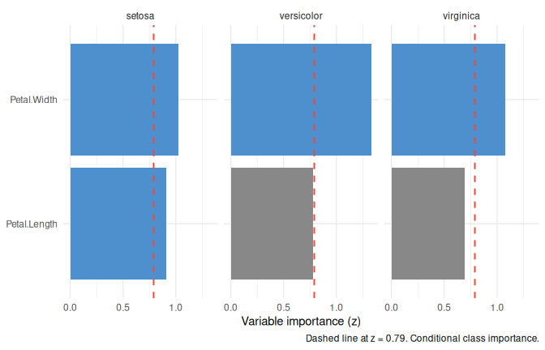

### Partial dependence: `gg_partial_varpro()` on classification

On a classification fit
[`gg_partial_varpro()`](https://ehrlinger.github.io/ggRandomForests/reference/gg_partial_varpro.md)
defaults to the **probability scale** (`scale = "auto"` resolves to
`"prob"`): each predictor’s curve is the predicted probability of the
*target class* — by default the last factor level (here *virginica*),
selectable with `target =`.
[`varPro::partialpro()`](https://www.randomforestsrc.org/reference/partialpro.html)
works internally on the log-odds of that class; the wrapper
back-transforms each observation to a probability *before* averaging, so
the curve is the mean predicted probability (not the probability of the
mean log-odds). On this bounded $`[0, 1]`$ scale only the parametric and
non-parametric curves are shown — the `causal` contrast is a log
odds-ratio, not a level, so it cannot share the probability axis (use
`scale = "logodds"` to see it). `scale = "odds"` and `"logodds"` give
the same relationship on the odds and log-odds scales.

``` r

# Precomputed offline (see precompute_varpro.R); falls back to a live fit.
gg_pd_iris <- if (is.null(.vp$pd_iris_multi)) {
  gg_partial_varpro(object = v_iris_multi)
} else {
  .vp$pd_iris_multi
}
plot(gg_pd_iris)
```

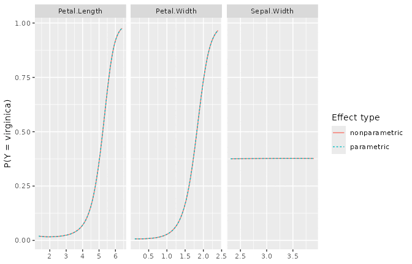

Read each panel as: “as predictor X changes from low to high, how does
the probability of the target class shift?” Patterns that match the
underlying biology (e.g. petal length separating *virginica* from the
others) act as a sanity check on the forest.

### Per-class lasso refinement with `gg_beta_varpro()`

On a classification fit,
[`gg_beta_varpro()`](https://ehrlinger.github.io/ggRandomForests/reference/gg_beta_varpro.md)
returns one row per (variable, class) pair. For a binary fit,
`which_class = NULL` defaults to the last factor level (the positive
class), so the headline view is a single panel of that class.[^1]

``` r

# Precomputed offline (see precompute_varpro.R); falls back to a live fit.
b_iris_binary <- if (is.null(.vp$b_iris_binary)) {
  varPro::beta.varpro(v_iris_binary)
} else {
  .vp$b_iris_binary
}
```

``` r

plot(gg_beta_varpro(v_iris_binary, beta_fit = b_iris_binary))
```

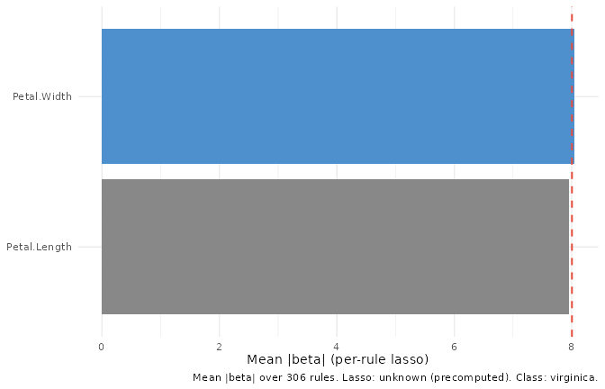

For a multi-class fit, the default view is faceted by class with each
class sharing the row order set by the unified ranking, same trick as
`gg_varpro(conditional = TRUE)`.

``` r

# Precomputed offline (see precompute_varpro.R); falls back to a live fit.
b_iris_multi <- if (is.null(.vp$b_iris_multi)) {
  varPro::beta.varpro(v_iris_multi)
} else {
  .vp$b_iris_multi
}
```

``` r

plot(gg_beta_varpro(v_iris_multi, beta_fit = b_iris_multi))
```

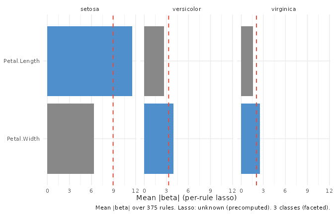

`which_class = "<level>"` collapses the faceted view to a single class
when you want it.

## Survival: PBC

Survival is the family where the varPro toolchain shows its limits, and
being explicit about those limits is more useful than pretending they
don’t exist. The forest-fitting and the family-agnostic wrappers all
work; the lasso-refined and individual-importance wrappers don’t,
because the underlying
[`varPro::beta.varpro()`](https://www.randomforestsrc.org/reference/utilities_internal.html)
and
[`varPro::ivarpro()`](https://www.randomforestsrc.org/reference/ivarpro.html)
calls don’t yet extend to right-censored outcomes. A per-rule local
lasso for a censored response requires a local partial-likelihood or
Nelson-Aalen estimator in place of the regression/classification local
estimator; the design work for that is tracked but not yet landed.

What does work is the core release-rule importance, partial dependence
(survival probability $`S(\tau)`$ and RMST through the release-rule
engine, plus cumulative hazard via the embedded `$rf` survival forest),
and anomaly scoring on the predictor matrix. For many applied problems,
those three views cover the questions you actually want to answer.

The PBC (primary biliary cirrhosis) dataset from `randomForestSRC` has
418 patients, seven predictors, and a Surv-encoded outcome of days to
event (death or transplant, status ∈ {0, 1, 2}). We use a small
seven-variable subset so the vignette fits quickly. For a full analysis
including time-dependent covariates, Lee et al. ([2021](#ref-Lee:2021))
demonstrates the boosted nonparametric hazard framework that varPro’s
survival path draws on.

``` r

library(survival)
data(pbc, package = "randomForestSRC")
pbc_small <- pbc[, c("days", "status", "age", "albumin", "bili",
                     "edema", "platelet")]
pbc_small <- na.omit(pbc_small)
set.seed(20260527L)
# Precomputed offline (see precompute_varpro.R); falls back to a live fit.
v_pbc <- if (is.null(.vp$v_pbc)) {
  varPro::varpro(Surv(days, status) ~ ., data = pbc_small, ntree = 50)
} else {
  .vp$v_pbc
}
```

### Variable importance: `gg_varpro()`

``` r

plot(gg_varpro(v_pbc))
```

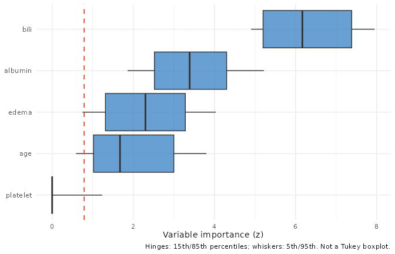

### Partial dependence: `gg_partial_varpro()` on survival

For survival
[`gg_partial_varpro()`](https://ehrlinger.github.io/ggRandomForests/reference/gg_partial_varpro.md)
defaults to **survival probability** (`scale = "auto"` resolves to
`"surv"`): each curve is $`S(\tau \mid x)`$, the predicted probability
of surviving past a horizon $`\tau`$, computed through `partialpro()` on
the same release-rule (UVT) engine as the regression and classification
fits — bounded in $`[0, 1]`$ and read in the model’s own time units.

When you do not supply `time`, $`\tau`$ defaults to the **median
follow-up time** of the fit. Because that horizon is derived from the
data it is always in the model’s units and cannot be mis-specified the
way a hand-typed number can — a units mismatch (days vs. years) is the
classic survival partial-plot trap, and a data-driven default sidesteps
it. The resolved $`\tau`$ is shown in the axis label and reported with a
message; pass `time = tau` to choose another horizon. As on the
classification probability scale, the `causal` contrast is hidden here
(use `scale = "rmst"` or `"mortality"` to see it).

Other survival scales are explicit opt-ins: `scale = "rmst"` gives
restricted mean survival time RMST$`(\tau)`$ (also on the release-rule
engine, with the same median-follow-up default $`\tau`$), and
`scale = "mortality"` keeps the unbounded ensemble-mortality score
([Ishwaran et al. 2008](#ref-Ishwaran:2007a)) — a relative-risk index,
*not* a survival probability.

``` r

# Precomputed offline (see precompute_varpro.R); falls back to a live fit.
gg_pd_pbc <- if (is.null(.vp$pd_pbc)) {
  gg_partial_varpro(object = v_pbc)
} else {
  .vp$pd_pbc
}
plot(gg_pd_pbc)
```

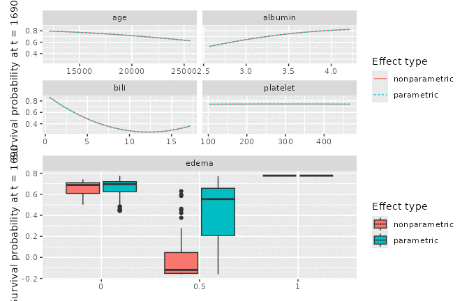

### Anomaly scoring: `gg_isopro()` on the X-matrix

Because `isopro()` only sees the predictor matrix, it doesn’t care about
the family. The same call from section 3 works here.

``` r

# Precomputed offline (see precompute_varpro.R); falls back to a live fit.
iso_pbc <- if (is.null(.vp$iso_pbc)) {
  varPro::isopro(data = pbc_small[, c("age", "albumin", "bili", "platelet")],
                 method = "rnd", sampsize = 256, ntree = 50)
} else {
  .vp$iso_pbc
}
plot(gg_isopro(iso_pbc))
```


### Not available for survival: `gg_beta_varpro`, `gg_ivarpro`

[`varPro::beta.varpro()`](https://www.randomforestsrc.org/reference/utilities_internal.html)
errors on survival fits in the current release (it only supports `regr`
and `class`).
[`gg_ivarpro()`](https://ehrlinger.github.io/ggRandomForests/reference/gg_ivarpro.md)
for survival is similarly deferred pending design work on the per-rule
risk-scaling story. Both are tracked for v3.1.0.

If you call either on a survival fit you’ll get a clear error message
pointing at the deferred work, not a silent miscalculation. The
family-support matrix in §6 records this; the rest of the toolkit that
*does* work on survival (`gg_varpro`, `gg_partial_varpro`, `gg_isopro`
above; `gg_udependent` shown in §3 on the X-matrix).

## Cross-cutting reference

### Family-support matrix

| Wrapper | regr | class | surv | regr+ |
|----|----|----|----|----|
| `gg_partial_varpro` | ✓ | ✓ (prob) | ✓ (S(τ); rmst/mortality/chf) | ✗ (not audited) |
| `gg_varpro` | ✓ | ✓ (`conditional = TRUE`) | ✓ | ✗ (errors) |
| `gg_udependent` | ✓ (uvarpro on X) | ✓ (X) | ✓ (X) | ✓ (X) |
| `gg_isopro` | ✓ (X) | ✓ (X) | ✓ (X) | ✓ (X) |
| `gg_beta_varpro` | ✓ | ✓ | ✗ (upstream stop) | ✗ (deferred) |
| `gg_ivarpro` | ✓ | ✓ | ✗ (deferred) | ✗ (deferred) |

The four wrappers in the lower-right are the v3.1.0 work surface.

### Factor-level ordering

Across
[`gg_beta_varpro()`](https://ehrlinger.github.io/ggRandomForests/reference/gg_beta_varpro.md)
and
[`gg_ivarpro()`](https://ehrlinger.github.io/ggRandomForests/reference/gg_ivarpro.md),
the `variable` column is stored as a factor whose levels are set by
descending aggregate importance (`mean(|imp|)` summed across classes for
classification). The default plot inherits that ordering, so faceted
views show variables in the same row order across panels. If you
re-shape the frame downstream and want the order preserved, keep
`variable` as a factor rather than coercing to character.

This convention will be propagated to `gg_vimp` and
`plot.gg_varpro(conditional = TRUE)` in a follow-up release.

### Caching the expensive calls

[`varPro::beta.varpro()`](https://www.randomforestsrc.org/reference/utilities_internal.html)
and
[`varPro::ivarpro()`](https://www.randomforestsrc.org/reference/ivarpro.html)
are the two heavy calls. Both wrappers accept a pre-computed fit
(`beta_fit`, `ivarpro_fit`) so you can iterate on selection, observation
index, or cutoff without re-fitting the lasso or the local-importance
machinery. The vignette uses this throughout: every section computes the
heavy fit once in a `cache: true` chunk and re-uses it for every figure.

Provenance carries `precomputed = TRUE` when the cached path was used,
so downstream tooling can tell the two paths apart.

### Provenance shape

`attr(., "provenance")$cutoff` is always a *named numeric vector* across
the toolkit:

- regression: length 1, named `"regr"`
- classification: length K, named with the response factor levels

Downstream code that picks a value should read it as a vector
(`prov$cutoff[[class_name]]` or `prov$cutoff[[1]]`), not as a scalar.
This contract was established in v2.7.3.9012 (PR \#98).

## Further reading

The release-rule framework is laid out in Lu and Ishwaran
([2024](#ref-Lu2024varpro)). Worked implementation examples and the full
API are at the [varPro tools reference
site](https://www.varprotools.org/articles/getstarted.html).

The ensemble-mortality scale (`scale = "mortality"`), one of the
survival partial-dependence options alongside the default survival
probability, is introduced in Ishwaran et al.
([2008](#ref-Ishwaran:2007a)) (the Annals of Applied Statistics methods
paper for random survival forests); the R-package side is described in
Ishwaran and Kogalur ([2007](#ref-Ishwaran:2008)). The boosted
nonparametric hazard framework that informs varPro’s survival path
(including the treatment of time-dependent covariates) is in Lee et al.
([2021](#ref-Lee:2021)).

Each wrapper’s help page carries a “What this is doing” section that
goes one level deeper than this vignette. The cross-cutting reference in
§6 maps each wrapper to the forest families it supports and notes which
capabilities are deferred to v3.1.0.

## References

Ishwaran, Hemant, and Udaya B. Kogalur. 2007. “Random Survival Forests
for R.” *R News* 7 (2): 25–31.

Ishwaran, Hemant, Udaya B. Kogalur, Eugene H. Blackstone, and Michael S.
Lauer. 2008. “Random Survival Forests.” *The Annals of Applied
Statistics* 2 (3): 841–60. <https://doi.org/10.1214/08-AOAS169>.

Lee, D. K., N. Chen, and H. Ishwaran. 2021. “Boosted Nonparametric
Hazards with Time-Dependent Covariates.” *The Annals of Statistics* 49
(4): 2101–28. <https://doi.org/10.1214/20-AOS2028>.

Lu, M., and H. Ishwaran. 2024. “Model-Independent Variable Selection via
the Rule-Based Variable Priority.” *arXiv Preprint*.
<https://arxiv.org/abs/2409.09003>.

[^1]: The same code pattern applies to clinical binary outcomes such as
    30-day mortality: drop the negative class, set the event class as
    the last factor level, and read the figure for the event panel.
