# Random Forest Survival Analysis with ggRandomForests

> **Work in progress**
>
> This vignette is under active development. Code examples and narrative
> may change before the next release.

## Introduction

Random forests ([Breiman 2001](#ref-Breiman:2001)) are a non-parametric
ensemble method that requires no distributional assumptions on the
relation between covariates and the response. Random survival forests
(RSF) ([Ishwaran et al. 2008](#ref-Ishwaran:2007a); [Ishwaran and
Kogalur 2007](#ref-Ishwaran:2008)) extend the method to right-censored,
time-to-event data by growing trees with a log-rank splitting rule and
aggregating Kaplan–Meier estimates within terminal nodes.

The forest returns three ensemble quantities for each subject. First,
the survival function $`\hat{S}(t)`$: the probability of surviving past
time $`t`$, bounded between 0 and 1. Second, the cumulative hazard
function (CHF): $`\hat{H}(t) = -\log \hat{S}(t)`$, an unbounded,
monotone-increasing summary of accumulated risk. Third, mortality: the
expected number of events a subject would accumulate if followed
indefinitely under their covariate profile, computed by summing the CHF
over the observed time grid. Mortality is an unbounded relative-risk
score, not a probability, and works well as a single scalar for ranking
patients by risk.

The **[randomForestSRC](https://www.randomforestsrc.org)** package
([Ishwaran and Kogalur 2024](#ref-Ishwaran:RFSRC:2014)) provides a
unified implementation for survival, regression, and classification
forests. **ggRandomForests** extracts tidy data objects from `rfsrc`
fits and renders them with **ggplot2** ([Wickham
2016](#ref-Wickham:2009)), making it straightforward to explore how a
forest is constructed, which variables matter, and how the response
depends on individual predictors.

This vignette demonstrates a complete random survival forest workflow on
the primary biliary cirrhosis (PBC) data set ([Fleming and Harrington
1991](#ref-fleming:1991)):

1.  **Data preparation and exploration** — cleaning, EDA, Kaplan–Meier
    curves
2.  **Growing the forest** — fitting an RSF, checking convergence and
    OOB error
3.  **Variable selection** — VIMP and minimal depth via
    [`max.subtree()`](https://www.randomforestsrc.org//reference/max.subtree.rfsrc.html)
4.  **Dependence plots** — variable dependence and partial dependence
    via
    [`gg_variable()`](https://ehrlinger.github.io/ggRandomForests/reference/gg_variable.md)
    and
    [`gg_partial_rfsrc()`](https://ehrlinger.github.io/ggRandomForests/reference/gg_partial_rfsrc.md)
5.  **Variable interactions** — conditioning plots and partial
    dependence surfaces

``` r

library(ggplot2)
library(dplyr)
library(tidyr)
library(randomForestSRC)
library(survival)

if (requireNamespace("ggRandomForests", quietly = TRUE)) {
  library(ggRandomForests)
} else if (requireNamespace("pkgload", quietly = TRUE)) {
  pkgload::load_all(export_all = FALSE, helpers = FALSE, attach_testthat = FALSE)
} else {
  stop("Install ggRandomForests (or pkgload for dev builds) to render this vignette.")
}

theme_set(theme_bw())

# Plotting constants
event_marks  <- c(1, 4)
event_labels <- c("Censored", "Death")
event_colors <- c("steelblue", "firebrick")
```

## Data: Primary Biliary Cirrhosis (PBC)

The PBC study consists of 424 patients referred to Mayo Clinic between
1974 and 1984, of whom 312 were randomized into a trial of
D-penicillamine (DPCA) versus placebo. The data is described in Fleming
and Harrington ([1991](#ref-fleming:1991)) Chapter 0.2, with a
proportional hazards model developed in Chapter 4.4. We use the copy
bundled with **randomForestSRC**.

``` r

data("pbc", package = "randomForestSRC")
```

### Data cleaning

We convert `days` to `years`, recode `treatment` as a factor, and coerce
low-cardinality numeric columns (five or fewer unique values, including
binary 0/1 indicators) to factors. We avoid converting binary columns to
`logical` because
[`randomForestSRC::partial.rfsrc()`](https://www.randomforestsrc.org//reference/partial.rfsrc.html)
does not handle logical predictors correctly in survival forests.

``` r

pbc <- pbc |>
  mutate(
    years     = days / 365.25,
    age       = age / 365.25,
    treatment = factor(
      ifelse(treatment == 1, "DPCA",
             ifelse(treatment == 2, "Placebo", NA)),
      levels = c("DPCA", "Placebo")
    )
  ) |>
  select(-days)

# Low-cardinality numerics (including binary 0/1) to factor.
# NOTE: do NOT convert to logical — partial.rfsrc() fails with logical
# predictors in survival forests (randomForestSRC <= 3.5.1).
# Exclude the response columns (status, years) from conversion.
resp_cols <- c("status", "years")
for (nm in setdiff(names(pbc), resp_cols)) {
  v <- pbc[[nm]]
  if (is.numeric(v) && !is.factor(v) && length(unique(v[!is.na(v)])) <= 5) {
    pbc[[nm]] <- factor(v)
  }
}
```

``` r

# Human-readable labels for plot axes
st_labs <- c(
  status       = "Death Event",
  treatment    = "Treatment",
  age          = "Age (years)",
  sex          = "Female",
  ascites      = "Ascites",
  hepato       = "Hepatomegaly",
  spiders      = "Spiders",
  edema        = "Edema (0, 0.5, 1)",
  bili         = "Serum Bilirubin (mg/dl)",
  chol         = "Serum Cholesterol (mg/dl)",
  albumin      = "Albumin (gm/dl)",
  copper       = "Urine Copper (ug/day)",
  alk.phos     = "Alkaline Phosphatase (U/liter)",
  ast          = "SGOT (U/ml)",
  trig         = "Triglycerides (mg/dl)",
  platelet     = "Platelets (per cubic ml/1000)",
  prothrombin  = "Prothrombin Time (sec)",
  stage        = "Histologic Stage",
  years        = "Follow-up Time (years)"
)
```

### Exploratory data analysis

Good practice before modeling: scan categorical variables as stacked
histograms over follow-up time, and continuous variables as scatter
plots colored by event status.

``` r

cls <- sapply(pbc, class)
cnt_idx <- which(cls %in% c("numeric", "integer"))
fct_idx <- setdiff(seq_along(pbc), cnt_idx)
fct_idx <- union(fct_idx, which(names(pbc) == "years"))

dta_cat <- suppressWarnings(
  pbc[, fct_idx] |>
    pivot_longer(-years, names_to = "variable", values_to = "value",
                 values_transform = list(value = as.character))
)

ggplot(dta_cat, aes(x = years, fill = value)) +
  geom_histogram(color = "black", binwidth = 1) +
  labs(y = "", x = st_labs["years"]) +
  scale_fill_brewer(palette = "RdBu", na.value = "white") +
  facet_wrap(~variable, scales = "free_y", nrow = 2) +
  theme(legend.position = "none")
```

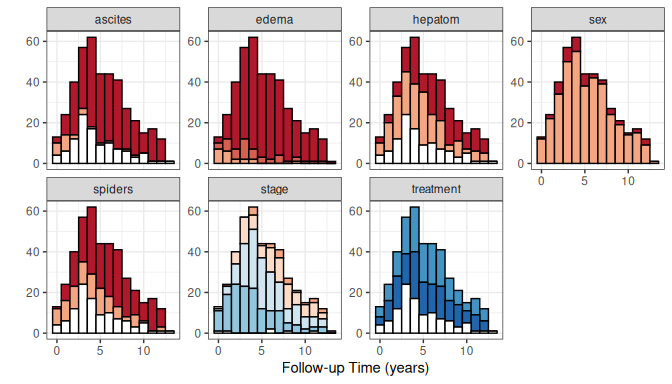

EDA for categorical variables. Bar color indicates factor level; white =
missing.

``` r

cnt_idx <- union(cnt_idx, which(names(pbc) == "status"))
dta_cont <- pbc[, cnt_idx] |>
  pivot_longer(c(-years, -status),
               names_to = "variable", values_to = "value")

ggplot(dta_cont |> filter(!is.na(value)),
       aes(x = years, y = value, color = factor(status), shape = factor(status))) +
  geom_point(alpha = 0.4) +
  geom_rug(data = dta_cont |> filter(is.na(value)), color = "grey50") +
  labs(y = "", x = st_labs["years"], color = "Death", shape = "Death") +
  scale_color_manual(values = event_colors) +
  scale_shape_manual(values = event_marks) +
  facet_wrap(~variable, scales = "free_y", ncol = 4) +
  theme(legend.position = c(0.8, 0.2))
```

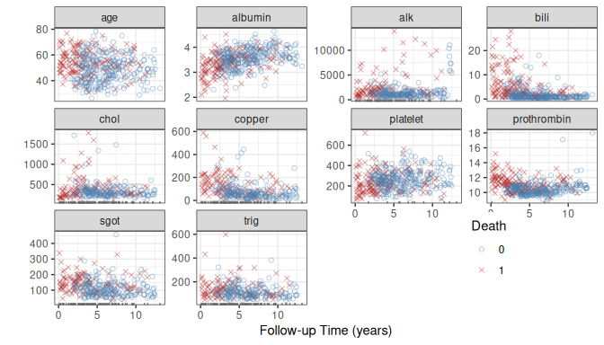

EDA for continuous variables. Points colored by death event; rug marks
indicate missing values.

Look for patterns of missingness (white bars, rug marks) and extreme
values that fall outside the biological range.

### Kaplan–Meier survival by treatment

The Kaplan–Meier estimate is the marginal survival curve with no
covariate adjustment. It serves as the no-covariate baseline: once we
fit a forest, comparing the KM curves to the forest’s OOB predictions
lets us judge how much predictive signal the covariates add beyond the
raw event rate.

We restrict to the 312 trial patients and construct KM curves with
`gg_survival`.

``` r

pbc_trial <- pbc |> filter(!is.na(treatment))
pbc_test  <- pbc |> filter(is.na(treatment))

gg_km <- gg_survival(interval = "years", censor = "status",
                     by = "treatment", data = pbc_trial,
                     conf.int = 0.95)

plot(gg_km) +
  labs(y = "Survival Probability", x = "Time (years)",
       color = "Treatment", fill = "Treatment") +
  theme(legend.position = c(0.2, 0.2)) +
  coord_cartesian(ylim = c(0, 1.01))
```

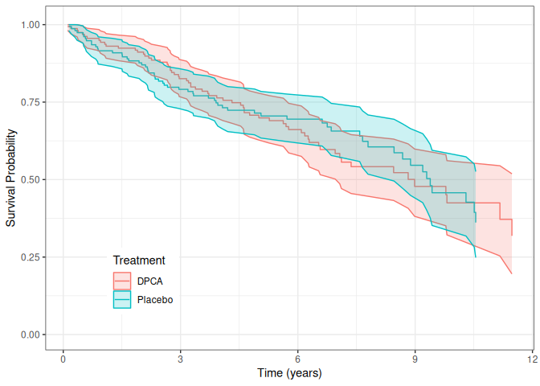

KM survival estimates by treatment group with 95% confidence bands.

The curves largely overlap, consistent with the original finding that
DPCA offered no clear survival benefit over placebo ([Fleming and
Harrington 1991](#ref-fleming:1991)).

``` r

plot(gg_km, type = "cum_haz") +
  labs(y = "Cumulative Hazard", x = "Time (years)",
       color = "Treatment", fill = "Treatment") +
  theme(legend.position = c(0.2, 0.8)) +
  coord_cartesian(ylim = c(-0.02, 1.22))
```

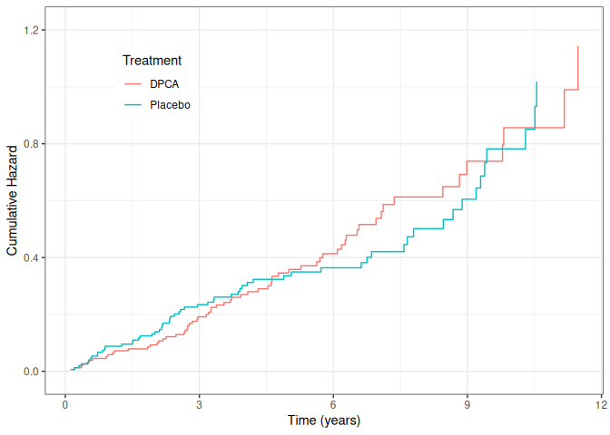

KM cumulative hazard estimates by treatment group.

We can also stratify on continuous variables. Here we reproduce the
bilirubin groupings from Fleming and Harrington
([1991](#ref-fleming:1991)) Figure 4.4.2:

``` r

pbc_bili <- pbc_trial |>
  mutate(bili_grp = cut(bili, breaks = c(0, 0.8, 1.3, 3.4, 29)))

plot(gg_survival(interval = "years", censor = "status",
                 by = "bili_grp", data = pbc_bili),
     error = "none") +
  labs(y = "Survival Probability", x = "Time (years)", color = "Bilirubin")
```

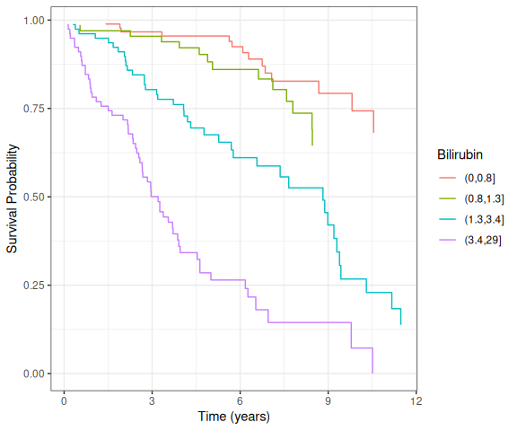

KM survival stratified by bilirubin groups.

Higher bilirubin strongly predicts worse survival — an effect the random
forest will rediscover without any prior specification.

## Growing a Random Survival Forest

Several predictors in the PBC trial data contain missing values
(cholesterol, copper, triglycerides, and others). We handle these with a
two-step approach: first impute using
[`impute.rfsrc()`](https://www.randomforestsrc.org//reference/impute.rfsrc.html),
which uses the random forest proximity structure to fill in missing
values, then fit the survival forest on the complete imputed data. This
keeps the fitted forest object free of imputation state, which is
required for
[`partial.rfsrc()`](https://www.randomforestsrc.org//reference/partial.rfsrc.html)
to work correctly.

``` r

# Step 1: impute missing values via random forest proximity
pbc_imputed <- impute.rfsrc(Surv(years, status) ~ .,
                             data    = pbc_trial,
                             ntree   = 100,
                             nimpute = 2)

# Step 2: grow the survival forest on the complete imputed data
rfsrc_pbc <- rfsrc(Surv(years, status) ~ .,
                   data      = pbc_imputed,
                   ntree     = 150,
                   nsplit    = 10,
                   tree.err  = TRUE,
                   importance = TRUE)
```

The forest grew 150 trees, splitting on 5 randomly selected candidate
variables at each node, and stopping at a minimum terminal node size of
15.

### OOB error convergence

``` r

plot(gg_error(rfsrc_pbc))
```

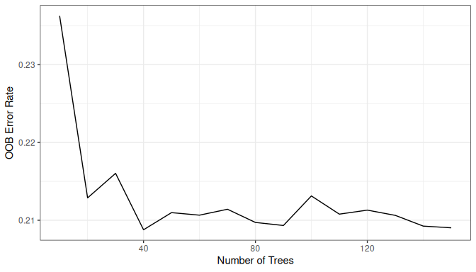

OOB prediction error vs. number of trees.

The error stabilizes well before 1000 trees, indicating the forest is
large enough for reliable predictions.

### OOB predicted survival

``` r

gg_rsf <- plot(gg_rfsrc(rfsrc_pbc), alpha = 0.2) +
  scale_color_manual(values = event_colors) +
  theme(legend.position = "none") +
  labs(y = "Survival Probability", x = "Time (years)") +
  coord_cartesian(ylim = c(-0.01, 1.01))
gg_rsf
```

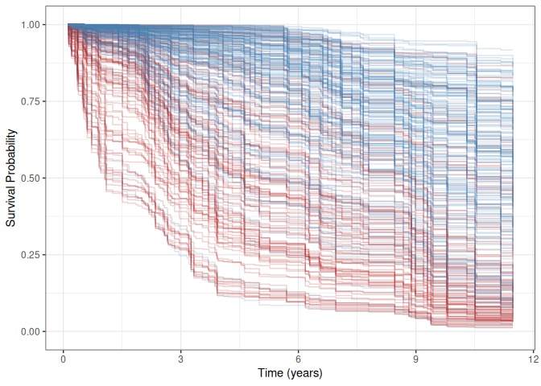

OOB predicted survival curves. Blue = censored, red = death events.

Each curve is one patient’s OOB ensemble survival function
$`\hat{S}(t)`$, extended to the last follow-up time. The forest never
saw that patient when building its prediction, so these are genuine
out-of-sample estimates. Red (death event) curves generally fall faster
and reach lower survival probabilities, confirming the forest separates
risk groups. Comparing this spread to the marginal KM curves from the
previous section shows how much the covariates tighten risk
stratification.

``` r

plot(gg_rfsrc(rfsrc_pbc, by = "treatment")) +
  theme(legend.position = c(0.2, 0.2)) +
  labs(y = "Survival Probability", x = "Time (years)") +
  coord_cartesian(ylim = c(-0.01, 1.01))
```

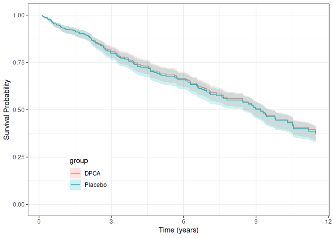

Median predicted survival by treatment group with 95% confidence bands.

### Test set predictions

The non-trial patients (`pbc_test`) have substantial missing data.
[`predict.rfsrc()`](https://www.randomforestsrc.org//reference/predict.rfsrc.html)
handles these transparently at prediction time via
`na.action = "na.impute"` — this is distinct from training-time
imputation and does not affect the fitted forest object.

``` r

rfsrc_pbc_test <- predict(rfsrc_pbc, newdata = pbc_test,
                          na.action = "na.impute",
                          importance = TRUE)

plot(gg_rfsrc(rfsrc_pbc_test), alpha = 0.2) +
  scale_color_manual(values = event_colors) +
  theme(legend.position = "none") +
  labs(y = "Survival Probability", x = "Time (years)") +
  coord_cartesian(ylim = c(-0.01, 1.01))
```

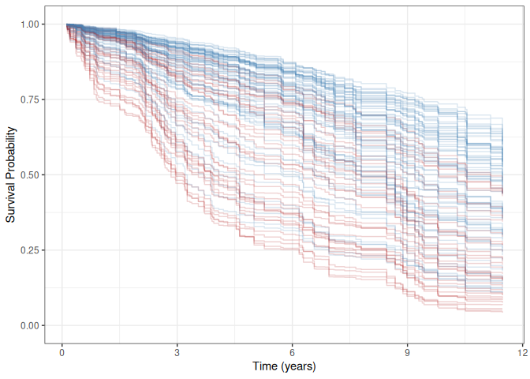

Predicted survival for non-trial patients (test set).

Because the training curves use OOB estimates, both plots represent
out-of-sample predictions and are directly comparable.

## Variable Selection

Random forest uses all available predictors. To understand which matter
most, we examine variable importance (VIMP) and minimal depth.

### Variable importance (VIMP)

VIMP measures the increase in prediction error when a variable’s values
are randomly permuted across the out-of-bag sample. For survival forests
the prediction error is the Harrell C-statistic complement (1 − C), so
permuting an important variable hurts C and yields a large positive
VIMP. A negative VIMP means the variable is adding noise: the forest
would predict better without it. See the
[randomForestSRC](https://www.randomforestsrc.org) documentation for
details on the VIMP calculation for censored outcomes ([Ishwaran et al.
2008](#ref-Ishwaran:2007a)).

``` r

plot(gg_vimp(rfsrc_pbc), lbls = st_labs) +
  theme(legend.position = c(0.8, 0.2)) +
  labs(fill = "VIMP > 0")
```

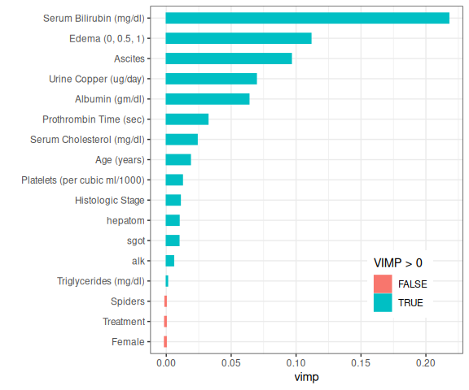

Variable importance ranking. Blue = positive VIMP, red = negative.

Bilirubin ranks highest, followed by copper, prothrombin time, albumin,
and age — closely matching the variables selected in the Fleming and
Harrington ([1991](#ref-fleming:1991)) proportional hazards model.

### Minimal depth

Minimal depth ([Ishwaran et al. 2010](#ref-Ishwaran:2010)) ranks
variables by how close to the root node they first split, on average.
Variables that partition large portions of the population early are
considered most important.

``` r

md_pbc <- max.subtree(rfsrc_pbc)
```

The
[`max.subtree()`](https://www.randomforestsrc.org//reference/max.subtree.rfsrc.html)
function computes minimal depth for each variable. The threshold is
5.72, selecting 8 variables: age, ascites, edema, bili, chol, albumin,
copper, prothrombin.

Both selection methods agree on the key predictors: `bili`, `albumin`,
`copper`, `prothrombin`, and `age`. We add `edema` (selected by the
Fleming and Harrington ([1991](#ref-fleming:1991)) model) for the
remainder of the analysis.

``` r

xvar     <- c("bili", "albumin", "copper", "prothrombin", "age")
xvar_cat <- "edema"
xvar_all <- c(xvar, xvar_cat)
```

## Variable Dependence

### Variable dependence plots

Variable dependence shows each patient’s predicted survival probability
$`\hat{S}(t_0)`$ at a fixed time horizon $`t_0`$, plotted against a
predictor of interest. Because $`\hat{S}(t_0)`$ is a probability, the
y-axis is always bounded to \[0, 1\]. Points are colored by event
status; a loess smooth traces the overall trend while the individual
points show how much variance remains after the forest accounts for all
other covariates.

``` r

gg_v <- gg_variable(rfsrc_pbc, time = c(1, 3),
                    time.labels = c("1 Year", "3 Years"))

plot(gg_v, xvar = "bili", alpha = 0.4) +
  labs(y = "Survival", x = st_labs["bili"]) +
  theme(legend.position = "none") +
  scale_color_manual(values = event_colors, labels = event_labels) +
  scale_shape_manual(values = event_marks, labels = event_labels) +
  coord_cartesian(ylim = c(-0.01, 1.01))
```

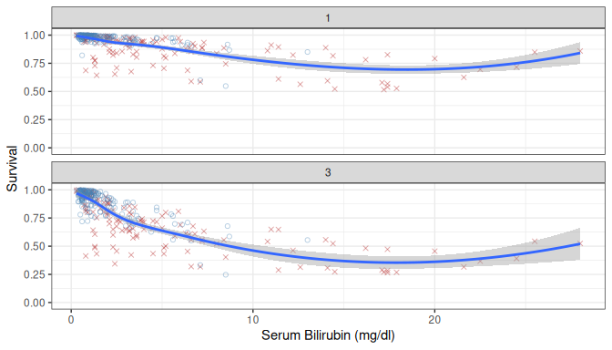

Variable dependence of survival at 1 and 3 years on bilirubin.

Survival drops sharply with increasing bilirubin, and the 3-year curve
drops further than the 1-year curve, suggesting a non-proportional
hazards effect.

``` r

plot(gg_v, xvar = xvar[-1], panel = TRUE, alpha = 0.4) +
  labs(y = "Survival") +
  theme(legend.position = "none") +
  scale_color_manual(values = event_colors, labels = event_labels) +
  scale_shape_manual(values = event_marks, labels = event_labels) +
  coord_cartesian(ylim = c(-0.05, 1.05))
```

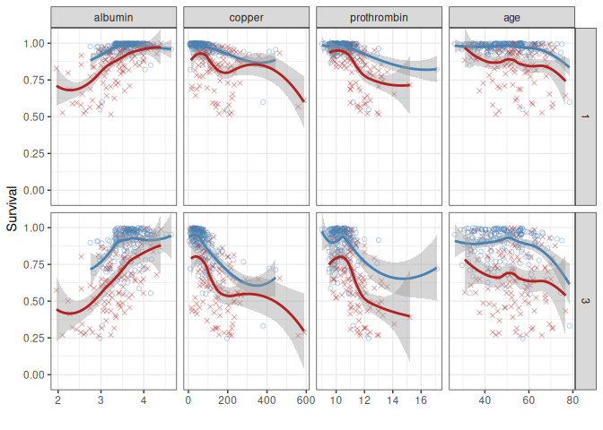

Variable dependence at 1 and 3 years for continuous predictors.

The plots confirm survival increases with albumin and decreases with
copper, prothrombin time, and age. The divergence between time curves
for `copper` further supports a non-proportional hazards mechanism.

``` r

plot(gg_v, xvar = xvar_cat, alpha = 0.4) +
  labs(y = "Survival") +
  theme(legend.position = "none") +
  scale_color_manual(values = event_colors, labels = event_labels) +
  scale_shape_manual(values = event_marks, labels = event_labels) +
  coord_cartesian(ylim = c(-0.01, 1.02))
```

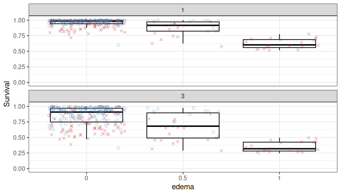

Variable dependence on edema (categorical).

Patients with edema = 1 (edema despite diuretics) have markedly lower
predicted survival.

### Partial dependence

> **Warning**
>
> **Known issue (draft):**
> [`randomForestSRC::partial.rfsrc()`](https://www.randomforestsrc.org//reference/partial.rfsrc.html)
> currently fails for survival forests in randomForestSRC ≥ 3.3. The
> partial dependence and surface sections below will show an error until
> this upstream bug is resolved. All other sections of this vignette are
> fully functional.

Partial dependence integrates out the effects of other covariates,
giving a risk-adjusted view of how each predictor influences the
response ([Friedman 2001](#ref-Friedman:2000)). We use
[`gg_partial_rfsrc()`](https://ehrlinger.github.io/ggRandomForests/reference/gg_partial_rfsrc.md)
which calls
[`randomForestSRC::partial.rfsrc()`](https://www.randomforestsrc.org//reference/partial.rfsrc.html)
directly and returns a `gg_partial_rfsrc` object. For survival forests,
the result includes a `time` column so `plot(pd)` produces one curve per
predictor value over time, faceted by variable name.

``` r

# partial.rfsrc() requires times that match the model's time.interest grid;
# gg_partial_rfsrc() snaps the requested values to the nearest observed times.
ti   <- rfsrc_pbc$time.interest
t1yr <- ti[which.min(abs(ti - 1))]
t3yr <- ti[which.min(abs(ti - 3))]

pd <- gg_partial_rfsrc(rfsrc_pbc, xvar.names = xvar,
                       partial.time = c(t1yr, t3yr))

# Quick S3 plot — survival forests produce time-series curves per predictor value
plot(pd)
```

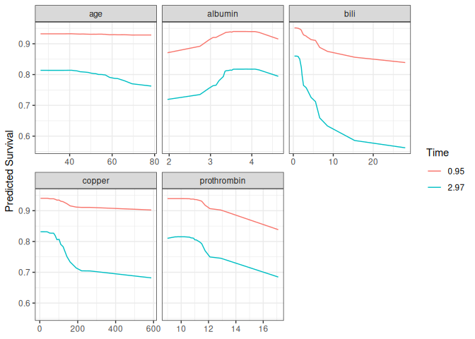

Partial dependence of survival at approximately 1 and 3 years on
continuous predictors.

For a publication-ready layout with custom colour scale, access
`pd$continuous` directly:

``` r

ggplot(pd$continuous, aes(x = x, y = yhat,
                          color = factor(round(time, 2)),
                          group = factor(time))) +
  geom_line(linewidth = 1) +
  facet_wrap(~name, scales = "free_x") +
  labs(y = "Predicted Survival", x = "", color = "Year") +
  scale_color_manual(values = setNames(c("steelblue", "firebrick"),
                                       as.character(round(c(t1yr, t3yr), 2)))) +
  theme_bw()
```

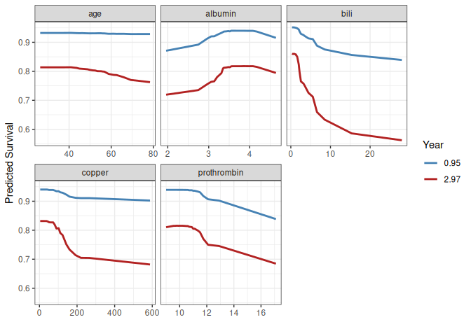

Partial dependence (custom styling).

The partial dependence curves at approximately 1 and 3 years confirm the
variable dependence findings and support the log-transforms used in the
Fleming and Harrington ([1991](#ref-fleming:1991)) model for `bili`,
`albumin`, and `prothrombin`. The divergence between time curves for
`bili` and `copper` supports non-proportional hazards.

### Conditional dependence

To investigate interactions, we can condition variable dependence on
group membership in another variable. Here we examine the dependence of
survival on bilirubin, stratified by edema group.

``` r

gg_v1 <- gg_variable(rfsrc_pbc, time = 1)
gg_v1$edema <- paste("edema =", gg_v1$edema)

plot(gg_v1, xvar = "bili", alpha = 0.5) +
  labs(y = "Survival at 1 Year", x = st_labs["bili"]) +
  theme(legend.position = "none") +
  scale_color_manual(values = event_colors, labels = event_labels) +
  scale_shape_manual(values = event_marks, labels = event_labels) +
  facet_grid(~edema) +
  coord_cartesian(ylim = c(-0.01, 1.01))
```

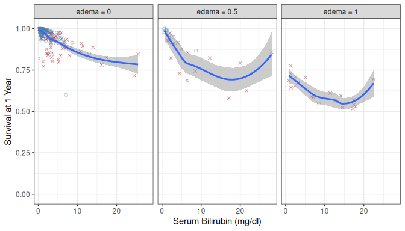

Variable dependence on bilirubin, conditional on edema group.

The decreasing trend with bilirubin holds across all edema groups, but
survival is uniformly lower in the edema = 1 panel, confirming an
additive effect.

We can also condition on a continuous variable by binning into quantile
groups:

``` r

albumin_cts <- quantile_pts(gg_v1$albumin, groups = 6, intervals = TRUE)
gg_v1$albumin_grp <- cut(gg_v1$albumin, breaks = albumin_cts)
levels(gg_v1$albumin_grp) <- paste("albumin =",
                                    levels(gg_v1$albumin_grp))

plot(gg_v1, xvar = "bili", alpha = 0.5) +
  labs(y = "Survival at 1 Year", x = st_labs["bili"]) +
  theme(legend.position = "none") +
  scale_color_manual(values = event_colors, labels = event_labels) +
  scale_shape_manual(values = event_marks, labels = event_labels) +
  facet_wrap(~albumin_grp) +
  coord_cartesian(ylim = c(-0.01, 1.01))
```

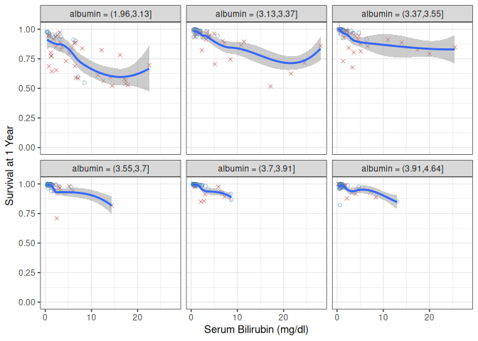

Variable dependence on bilirubin, conditional on albumin groups.

The effect of bilirubin attenuates at higher albumin levels, suggesting
an interaction between these two liver function markers.

## Partial Dependence Surfaces

For a richer view of the interaction between bilirubin and albumin, we
construct a partial dependence surface. We compute partial dependence on
a grid of 8 albumin values, each evaluated at 25 bilirubin points.

``` r

# Create grid of albumin values
alb_grid <- quantile_pts(pbc_trial$albumin, groups = 8)

# For each albumin value, compute partial dependence on bili at ~1 year
surface_list <- lapply(alb_grid, function(alb_val) {
  newx <- pbc_trial[, rfsrc_pbc$xvar.names, drop = FALSE]
  newx$albumin <- alb_val
  pd_alb <- gg_partial_rfsrc(rfsrc_pbc, xvar.names = "bili",
                              newx = newx, partial.time = t1yr)
  df <- pd_alb$continuous
  df$albumin <- alb_val
  df
})

surface_df <- bind_rows(surface_list)
```

``` r

if (!exists("surface_df")) {
  message("surface_df not available --- skipping surface (see surface-data chunk error above).")
} else {
  ggplot(surface_df, aes(x = x, y = albumin, fill = yhat)) +
    geom_tile() +
    scale_fill_viridis_c(name = "Survival") +
    labs(x = "Bilirubin", y = "Albumin") +
    theme_bw()
}
```

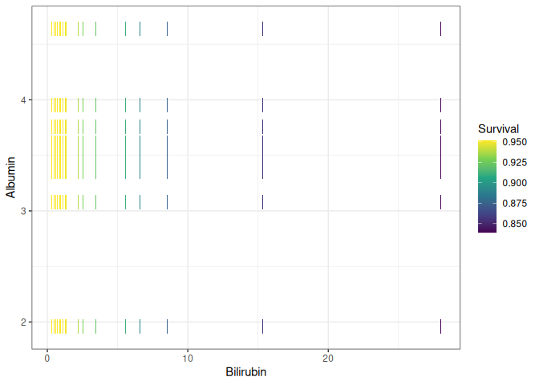

Partial dependence surface: survival at 1 year as a function of
bilirubin and albumin. Fill colour is the predicted survival
probability.

The surface shows that survival is highest when bilirubin is low and
albumin is high (upper-left corner), and drops steeply as bilirubin
increases or albumin decreases. The curvature of the surface —
particularly the steep gradient at low albumin and high bilirubin —
confirms the interaction detected in the conditional plots.

### Brier Score and CRPS

VIMP and minimal depth tell us which predictors matter, but they say
nothing about how well the forest’s survival predictions are calibrated.
The Brier score answers that question. At each point on the event-time
grid it measures the mean squared difference between the predicted
survival probability $`\hat{S}(t)`$ and the binary outcome (survived
past $`t`$ or not). Because right-censored subjects have unknown true
outcomes, the calculation uses inverse-probability-of-censoring
weighting (IPCW): each subject’s squared error is upweighted by the
inverse probability of being uncensored at that time, so the estimate
remains unbiased even under heavy censoring ([Graf et al.
1999](#ref-graf:1999)).

Two reference values help interpret the curve. A Brier score of 0 is
perfect prediction. A score around 0.25 is the uninformative ceiling: a
model that assigns every subject a survival probability of 0.5,
regardless of their covariates or the time horizon, scores near 0.25 by
construction. A forest that beats 0.25 is doing better than that floor;
one that exceeds it has been made worse by its covariates, which is a
sign of overfitting or a poorly specified model.

[`gg_brier()`](https://ehrlinger.github.io/ggRandomForests/reference/gg_brier.md)
wraps
[`randomForestSRC::get.brier.survival()`](https://www.randomforestsrc.org//reference/plot.survival.rfsrc.html)
and returns a tidy data frame ready to plot.

``` r

gg_bs <- gg_brier(rfsrc_pbc)
plot(gg_bs)
```

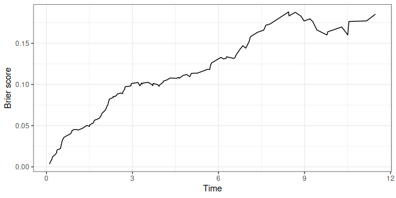

Time-resolved Brier score for the PBC survival forest.

Read the curve left to right. Early on it sits near zero — almost
everyone is still alive, so predicting survival is easy. It climbs to a
peak around the median event time, where the outcome is genuinely
uncertain, then falls again as the at-risk pool shrinks and the
remaining predictions get easier.

Setting `envelope = TRUE` adds a 15–85% ribbon around that line, showing
how spread out the individual subjects’ Brier contributions are at each
time. A narrow ribbon means the forest is assigning similar risks across
subjects; a wide one means the predicted risks are pulling apart.

``` r

plot(gg_bs, envelope = TRUE)
```

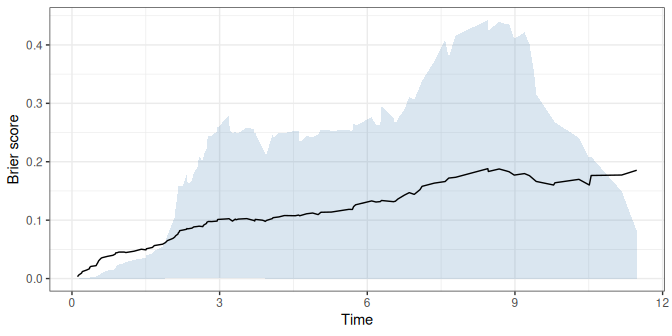

Brier score with 15–85% per-subject envelope.

The running CRPS (continuous ranked probability score) is the Brier
score integrated over time and divided by elapsed time — the
time-average of the curve above. It collapses the whole trajectory into
one running number, which is handy when you want a single calibration
figure rather than a curve to read. Like the Brier score, a CRPS near 0
is good and a value near 0.25 is the uninformative ceiling (the same
constant-predictor reference as above). The final (integrated) value at
the right edge of the plot is the one most often reported.

``` r

plot(gg_bs, type = "crps")
```

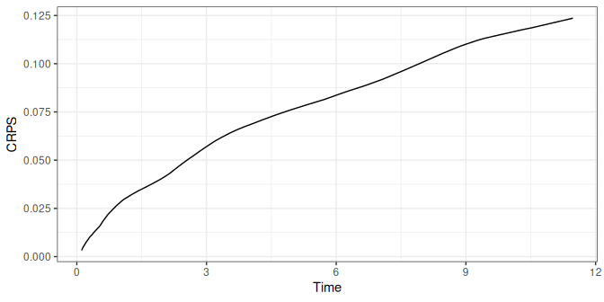

Running CRPS for the PBC survival forest.

The integrated CRPS — a scalar summary of overall calibration — is
stored as an attribute and can be retrieved with:

``` r

attr(gg_bs, "crps_integrated")
```

    #> [1] 1.404373

## Conclusion

We have walked a full random survival forest analysis with
**randomForestSRC** and **ggRandomForests**, and the results hang
together:

- [`gg_survival()`](https://ehrlinger.github.io/ggRandomForests/reference/gg_survival.md)
  drew Kaplan–Meier curves that showed no treatment effect in the PBC
  trial, the same conclusion reached in Fleming and Harrington
  ([1991](#ref-fleming:1991)).
- [`gg_error()`](https://ehrlinger.github.io/ggRandomForests/reference/gg_error.md)
  showed the OOB error settling quickly as trees were added.
- VIMP
  ([`gg_vimp()`](https://ehrlinger.github.io/ggRandomForests/reference/gg_vimp.md))
  and minimal depth
  ([`max.subtree()`](https://www.randomforestsrc.org//reference/max.subtree.rfsrc.html))
  landed on the same five predictors (bilirubin, albumin, copper,
  prothrombin, and age), which is also where the proportional hazards
  model landed.
- [`gg_variable()`](https://ehrlinger.github.io/ggRandomForests/reference/gg_variable.md)
  exposed non-proportional hazards for bilirubin and copper, where the
  gap between time horizons widens.
- Partial dependence from
  [`gg_partial_rfsrc()`](https://ehrlinger.github.io/ggRandomForests/reference/gg_partial_rfsrc.md)
  gave the risk-adjusted version of those curves and backed the
  log-transforms used in the parametric model.
- Conditioning plots and the partial dependence surface drew out the
  bilirubin–albumin interaction.
- [`gg_brier()`](https://ehrlinger.github.io/ggRandomForests/reference/gg_brier.md)
  measured how accurate the predictions actually were, both across time
  and as a single CRPS summary.

Notice the pattern. Each `gg_*()` function returns a tidy object (often
a data frame, sometimes a small list of data frames); the plotting comes
after. Lean on the package’s
[`plot()`](https://rdrr.io/r/graphics/plot.default.html) methods when
the default figure works, and drop down to `ggplot2` directly when it
does not.

## References

Breiman, Leo. 2001. “Random Forests.” *Machine Learning* 45 (1): 5–32.
<https://doi.org/10.1023/A:1010933404324>.

Fleming, Thomas R., and David P. Harrington. 1991. *Counting Processes
and Survival Analysis*. Wiley Series in Probability and Statistics. John
Wiley & Sons.

Friedman, Jerome H. 2001. “Greedy Function Approximation: A Gradient
Boosting Machine.” *The Annals of Statistics* 29 (5): 1189–232.
<https://doi.org/10.1214/aos/1013203451>.

Graf, Erika, Claudia Schmoor, Willi Sauerbrei, and Martin Schumacher.
1999. “Assessment and Comparison of Prognostic Classification Schemes
for Survival Data.” *Statistics in Medicine* 18 (17–18): 2529–45.
<https://doi.org/10.1002/(SICI)1097-0258(19990915/30)18:17/18%3C2529::AID-SIM274%3E3.0.CO;2-5>.

Ishwaran, Hemant, and Udaya B. Kogalur. 2007. “Random Survival Forests
for R.” *R News* 7 (2): 25–31.

Ishwaran, Hemant, and Udaya B. Kogalur. 2024. *randomForestSRC: Fast
Unified Random Forests for Survival, Regression, and Classification
(RF-SRC)*. <https://cran.r-project.org/package=randomForestSRC>.

Ishwaran, Hemant, Udaya B. Kogalur, Eugene H. Blackstone, and Michael S.
Lauer. 2008. “Random Survival Forests.” *The Annals of Applied
Statistics* 2 (3): 841–60. <https://doi.org/10.1214/08-AOAS169>.

Ishwaran, Hemant, Udaya B. Kogalur, Eiran Z. Gorodeski, Andy J. Minn,
and Michael S. Lauer. 2010. “High-Dimensional Variable Selection for
Survival Data.” *Journal of the American Statistical Association* 105
(489): 205–17. <https://doi.org/10.1198/jasa.2009.tm08622>.

Wickham, Hadley. 2016. *ggplot2: Elegant Graphics for Data Analysis*.
2nd ed. Springer. <https://doi.org/10.1007/978-3-319-24277-4>.
